# AWS Architected Best Practice

## Well-Architected
Can you confidently answer these questions when reviewing your team’s systems or applications?
Sometimes you design a system, but you’re unsure if it’s well-designed — that’s where this knowledge comes in handy.

### What defines a good design?
- Core elements
- Benefits
- General design principles
- Cost
- Performance
- CPU/memory configuration based on RPS (Requests Per Second)

## Operational Excellence
- Security  
- Reliability  
- Performance efficiency  
- Cost optimization  
- Sustainability

## Design Principles
- Faster development and deployment
- Risk mitigation or reduction
- Is it safe to open port 22 on a server?
- Should we rely on a Bash script or online guides to open well-known ports?
- With AWS Systems Manager Session Manager, you can access servers **without opening port 22**

> ### SCALE UP / SCALE OUT
- **SCALE UP**: Vertical scaling — upgrading hardware specs like CPU/memory (UP/DOWN)
- **SCALE OUT**: Horizontal scaling — adding more servers with the same specifications (IN/OUT)

## Best Practices for EC2

### Infrastructure Perspective
- Estimate capacity first → this leads to cost estimation
- Automate response to security events: trigger automatic actions based on event or condition-based alerts

### Operational Excellence
- Core focus: How the organization supports its business objectives
  - Effectively running workloads, gaining operational insights, and continuously improving processes and procedures to deliver business value

### Design Principles
- Over-provisioning = waste (based on peak traffic estimates)
- Under-provisioning = overload risk
- Test systems at production scale
- Use identical environments for testing to ensure stability
- Since it's cloud-based, you can terminate unused resources (e.g., Blue/Green deployment)
- Architecture experimentation becomes easier with automation

### Enabling Innovative Architectures
- **MSA (Microservices) ↔ Monolith**
- Use PoCs to identify better migration strategies — don’t get stuck
- Data-driven architecture
  - Don’t rely on gut feeling; base decisions on data

### Improvements Through Real-World Testing
- Failing to prepare for failure can lead to expensive recoveries
- Human resources should be included as part of the workload

## Infrastructure as Code (IaC)
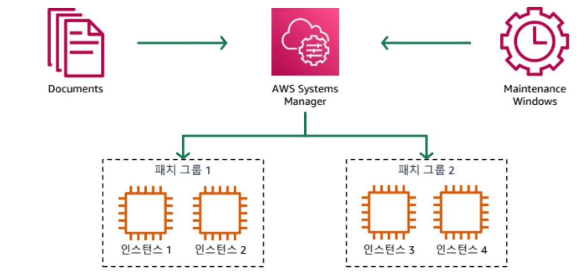

- Manage infrastructure using code
- Make small, reversible changes frequently
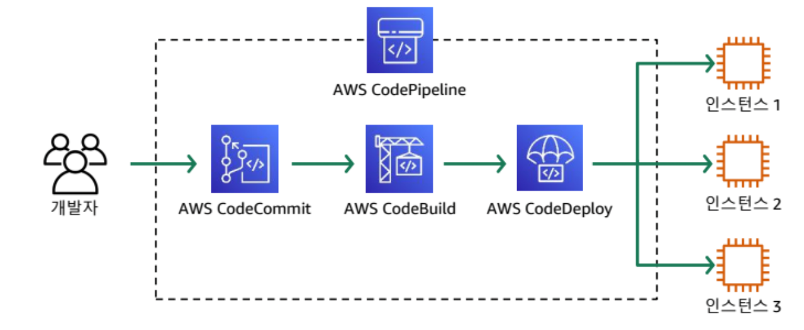

  - Like **Merge Requests**
  - Build CI/CD workflows using CodePipeline
  - **Canary Deployment**: Deploy to a subset of servers, test and monitor, then roll out to the rest

### Re-defining Operational Procedures Frequently
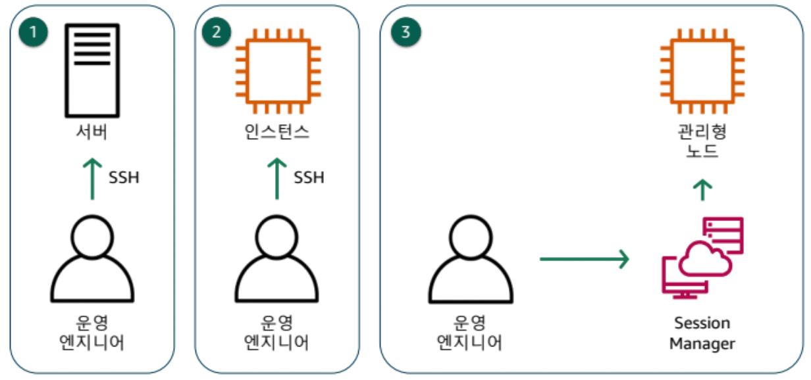

- Opening SSH = opening port 22
- Opening well-known ports increases the risk of hacking attempts
- AWS Session Manager allows browser-based management
- You can perform prompt-based operations just like with SSH

### Failure Prediction and Response

- Build failure-tolerant architectures
- Perform health checks before routing traffic
- If a health check fails, isolate the traffic → prevent failure propagation

> e.g., Case Study: Any Company  
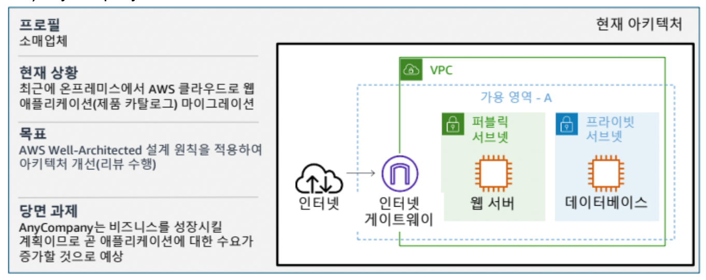  
[Issue]  
When Availability Zone A goes down, all services go down  
→ Split services across multiple Availability Zones  
Installing a database directly on EC2 increases the management burden  
→ Use redundancy and dedicated instances to ensure high availability  

[Best Practice Review]  
- Most operations were performed manually  
- Product catalog application needed a highly available architecture  
- Security was the top priority

## Database Replication
- Use **Active/Standby** setup
  - Data is synchronized in real-time
  - **RPO** (Recovery Point Objective): How often data is backed up — RPO can be zero

## Reliability
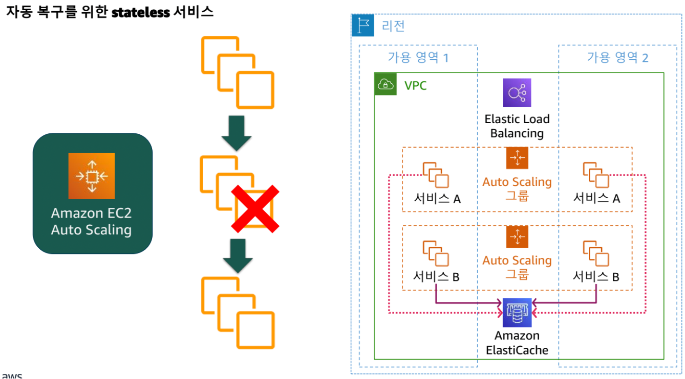

### Key Elements
- Recover from infrastructure or service failures
- Dynamically acquire computing resources based on demand
- Mitigate interruptions due to misconfigurations or temporary network issues

### Auto Recovery From Failures
- Use **Rolling**, **Canary**, or **Blue-Green** deployment strategies
- Configure Auto Scaling with min:max:desired capacity settings

### Horizontal Scaling
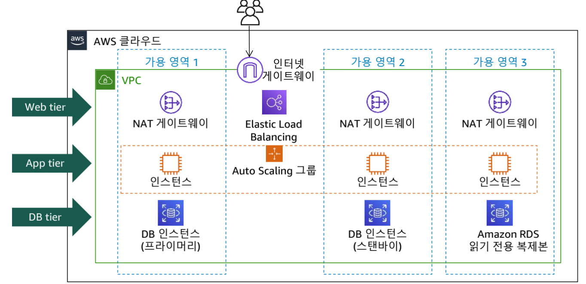

- Scale across multiple Availability Zones
  - Elastic Load Balancer adds capacity automatically when traffic increases (**Auto Scaling**)

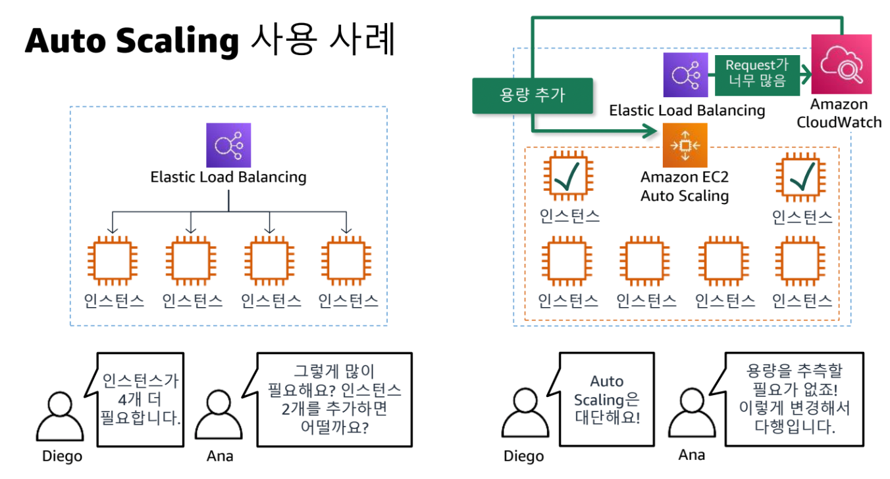

## Security
Security involves protecting your data, systems, and assets using cloud technology and improving your overall security posture.

- Multiple teams sharing a single account  
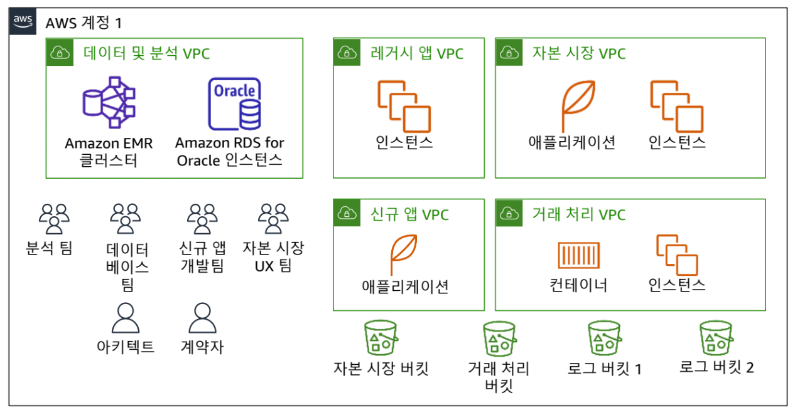  
- Use separate AWS accounts for each function  
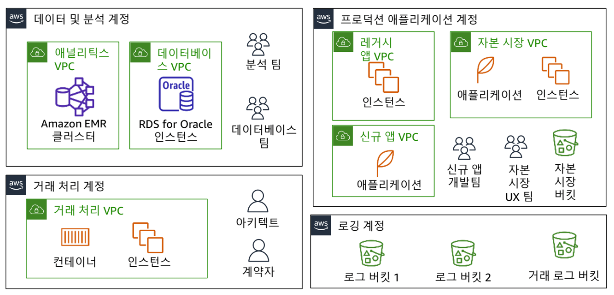

### Apply Security at Every Layer
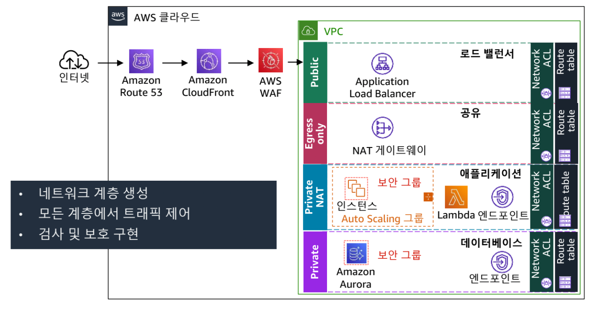

### Strong Identity and Access Management
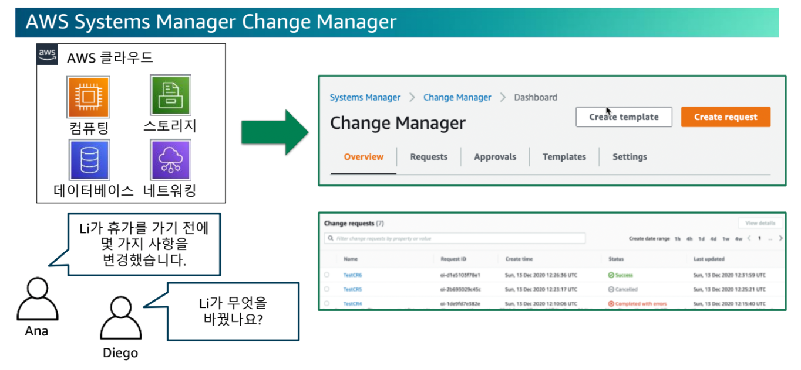

- Like Git commits, changes can be tracked similarly to **ChangeLogs** — know when and how changes occurred

### Protect Data In Transit and At Rest
- Encryption: **Amazon Macie**
- For key management, use **AWS KMS** for common resources, and **AWS CloudHSM** for team-specific keys

## Cost Optimization
- Continuously monitor usage and operate systems that deliver business value at the lowest possible cost
- Pay-as-you-go architecture
- Minimize resources for development/test environments

### Efficient Cost Management
- Measure value as workloads evolve
- Consider switching to serverless architectures
- Use **tags** for cost tracking: Identify where usage or costs are increasing
