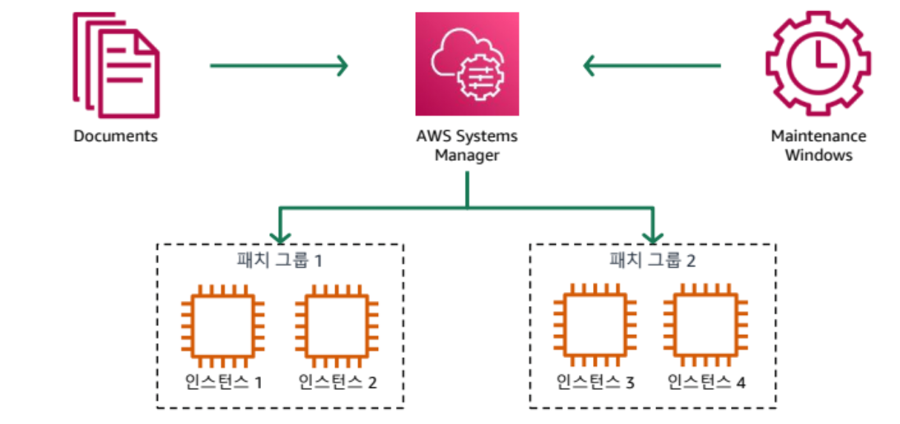
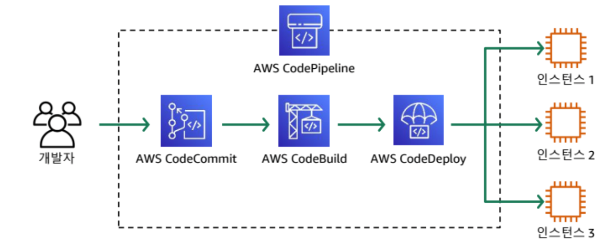
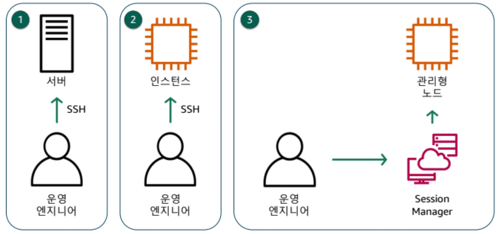
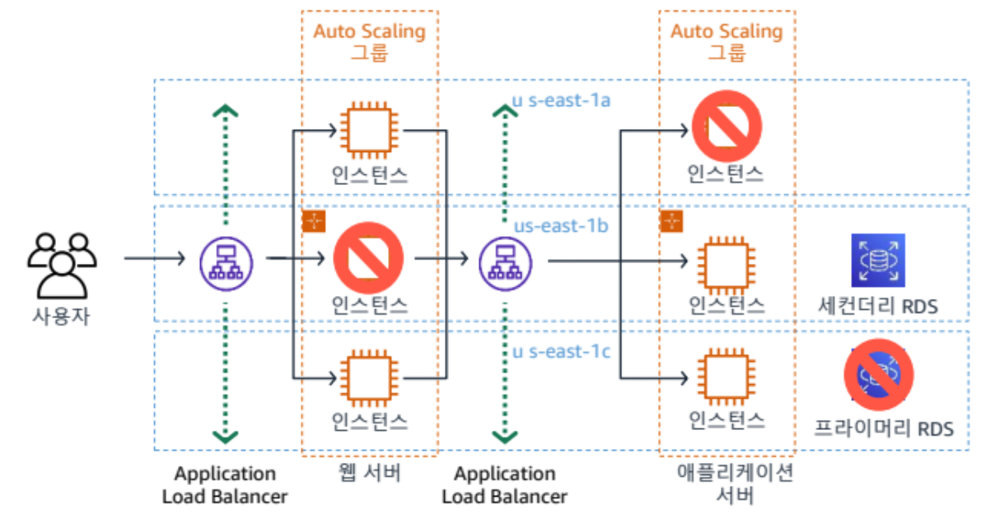
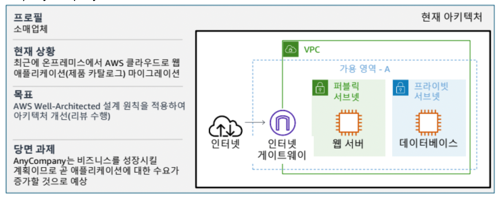
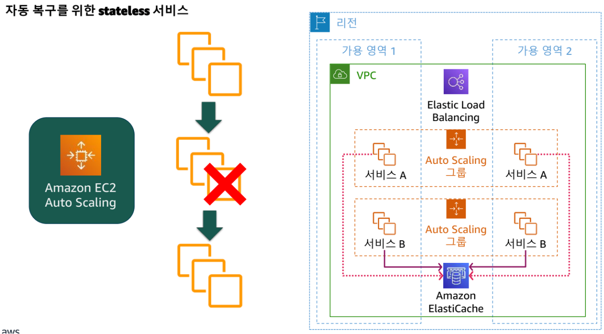
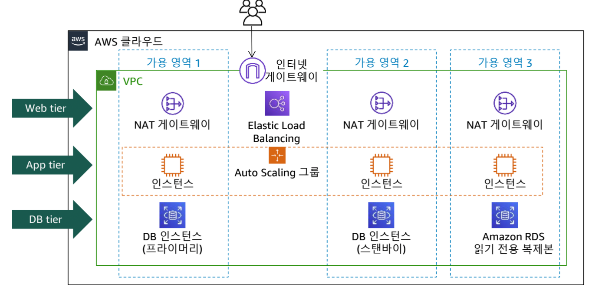
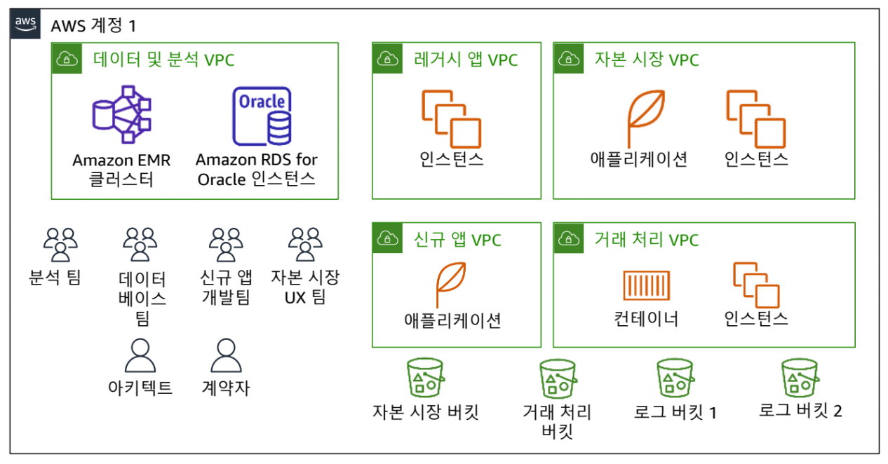
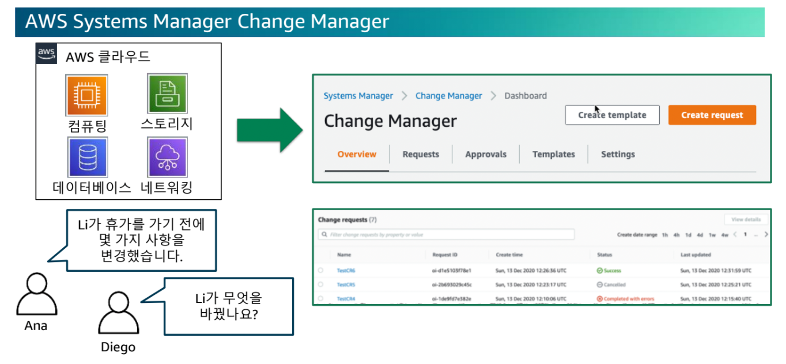

# AWS Architected Best Practice

## Well-Architected
팀에서 구축하고 있는 시스템이나 애플리케이션을 살펴볼 때 다음 질문에 답할 수 있을까?
설계를 하였지만, 제대로 설계한지 모를 때 필요한 지식

### 설계에 대한 기준?
- 핵심 요소
- 이점
- 일반 설계 원칙
- 비용
- 성능
- RPS를 토대로 CPU/memory 설정

## 운영 우수성
- 보안
- 안정성
- 성능 효율성
- 비용 최적화
- 지속 가능성

## 설계 원칙
- 보다 신속한 구축 및 배포
- 위험 감소 또는 완화
- 서버에서 22번 포트를 OPEN하는 방법이 안전한 방법일까요?
- bash 스크립트나 인터넷에서 잘 알려진 22번 포트를 여는게 맞을까?
- AWS 세션 매니저를 통해 22번 포트를 열지 않고도 서버에 접근할 수 있다

> ### SCALE UP / SCALE OUT
- **SCALE UP**: 수직적인 확장, CPU / memory 등의 하드웨어 강화 (UP/DOWN)
- **SCALE OUT**: 수평적인 확장, 동일한 스펙으로 서버의 대수를 늘림 (IN/OUT)

## EC2에서 모범사례
### 인프라의 관점
- 용량 먼저 산정 -> 비용으로 이어짐
- 보안 이벤트에 대한 응답 자동화: 이벤트 기반 알림 또는 조건 기반 알림에 대해 모니터링하고 자동으로 대응

### 운영 우수성
- 핵심 요소: 조직이 비즈니스 목표를 지원하는 방법을 다룸
  - 워크로드를 효과적으로 실행하고, 운영에 대한 인사이트를 얻고, 프로세스 및 절차를 지속적으로 개선하여 비즈니스 가치를 제공하는 조직의 능력이 포함됨

### 설계 원칙
- 많이 산정: 낭비 (피크 트래픽 기준 트래픽으로 스펙 산정)
- 적게 산정: 부하
- 프로덕션 규모로 시스템을 테스트
- 환경 별로 동일한 스펙으로 테스트해야 안정성 테스트 가능
- 클라우드 환경이기에 사용 후 없애면 됨 (Blue / Green 배포)
- 자동화를 통해 더 간편해진 아키텍처 실험

### 혁신적인 아키텍처 허용
- **MSA <-> 모놀리스**
- PoC를 통해 보다 효과적인 방법으로 마이그레이션 (고이지 말자)
- 데이터를 사용하여 아키텍처를 구동
  - 사람의 감이 아닌 데이터를 통해 구동

### 실전 테스트를 통한 개선
- 장애 상황에 대해 미리 대처하지 않으면 복구에 많은 비용이 들 수 있음
- 인력에 대한 리소스 또한 워크로드에 포함됨

## 코드형 운영 수행

- 코드를 통해 인프라를 관리
- 되돌릴 수 있는 소규모 변경을 빈번하게 수행

  - **MR**과 마찬가지
  - Code Pipeline을 통해 CI/CD 워크플로우를 구성 가능
  - **카나리 배포**: 여러 대 중 일부 서버에만 배포를 진행한 후 테스트 및 모니터링을 통해 나머지 서버에 동일하게 배포 진행

### 운영 절차 빈번하게 재정의

- **SSH를 열겠다는 것**: 22포트를 여는 것
- Well known 포트를 OPEN 하므로 해커들의 공격 발생 가능
- AWS 세션 매니저를 통해 브라우저 기반의 관리를 할 수 있음
- SSH로 접근하는 것과 동일하게 프롬프트 작업을 수행 가능

### 장애 예측 및 대응

- 장애를 수용하는 아키텍처 구성
- **health check**를 통해 트래픽 전송 전 체크
- health check가 실패하면 트래픽 격리 -> 장애 전파를 막음

> e.g. Any Company 사례

[문제점]
A 가용 영역이 다운되면 모든 서비스가 다운된다
-> 가용 영역을 나누어야 함
EC2 위에 데이터베이스를 설치한다는 것은 관리 요소에 부담이 갈 수 있다
-> 이중화 및 별도 인스턴스로 구성 (고가용성 확보)
>
[모범 사례 리뷰]
- 대부분의 운영 작업이 수동으로 수행됨
- 제품 카탈로그 애플리케이션에 고가용성 아키텍처가 필요
- 보안이 최우선 순위

## 데이터베이스 이중화
- **Active / StandBy** 형태로 구성
  - 데이터가 동기식으로 동기화됨
  - **RPO**: 얼마나 자주 백업하는가? RPO가 제로일 수 있음

## 안정성

### 핵심 요소
- 인프라 또는 서비스 장애로부터 복구하고, 수요에 맞춰 컴퓨팅 리소스를 동적으로 확보
- 잘못된 구성이나 일시적인 네트워크 문제로 인한 중단을 완화하는 시스템의 능력 포함

### 장애로부터 자동 복구
- **Rolling**, **카나리**, **Blue Green** 배포
- 설정 방법: 최소:최대:목표 설정 후 AutoScaling 가능

### 수평적 확장

- 여러 가용 영역에서의 수평적 확장
  - Elastic Load Balancer에서 요청이 많으면 자동으로 용량 추가 (**오토스케일링**)

  
## 보안
보안에서는 클라우드 기술을 사용하여 데이터 시스템 및 자산을 보호하고 보안 태세를 개선하는 방법을 고려해야 함

- 다양한 팀이 하나의 Account 사용

- 기능별 AWS 계정

### 모든 계층에 보안 적용

### 강력한 자격 증명 기반 구현

- Git 커밋처럼 **ChangeLog**와 유사하게, 언제 어떻게 바뀌었는지 추적 가능

### 전송 중 및 저장 시 데이터 보호
- 암호화: **Amazon Macie**
- **AWS KMS**를 사용하여 공통 자원의 키 관리, 팀별 요구사항에 맞는 키 관리는 **AWS CloudHSM**

## 비용 최적화
- 지속적인 모니터링으로 최저 가격으로 비즈니스 가치를 제공하는 시스템을 운영하도록 장려
- 비용 및 사용량을 사용한 만큼 지불하는 아키텍처 구성
- 개발/테스트 환경의 최소화

### 효율적인 비용 관리
- 워크로드가 변경됨에 따라 가치를 측정
- 서버리스 아키텍처로 전환
- 비용 추적을 위해 **태그** 사용 권장: 어디서 사용량이나 비용이 증가했는지 추적 가능
