> Source Code: https://github.com/dings-things/coffee_pal

# Purpose
---
Great cultures make great organizations — not just getting things done, but doing them *well*. Good culture enhances productivity and quality alike.

I created “CoffeePal” with the idea of helping people stuck on problems or simply wanting a quick small talk boost. The name reflects its purpose: your “coffee pal” during the workday.

# Before Development
---
The app needed to be easy and fast, seamlessly matching users via our internal Slack tool.

To understand the interaction flow, I started with [Slack Workflow](https://slack.com/intl/en-kr/features/workflow-automation).

---

1. **Create a Trigger Point**  
   For testing, I used a `:coffee:` emoji reaction to initiate the workflow.

2. **Activate Workflow**  
   A message is sent to the reacting user to confirm whether they want to start a coffee chat.

3. **Collect User Information via Form**  
   For personalization, users can optionally input their MBTI and birthday.

4. **Set Target, Time, and Topic**  
   Define the coffee partner, schedule, and discussion topic ahead of time.

5. **Send Invitation Message to Partner**  
   Using the collected data, send an invitation message to the designated partner.

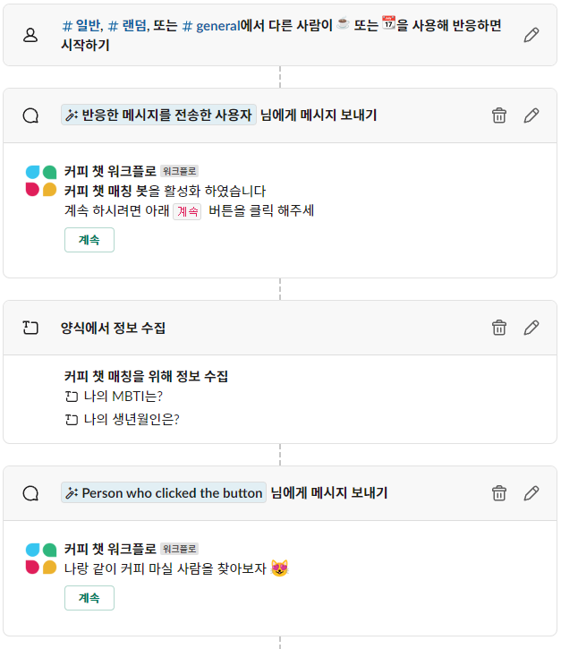

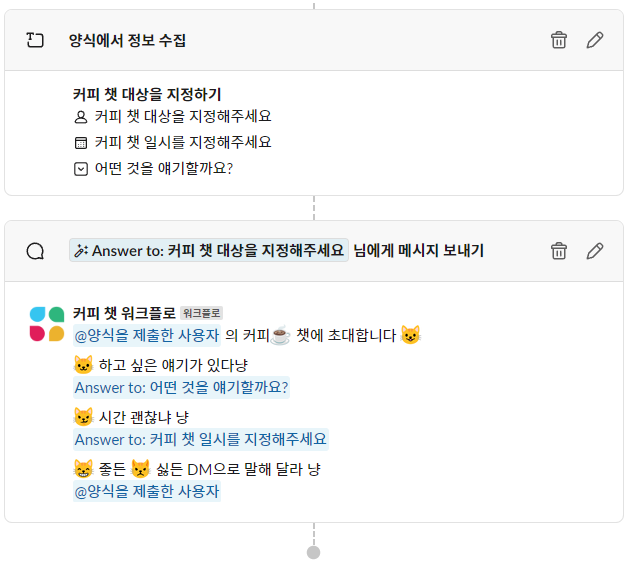

I used Slack Workflow for the first time and found the UI clean and intuitive.

However, it felt more like a one-way communication than true *interaction*. So, I decided to expand it into a full Slack app.

It felt like being force-fed food I didn’t want...


# Requirements
---
1. Match users based on pre-saved profile data  
   - Trigger matching after personal data is submitted

2. Secure compute resources to handle app interactions  
   - [x] Internal Server  
      - Firewall complexity  
      - Fast response via socket communication  
   - [ ] AWS Lambda  
      - Free under Free Tier  
      - Serverless  
      - Can connect with API Gateway  
      - Consider future cost after Free Tier

3. Intuitive UI for users at a glance  
   - Use [Slack Block Kit](https://app.slack.com/block-kit-builder)

# Implementation
---
## Using Lambda
- Create Slack App  
- Set up Lambda  
- Configure Socket Mode

### Step 1: Create Slack App
Go to [Slack API](https://api.slack.com/apps) and create a new app  


### Step 2: Click `From scratch`  


### Step 3: Choose workspace and name  
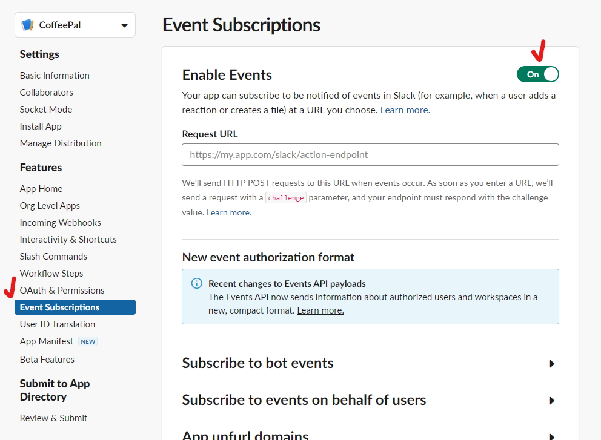

### Step 4: Set bot for user interaction  
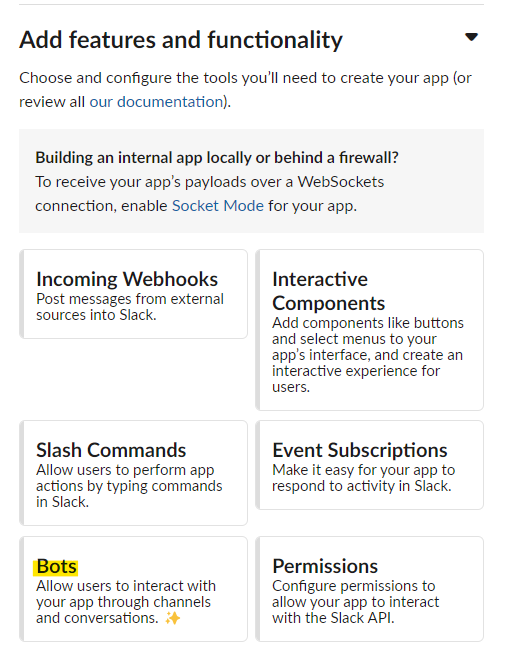

### Step 5: Enable events  


### Lambda Step 1: Go to [Lambda Console](https://ap-northeast-2.console.aws.amazon.com/lambda/home?region=ap-northeast-2#/begin)  


### Lambda Step 2: Configure function, runtime, architecture  
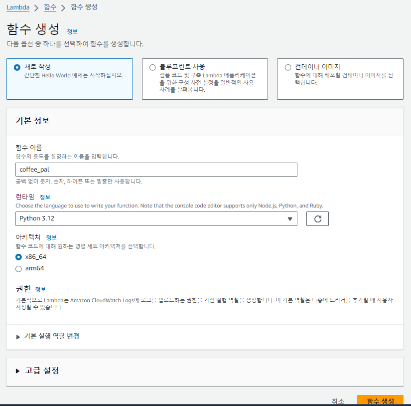

### Lambda Step 3: Set up API Gateway  
API Gateway routes HTTP requests to Lambda — essential to integrate Slack Events API with Lambda.  
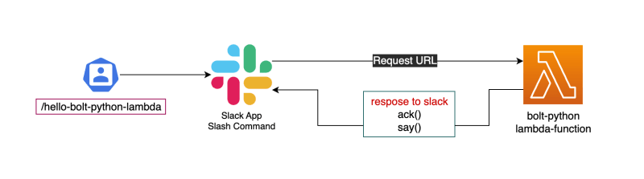

But then I asked myself... If we already have a server, why use Lambda? Wouldn’t *not* using it be wasteful?

So I decided to use our spare dev server and implement it via socket mode.

## Socket Mode Configuration
> **What is Socket Mode?**  
> Instead of sending payloads to public HTTP endpoints, Slack uses a WebSocket connection to deliver app interactions and events.  
> 

Avoiding public endpoints means better security, and you don't need to subscribe to each event individually.

### Step 1: Generate App-Level Token  
Grant permissions to a global token for Slack app control inside the server.  


### Step 2: Set Token Scope  


- `channels:read`: Get user info from channels  
- `chat:write`: Post messages to channels  
- `chat:write.public`: Write to channels even if not invited  
- `groups:read`: Access private channel info  
- `groups:write`: Write in private channels  
- `im:write`: Send DMs  
- `mpim:write`: Send group DMs  
- `reminders:write`: Set reminders

## Development

### Slack Bolt

> A framework for building Slack apps, supporting languages like Node.js, Python, and JavaScript.

While you might consider skipping it… using Bolt avoids a lot of redundant work. Skipping it results in slower development and difficult maintenance.

#### Without Bolt:
```python
from slack_sdk import WebClient
from slack_sdk.errors import SlackApiError
import os, json, base64, urllib.parse

def lambda_handler(event, context):
    bot_token = os.getenv('BOT_KEY')
    client = WebClient(token=bot_token)
    if event.get('isBase64Encoded', False):
        decoded_body = base64.b64decode(event['body']).decode('utf-8')
        event_body = urllib.parse.unquote_plus(decoded_body)[8:]
    else:
        event_body = event['body']
    try:
        event_data = json.loads(event_body)
    except json.JSONDecodeError:
        return { 'statusCode': 400, 'body': json.dumps({'message': 'Invalid request'}) }

    event_type = event_data.get('event', {}).get('type')
    # handle event_type...
```

#### With Bolt:
```python
app = App(token=settings.SLACK_BOT_TOKEN)

@app.event("app_home_opened")
def handle_home(event, client: WebClient = None):
    ...

@app.action("suggest_coffee_chat_button")
def handle_chat_button(ack, body, client: WebClient = None):
    ...
```

Bolt simplifies:
- Auth
- Routing by event/action/view
- Middleware chaining

### Block Kit

Block Kit is at the heart of Slack app UI design.

Each visual unit is a "block". You compose a full view by stacking them.

```python
HOME_VIEW = {
  "type": "home",
  "blocks": [
    ...
  ]
}
```

#### HOME layout
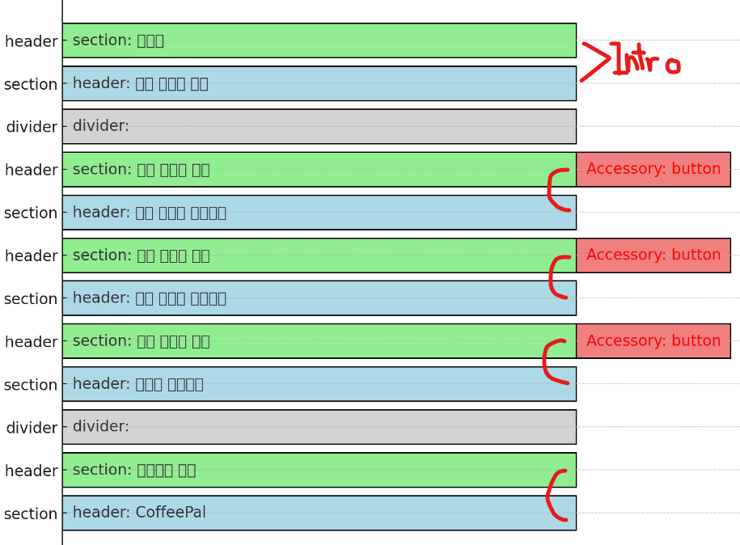

#### Horizontal Section
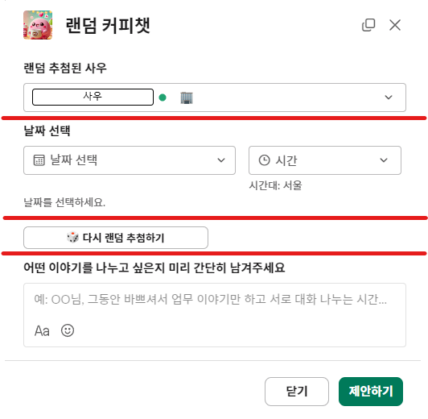

#### Vertical Section
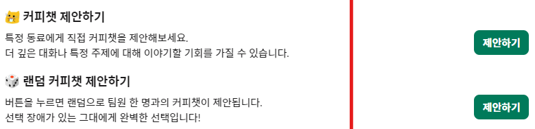

### Input
Slack API is stateless. Every request is isolated, so inputs are critical for maintaining interaction context.

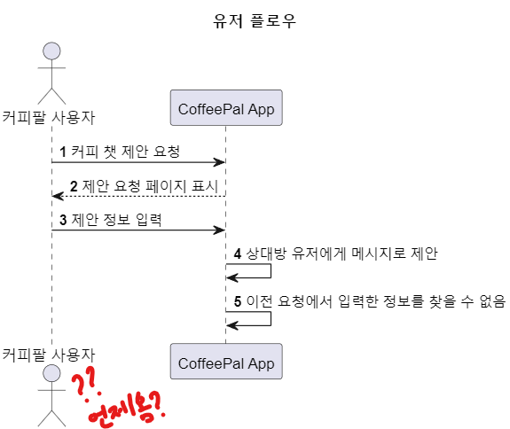


Even if the server disconnects, the state can be restored based on input fields.

#### Random Coffee Chat example
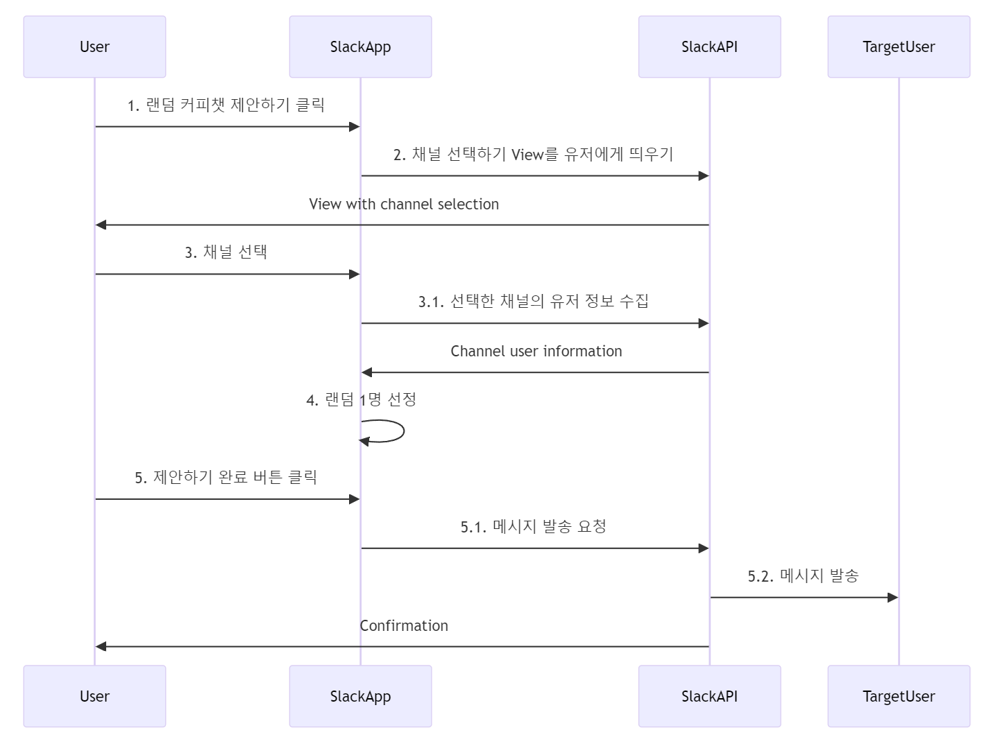

---

## Improvements
- Use Slack DataStore for stateful user data with TTLs
- Integrate HR info (rank/age/role) to personalize matches
- Improve UI for clarity and friendliness
- Add CI/CD and infra for production usage

## Final Thoughts

As a developer, I resonate with the Ubuntu philosophy:

> “I am because we are.”

Fostering collaboration is just as important as individual contribution.

That’s why I built **CoffeePal** ☕


If you hit technical roadblocks or need an ice-breaker for teamwork, consider building your own Slack bot!

