# 배경
1. 조직에서 주간/월간 회의를 통해 성과를 정리하고 그 다음 스프린트에서 해야할 일을 정의하는 시간을 갖는다.
2. 매번 눈치껏 누군가가 이전 주/달의 보고서를 복사하여 이번 주/달 제목으로 작성하여 본인의 테스크 진행상태를 정리한다.

문제점은 다음과 같다
- 자동화의 책임 소재 부재
- 개발자의 불필요한 업무 시간 낭비
- 누가 생성할 것이냐... 눈치게임 시작!

목마른 자가 우물을 판다.. 우리의 시간은 소중하니까 ⭐ 팀을 위해 자동화를 시작해보자

# Usecase
- 일정한 형식을 가진 문서를 동일한 공간에 주기적으로 생성
- 코드 기반으로 문서 작업을 수행하고 싶을 때

# 요구사항
1. 같은 공간 내 하위에 매주 목요일 날짜로 주간 보고서를 생성한다
2. 신규 보고서는 이전 보고서의 내용을 복사+붙여넣기 한다
3. 신규 보고서가 완료되면 웹훅을 통해 슬랙으로 주간 보고서 작성을 알림한다

# 작업 시작
> 컨플루언스에서 회사마다 워크스페이스가 다를 수 있어 링크가 아닌 이미지로 설명합니다
## 1. 컨플루언스 개인용 액세스 토큰 발급하기
1. 컨플루언스 우측 상단의 프로필 클릭 → 프로파일 클릭
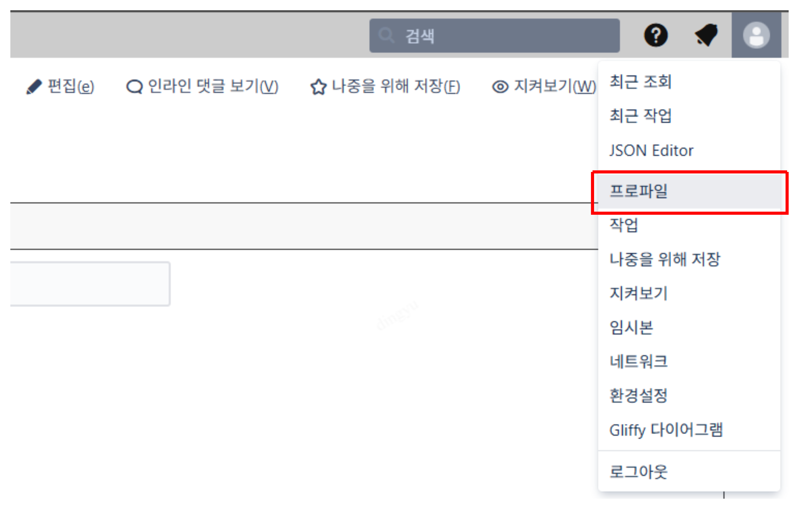

2. 환경설정 → 개인용 액세스 토큰 → 토큰 만들기 클릭
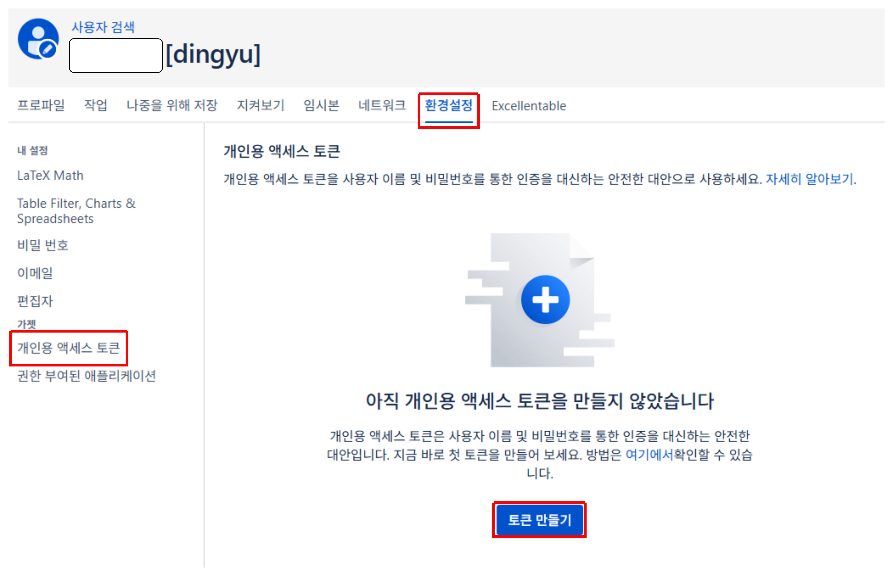

3. 토큰 이름 지정 → 영구 사용 시 자동 만료 체크 해제 → 만들기 클릭
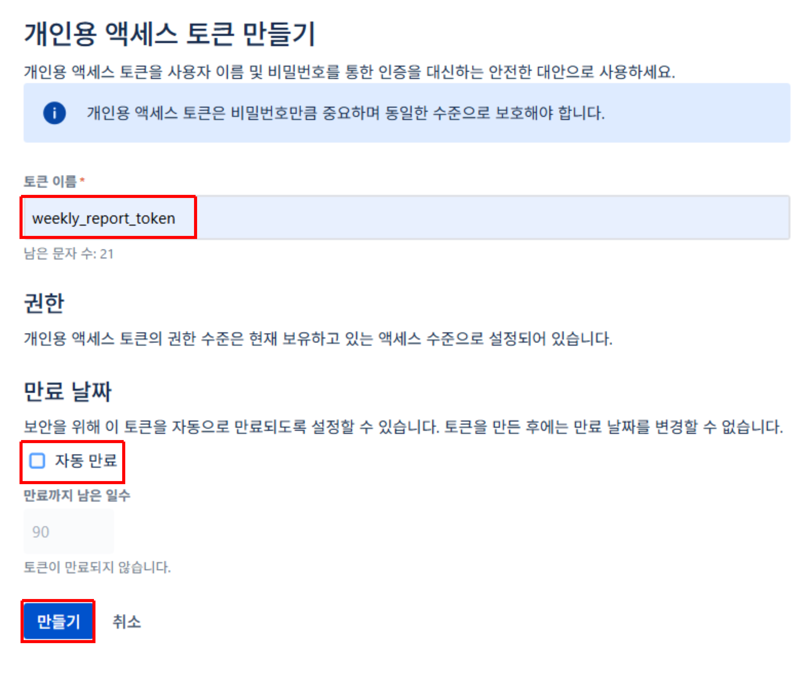

4. 생성된 액세스 토큰 확인 → 복사 버튼 클릭 → 별도 파일로 저장
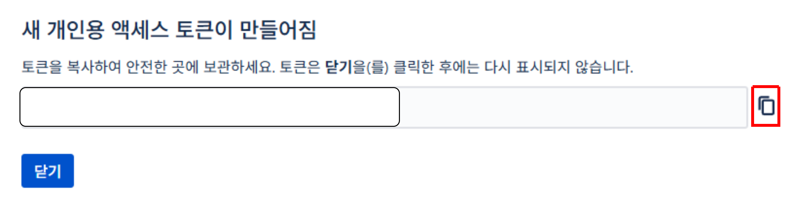
※ 한번 생성한 뒤에는 다시 확인이 불가하기 때문에 별도 파일로 저장합니다

## 2. 컨플루언스 API 활용하기
> [소스코드](https://github.com/dings-things/py-cofluence-automation)를 참고해주세요.
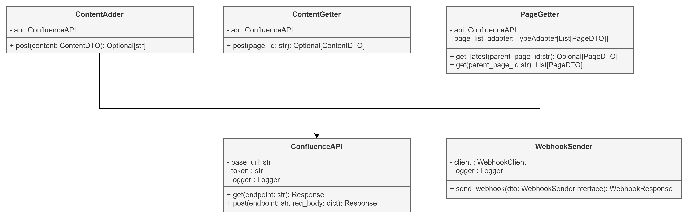
1. ContentAdder
| 항목              | 설명                          |
| --------------- | --------------------------- |
| **Endpoint**    | `/rest/api/content`         |
| **HTTP Method** | `POST`                      |
| **기능**          | `ContentDTO`를 기반으로 새 페이지 생성 |
| **리턴 값**        | 생성된 페이지의 ID (`str`)         |

2. ContentGetter
| 항목              | 설명                                                                |
| --------------- | ----------------------------------------------------------------- |
| **Endpoint**    | `/rest/api/content/{page_id}?expand=body.storage,space,ancestors` |
| **HTTP Method** | `GET`                                                             |
| **기능**          | 특정 페이지 ID로 페이지 정보를 조회                                             |
| **리턴 값**        | `ContentDTO` 객체 또는 `None`                                         |

3. PageGetter
| 메서드명           | Endpoint                                                       | 설명                       | 리턴 타입               |
| -------------- | -------------------------------------------------------------- | ------------------------ | ------------------- |
| `get_latest()` | `/rest/api/content/{parent_page_id}/child/page?expand=version` | 하위 페이지 중 가장 최신 페이지 1개 조회 | `Optional[PageDTO]` |
| `get()`        | 동일                                                             | 하위 페이지 전체 목록 조회          | `List[PageDTO]`     |
- `PageDTO`중 `version.when` 필드를 사용하여 업데이트 일자를 기준으로 가장 최신의 페이지를 반환한다
    - createdate, updatedate가 구분되지 않아 업데이트를 기준으로 정의된다

4. ConfluenceAPI
| 메서드명     | 설명              | 내부 사용                         |
| -------- | --------------- | ----------------------------- |
| `get()`  | HTTP GET 요청 수행  | `ContentGetter`, `PageGetter` |
| `post()` | HTTP POST 요청 수행 | `ContentAdder`                |
> 각 클래스는 ConfluenceAPI에 의존하여 실제 HTTP 요청을 위임하며, DTO 객체(ContentDTO, PageDTO)를 사용하여 데이터 구조를 명확히 유지합니다.

5. WebhookSender
| 항목         | 설명                                                             |
| ---------- | -------------------------------------------------------------- |
| **주요 목적**  | 외부 시스템으로 Webhook 이벤트 전송                                        |
| **의존 객체**  | `WebhookClient`, `WebhookSenderInterface`, `logging.Logger`    |
| **초기화 인자** | `webhook_url: str`, `logger: logging.Logger`                   |
| **내부 필드**  | `self.client`: `WebhookClient`, `self.logger`: 로깅 객체           |
| **메서드**    | `send_webhook(dto: WebhookSenderInterface) -> WebhookResponse` |
| **메서드 설명** | 전달된 DTO 객체를 JSON 변환 후 Webhook POST 요청 실행                       |
| **예외 처리**  | 전송 실패 시 로그에 예외 내용 기록 (`logger.exception`)                      |
| **리턴 값**   | `WebhookResponse` (전송 성공 응답 객체, 실패 시 예외 기록)                    |
- 스크립트 결과를 웹훅으로 전송하기 위한 Class
- Slack Webhook 의존성을 가지며 Slack 워크플로와 연동하여 추가 구현 가능
- 추상화된 DTO를 통해 스크립트 별로 느슨한 결과 반환

## 3. 스크립트 및 workflow 구성하기
> 지난 주에 작성했던 내용을 복사하여 이번 주 제목으로 새롭게 작성한다
### Step 1: Root 페이지로부터 가장 최신의 페이지 ID 가져오기
> **RootPage란?** 디렉토리 구조 중, 생성되는 페이지의 부모 디렉토리를 뜻한다
> 
> ex.
> ```text
> [보고]
> └── 주간 보고
>     ├── 주간보고 | 2024
>     ├── 주간보고 | 2025 1분기
>     ├── 20250403_MY팀 주간 보고
>     ├── 20250410_MY팀 주간 보고
>     ├── 20250417_MY팀 주간 보고
>     ├── 20250424_MY팀 주간 보고
>     ├── 20250508_MY팀 주간 보고
>     ├── 20250515_MY팀 주간 보고 
>     ├── 20250522_MY팀 주간 보고
>     ├── 20250529_MY팀 주간 보고
>     └── 20250605_MY팀 주간 보고
> ```
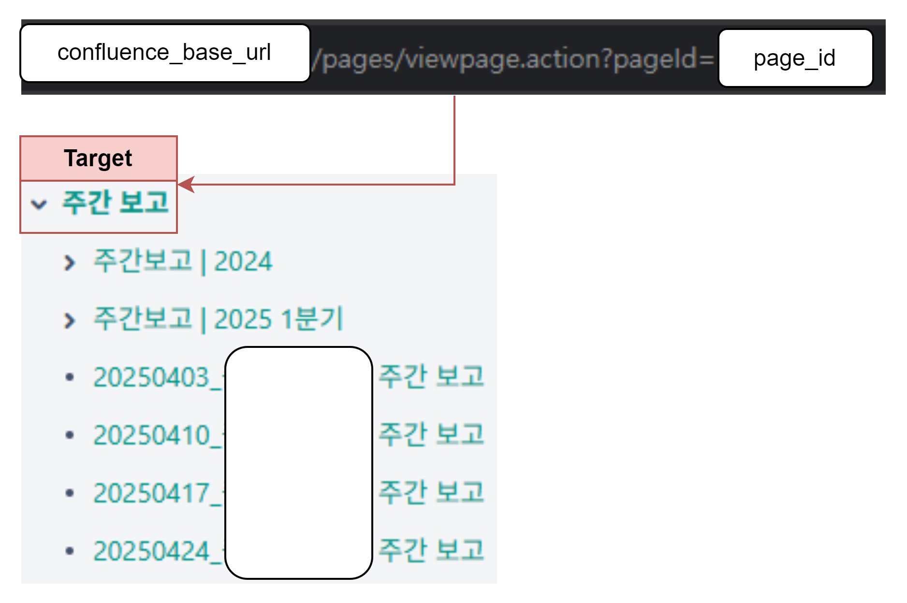
- 부모 디렉토리 구조 중 `ROOT_PAGE_ID`를 `.env`로 따로 저장한다
    - `https://{CONFLUENCE_BASE_URL}/pages/viewpage.action?pageId={ROOT_PAGE_ID}`
- 조직별로 `CONFLUENCE_BASE_URL`이 달라질 수 있어 이 또한 `.env`로 관리한다

```py
from pydantic_settings import BaseSettings
from dotenv import load_dotenv

load_dotenv()

class Settings(BaseSettings):
    CONFLUENCE_API_TOKEN: str
    ROOT_PAGE_ID: str
    CONFLUENCE_BASE_URL: str
    WEBHOOK_URL: str = ""

    class Config:
        env_file = ".env"
        env_file_encoding = "utf-8"

settings = Settings()
```
`.env` 파일을 기준으로 `Settings` 데이터 클래스를 정의한다

`config`에 필요한 환경변수는 다음과 같다
- CONFLUENCE_API_TOKEN : 앞서 발급한 컨플루언스 토큰
- ROOT_PAGE_ID : 타겟 부모 페이지 ID
- CONFLUENCE_BASE_URL : 조직의 컨플루언스 URL
- WEBHOOK_URL : 웹훅 사용 시, 웹훅 URL

### Step 2: 지난주 제목 불러오기
※ Latest 기준이 업데이트 일자를 기준으로 정렬되기 때문에, 간헐적으로 이전 주가 아닌 다른 페이지가 생성되거나 수정될 경우 문제가 발생하였다

1. 이번 주 목요일 제목을 가진 페이지 여부를 확인
    - 만약 이미 존재한다면 `return`
2. 저번 주 목요일 제목을 가진 페이지 여부를 확인
    - 만약 존재하지 않는다면 `Exception`

```py
def get_thursday_title(offset_weeks: int = 0) -> str:
    today = datetime.now()
    monday = today - timedelta(days=today.weekday())
    thursday = monday + timedelta(days=3, weeks=offset_weeks)
    return TITLE_FORMAT.format(timestr=thursday.strftime(TIMESTR_FORMAT))


def find_page_by_title(pages: List[PageDTO], title: str):
    return next((page for page in pages if page.title == title), None)


def generate_report() -> WeeklyReportDTO:
    pages = page_getter.get(settings.ROOT_PAGE_ID)
    if not pages:
        return Exception("루트 페이지 하위를 불러오기에 실패하였습니다.")

    this_week_title = get_thursday_title(0)
    last_week_title = get_thursday_title(-1)

    this_week_page = find_page_by_title(pages, this_week_title)
    # 이미 이번주 주간 보고가 있는 경우, 웹훅만 전송
    if this_week_page:
        report_link = CONFLUENCE_BASE_PAGE_URL.format(
            base_url=settings.CONFLUENCE_BASE_URL, page_id=this_week_page.id
        )
        return WeeklyReportDTO(report_link=report_link)

    last_week_page = find_page_by_title(pages, last_week_title)
    # 지난주 주간 보고가 없는 경우, 에러
    if not last_week_page:
        return Exception("지난 주 목요일 제목의 페이지가 존재하지 않습니다.")
```

### Step 3: 지난 주 내용을 불러와 새롭게 페이지 생성
1. 마지막 주 id를 기준으로 컨텐츠를 불러온다
    - 컨텐츠 불러오기에 실패 시 `Exception`
2. 저번주 내용으로 이번주 제목의 새로운 페이지 생성한다.
    - 페이지 생성 실패 시 `Exception`


```py
def generate_report() -> WeeklyReportDTO:
    ...
    # 지난 주 페이지 내용 가져오기
    base_content = content_getter.get(last_week_page.id)
    if not base_content:
        return Exception("기준 페이지의 내용을 가져올 수 없습니다.")

    # 이번 주 제목으로 새 페이지 생성하기
    base_content.title = this_week_title
    new_page_id = content_adder.post(base_content)

    if new_page_id:
        report_link = CONFLUENCE_BASE_PAGE_URL.format(
            base_url=settings.CONFLUENCE_BASE_URL, page_id=new_page_id
        )
        return WeeklyReportDTO(report_link=report_link)
    else:
        return Exception("새 페이지 생성에 실패했습니다.")
```

### Step 4: 웹훅 연동하기
1. Slack에서 채널 생성하기
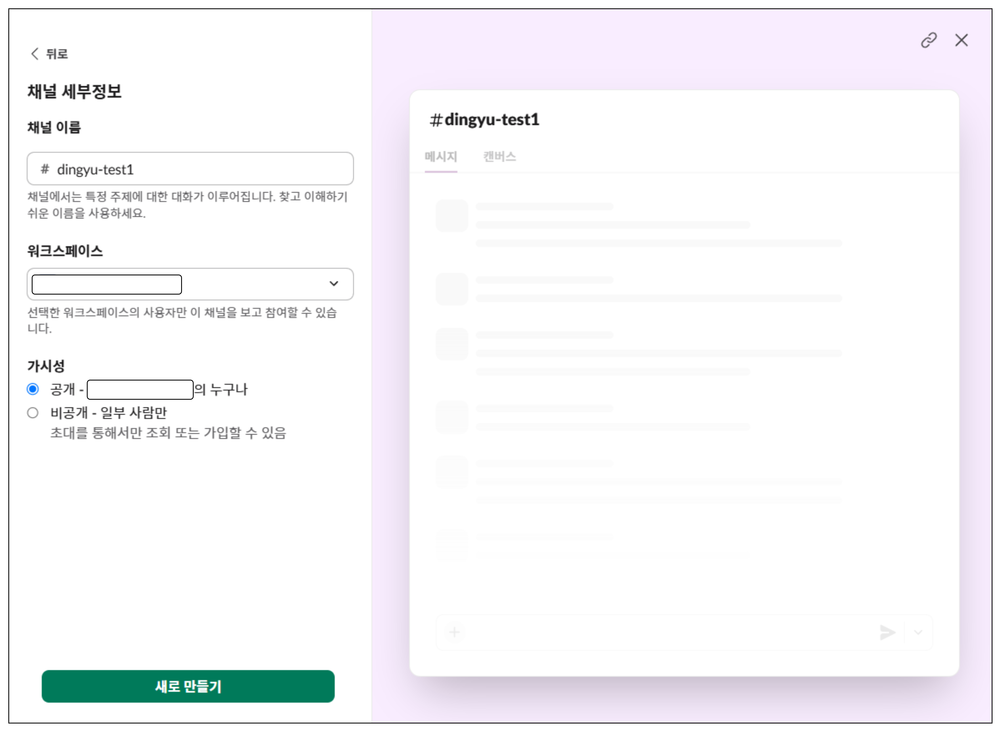

2. 스크립트 결과값을 webhook으로 전송하기
```py
class WebhookDTOInterface(ABC):
    @abstractmethod
    def to_json(self) -> dict:
        """JSON 형식으로 변환하는 메서드"""
        pass


class WeeklyReportDTO(WebhookDTOInterface):
    def __init__(self, report_link: str):
        self.report_link = report_link

    def to_json(self) -> dict:
        # JSON 문자열 반환
        return {"report_link": self.report_link}

...
if __name__ == "__main__":
    # DI 구성
    ...
    result: WeeklyReportDTO = None
    try:
        result = generate_report()
        logger.info(f"주간 보고 생성 완료 : {result.report_link}")
    except Exception as e:
        logger.error(f"스크립트 실행 중 예외가 발생했습니다: {e}", exc_info=True)
    try:
        webhook_sender.send_webhook(dto=result)
        logger.info("웹훅 전송 성공")
    except Exception as e:
        logger.error(f"웹훅 전송 중 예외가 발생했습니다: {e}", exc_info=True)
```

3. 슬랙 채널에서 워크플로 만들기
    1. 채널 좌측 상단의 "+" 클릭 후, 워크플로 클릭
    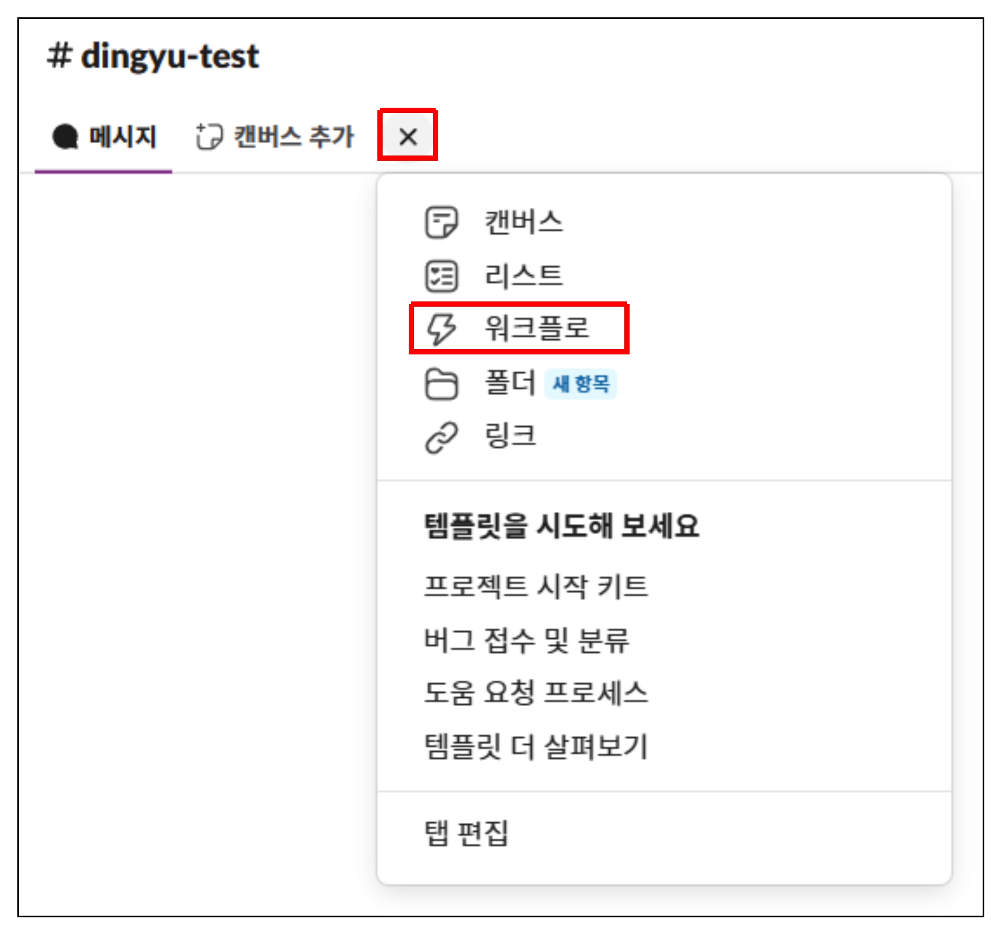
    2. 워크플로 시작... 에서 웹후크로 시작 선택
    3. 데이터 변수에 report_link 추가 및 계속
    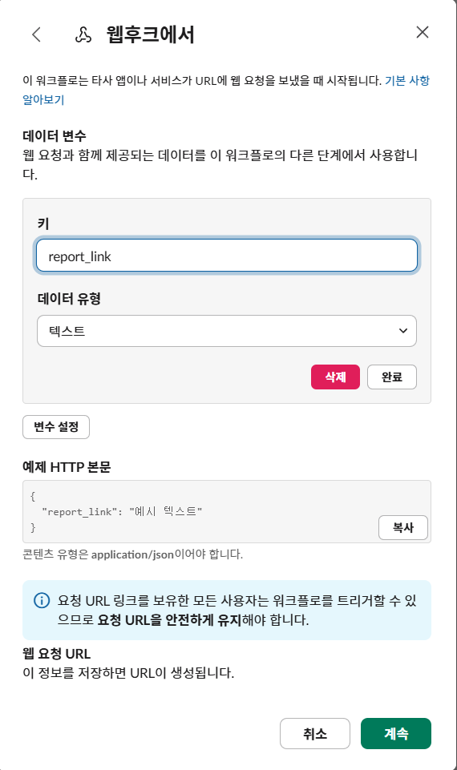
    4. 채널에 메시지 보내기 → 채널 선택 → 메시지 포맷 지정하기 → 버튼 추가하여 링크 삽입하기
    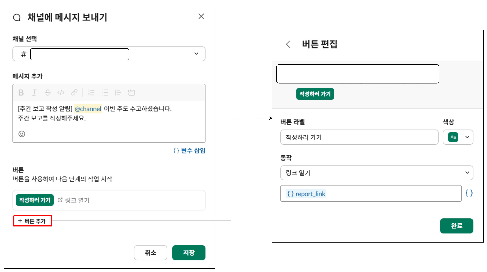

4. git workflow 구성하기
개략적인 CICD
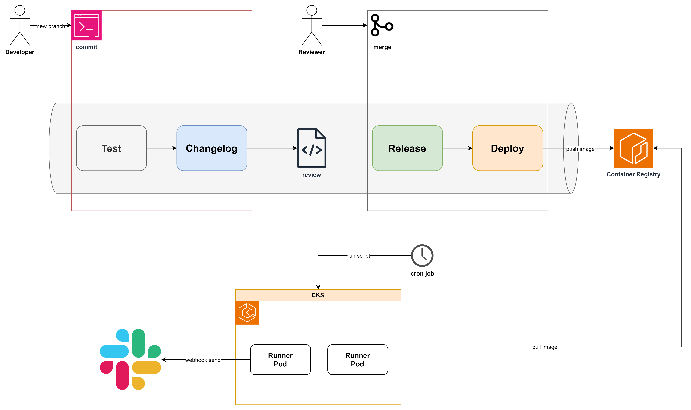
- 마지막 TAG를 기준으로 버전 관리
- main 브랜치 머지될 경우, 스크립트를 포함한 docker image 생성 후 container registry에 등록
- gitlab cron job을 통해 지정한 시간대에 주기적으로 스크립트가 실행되도록 지정

---

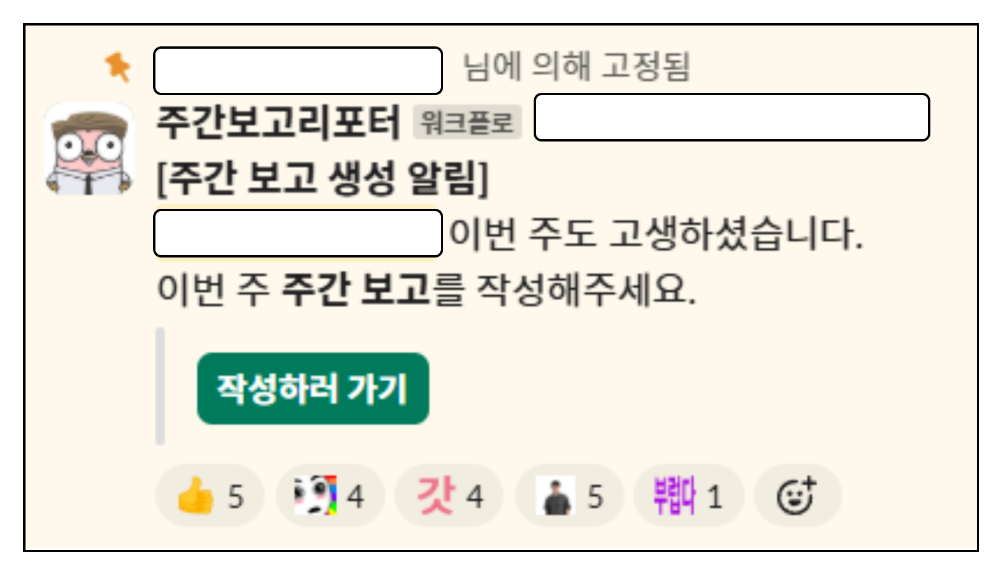
사소하고 어렵지 않은 일이지만 팀에 기여하는 방법은 어디에서나 찾아볼 수 있습니다.

엔지니어로서... 작은것에서 부터 모두가 편해질 수 있는 서비스를 만들어 보람을 찾아보는건 어떨가요?

# REFS
- [github code](https://github.com/dings-things/py-cofluence-automation)