## Before We Begin
### Purpose
- Automating login steps is one of the most common challenges in data scraping from the web. Some portal sites implement Google Recaptcha to block Selenium-based automation, and this post aims to bypass that.
- A secondary goal is to gain a deeper understanding of how ChromeDriver works under Selenium.
- While this project uses a Chrome extension, many paid Recaptcha solvers rely on real humans to solve captchas. This post investigates why that is the case.

### Basic Setup
#### 1. Setting up ChromeDriver
- Check the version of Chrome browser you are using: Settings → About Chrome
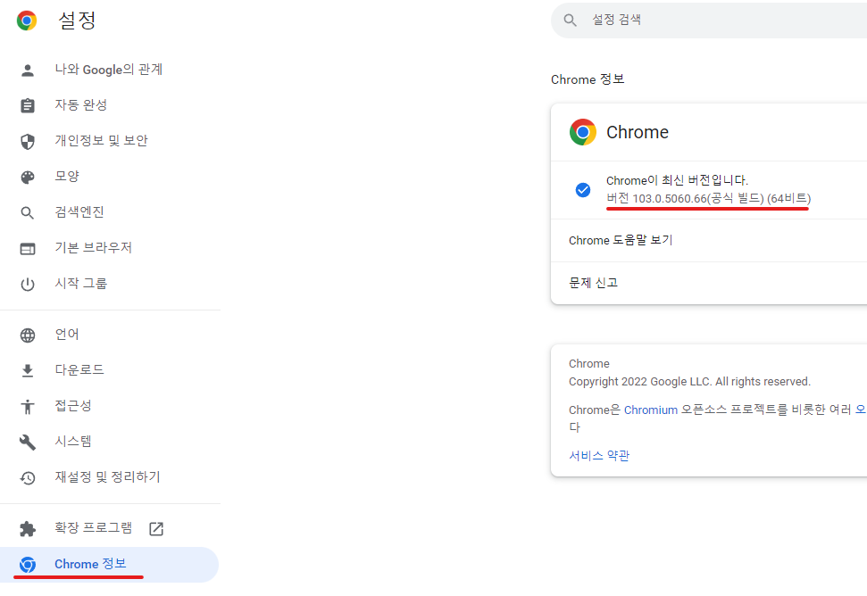
- Download the ChromeDriver version that matches your browser: https://chromedriver.chromium.org/downloads
-> Download the driver version that supports your current Chrome version
Or add as a dependency / NuGet package
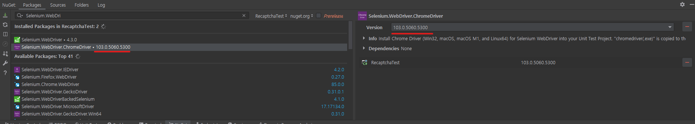

Automatically matching the ChromeDriver version with the installed browser version via code will be added in future enhancements.

#### 2. Download Buster: Recaptcha Solver
- Buster is a Chrome extension that solves Google's Recaptcha using voice recognition and inputs the result automatically.
- Search "buster recaptcha" on Google and install the extension from the Chrome Web Store.
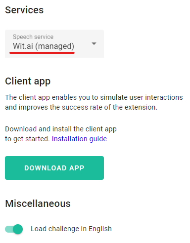

You can configure the Speech service (Wit.ai by default and free to use). Google Speech-to-Text is also available and was reported in some articles to achieve a 97% pass rate. However, since Recaptcha is a Google service, it is likely that the same dataset was used to train the AI, and this speech service is **paid**, so we’ll skip it.

Using Wit.ai, Recaptcha could be solved in up to 8 retries. This will be an important issue explained further below.

#### 3. Extension Setup
- Selenium's `ChromeDriver()` class provides an option called `addExtension()` for adding extensions.
- `addExtension(String extensionPath)` accepts the path to the `.crx` extension package file.

- In Chrome, go to More Tools → Extensions or visit `chrome://extensions`
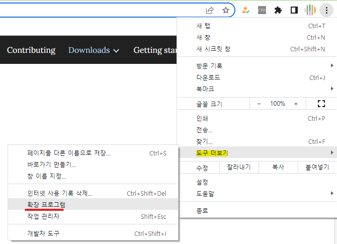

- Enable Developer Mode and remember the ID of the extension you want to use
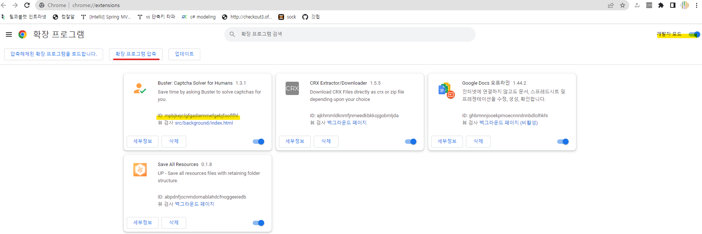

- Unzip the extension and place it where it can be loaded by ChromeDriver (e.g., folder like `1.3.1_0`)
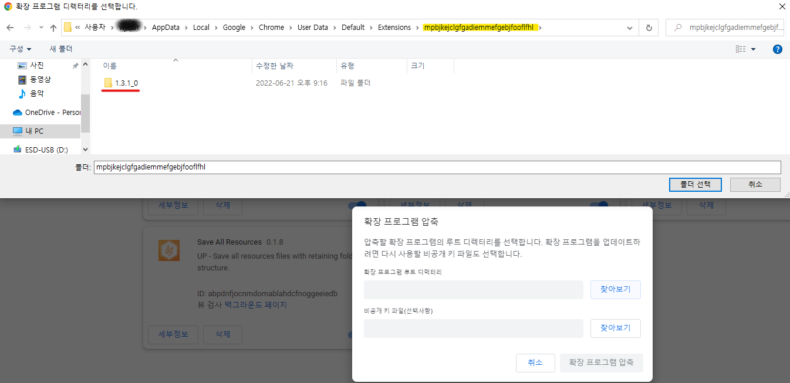
Typically located in `Users-{Username}-AppData-Local-Google-Default-Extensions` — find the folder using the extension ID.
**! If AppData is hidden, manually enter \AppData in the File Explorer path bar !**

## Analyzing Recaptcha on the Webpage via Browser
Before writing any code, analyzing the webpage structure is crucial.

We'll test with this URL: https://patrickhlauke.github.io/recaptcha/ — it always loads Recaptcha.

#### Packet Monitoring with Fiddler
- If Recaptcha is enabled during login, the login page will return something like `ex:needRecaptcha` in the response.
- If **needRecaptcha = true**, Recaptcha solving becomes mandatory.
- A successful login `POST` request must include the Recaptcha token. Services offering Recaptcha API solve the captcha and return this token.

#### Changes in the Browser

First, focus on the top Recaptcha checkbox widget:
- It includes a `data-sitekey` attribute — a unique identifier per site (**site key**)
- Recaptcha solve APIs use this sitekey to simulate solving and return tokens.
- Inside this div is an iframe, accessible using Selenium’s `SwitchTo().Frame()`
- From analysis, we found that Recaptcha success can be detected by checking if `aria-checked="false"` becomes `true`
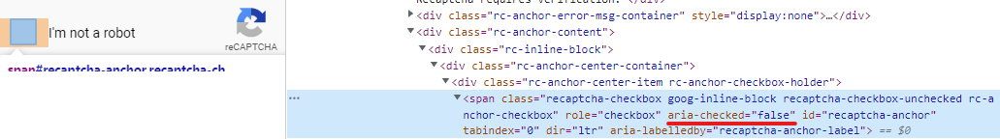

This change is used as a checkpoint for scraping automation:
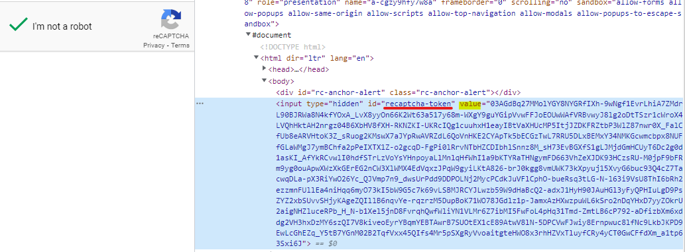
- This iframe also holds the Recaptcha token once solved

Second, another iframe has the title `recaptcha challenge expires in two minutes`
- If it’s your first captcha attempt, it might pass instantly. After repeated attempts, image/audio challenges appear here
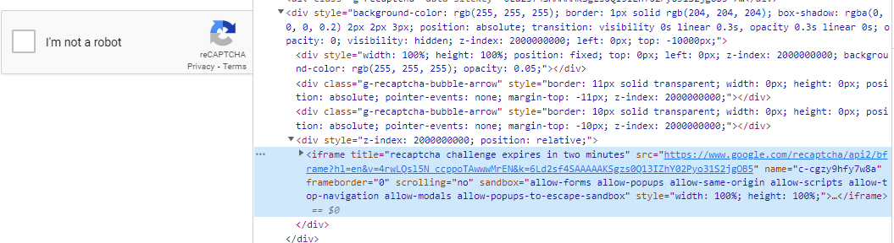

- This is also where the Buster button lives
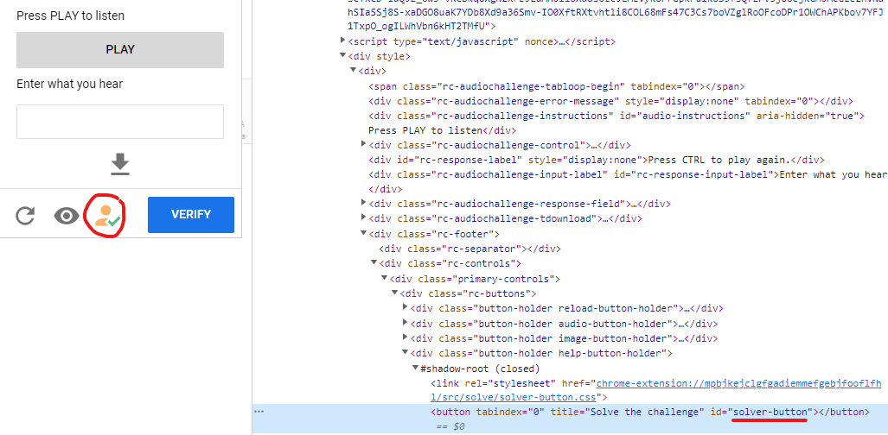

- Wit.ai often fails on the first few tries. You’ll need to hit the reload and Buster buttons until successful.

**! Google detects repetitive actions and may completely block Recaptcha for your IP. Hence, this is an experimental-only project !**

## To Code (C# Base)
We design the flow based on the previous analysis:
> **Visit login page → Check needRecaptcha = true? →
Control browser with Selenium → Use Buster and reload button until checkbox is ticked →
Extract token → Send POST login request**

We’ll use MSTest as the testing framework.

1. Install `Selenium.WebDriver` via NuGet package

2. Create ChromeDriver

```csharp
ChromeOptions _options = new ChromeOptions();
_options.AddExtension(@"...path_to_.crx");
ChromeDriver _driver = new ChromeDriver(_options);
```

If using standalone ChromeDriver:
```csharp
ChromeOptions _options = new ChromeOptions();
_options.AddExtension(@"...path_to_.crx");
ChromeDriver _driver = new ChromeDriver(@"...path_to_chromedriver_folder", _options);
```

#### Extra: Use Chrome Profile for ChromeDriver
If you can access a non-sensitive user profile, you can reuse it:

1. Click profile picture in Chrome

2. Continue without sign-in
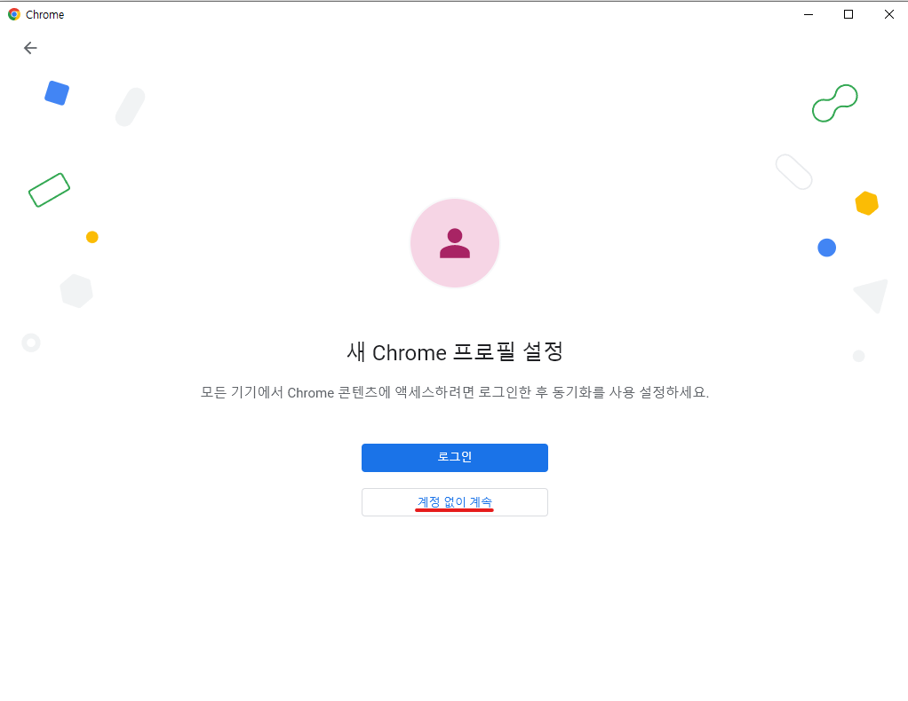
3. Create new profile
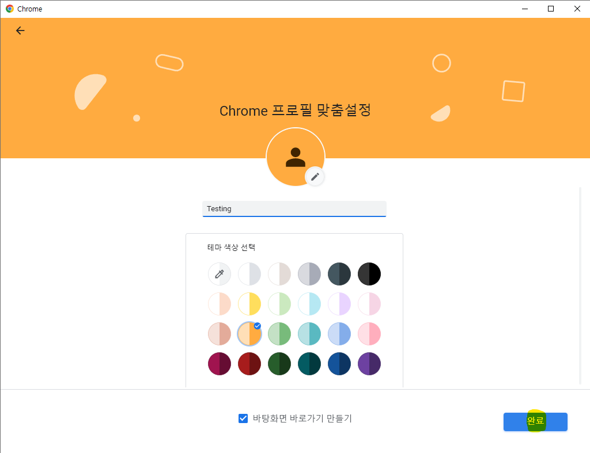
4. Profile path: `Users-{User}-AppData-Local-Google-Profile{X}`
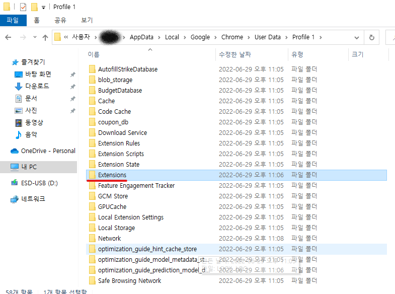
5. Download Buster extension into that profile
6. Set profile via ChromeOptions:

```csharp
ChromeOptions _options = new ChromeOptions();
_options.AddArgument("--user-data-dir=" + @"path_to_profile");
_options.AddArgument("--profile-directory=ProfileNumber");
ChromeDriver _driver = new ChromeDriver(_options);
```

**Warning**: If Chrome is already running with this profile, Selenium will fail to open the browser

3. Utility methods to check Recaptcha state:
```csharp
public static bool IsChecked(ChromeDriver driver)
{
    return driver.FindElement(By.Id("recaptcha-anchor")).GetAttribute("aria-checked") == "true";
}

public static bool IsExistByCss(ChromeDriver driver, string cssQuery)
{
    try { driver.FindElement(By.CssSelector(cssQuery)); }
    catch { return false; }
    return true;
}
```

4. Check if captcha exists:
```csharp
if (IsExistByCss(_driver, "iframe[title=\"reCAPTCHA\"]"))
```

5. Find two Recaptcha-related iframes:
```csharp
IWebElement first = _driver.FindElement(By.CssSelector("iframe[title=\"reCAPTCHA\"]"));
IWebElement second = _driver.FindElement(By.CssSelector("iframe[title=\"reCAPTCHA challenge expires in two minutes\"]"));
```

6. Switch to first iframe and click the checkbox:
```csharp
_driver.SwitchTo().Frame(first);
var checkBox = _driver.FindElement(By.ClassName("recaptcha-checkbox"));
_driver.ExecuteScript("arguments[0].click()", checkBox);
```

7. Check if it passed:
```csharp
if (!IsChecked(_driver))
```

8. Retry with second iframe and click Buster button:
```csharp
_driver.SwitchTo().DefaultContent();
_driver.SwitchTo().Frame(second);
_driver.Manage().Timeouts().ImplicitWait = TimeSpan.FromSeconds(200);
var busterHolder = _driver.FindElement(By.ClassName("help-button-holder"));
busterHolder.Click();
```

9. If not passed, refresh and try again:
```csharp
if (!IsChecked(_driver))
{
     _driver.SwitchTo().DefaultContent();
     _driver.SwitchTo().Frame(second);
     _driver.FindElement(By.ClassName("rc-button-image")).Click();
     _driver.FindElement(By.ClassName("help-button-holder")).Click();
}
else {
    isChecked = true;
    break;
}
```

10. Extract token:
```csharp
if (isChecked)
{
    _driver.SwitchTo().DefaultContent();
    _driver.SwitchTo().Frame(second);
    _token = _driver.FindElement(By.Id("recaptcha-token")).GetAttribute("value");
    return _token;
}
```

---

### Improvements
Through this project, I came to appreciate Google's anti-bot intelligence.

If I had used the paid Google Speech-to-Text, the success rate would’ve been higher even under heavier traffic. However, since we used free tools, Recaptcha eventually flagged the automation and blocked us.

Recaptcha v3 is known to detect cursor movement and behavior patterns — even if this project is enhanced, v3 may still detect it.

That’s why many Recaptcha solving APIs hire real humans to manually solve captchas and return the token.

Key improvement areas:
> 1. ChromeDriver version must be manually matched with Chrome browser version
> 2. Heavy traffic and repeated failures lead to Recaptcha ban
> 3. Login must complete within 2 minutes of solving the captcha
