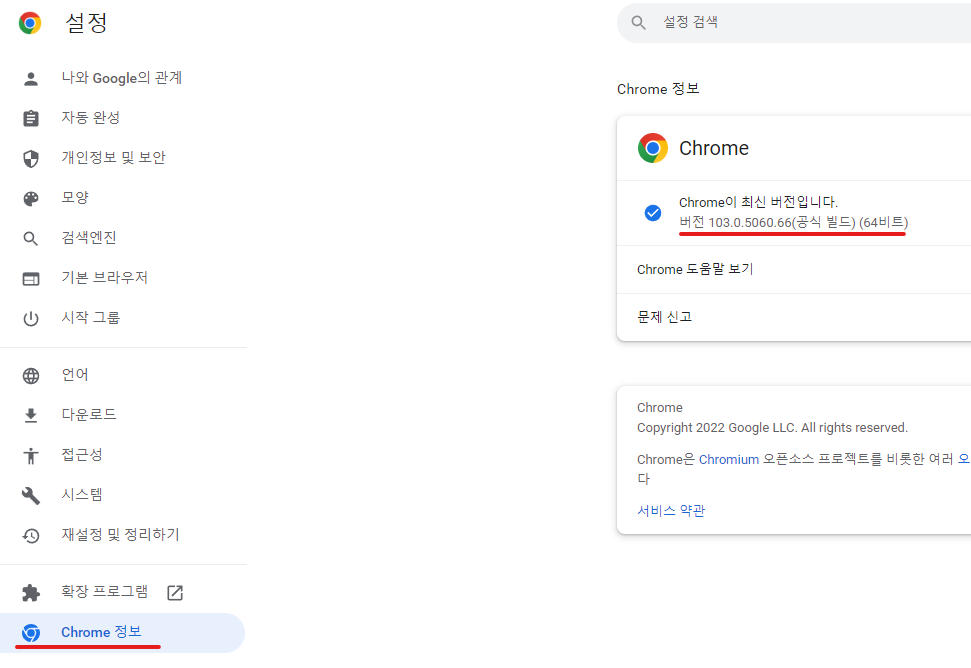
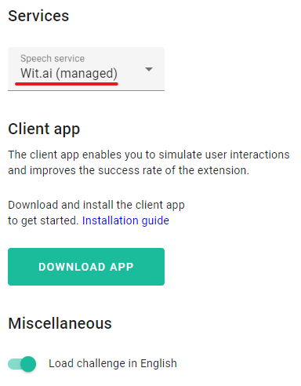
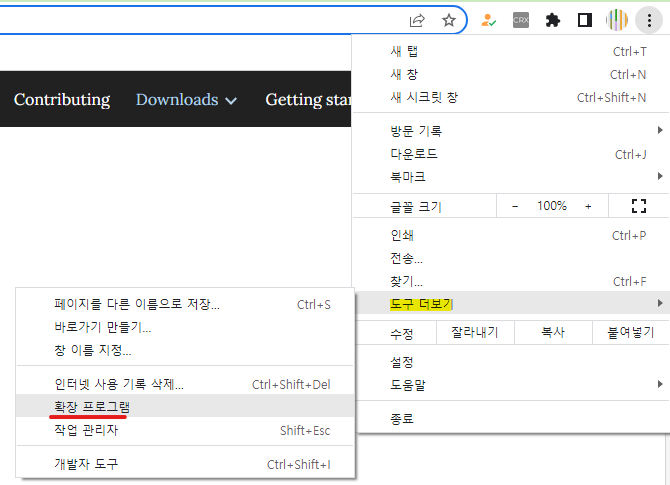
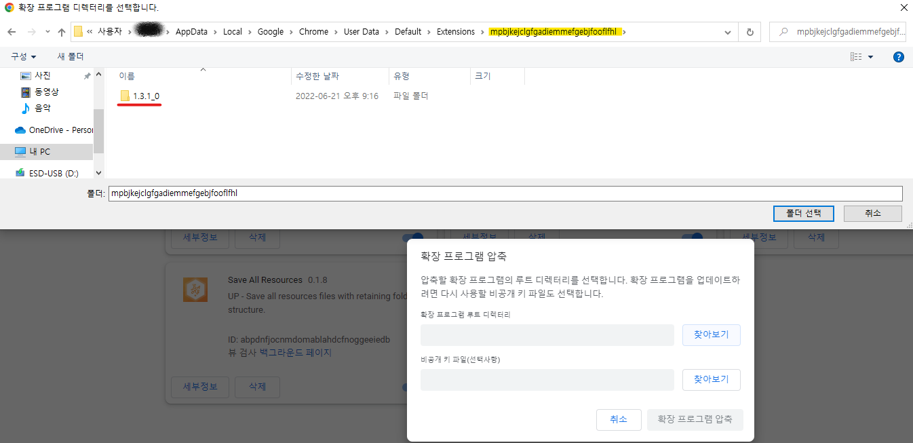
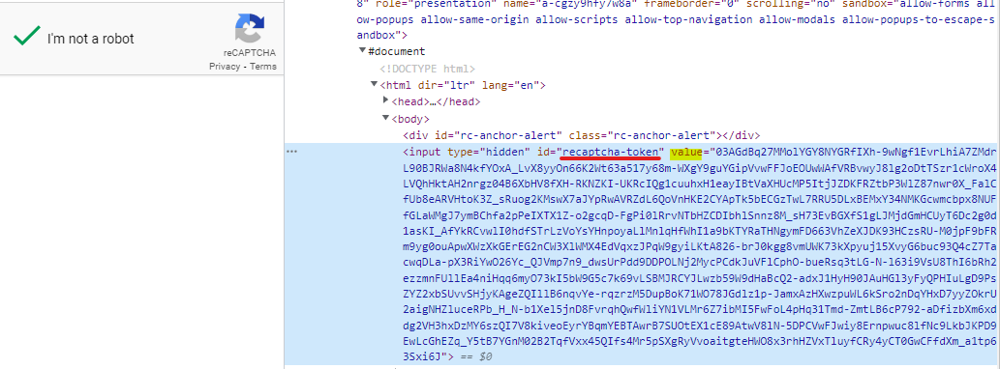
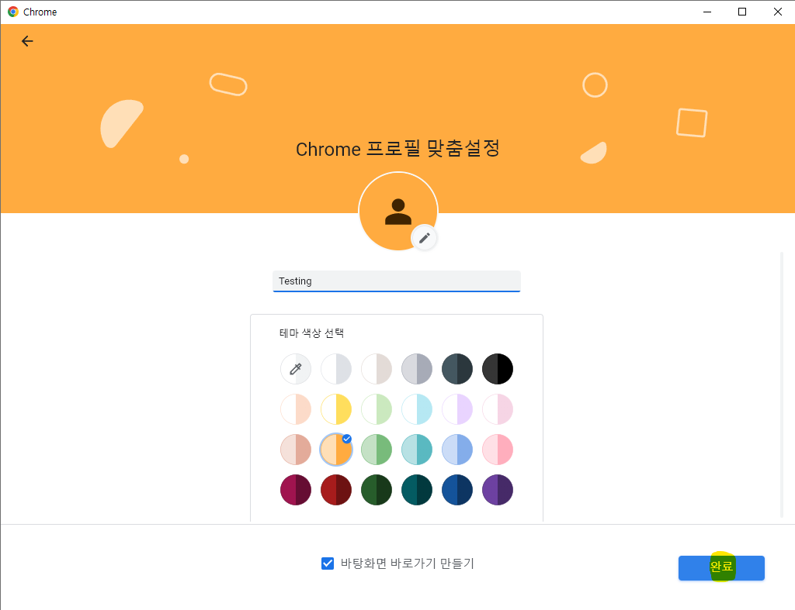

## 시작에 앞서서
### 목적 ?
- 스크래핑을 이용한 데이터 수집에서 로그인하는 과정을 자동화하는 절차는 모든 웹에서 공통적으로 수행해야 하는 과제중 하나이다. 포털 사이트중 일부는 구글 Recaptcha 를 도입하여 Selenium을 통한 접근을 막게 되는데 이를 우회하기 위해 시작하게 되었다.
- 일반적으로 Selenium 을 사용하게 될때에 쓰이는 Chrome Driver 에 대한 이해를 심화하기 위한 과제
- 현재는 구글 Extension 을 활용하여 진행하지만 외부에서 배포하고 있는 유료 recaptcha solver 는 사람이 직접 캡챠를 푸는 방식을 채택하는 것이 대부분인데 그 이유를 파악하고자 하는 목적이 있다
---
### 기본 설정
#### 1. 크롬 드라이버 설정
- 사용하고 있는 크롬 브라우저의 버전을 확인한다 : 크롬브라우저 설정 - Chrome 정보

- 해당 버전과 동일한 버전의 chrome driver를 설치한다 : https://chromedriver.chromium.org/downloads 
-> supports Chrom version {사용하고 있는 버전} 다운로드
또는 dependency 추가 / Nuget Package 추가


Code를 통하여 Chrome Version과 동일한 버전의 크롬 드라이버를 설치하여 자동화하는 과정은 추후 고도화하는 과정에서 추가할 예정에 있습니다


#### 2. Buster : Recaptcha Solver 다운로드
- 구글의 Recaptcha에서 음성을 인식하여 자동으로 타이핑 이후 우회하게 해주는 확장 프로그램입니다
- 구글에 buster recaptcha 검색 이후 확장프로그램 다운로드를 진행합니다

추가 설정으로 Speech service 를 선택할 수 있습니다.
Wit.ai 가 default 이며 무료로 사용할 수 있으며 Google Speech-to-Text 또한 선택할 수 있는데 논외로 한 기사에서 보았는데 97%의 recaptcha 통과율을 보이는 Speech service 라고 합니다. 
다만 Recaptcha 자체가 구글에서 제공하는 것이다 보니 같은 구글의 speech 파일으로 AI의 학습 데이터셋을 활용했을 가능성이 높을것이며 해당 서비스는 **유료** 이기 때문에 pass 하겠습니다

- Wit.ai를 통한 리캡챠 시도시 최대 8회까지 새로고침하여 리캡챠를 시도하였을 때 통과하는 수준을 보였습니다. 이것은 이후에 문제가 되는데 다음에 설명하겠습니다.


#### 3. Extension 설정
- Python, JAVA, C# 을 막론하고 Selenium에서 제공하는 `ChromeDriver()` 클래스에서는 option으로 `addExtension()`이라는 메서드를 제공합니다
- `addExtension(String extensionPath)` : ".crx" 파일의 크롬 확장 프로그램의 압축 파일의 경로를 인스턴스로 옵션값을 설정하게 됩니다

- 크롬 브라우저에서 도구 더보기 - 확장 프로그램 을 통하여 chrome://extentions 에 접근 



- 개발자 모드를 활성화 시키고 활용하고자 하는 extension의 아이디를 기억합니다


- 이후 확장 프로그램 압축 클릭 - extension 파일의 경로에 위치 시킵니다 (아래의 경우 1.3.1_0 을 폴더로 선택) 

`일반적으로 경로는 Users-{사용자 Desktop}-AppData-Local-Google-Default-Extensions에 위치합니다` (위에서 ID값을 기억한 이후 해당 ID값을 가지는 폴더를 선택하여 압축합니다)
**! AppData 가 보이지 않는다면 사용자Desktop에서 \AppData를 입력하여 접근합니다 !**

---


### 브라우저를 통한 리캡챠를 갖는 웹의 분석
코드로 작성하기에 앞서 스크래핑에 있어 가장 중요한 웹페이지의 분석 단계입니다
먼저 얻고자 하는 result(리캡챠 통과) 를 설정하고 과정을 시뮬레이션하여 바뀌게 되는 패킷의 이동이나 웹 브라우저의 변화를 감지합니다 

Test 하게 되는 url 은 https://patrickhlauke.github.io/recaptcha/  이며 해당 url에는 항시 리캡챠가 적용되어있기 때문에 이를 토대로 분석해줍니다

#### Fiddler 를 통한 패킷의 변화 
- 만약 로그인 시도시에 recaptcha가 존재한다면 HttpResponse 로 `ex:needRecaptcha` 와 같은 response를 로그인 페이지를 `GET`하게 될때에 얻을 수 있을 것입니다.
- 만약 **needRecaptcha**가 **true** 라면 이 일련의 과정을 거쳐야 한다고 판단할 수 있는 것이죠!
- needRecaptcha가 true라는 가정하에 로그인 `POST`  시에 Required 파라미터로 Recaptcha 토큰 값 또한 body에 넣어야 로그인이 진행됩니다. 이때문에 Recaptcha Api를 제공하는 곳에서는 이 토큰값을 반환하여 돈을 얻게 되는 것이죠.

#### 브라우저의 변화

첫번째로 봐야 할 것은 위에 상단에 위치하는 recaptcha 입니다
   - `data-sitekey` 라는 속성을 갖는데 이는 웹마다 다른 고유값을 가집니다 (**식별키**)
   실제로 recaptcha solve api를 제공하는 곳에선 이 data-sitekey 를 통하여 리캡챠를 사람이 푼뒤 토큰값을 반환하는 것으로 알고 있습니다
   - 해당 div 에는 iframe이 존재하는데 Selenium 의 SwitchTO().Frame 을 통하여 접근할 수 있습니다
   - 분석한 결과를 토대로 핵심만 말하자면 이 iframe 에서는 Recaptcha 가 체크되었는지, 즉 통과되었는지 여부를 알 수 있습니다
   
   aria-checked = false 에서 true 로 바뀌는 시점이 리캡챠가 풀리는 시점입니다. 
   현재 Selenium을 통한 스크래핑 과정중에 있기때문에 현실에서는 눈으로 캡챠가 풀렸는지 확인할 수 있지만 Selenium을 통하였을때 통과되는 분기점을 찾는것은 매우 중요합니다. 
   
   저는 이 aria-checked 라는 attribute 값의 변화를 분기점으로 두고 스크래핑하였습니다
   
- 또한 리캡챠가 완료되었을때 token 값이 담기는 iframe 이기 때문에 핵심이라고 할 수 있습니다
   
두번째는 title="recaptcha challenge expires in two minutes" 를 갖는 iframe 입니다
- 만약 리캡챠를 푸는것이 초기라면 그림이나 음성을 통한 수행과정 없이도 바로 체크를 얻을 수 있을것입니다. 하지만 반복적인 리캡챠 수행이 이루어지게 되었을때 그림, 음성 수행과정을 수행하는 iframe 이 이곳입니다


- buster 확장프로그램 버튼이 위치하는 iframe이기도 합니다 


- 앞서 설명했듯 Wit.Ai 를 통한 Speech-to-Text 는 완벽하지 않습니다. 평균적으로 5회 정도하였을때 성공하는 정도를 보였습니다. 결국 성공할 때 까지 refresh 버튼을 통하여 Speech 를 초기화한뒤 buster button을 계속 눌러줘야 합니다 (성공할때까지)

**! 구글은 이러한 정형화된 Action 을 파악하여 일정 횟수를 초과하면 해당 ip 에서는 아에 리캡챠를 수행하지 못하도록 막아버립니다. 이러한 이유때문에 이 프로젝트가 실험적인 요소로 남을 수 밖에 없는 것입니다 !**

---
### To Code (C# Base)
위의 분석을 토대로 전체적인 Flow 를 구상합니다
> **로그인 페이지에 접근 ->
response에서 needRecaptcha 가 true ? ->
Selenium을 통한 브라우저 조종 ( recaptcha checkbox 가 체크될때 까지 buster button 과 reload를 눌러 리캡챠를 통과 시킴 ) ->
recaptcha token 을 포함하는 POST 메서드를 통하여 로그인 통과**

유닛테스트 (MS Test)를 기반으로 프로젝트를 생성하겠습니다

1. Nuget Package 를 통하여 Selenium.WebDriver 를 다운로드하여 프로젝트 패키지에 넣어줍니다


2. 크롬 드라이버 생성

  Nuget 을 통하여 ChromeDriver를 생성하였다면
  
  ``` cs
  ChromeOptions _options = new ChromeOptions();
  _options.AddExtension(@"...\...\path_to_.crx");

  ChromeDriver _driver = new ChromeDriver(_options);
  ```
  
  chromedriver.exe를 직접 설치하였다면 (chormedriver.exe 가 아닌 포함 된 폴더로 지정)
  ``` cs
    ChromeOptions _options = new ChromeOptions();
    _options.AddExtension(@"...\...\path_to_.crx");

    ChromeDriver _driver = new ChromeDriver(@"...\...\path_to_chromedriver_folder",_options);
   ```

 
	
    
---

#### Extra ) Profile 을 통한 설정으로 크롬드라이버 생성시
만약 다른 사용자가 만들어놓은 Profile에 접근 할 수 없어 보안상 문제가 없다고 한다면 통용되는 방법입니다

1. 크롬에서 프로필 사진 클릭


2. 계정 없이 계속


3. 신규 프로필 생성


4. 새로 만든 프로필의 경로

Users-{사용자 Desktop}-AppData-Local-Google-Profile{만든순서} 에 위치합니다

5. 새로 만든 프로필에서 buster extension을 다운로드

6. ChromeDriverOption 설정을 통하여 드라이버 생성


``` cs
ChromeOptions _options = new ChromeOptions();
_options.AddArgument("--user-data-dir=" + @"path_to_profile");
_options.AddArgument("--profile-directory=ProfileNumber");

ChromeDriver _driver = new ChromeDriver(_options);
```

**! 주의 사항 ! **: 해당 프로필의 브라우저가 열려있을때 Selenium 으로 해당 프로필 정보로 드라이버 생성시 `Error` 가 발생합니다 

---

3. 우선 리캡챠 체크 여부를 판별하는 메서드와 해당 WebElement 가 존재하는지 여부를 판별하는 메서드를 따로 생성하여 관리 하였습니다

``` cs
public static bool IsChecked(ChromeDriver driver)
{
    bool check = driver.FindElement(By.Id("recaptcha-anchor")).GetAttribute("aria-checked").Equals("true") ? true : false;
    return check;
}


public static bool IsExistByCss(ChromeDriver driver, string cssQuery)
{
    try
    {
        driver.FindElement(By.CssSelector(cssQuery));
    }
    catch (Exception e)
    {
        return false;
    }

    return true;
}
```

4. 세션시간 초과로 캡챠가 도중에 풀렸을 수도 있기때문에 미리 캡챠 div가 있는지 판별
``` cs
if (IsExistByCss(_driver, "iframe[title=\"reCAPTCHA\"]"))
```

5. recaptcha 가 존재한다면 앞서 설명한 두개의 iframe Element를 저장해줍니다
``` cs
IWebElement first = _driver.FindElement(By.CssSelector("iframe[title=\"reCAPTCHA\"]"));
var x = _driver.PageSource;
IWebElement second = _driver.FindElement(By.CssSelector("iframe[title=\"reCAPTCHA 보안문자 2분 후 만료\"]"));
```

6. 첫번째 iframe 으로 전환후 리캡챠 체크박스를 클릭합니다 ( 이상하게 Element.Click()이 통하지 않아 executeScript를 사용하니 적용이 되었습니다 )
``` cs
_driver.SwitchTo().Frame(first);
var checkBox = _driver.FindElement(By.ClassName("recaptcha-checkbox"));
_driver.ExecuteScript("arguments[0].click()", checkBox); // IFrame 에 접근시 JS를 통하지 않고 바로 Click() 수행시 동작하지 않는 문제
```

7. 체크박스 클릭이후 체크여부를 판별합니다
```
if (!IsChecked(_driver))
```

8. 첫번째 iframe -> 두번째 iframe 으로 접근합니다 ( iframe 간에는 바로 Switch가 불가능하며 본래 html로 복귀 이후 이동하여야 합니다 )
이후 buster button을 클릭합니다
``` cs
_driver.SwitchTo().DefaultContent(); // 본래 html 로 복귀
_driver.SwitchTo().Frame(second);
_driver.Manage().Timeouts().ImplicitWait = TimeSpan.FromSeconds(200);
var busterHolder = _driver.FindElement(By.ClassName("help-button-holder"));
busterHolder.Click();
```

9. 만약 리캡챠가 풀리지 않았다면 풀릴때까지 10회 반복합니다 ( 이미지 버튼을 클릭하여 Speech reload 이후 buster button click)
``` cs
if (!IsChecked(_driver))
{
     _driver.SwitchTo().DefaultContent(); // 본래 html 로 복귀
     _driver.SwitchTo().Frame(second);
     _driver.FindElement(By.ClassName("rc-button-image")).Click();
     _driver.FindElement(By.ClassName("help-button-holder")).Click();
}
else
{
	isChecked=true;
    break;
}
```

10. 마지막으로 체크가 되었다면 토큰값을 반환합니다
``` cs
if (isChecked)
{
    _driver.SwitchTo().DefaultContent(); 
    _driver.SwitchTo().Frame(second);
    _token = _driver.FindElement(By.Id("recaptcha-token")).GetAttribute("value");
    return _token;
}
```

---

### 개선사항 
위의 프로젝트를 진행하면서 구글의 똑똑함을 다시한번 느꼈습니다. 만약 과금을 하더라도 Google speech-to-text 를 이용하였다면 높은 성공율으로 트래픽이 다소 많더라도 리캡챠를 풀 수 있었겠지만 그렇지 않았기에 결국 자동화된 프로그램으로 인식되어 Recaptcha가 밴 될수도 있다는 것을 알게 되었죠..

Google 의 Recaptcha v3 같은 경우에는 커서의 움직임이나 행동패턴을 통하여도 구분한다고 하는데 이 프로젝트를 고도화 한다 하여도 v3에는 아마 꼬리가 잡히지 않을까 합니다.

그래서 많은 ReCaptcha Solver API 가 실제 사람들을 고용하여 수동으로 풀고 토큰값을 반환하는게 아닐까 그런 생각도 들고 말이죠.

핵심적으로 위의 프로젝트에서 개선되어야 할점을 꼬집어 보자면 API로서의 역할을 하기에는 불완전 요소가 많다는 점입니다 

> 1. Chrome 브라우저 버전과 Chrome driver 버전의 일치를 manually 하여야 한다는 점 
2. 트래픽이 많고 리캡챠의 실패가 잦아 질수록 구글에서의 리캡챠 밴이 될 확률이 높다는 점
3. 리캡챠가 풀리는 2분내에 로그인까지 완료가 되지 않을 수도 있다는 점

이러한 점들이 있겠네요. 
요즘 간간히 서버쪽도 공부해가면서 Ubuntu를 이용한 자동화에 대해서도 공부를 더 해봐야 겠습니다.
