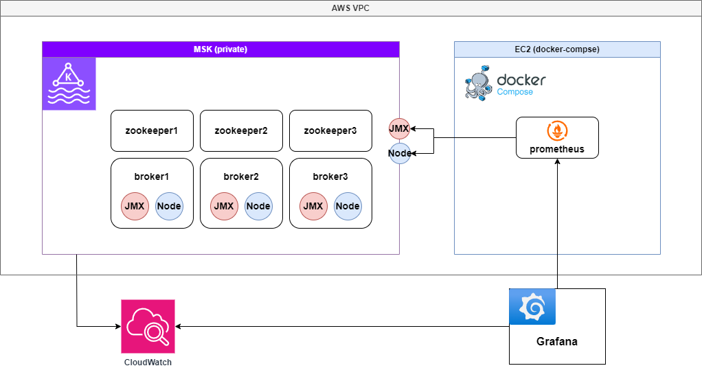
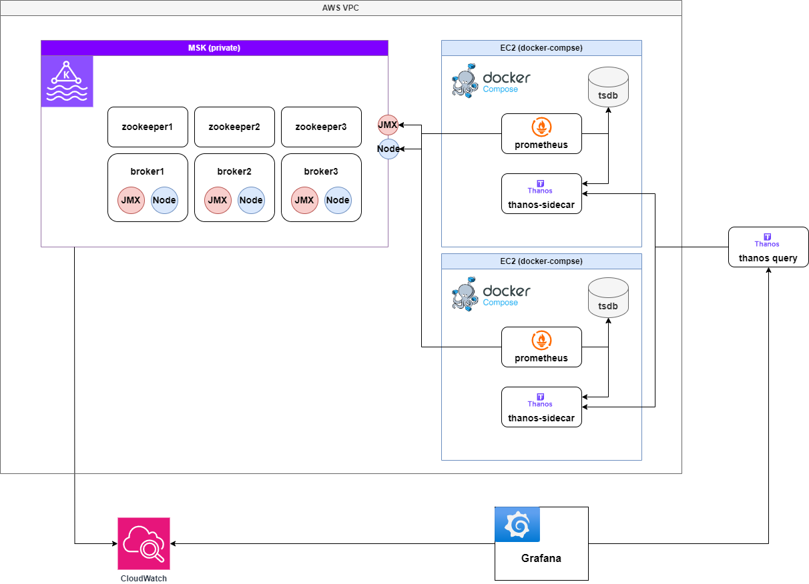
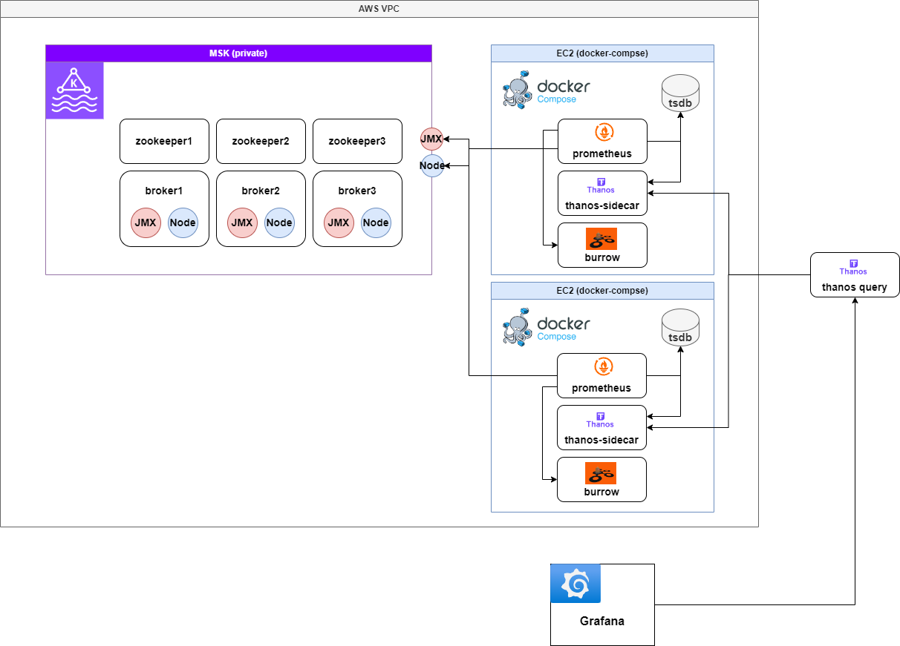
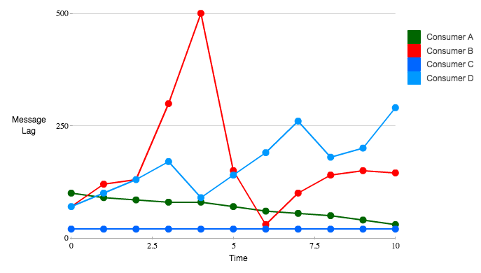
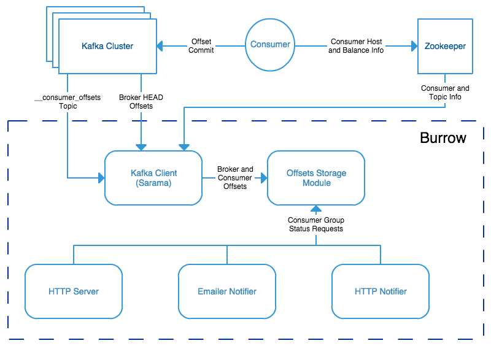
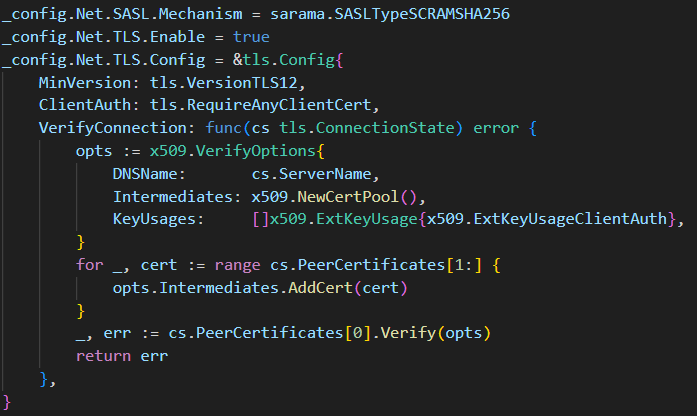
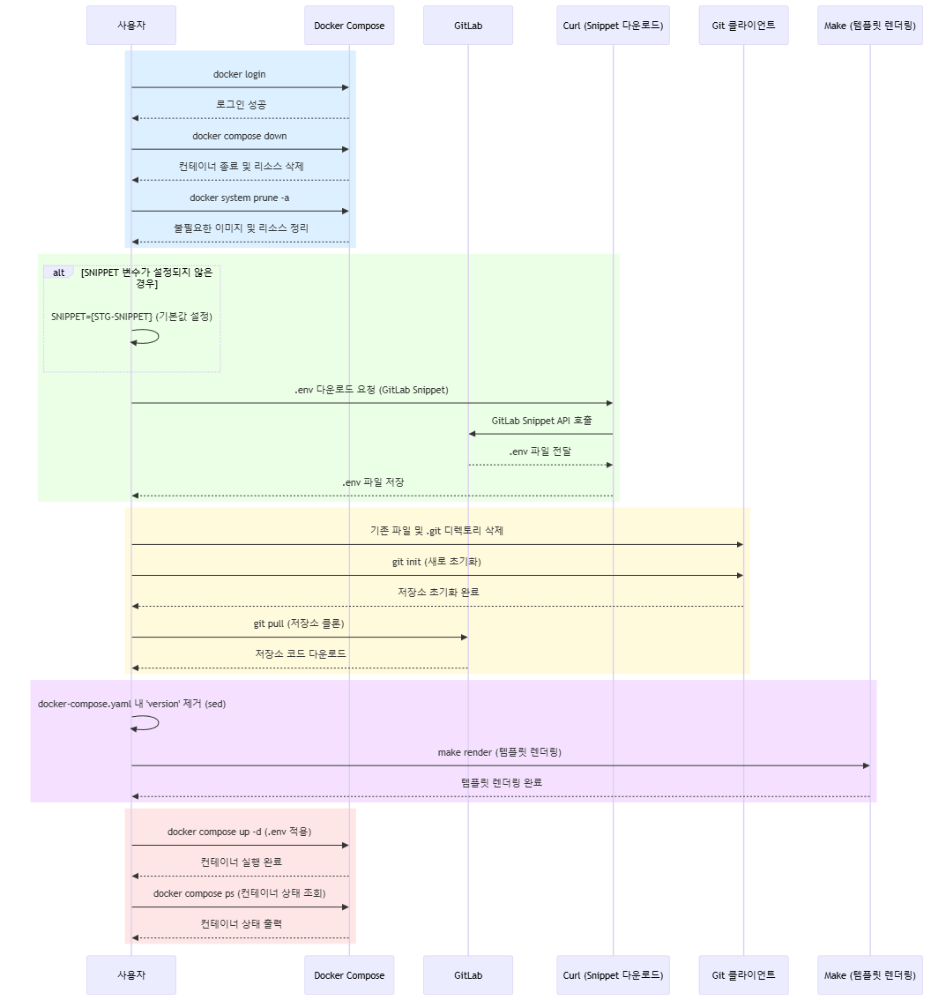
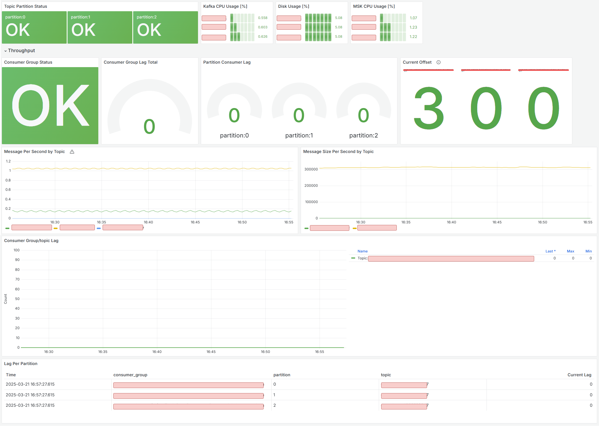
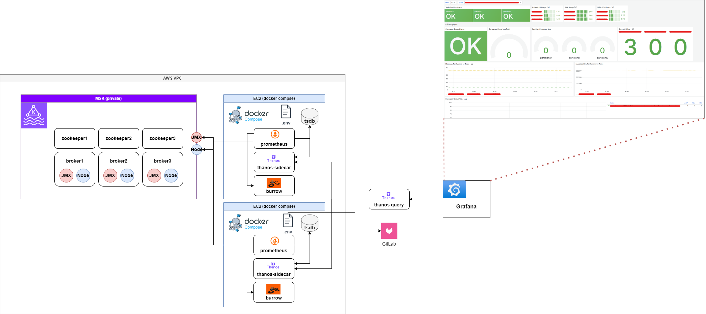

# Background
One of the biggest trade-offs between asynchronous and synchronous programming is that while performance may be improved, **it becomes harder to trace**.

The same is true for event-driven architecture (EDA) using Kafka. It is not easy to track the flow of asynchronously processed data in real-time.
In particular, issues often go unnoticed until after they occur, making Kafka monitoring increasingly critical.

In event-driven systems, **performance monitoring** is crucial. In REST API-based architectures, traffic is typically handled using Kubernetes Horizontal Pod Autoscaler (HPA) based on CPU/memory usage and request rates.
However, in Kafka-based architectures, the key performance factors are the **number of partitions** and the **processing speed of consumers**.

What if there are **too few partitions or slow consumers causing lag**?
→ Developers must manually analyze performance and perform `partition scaling` or `consumer scale-out`.

To detect and address such issues in advance, a **Kafka monitoring system was built**.

We considered three different options for monitoring Kafka performance:

# Design
## Comparison of Kafka Monitoring Solutions
### AWS CloudWatch
Using AWS CloudWatch for Kafka monitoring allows metric collection at the
**PER_TOPIC_PER_PARTITION** level.

#### **Key Monitoring Metrics**
| Metric (`AWS/MSK`) | Description |
|--------------------|-------------|
| `EstimatedTimeLag` | Time lag (in seconds) of the partition offset after the consumer group reads data |
| `OffsetLag`        | Number of offset lag in the partition after consumption by the consumer group |

| Item | Description |
|------|-------------|
| **✅ Easy setup** | Integrated with AWS MSK by default |
| **✅ Supports CloudWatch Alarm + SNS** | Simple alert setup available |
| **❌ Viewable only on AWS Console** | Hard to integrate with external monitoring tools |
| **❌ Cost concerns** | Additional fees for topic-level monitoring |

---

### Helm-based Monitoring on EKS (Internal solution, failed attempt)
We attempted Kafka monitoring using an internal Helm chart,
but it failed due to **MSK and EKS residing in different regions**.

| Item | Description |
|------|-------------|
| **✅ Internal system integration** | Smooth integration with in-house systems |
| **❌ MSK and EKS are in different regions** | Integration not possible |
| **❌ Cost if EKS is redeployed in MSK region** | Additional expenses may occur |

Ultimately, this approach was abandoned.

---

### EC2-based Docker Compose Monitoring (Final Choice)
Eventually, we opted to **deploy EC2 in the same VPC as MSK and build the Kafka monitoring stack manually**.
- Used **JMX Exporter & Node Exporter** for Kafka metric collection
- Used **Burrow** to monitor consumer lag
- Enabled **long-term monitoring via Thanos and Prometheus**

| Item | Description |
|------|-------------|
| **✅ Cost-efficient** | Can run on low-cost T-series EC2 instances |
| **✅ Scalable** | Easily customizable and extensible |
| **✅ Fine-grained Kafka monitoring** | Enables detailed tracking via Burrow |
| **❌ Initial setup burden** | Manual configuration with potential trial-and-error |
| **❌ Lack of Burrow & Thanos ops experience** | Required team to learn and operate monitoring stack from scratch |

Surprisingly, starting from scratch became a **benefit**, so we decided to build EC2-based monitoring ourselves.

## Architecture Overview
> #### MSK Terminology
> - `zookeeper`: Stores Kafka metadata and manages Kafka states
> - `broker`: The server/node where Kafka runs
> - `JMX Exporter`: Exposes various metrics from Apache Kafka (brokers, producers, consumers) for monitoring via JMX
> - `Node Exporter`: Exposes CPU and disk metrics

#### Kafka Monitoring Architecture Evolution: Integrating Prometheus, Thanos, and Burrow

Our monitoring architecture evolved from standalone Prometheus (V1), to Thanos integration (V2), to including Kafka consumer monitoring with Burrow (V3).

Each version is compared below with its respective pros and cons.

---

### V1: Standalone Prometheus Metric Collection
Used Prometheus to gather Kafka metrics and added both `CloudWatch` and `Prometheus` as data sources in Grafana for monitoring.

#### Architecture Diagram


#### Pros
- Simple setup using only Prometheus
- Easy to compare metrics between Prometheus and CloudWatch in Grafana

#### Cons
- If Prometheus goes down, the entire monitoring stack becomes unavailable → **SPOF risk**
- Prometheus stores all metrics in-memory (TSDB), increasing memory usage with metric volume
- Large TSDB size can degrade Prometheus performance

---

### V2: Prometheus + Thanos Sidecar for HA

To ensure high availability, we ran **two Prometheus instances** and added Thanos Sidecars to connect them to a central **Thanos Query + Store server**.

#### Architecture Diagram


#### Why Thanos?
- **Avoid metric duplication**: Thanos Query deduplicates metrics collected from multiple Prometheus instances
- **Separate short-term (Prometheus) and long-term (Thanos Store) storage**: Enables restoration from S3
- **Reduce TSDB size**: Lowers memory usage and cost

#### Pros
- **HA support**: Continues monitoring even if one Prometheus fails
- **Long-term metric storage**: Offload to S3/GCS
- **Resource efficiency**: Reduces Prometheus memory usage

#### Cons
- **Increased operational complexity**: Requires Sidecar, Query, and Object Storage (S3) configuration
- **Performance limits of Thanos Query**: Heavy queries may impact performance

---

### V3: Burrow + Prometheus + Thanos Sidecar for Kafka Consumer Monitoring

To cut costs and enhance Kafka Consumer Lag monitoring,
we replaced CloudWatch with Burrow for metric collection.

Now the monitoring stack is fully built with **Burrow + Prometheus + Thanos**, removing CloudWatch.

#### Architecture Diagram

> Burrow collects Kafka consumer metrics periodically, Prometheus scrapes those metrics, and Thanos Query gathers them from Sidecar.

#### Why Burrow?
- **Cost savings**: Eliminates CloudWatch fees
- **Detailed Consumer Lag visibility**: Real-time offset tracking for Kafka consumer groups
- **ACL-aware monitoring**: Burrow provides fine-grained lag info per topic and group, unlike CloudWatch

#### Pros
- **Reduces CloudWatch cost**
- **Detailed insights into Consumer Group lag and partition status**
- **Integrates well with existing Prometheus + Thanos stack**

#### Cons
- **Setup overhead**: Initial integration with Kafka clusters and ACL permissions needed
- **Limited alerting in Burrow**: Works best when combined with Prometheus Alertmanager or Grafana Alerta

---

### Version Comparison Summary
| Architecture | Pros | Cons | Verdict |
|--------------|------|------|---------|
| **V1: Prometheus only** | Easy and fast setup | Lacks HA, high memory usage | Inefficient due to SPOF |
| **V2: Prometheus + Thanos** | HA, long-term storage, memory optimization | More complex setup | Good for scalable systems |
| **V3: Burrow + Prometheus + Thanos** | Reduces cost, adds detailed monitoring, integrates well | Needs setup, weak built-in alerts | ✅ Final choice |

To monitor Kafka effectively,
**a combination of Burrow + Prometheus + Thanos was the optimal solution for comprehensive Kafka consumer lag visibility.**

# Implementation
## Burrow
### Kafka Consumer Lag Monitoring with Burrow

While Kafka clients can expose `records-lag-max` using the `metrics()` method, this only reflects the **lag of the slowest partition**, making it difficult to get a full picture of the consumer’s performance. Additionally, if the consumer stops, lag will no longer be measured, requiring an **external monitoring system**. A representative solution is LinkedIn’s **Burrow**.



[Burrow: Kafka Consumer Monitoring Reinvented](https://engineering.linkedin.com/apache-kafka/burrow-kafka-consumer-monitoring-reinvented)
- **Consumer A**: Lag is consistently decreasing → Healthy
- **Consumer B**: Lag temporarily spiked but recovered → Healthy
- **Consumer C**: Lag remains constant → Healthy
- **Consumer D**: Lag temporarily increased but recovered → Healthy traffic pattern

### The Problem with Lag Thresholds
**Threshold-based detection is prone to false positives**. For example, if a threshold of `250` is set, **consumers B and D**, which are behaving normally, could be incorrectly flagged as unhealthy.

> ⚠️ You cannot determine the health of a Kafka consumer solely based on `MaxLag`!

---

### How Burrow Solves This
Burrow **reads the internal Kafka topic where consumer offsets are committed** and evaluates the state of each consumer independently. It’s not dependent on any specific consumer, and **automatically monitors all consumers** to enable **objective status analysis**.



#### How Burrow Works
Burrow uses a **sliding window technique** to analyze the last N offset commits. LinkedIn recommends using **10 commits (approx. 10 minutes)** to evaluate the following:

1. **Is the consumer committing offsets regularly?**
2. **Are the offsets increasing?**
3. **Is lag increasing?**
4. **Is there a sustained pattern of increasing lag?**

Based on this, Burrow categorizes the consumer’s status as:

- **✅ OK**: Operating normally
- **⚠️ Warning**: Lag is increasing
- **❌ Error**: Consumer has stopped or stalled

Burrow detects anomalies through **pattern analysis rather than thresholds**, and exposes this information via HTTP API and alerting integrations.

#### Example Burrow API
```
GET /v2/kafka/local/consumer/dingyu/status
```
Returns the current state of a consumer and details about affected topics and partitions.

## Integration Guide
### 1. Prerequisites
- OS: Amazon Linux 2 or Ubuntu 20.04+
- Install Docker and Docker Compose
- Open these ports in the EC2 security group:
  - Prometheus: `9090`
  - Thanos Sidecar: `10901`, `10902`
  - Burrow: `8000`

### 2. Install Packages
```bash
# Install Docker
sudo yum install -y docker
sudo systemctl enable docker --now

# Install Docker Compose
sudo curl -L "https://github.com/docker/compose/releases/latest/download/docker-compose-$(uname -s)-$(uname -m)" -o /usr/local/bin/docker-compose
sudo chmod +x /usr/local/bin/docker-compose
```

### 3. Folder Structure
```
MSK-MONITORING/
├── templates/                # Configuration templates
│   ├── burrow.tmpl.toml       # Burrow config template
│   ├── prometheus.tmpl.yaml   # Prometheus config template
│   ├── targets.tmpl.json      # Prometheus targets
├── deploy.sh                  # Deployment script
├── docker-compose.yaml        # Docker Compose file
├── Makefile                   # Build and render utility
├── README.md                  # Project documentation
```

### 4. Core Components
#### 4.1 Burrow
- Monitors Kafka consumer states
- Configured using `burrow.tmpl.toml` with environment variable substitution
- Connects to MSK with SASL/TLS
- Exposes status via HTTP

##### Burrow Troubleshooting
- SASL authentication lacked documentation, resulting in heavy trial and error
- Even when skipping TLS auth, `skip verify` had to be explicitly set
- Required debugging with custom `sarama` client configuration



Burrow supports `SCRAM-SHA-512` and `SCRAM-SHA-256` mechanisms. **Make sure to match the mechanism used by MSK**.

#### 4.2 Prometheus
- Collects metrics from Kafka and Burrow
- Config based on `prometheus.tmpl.yaml`
- Uses `targets.tmpl.json` to gather JMX and Node Exporter metrics

#### 4.3 Docker Compose
- Launches Burrow, Prometheus, and Thanos Sidecar containers
- Ensures smooth inter-container communication

#### 4.4 Makefile
- `make render`: Renders config files with current environment variables into `generated/` directory

#### 4.5 Environment Variable Management
Create a `.env` file in the same directory as `docker-compose.yaml`, for example:
```env
PROM_CLUSTER={your-cluster-name}
PROMETHEUS_PORT=9090
BURROW_PORT=8000

ZOOKEEPER_HOST_1={zookeeper1_endpoint}
ZOOKEEPER_HOST_2={zookeeper2_endpoint}
ZOOKEEPER_HOST_3={zookeeper3_endpoint}

BROKER_HOST_1={broker1_endpoint}
BROKER_HOST_2={broker2_endpoint}
BROKER_HOST_3={broker3_endpoint}

BURROW_USERNAME={user}
BURROW_PASSWORD={password}
```

### 5. Setup and Launch
#### 5.1 Clone the Project
```sh
git clone https://github.com/dings-things/msk-monitoring-docker-compose.git
cd msk-monitoring-docker-compose
```

#### 5.2 Configure Environment Variables
Create a `.env` file.

#### 5.3 Run Deployment Script
```sh
chmod +x deploy.sh
./deploy.sh
```

#### 5.4 Manual Startup (optional)
```sh
make render
docker compose up -d
```

### Deployment Tips
For detailed usage, see the [GitHub repo](https://github.com/dings-things/msk-monitoring-docker-compose).

In production environments, you can use [GitLab Snippets](https://docs.gitlab.com/user/snippets/) to manage environment variables dynamically via API.



## Building the Dashboard
Here are the key metrics you should monitor:
- **Status per Topic/Partition**: Detect anomalies per partition
  - Use `burrow_kafka_topic_partition_status`
- **Disk Usage**: Alert when nearing disk limits
  - Use `node_filesystem_avail_bytes` vs. `size_bytes` for disk utilization
- **CPU Usage**: Alert on CPU threshold breaches (may require partition scaling)
  - Use `node_cpu_seconds_total` to measure user vs idle CPU
- **Consumer Group Health**: Overall health of consumers (apps)
  - Use `burrow_kafka_consumer_status`
- **Group/Topic Lag**: Lag per topic/group
  - Use `burrow_kafka_consumer_partition_lag`
- **Lag per Partition**: Granular lag analysis
  - Use tabular view of `burrow_kafka_consumer_partition_lag`
- **Current Offset**: Latest committed offset
  - Use `burrow_kafka_consumer_status`



# Final Architecture


## References
- [Burrow Official Docs](https://github.com/linkedin/Burrow)
- [Prometheus Documentation](https://prometheus.io/docs/)
- [Thanos for Prometheus Scaling](https://bcho.tistory.com/1375)
- [Operating AWS MSK Connect Effectively](https://oliveyoung.tech/2023-10-04/oliveyoung-b2b-msk-connect-introduction/)
- [MSK Monitoring at Yanolja](https://techblog.gccompany.co.kr/aws-msk-part3-%EB%AA%A8%EB%8B%88%ED%84%B0%EB%A7%81%EC%9D%84-%EA%B5%AC%EC%B6%95%ED%95%B4%EB%B3%BC%EA%B9%8C%EC%9A%94-fe9a7109f4d)

