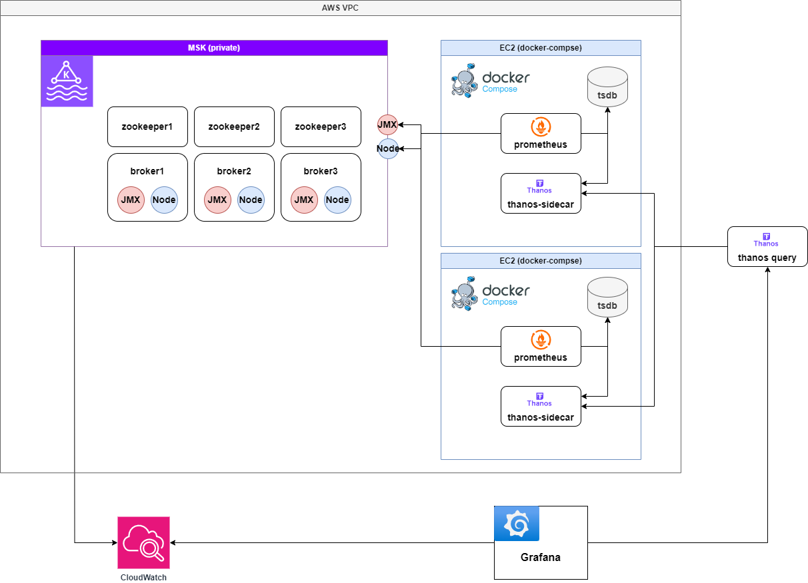
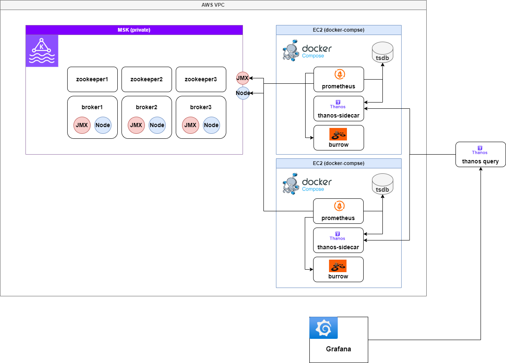
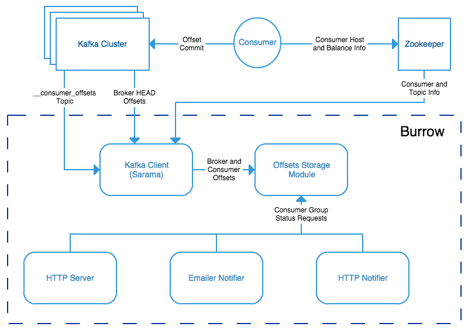
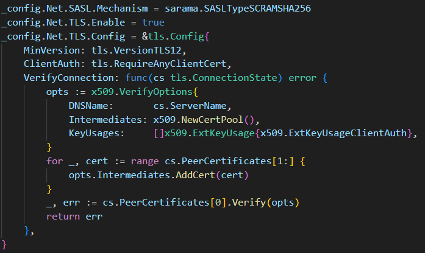
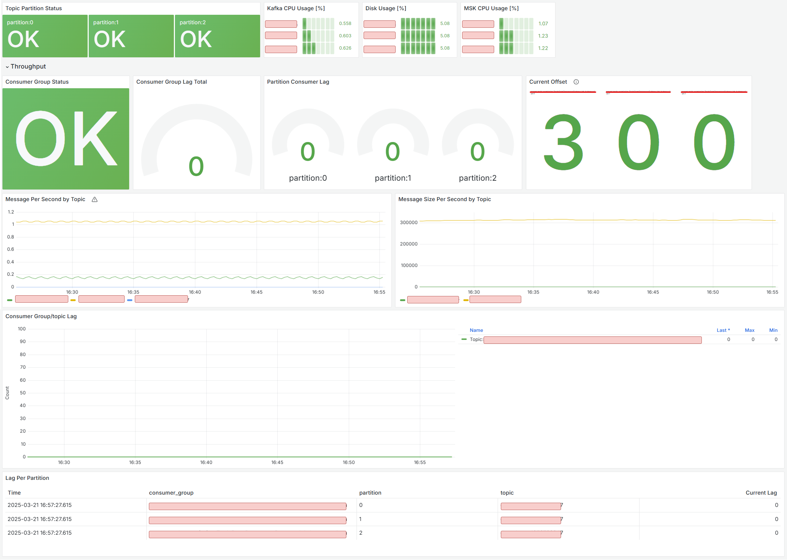
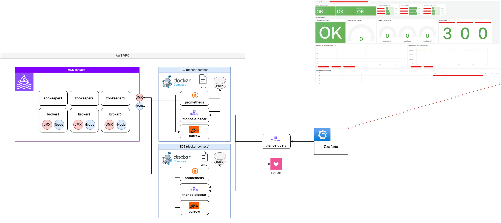

# 배경
비동기 프로그래밍과 동기 프로그래밍의 가장 큰 트레이드오프(Trade-off)를 꼽자면, 성능을 확보하는 대신 **추적이 어려워진다**는 점이다.

Kafka를 활용한 이벤트 기반 아키텍처(EDA, Event-Driven Architecture)에서도 마찬가지로, 비동기적으로 처리되는 데이터의 흐름을 실시간으로 파악하는 것은 쉽지 않다.  
특히 이슈가 발생한 후에야 문제를 인지하는 상황이 반복되면서, Kafka 모니터링의 필요성이 더욱 절실해졌다.

이벤트 기반 시스템에서 중요한 것은 **퍼포먼스(Performance) 모니터링**이다.  
REST API 기반의 아키텍처에서는 CPU/메모리 사용량 및 요청량을 기반으로 Kubernetes Horizontal Pod Autoscaler(HPA)를 이용해 트래픽을 견디는 방식이 일반적이다.  
그러나 Kafka 기반 아키텍처에서는 **파티션(Partition)의 개수와 Consumer의 처리 속도**가 성능을 결정하는 핵심 요소다.

만약 **파티션이 적거나 Consumer의 처리 속도가 느려 Lag이 발생**한다면?  
→ 개발자가 직접 퍼포먼스를 분석하고, `파티션 확장(Partition Scaling)` 및 `Consumer 증설(Scale-out)`을 수행해야 한다.

이러한 문제를 사전에 감지하고 해결할 수 있도록 **Kafka 모니터링 시스템을 구축**하게 되었다.


Kafka의 성능을 모니터링하는 방법으로 아래 3가지 옵션을 고려했다.

# 설계
## Kafka 모니터링 솔루션 비교
### AWS CloudWatch
AWS에서 제공하는 CloudWatch의 Kafka 모니터링 기능을 사용하면  
**PER_TOPIC_PER_PARTITION** 단위로 지표를 수집할 수 있다.

#### **주요 모니터링 지표**
|지표명 (`AWS/MSK`)|설명|
|---|---|
|`EstimatedTimeLag`|Consumer Group이 데이터를 소비한 후, 파티션의 Offset 지연시간(초)|
|`OffsetLag`|Consumer Group이 데이터를 소비한 후, 파티션의 Offset 지연 개수|

| 항목 | 설명 |
|------|-------------------------------|
| **✅ 간편한 설정** | AWS MSK와 기본 연동 가능 |
| **✅ CloudWatch Alarm + SNS 활용 가능** | 손쉽게 경고(Alert) 설정 가능 |
| **❌ AWS 콘솔에서만 데이터 확인 가능** | 외부 모니터링 툴과 연동 어려움 |
| **❌ 비용 부담** | 토픽 수준 모니터링은 추가 비용 발생 |


---
### EKS 기반 Helm 모니터링 (사내 솔루션, 실패)

기존에 사내에서 운영 중인 Helm Chart를 활용하여 Kafka 모니터링을 시도했으나,  
MSK와 EKS가 **서로 다른 리전에 존재**하여 사용이 불가능했다.

| 항목 | 설명 |
|------|--------------------------------------|
| **✅ 사내 시스템과 통합 가능** | 사내 시스템과 원활한 연동 가능 |
| **❌ MSK와 EKS가 서로 다른 리전에 위치** | 연동 불가 문제 발생 |
| **❌ EKS를 MSK와 동일 리전에 구축할 경우 비용 부담 발생** | 추가적인 비용이 발생할 수 있음 |


결과적으로 도입을 포기하게 되었다.

---
### EC2 기반 Docker Compose 모니터링 (최종 채택)

결국, **MSK와 동일한 VPC 내에 EC2를 배포하고 Kafka 모니터링 스택을 직접 구성**하는 방식을 선택했다.
- **JMX Exporter & Node Exporter**를 활용하여 Kafka 메트릭 수집
- **Burrow를 활용하여 Consumer Lag 모니터링**
- **Thanos 및 Prometheus를 통해 장기적인 모니터링 가능**

| 항목 | 설명 |
|------|------------------------------------------------|
| **✅ 비용 효율성** | 저렴한 T 시리즈 EC2 인스턴스를 활용하여 운영 가능 |
| **✅ 확장성** | 커스터마이징이 자유로우며 필요에 따라 확장 가능 |
| **✅ 보다 세밀한 Kafka 모니터링 가능** | Burrow를 활용하여 Consumer Lag 추적 가능 |
| **❌ 초기 세팅 부담** | 직접 설정해야 하며 시행착오가 발생할 가능성이 있음 |
| **❌ Burrow 및 Thanos 운영 경험 부족** | 팀 내에서 Kafka 모니터링 노드를 운영한 경험이 없어 직접 해결해야 했음 |


오히려 좋아..! 바닥부터 새롭게 알아갈 수 있다는 것이 오히려 장점이 되어 EC2 기반 모니터링을 직접 구축하기로 했다

## 아키텍처 구성하기
> #### MSK 관련 배경 정보
> - `zookeeper`: 카프카의 메타 데이터 정보를 주키퍼에 저장하고, 카프카의 상태를 관리
> - `broker`: 카프카가 설치되어 있는 서버 또는 노드
> - `JMX Exporter`: JMX(Java Management Extensions) Exporter를 사용하여 Apache Kafka(브로커, 프로듀서, 컨슈머)의 성능과 상태를 모니터링할 수 있도록 다양한 메트릭을 제공
> - `Node Exporter`: Node Exporter를 사용하여 CPU 및 디스크 메트릭 노출이 가능

#### Kafka 모니터링 아키텍처 발전 과정: Prometheus, Thanos, Burrow 연동

Kafka 모니터링 시스템을 구축하는 과정에서 Prometheus 단독 운영(V1) → Thanos를 통한 확장(V2) → Burrow를 활용한 Kafka Consumer 모니터링 추가(V3)로 발전해 나갔다.

각 버전별 아키텍처를 비교하며, 각 접근 방식의 장단점을 정리한다.

---

### V1: Prometheus 단독 구성으로 Metric 수집

Prometheus를 이용하여 Kafka 메트릭을 수집하고, Grafana에서 `CloudWatch`와 `Prometheus`를 **데이터 소스로 추가하여 모니터링**을 진행했다.

#### 구성 아키텍처


#### Pros (장점)
- Prometheus만 설정하면 별도 복잡한 설정 없이 Kafka 모니터링 가능
- Grafana에서 Prometheus와 CloudWatch를 동시에 활용 가능하여 메트릭 비교 가능

#### Cons (단점)
- Prometheus가 다운되면 모니터링 시스템 전체가 중단되며, **Single Point of Failure (SPOF) 문제가 발생**
- Prometheus는 **모든 메트릭을 메모리(TSDB)에서 처리**하므로, 수집하는 메트릭이 많아질수록 메모리 사용량 급증
- TSDB의 크기가 증가할수록 Prometheus의 성능 저하 및 장애 가능성 증가

---

### V2: Prometheus + Thanos Sidecar 구성으로 HA 보장

고가용성을 확보하기 위해 **2대의 Prometheus 인스턴스를 운영**하고,
Thanos Sidecar를 추가하여 **Thanos 중앙 서버(Query + Store)와 연동**했다.

#### 구성 아키텍처


#### Thanos를 도입한 이유
- **Prometheus의 중복 적재 방지**: N대의 Prometheus가 동일한 Metric을 수집할 경우, **Thanos Query가 중복 데이터를 제거(Deduplication)하여 처리**
- **TSDB 단기 저장(Short-term) + Thanos Store 장기 저장(Long-term) 분리**: Prometheus는 단기적인 메트릭만 보관하고, 장기적인 데이터는 **Thanos Store(S3 등)에 저장**하여 복구 가능
- **Prometheus의 TSDB 크기를 줄일 수 있어, 메모리 사용량 감소 및 비용 절감 가능**

#### Pros (장점)
- **고가용성(HA) 확보**: 2대의 Prometheus + Thanos Query 구성으로 Prometheus 한 대가 장애가 나더라도 모니터링 지속 가능
- **장기적인 데이터 보존 가능**: Prometheus TSDB는 단기 데이터만 저장하고, 장기 데이터는 Thanos Store에 저장 가능하여 S3, GCS 등 Object Storage를 활용하여 저비용으로 장기 보존 가능
- **Prometheus 리소스 최적화 가능**: Prometheus의 TSDB 크기를 줄일 수 있어, 메모리 사용량 감소로 비용 절감 가능

#### Cons (단점)
- **Thanos 추가 구성 필요로 인해 운영 복잡도 증가**: 기존 Prometheus 단독 운영보다 **Thanos Sidecar, Query, Store 설정이 추가로 필요**하며, Thanos Store를 위한 Object Storage(S3 등) 연동이 필요함
- **Thanos Query의 성능 한계**: 여러 Prometheus 인스턴스에서 메트릭을 조회하는데, 과도한 요청이 발생하면 성능 저하 가능성 있음

---

### V3: Burrow + Prometheus + Thanos Sidecar로 Kafka Consumer 모니터링 강화

비용 절감 및 Kafka Consumer Lag 모니터링을 강화하기 위해,
**CloudWatch 대신 Burrow를 도입하여 Kafka Consumer 메트릭을 수집**했다.

**CloudWatch를 걷어내고, Burrow + Prometheus + Thanos로 Kafka 모니터링을 최적화**하였다.

#### 구성 아키텍처

> burrow가 주기적으로 kafka Consumer 메트릭을 수집하고, prometheus가 burrow metric을 수집하도록 하여 최종적으로 thanos query가 thanos-sidecar를 통해 kafka 관련 메트릭을 모두 수집하도록 구성

#### Burrow를 도입한 이유
- **CloudWatch 비용 절감**: Kafka 모니터링을 **CloudWatch에서 Burrow + Prometheus로 전환**하여 비용 절감 가능
- **Kafka Consumer Lag 모니터링 강화**: Burrow는 **Kafka Consumer Group의 Offset 정보를 실시간으로 수집**하며, Consumer Lag을 모니터링하여 Kafka가 정상적으로 동작하는지 추적 가능
- **ACL(Access Control) 기반 모니터링 가능**: CloudWatch는 Kafka ACL을 기반으로 세부적인 Consumer 모니터링이 어려운 반면, Burrow는 Consumer Group 및 Topic 별로 상세한 Lag 정보를 제공

#### Pros (장점)
- **CloudWatch 비용 절감**: Kafka 모니터링을 CloudWatch에서 Burrow + Prometheus로 전환하여 비용 절감 가능
- **Kafka Consumer Group의 상세 모니터링 가능**: Burrow를 통해 각 Consumer의 Offset, Lag, Partition 상태까지 상세 분석 가능
- **기존 Prometheus + Thanos와 원활한 연동 가능**: Burrow에서 `/metrics` 엔드포인트를 제공하여, Prometheus에서 손쉽게 데이터 수집 가능하며, Thanos Query를 통해 Kafka 관련 메트릭을 Grafana에서 단일 인터페이스로 조회 가능

#### Cons (단점)
- **Burrow 초기 설정 및 운영 부담 증가**: Burrow는 Kafka Consumer Lag을 모니터링하는 강력한 도구지만, 처음 설정할 때 Kafka 클러스터와 연동하는 과정이 필요하며, Kafka ACL이 적용된 환경에서는 Burrow의 접근 권한 설정이 필요함
- **Burrow의 자체 Alerting 기능 한계**: Burrow는 기본적으로 Alert 기능을 제공하지만, Prometheus Alertmanager보다 유연하지 않아 Prometheus Alertmanager 또는 Grafana Alerta와 함께 사용해야 효과적임

---

### 버전 별 정리
| 아키텍처 | 장점 | 단점 | 최종 평가 |
|------|------|------|------|
| **V1: Prometheus 단독** | 빠른 구성 가능, 별도 설정 불필요 | 고가용성 보장 안됨, 메모리 사용량 과다 | SPOF 문제로 비효율적 |
| **V2: Prometheus + Thanos Sidecar** | 고가용성(HA) 확보, 장기 데이터 저장 가능, 메모리 최적화 가능 | Thanos 추가 구성 필요, 운영 복잡도 증가 | 장기 저장 및 확장 가능 |
| **V3: Burrow + Prometheus + Thanos** | CloudWatch 비용 절감, Kafka Consumer 상세 모니터링, 기존 Prometheus 연동 가능 | Burrow 설정 필요, Alert 기능 부족 | 최종 채택 |

Kafka 모니터링을 효과적으로 수행하기 위해,
**Burrow + Prometheus + Thanos를 조합하여 Kafka Consumer Lag까지 포함한 종합적인 모니터링 시스템을 구축하는 것이 최적의 해결책이었다.**

# 구현
## Burrow
### Kafka Consumer Lag Monitoring with Burrow

Kafka client의 consumer에서 `metrics()` 메서드를 사용하여 `records-lag-max`를 기록할 수 있지만, **가장 뒤처진 파티션의 지연만을 보여주므로 전체 상태 파악이 어렵다**. 또한, consumer가 멈추면 lag을 감지할 수 없어 **외부 모니터링 시스템이 필요**하다. 이를 해결하는 대표적인 솔루션이 LinkedIn의 **Burrow**이다.


[Burrow: Kafka Consumer Monitoring Reinvented](https://engineering.linkedin.com/apache-kafka/burrow-kafka-consumer-monitoring-reinvented)
- **Consumer A**: lag이 지속적으로 감소 → 정상
- **Consumer B**: lag이 일시적으로 증가했으나 복구됨 → 정상
- **Consumer C**: lag이 일정하게 유지됨 → 정상
- **Consumer D**: lag이 일시적으로 증가했으나 복구됨 → 정상적인 트래픽 처리

### Kafka Lag Threshold의 문제점
**임계값(threshold) 기반 감지는 오탐 가능성이 높다**. 예를 들어, threshold를 `250`으로 설정하면 실제 정상적으로 동작하는 **B, D**도 이상 상태로 감지될 수 있다.

> ⚠️ Kafka consumer의 `MaxLag` 값만으로 장애 여부를 판단할 수 없다!

---

### Burrow는 어떻게 해결하는가?
Burrow는 **Kafka 내부의 consumer offset을 기록하는 토픽을 읽어 개별 consumer 상태를 독립적으로 평가**한다. 특정 consumer에 종속되지 않으며, **모든 consumer를 자동으로 모니터링**하여 **객관적인 상태 분석**이 가능하다.



#### Burrow의 동작 방식
Burrow는 **sliding window 기법을 활용하여 최근 N개의 offset commit을 분석**한다. LinkedIn에서는 **10개의 offset commit(약 10분)을 기준**으로 다음을 평가한다:

1. **Consumer가 지속적으로 offset을 커밋하는가?**
2. **Consumer offset이 증가하고 있는가?**
3. **Lag이 증가하고 있는가?**
4. **Lag 증가 패턴이 지속적인가?**

이를 기반으로 consumer 상태를 다음과 같이 분류한다:

- **✅ OK**: 정상 작동
- **⚠️ Warning**: lag이 증가하는 상태
- **❌ Error**: consumer가 멈추거나 동작이 중단됨

Burrow는 **임계값 없이 패턴 분석을 통해 자동으로 이상 감지**하며, HTTP API 및 알림 시스템을 통해 정보를 제공한다.

#### Burrow API 예제
```
GET /v2/kafka/local/consumer/dingyu/status
```
consumer의 현재 상태와 **문제가 발생한 topic과 partition 정보**를 확인할 수 있다.

## 연동 방안
### 1. 사전 준비
- OS: Amazon Linux 2 또는 Ubuntu 20.04 이상
- Docker 및 Docker Compose 설치
- EC2 보안 그룹에서 다음 포트 허용
  - Prometheus: `9090`
  - Thanos Sidecar: `10901`, `10902`
  - Burrow: `8000`

### 2. 패키지 설치
```bash
# Docker 설치
sudo yum install -y docker
sudo systemctl enable docker --now

# Docker Compose 설치
sudo curl -L "https://github.com/docker/compose/releases/latest/download/docker-compose-$(uname -s)-$(uname -m)" -o /usr/local/bin/docker-compose
sudo chmod +x /usr/local/bin/docker-compose
```

### 3. 폴더 구조
```
MSK-MONITORING/
│── templates/                # 설정 템플릿 폴더
│   ├── burrow.tmpl.toml       # Burrow 설정 템플릿
│   ├── prometheus.tmpl.yaml   # Prometheus 설정 템플릿
│   ├── targets.tmpl.json      # Prometheus 타겟 설정 템플릿
│── deploy.sh                  # 배포 스크립트
│── docker-compose.yaml        # Docker Compose 설정 파일
│── Makefile                   # 설정 렌더링 및 빌드 관리
│── README.md                  # 프로젝트 문서
```

### 4. 주요 구성 요소
#### 4.1 Burrow
- Kafka Consumer 상태를 모니터링하는 도구
- `burrow.tmpl.toml` 파일을 기반으로 환경 변수를 대체하여 설정
- SASL/TLS 인증을 사용하여 MSK에 연결
- HTTP 서버를 통해 상태 제공

#### Burrow 관련 트러블슈팅
SASL 인증을 하는 경우, 레퍼런스가 전혀 없어서 무한 삽질을 거듭하였다

TLS의 경우 인증을 하지 않아 별도로 설정하지 않았으나, `skip verify` 옵션으로 무조건 필요했다

이 부분은 sarama client 생성 시, config를 고쳐 가며 디버깅을 거듭했다



`SASL Mechanism`은 `SCRAM-SHA-512`/`SCRAM-SHA-256`을 지원한다! MSK에서 어떠한 Mechanism으로 설정하였는지 필히 확인하자


#### 4.2 Prometheus
- Kafka 및 Burrow 메트릭 수집
- `prometheus.tmpl.yaml`을 기반으로 환경 변수 대체 후 설정
- `targets.tmpl.json`을 통해 JMX 및 Node Exporter 메트릭 수집

#### 4.3 Docker Compose
- `docker-compose.yaml`을 사용하여 Burrow, Prometheus, Thanos Sidecar 컨테이너 실행
- 컨테이너 간 네트워크를 구성하여 원활한 통신 지원

#### 4.4 Makefile
- `make render`: 환경 변수를 반영하여 설정 파일을 생성 (`generated/` 디렉토리)

#### 4.5 환경 변수 관리
환경 변수는 아래 example 처럼 docker-compose와 같은 디렉토리에 `.env` 형태로 관리하세요
```env
PROM_CLUSTER={your-cluster-name}
PROMETHEUS_PORT=9090
BURROW_PORT=8000

ZOOKEEPER_HOST_1={zookeeper1_endpoint}
ZOOKEEPER_HOST_2={zookeeper2_endpoint}
ZOOKEEPER_HOST_3={zookeeper3_endpoint}

BROKER_HOST_1={broker1_endpoint}
BROKER_HOST_2={broker2_endpoint}
BROKER_HOST_3={broker3_endpoint}

BURROW_USERNAME={user}
BURROW_PASSWORD={password}
```

### 5. 설치 및 실행 방법
#### 5.1 프로젝트 클론
```sh
git clone https://github.com/dings-things/msk-monitoring-docker-compose.git
cd msk-monitoring-docker-compose
```

#### 5.2 환경 변수 설정
`.env` 파일을 생성

#### 5.3 배포 스크립트 실행
```sh
chmod +x deploy.sh
./deploy.sh
```

#### 5.4 개별 실행 (수동 실행)
```sh
make render
docker compose up -d
```

### 배포 프로세스
자세한 사용법은 [github](https://github.com/dings-things/msk-monitoring-docker-compose) 참고 !

실무 환경에서는 [gitlab snippets](https://docs.gitlab.com/user/snippets/)를 사용하여 환경 변수를 `snippets API`를 통해 불러와 환경 별로 매핑합니다.


## 대시보드 구성하기
꼭 구성해야 하는 중요한 지표를 아래와 같이 분류하였다
- Topic/Partition 별 Status Check : 특정 토픽, 파티션의 이상 여부 확인
    - `burrow_kafka_topic_partition_status` 지표 활용
- Disk Usage : Disk 임계치 초과 시 Alert 설정 (증설)
    - `node_filesystem_avail_bytes` 지표 활용 (현재 남아있는 공간(`avail_bytes`) 을 전체 디스크 용량(`size_bytes`) 과 비교하여 사용된 비율을 계산)
- CPU Usage : CPU 임계치 초과 시 Alert 설정 (파티션 증설)
    - `node_cpu_seconds_total` 지표 활용 (user[kafka]사용 CPU, 전체 - idle[유휴] CPU 확인)
- Consumer Group Status Check : 컨슈머 그룹(애플리케이션) 상태 체크
    - `burrow_kafka_consumer_status` 지표 활용
- Consumer Group/Topic Lag : 컨슈머 그룹 / 토픽 별 쌓인 Lag 체크
    - `burrow_kafka_consumer_partition_lag` 지표 활용
- Lag Per Partition : 파티션 별 쌓인 Lag 체크
    - `burrow_kafka_consumer_partition_lag` 지표 Table 활용
- Current Offset : 현재 컨슈머 그룹이 처리하고 있는 최근 Offset
    - `burrow_kafka_consumer_status` 지표 활용




# 최종 구성


## REFS
- [Burrow 공식 문서](https://github.com/linkedin/Burrow)
- [Prometheus 공식 문서](https://prometheus.io/docs/)
- [Prometheus 를 스케일링 하기 위한 Thanos](https://bcho.tistory.com/1375)
- [AWS MSK Connect 효과적으로 운영하기](https://oliveyoung.tech/2023-10-04/oliveyoung-b2b-msk-connect-introduction/)
- [여기어때 MSK 모니터링 구축해볼까요?](https://techblog.gccompany.co.kr/aws-msk-part3-%EB%AA%A8%EB%8B%88%ED%84%B0%EB%A7%81%EC%9D%84-%EA%B5%AC%EC%B6%95%ED%95%B4%EB%B3%BC%EA%B9%8C%EC%9A%94-fe9a7109f4d)