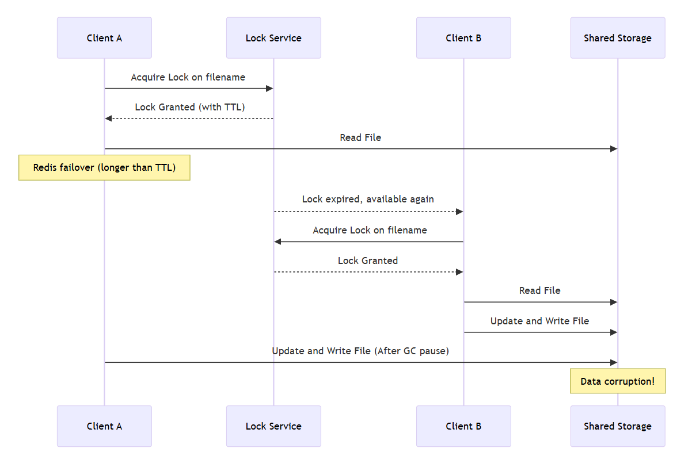
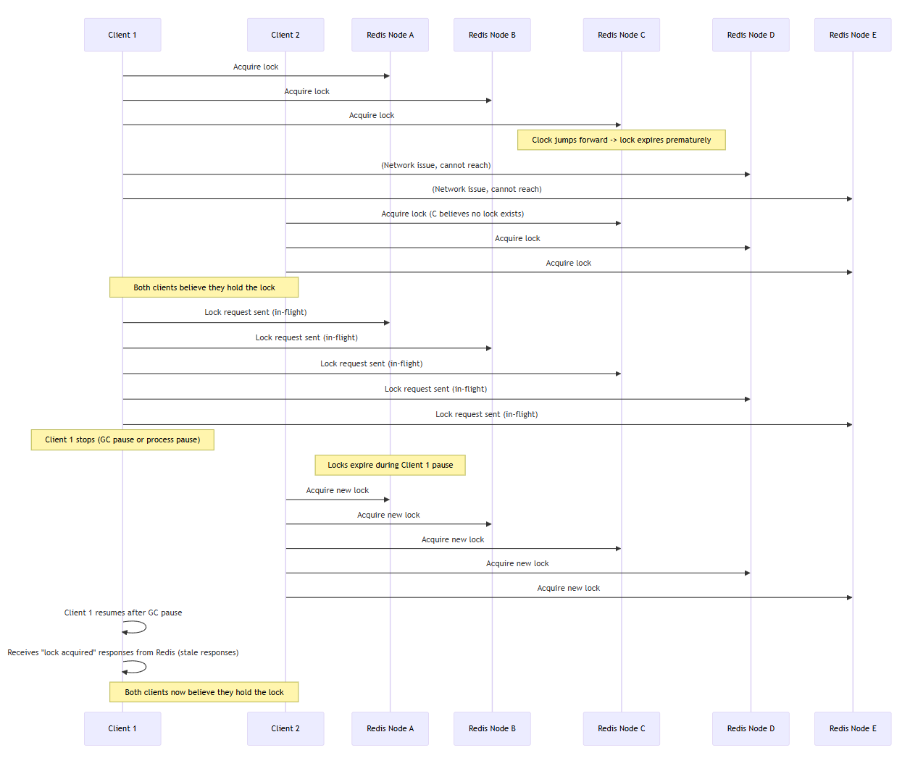

# Background
One day, a colleague introduced a session about Redlock in a study group I participate in.

It was such great content that I wanted to dig deeper with my own understanding.
> It would be helpful to review [Redlock Algorithm](https://chaewonkong.github.io/posts/2025-03-13-dist-lock-with-redis/) beforehand.

## Lock for what?
Locks are mainly used to ensure `efficiency` and `correctness`.

### Efficiency
Prevent redundant work from being executed unnecessarily.
- ex. N nodes performing the same heavy task (taking 10 minutes) simultaneously, leading to cost/time waste.

### Correctness
Enable consistent and accurate data processing on shared resources across concurrent processes.
- ex. N nodes processing a user's withdrawal logic simultaneously, causing the user's account to be charged N times.

According to [Martin Kleppmann](https://martin.kleppmann.com/2016/02/08/how-to-do-distributed-locking.html), if you're considering using Redis Lock for efficiency, it is recommended **not to use Redlock**.

| Item | Single Redis Lock | Redis Redlock Algorithm |
|:---|:---|:---|
| Lock Target | Single Redis instance | 5 independent Redis instances |
| Lock Creation Method | `SET key value NX PX <TTL>` | Attempt `SET key value NX PX <TTL>` on all 5 nodes |
| Success Condition | Successful lock on one Redis | Successful lock on majority (3 out of 5) nodes |
| Failure Handling | Lock information lost if Redis fails | Majority lock remains safe even if some nodes fail |
| Split Brain Handling | Impossible | Partially possible (not perfect) |
| Consistency | Weak consistency (single instance) | Strengthened consistency during lock acquisition (multi-instance) |
| Complexity | Simple (easy to implement) | Complex (requires handling lock acquisition time, clock drift) |
| Fault Tolerance | Low | Relatively higher |
| Performance | Fast (single node access) | May be slower (communication with 5 nodes) |
| Main Use Case | Small systems, single-server environments | Global distributed systems, high-availability lock systems |

> **If the Redis node crashes unexpectedly**
>
> Timeout occurs while trying to acquire the lock → application response delay or business logic execution failure

## Incomplete Lock
Using a single Redis node cannot guarantee `high availability` and `stability` during failure scenarios.

1. Fail case 1: Lock release due to GC Stop-the-World pause
    - Duration of STW is unpredictable.
    - Even Concurrent GC cannot avoid STW.
2. Fail case 2: After acquiring lock, external port operations (API, DB, HDFS...) experience packet loss
    - After acquiring lock, delays during IO operations → TTL (lease) expiration → another thread may acquire the lock and perform the same operation.
    - Delays caused by packet loss in external network operations → TTL (lease) expiration ...

### SPoF Solution: Master - Slave Structure
During failover, TTL expiration may lead to unlock, causing data corruption.

### Stability Solution: Safe Lock with Fencing
Similar to `first commit wins` in **MVCC**, transaction handling at the storage level is based on version (token).

1. client 1 successfully acquires the lock (with token33) but encounters delay during storage write (GC, network delay, etc.)
2. client 1's lock lease expires.
3. client 2 acquires the lock (with token34) and completes the write operation before client 1 finishes.
4. client 1 attempts storage write → storage rejects token33 because it's older than token34 (transaction fail).

The biggest problem is: **who generates the fencing token?** In a distributed environment, implementing a counter requires another leader election... (an infinite loop)

## Redlock
### Operation Flow
1. Record the current time in milliseconds.
2. Try to acquire the lock on all N Redis instances sequentially with the same key and a random value. Set a short timeout for each attempt so that if a node is down, move to the next instance immediately.
3. Calculate the time taken to acquire locks, and if locks are successfully acquired on the majority of instances and the time taken is less than the lock's validity time, the lock is considered acquired.
4. If the lock is acquired, set the new validity time as (initial validity − elapsed time).
5. If the lock is not acquired, or if the remaining validity time is negative (exceeded during acquisition), release the locks from all instances.

### Bad Timing Issue
| Category | Description |
|:---|:---|
| General Distributed System | Assumes "cannot trust time" → ensures safety unconditionally, only liveness depends on timing |
| Redlock | **Relies on time** (clock accuracy, network delay) to guarantee lock safety |
| Problem | If clocks jump forward/backward (GC, NTP, network delay), lock expiration calculations may fail and **lock can be broken** |
| Result | Not just liveness degradation — **safety violations** (e.g., data corruption, duplicate execution) can occur |

| Scenario | Description |
|:---|:---|
| First (Clock Jump) | Redis C node's clock jumps forward, causing early TTL expiration. Client 1 thinks it still holds the lock, but Client 2 acquires it again, leading both to believe they own the lock. |
| Second (GC Pause) | Client 1 sends lock requests but pauses (GC), during which locks expire. Client 2 acquires new locks, while Client 1 later processes stale success responses. |

### Synchrony assumptions of Redlock
| Condition | Description |
|:---|:---|
| Bounded Network Delay | Packets must arrive within a guaranteed maximum delay |
| Bounded Process Pause | GC or system pauses must stay within a limited time |
| Bounded Clock Drift | Clock drift must be small; NTP synchronization must be reliable |

➔ That is, all delays, pauses, and clock drifts must be much smaller than the lock's TTL (time-to-live) for Redlock to function correctly.

Is it realistic to expect such conditions? Remember GitHub's [90-second packet delay](https://github.blog/news-insights/the-library/downtime-last-saturday/).

Ultimately... Redlock is an algorithm that **relies on time**, and due to clock jumps, GC STW, and network packet loss, it cannot guarantee correctness.

Since Redis was never designed for "consensus" but rather as a **key-value store**, for truly reliable locks, it is better to use solutions like **Zookeeper** or **Raft** instead of Redlock.