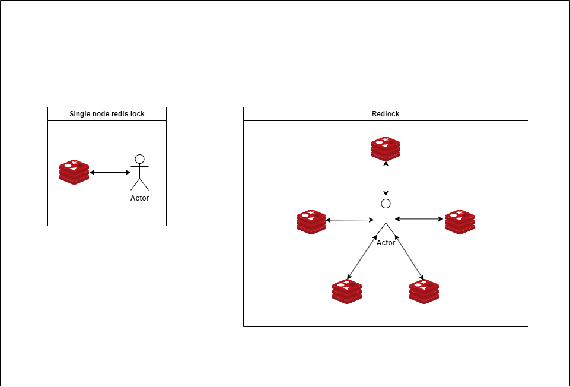
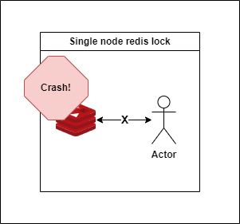
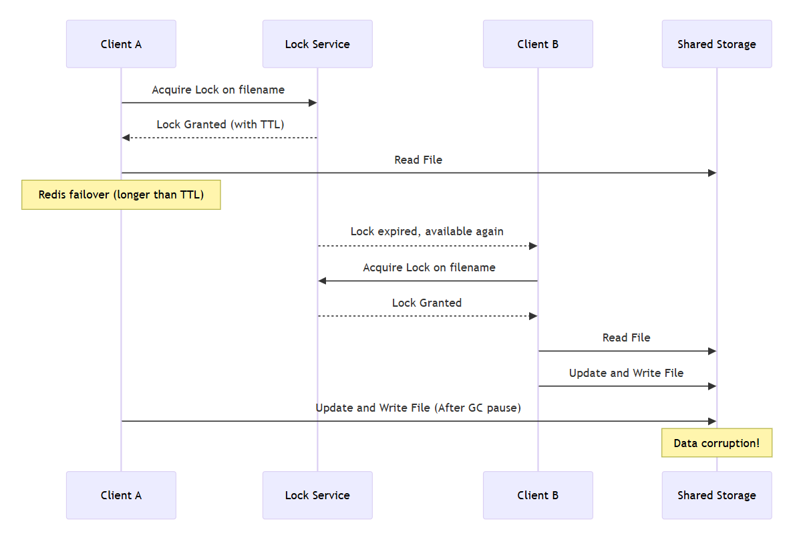
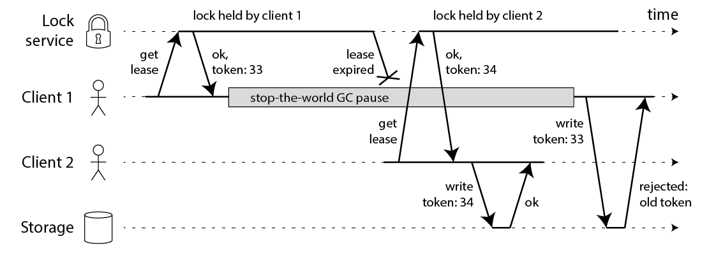
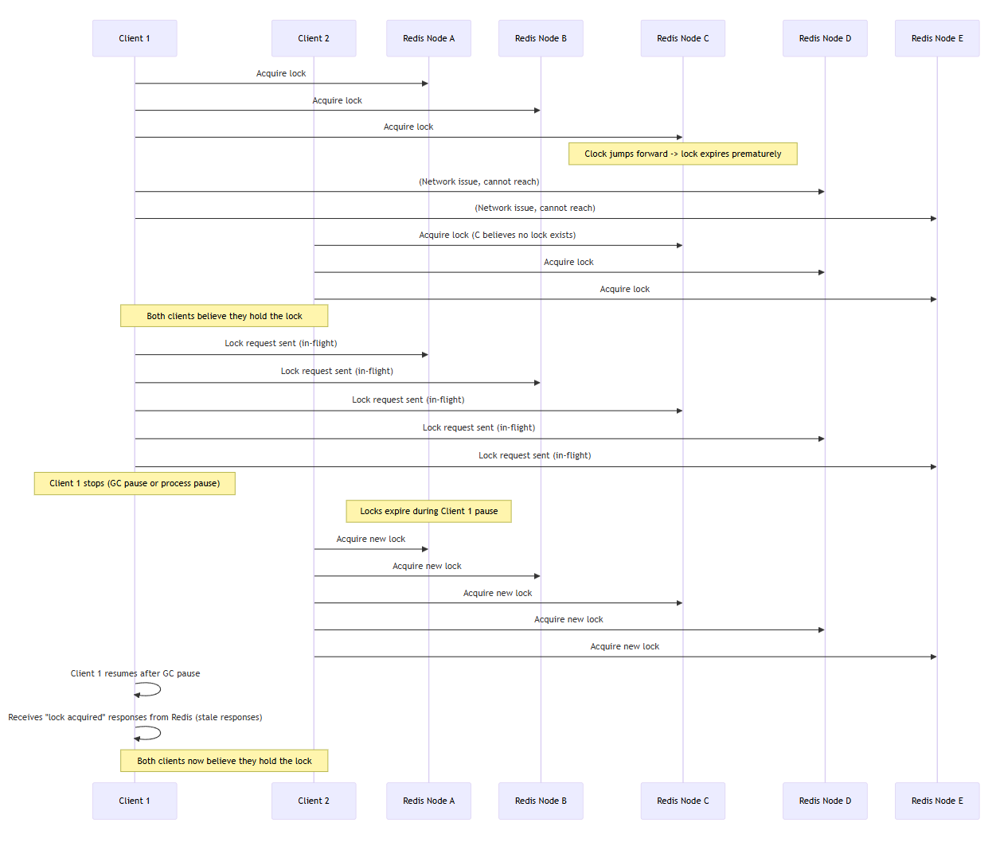

# 배경
참여하고 있는 스터디에서 동료가 어느날 Redlock과 관련된 세션을 소개해주셨다. 

너무 좋은 컨텐츠여서 욕심나기에.. 나만의 이해로 더 깊게 파고 들까한다.
> [Redlock 알고리즘](https://chaewonkong.github.io/posts/2025-03-13-dist-lock-with-redis/)을 보고 오면 좋을 것 같다. 

## Lock for what?
주요하게는 `효율성`과 `정확성`을 보장하기 위해 Lock을 사용한다

### Efficiency
불필요하게 중복된 작업 수행을 막을 수 있다
- ex. N개의 노드에서 동일한 무거운 작업(10분 소요)을 수행 → 비용적/시간적 낭비

### Correctness
동시 프로세스가 동일한 공유 자원에 대해 일관되고 정확한 데이터 처리가 가능
- ex. N개의 노드에서 사용자의 출금 로직 수행 → 사용자 계좌의 N*요금 만큼 차감

[Martin Kleppmann](https://martin.kleppmann.com/2016/02/08/how-to-do-distributed-locking.html)에 따르면 효율성을 위해 Redis Lock을 고려 중이라면 Redlock은 사용하지 않는 것을 추천한다.

| 항목 | 싱글 Redis Lock | Redis Redlock 알고리즘 |
|:---|:---|:---|
| 락 획득 대상 | 하나의 Redis 인스턴스 | 5개의 독립된 Redis 인스턴스 |
| 락 생성 방법 | `SET key value NX PX <TTL>` | 5개 노드 각각에 `SET key value NX PX <TTL>` 시도 |
| 성공 조건 | 단일 Redis에서 락 획득 성공 | 5개 중 3개 이상 서버(majority) 락 획득 성공 |
| 장애 대응성 | Redis 서버 장애 시 락 정보 소실 | 일부 서버 장애에도 majority 락이 유지되면 안전 |
| Split Brain (네트워크 분할) 대응 | 불가능 | 일부 방어 가능 (단, 완전하지 않음) |
| 일관성(Consistency) | 단일 인스턴스 기반 (약한 일관성) | 락을 획득하는 동안 일관성 강화 (multi-instance) |
| 복잡도 | 단순 (구현 쉬움) | 복잡 (락 취득 시간, clock drift 고려 필요) |
| Fault Tolerance | 낮음 | 상대적으로 높음 |
| 성능 | 빠름 (단일 노드 접근) | 느릴 수 있음 (5개 노드 통신 필요) |
| 주요 사용 예시 | 작은 시스템, 단일 서버 환경 | 글로벌 분산 시스템, 고가용성 락 필요 시스템 |

> **Redis 노드가 예기치 못하게 종료된 경우**
>
> lock 취득에서 timeout 발생 → 애플리케이션 응답 지연 또는 비즈니스 로직 수행 불가

## 불완전한 Lock
앞서 싱글 Redis 노드를 사용할 경우 장애 상황에서 `고가용성`과 `안정성`에 보장을 받을 수 없다.

1. Fail case 1 : GC Stop the World로 인한 취득한 lock의 release
    - GC의 STW 현상은 얼마나 지속될 지 예상 불가능함
    - Concurrent GC 또한 STW 현상은 피할 수 없음
2. Fail case 2 : lock 취득 후 외부 port 작업 (API, DB, HDFS...)에서 패킷 loss
    - lock 취득 후, IO 작업 수행 간의 지연 → TTL (lease) 만료 → 다른 스레드에서 lock 취득 후 동일 작업 수행
    - 외부 네트워크 작업에서 패킷 유실로 인한 지연 → TTL (lease) 만료 ...

### SPoF 해결 : Master - Slave 구조
Failover 되는 동안 TTL이 만료 → Unlock으로 인한 데이터 오염

### 안정성 해결 : Fencing으로 안전한 lock 사용
**MVCC**에서 `first commit wins`와 같이, version에 기반하여 storage에서 트랜잭션을 처리하도록 한다. (애초에 그러면 lock을 안써도 되지 않나?)

1. client 1이 lock 획득에 성공(/w token33)하고 storage write를 시도하는 도중 지연이 발생 (GC, 네트워크 지연 등)
2. client 1의 취득한 lock lease 만료
3. client 2가 lock을 획득(/w token34) 하고 client1의 작업이 종료되기 전에 storage에 write를 완료
4. client 1이 storage에 write → storage는 token34 이전인 token33은 reject (transaction fail)

가장 큰 문제는.. 과연 pencing token은 누가 생성할 것인가?이다. 분산 환경에서 카운터 증가를 구현하기 위해 또 다른 카운터 리더 선출이 필요해진다.. (무한 굴레)

## Redlock
### 동작 과정
1. 현재 시간을 밀리초로 기록
2. 동일한 키와 랜덤 값으로 모든 N개의 Redis 인스턴스에서 순차적으로 락을 시도. 각 시도에는 짧은 타임아웃을 설정해, 노드가 다운되면 바로 다음 인스턴스 이동.
3. 락을 획득하는 데 걸린 시간을 계산하고, N개의 인스턴스 중 과반수 이상에서 락을 획득하고, 걸린 시간이 락의 유효 시간보다 짧으면 락을 획득했다고 판단.
4. 락을 획득하면, 유효 시간은 초기 유효 시간에서 걸린 시간을 뺀 값으로 설정.
5. 락을 획득하지 못한 경우, 혹은 락의 유효시간이 마이너스인 경우(획득 과정에서 초과됨), 모든 인스턴스에서 락을 해제.

### Bad Timing Issue
| 구분                | 설명                                                                                                                  |
| ----------------- | ------------------------------------------------------------------------------------------------------------------- |
| 일반적인 분산 시스템       | "시간은 믿을 수 없다"고 가정 → 안전성은 무조건 지키고, 성능(liveness)만 시간에 의존                                                              |
| Redlock           | 시간(클럭 정확성, 네트워크 지연 등)에 **의존**해서 락의 안전성을 보장하려 함                                                                      |
| 문제점               | 클럭이 갑자기 변하거나(GC, NTP, 네트워크 지연), 프로세스가 일시 정지되면, 락 만료 시점 계산이 잘못돼서 **락이 깨질 수 있음**                                      |
| 결과                | 성능 문제(liveness degradation)가 아니라, 아예 **데이터 손상이나 중복 실행(safety violation)** 이 일어날 수 있음                                |

| 시나리오              | 설명                                                                                                                  |
| ----------------- | ------------------------------------------------------------------------------------------------------------------- |
| 첫 번째 (Clock Jump) | Redis C 노드의 시계가 갑자기 앞으로 점프하면서 TTL 만료가 빨라진다. Client 1이 락을 잡았다고 생각하지만, Client 2가 동시에 락을 다시 획득하여 둘 다 락을 보유했다고 착각하게 된다. |
| 두 번째 (GC Pause)   | Client 1이 락을 요청하고 나서 GC로 멈추는 동안 락이 만료된다. Client 2가 락을 다시 획득하고, Client 1은 GC 복귀 후 예전 락 응답을 받아 자신이 락을 잡았다고 착각한다.      |

### Synchrony assumptions of Redlock
| 조건                                  | 설명                                                                                                                  |
| ----------------------------------- | ------------------------------------------------------------------------------------------------------------------- |
| 네트워크 지연 한계(bounded network delay)   | 패킷이 항상 정해진 최대 시간 내에 도착해야 한다                                                                                         |
| 프로세스 일시정지 한계(bounded process pause) | GC나 시스템 중단이 일정 시간 이하로 제한되어야 한다                                                                                      |
| 시계 오차 한계(bounded clock drift)       | 각 서버의 클럭 오차가 작아야 하고, NTP 동기화가 신뢰할 수 있어야 한다                                                                          |

➔ 즉, "모든 지연, 중단, 클럭 차이"가 lock TTL(time-to-live)보다 훨씬 작아야 Redlock이 제대로 작동합니다.

현실 세상에서 이러한 가정이 성립할 수 있을까요? 깃헙의 [90-second packet delay](https://github.blog/news-insights/the-library/downtime-last-saturday/)를 떠올리면 절대라는 가정은 성립할 수 없습니다.

결론적으로는... Redlock 알고리즘은 시간을 전재로 하는 알고리즘이며, 이는 클럭 점프/GC STW/네트워크 유실 등등 여러한 이유에서 정확성을 갖지 못한다.

Redis는 애초에 "합의" 목적으로 나온 솔루션이 아닌 KV Store에 초점이 맞춰져 있기에 완벽한  Lock 취득을 위해서는 RedLock이 아닌 Zookeeper, Raft와 같은 방안을 선정하도록 한다.