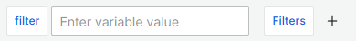
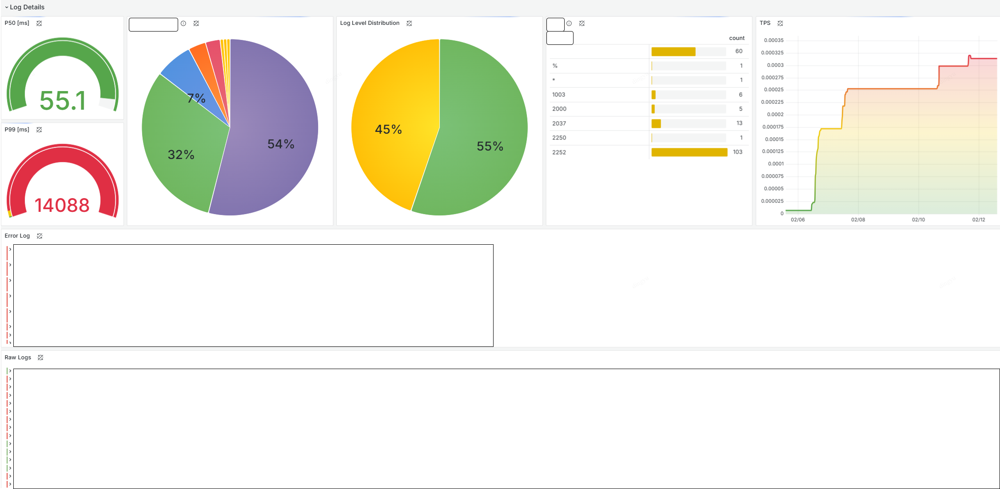

# Why Loki?
In backend applications, we often used Elasticsearch queries to investigate user issues and visualized dashboards using Kibana for operational teams.

If asked, _"Why switch to Loki?"_ the answer is simple:
_"To reduce cost!"_

| Category              | Loki 🟢                                     | Elasticsearch 🔴                     |
|----------------------|---------------------------------------------|--------------------------------------|
| **Storage Model**     | Stores metadata only; raw logs in object storage | Indexes and stores all logs          |
| **Search Method**     | Label-based search                          | Full-text search                     |
| **Indexing Cost**     | Low                                         | High (CPU/memory intensive)         |
| **Storage Cost**      | Cheap (S3/GCS object storage)               | Expensive (dedicated nodes needed)  |
| **Performance**       | Efficient for massive log storage           | Fast for query                       |
| **Scalability**       | Easy to scale with simple configuration     | Cluster scaling is more complex     |
| **Ops Overhead**      | Low (no need to manage cluster)             | High (cluster management required)  |
| **Use Case**          | Simple log storage and retrieval            | Complex analysis and search         |


## Pre-Migration Checklist
- [x] No need to expose dashboards to external stakeholders?
- [x] Do you only need basic log viewing during incidents?

## Notes When Integrating Loki
> When **labels are too diverse** or contain **too many unique values**, Loki's **indexing becomes inefficient**.
> - Example: assigning fields like `user_id` or `timestamp` as labels can cause a rapid index size increase.
>
> **Consequences**:
> - **Slow query performance**
> - **High memory usage**
> - **Increased storage cost**

### Use Fixed, Low-Cardinality Labels
To keep cardinality low:
- Use static or limited-range values as labels
- Examples:
  - **Good 😊**: `region="us-east-1"`, `app="payment-service"`
  - **Bad 😥**: `user_id="12345"`, `request_id="abcd-efgh"`

### Only Use Labels Relevant to Filtering
Design labels based on how you plan to filter/search logs in dashboards:
- Use labels only for data that will be filtered or analyzed
- Avoid labels used solely for debugging
- Examples:
  - **Good 😊**: For tracking TPS/latency, design labels around logs that appear once per request → e.g. `func="LogMiddleware.Log"`
  - **Bad 😥**: Using `latency` itself as a label

### Separate Log Message from Metadata
Labels should serve as tags. Dynamic values should go inside the log message.
- Examples:
  - **Good 😊**: `label:func="RestrictionsService"`, `log: member_id="12341512321", message="restricted member"`
  - **Bad 😥**: `label:member_id="12341512321"`, `log: message="restricted member", func="RestrictionsService"`

### Limit the Number of Labels
Too many labels = high cardinality → indexing inefficiency.
- Loki's official recommendation: **keep labels under 20**.

### Limit Unique Values per Label
Loki recommends fewer than **1,000 unique values per label**.
- Acceptable: `status="200"`, `status="500"`
- Avoid: `user_id="12345"`, `session_id="abcd-efgh"`
- Examples:
  - **Good 😊**: `env="production"`, `service="payments"`, `region="us-east-1"`
  - **Bad 😥**: `user_id="12345"`, `request_id="xyz-789"`

### Tune Chunk Size and Retention
Loki stores logs in chunks and flushes them to object storage periodically.
- Too small chunks → low performance
- Too large chunks → slow search
- Recommended:
  - `chunk_encoding: gzip`
  - `chunk_target_size: 1MB~2MB` (adjust as needed)

## Building the Dashboard
### 1. Set Up Variables
While filtering with Variables adds complexity, it’s a gift to your future self.

Application logs are usually queried using `raw log`, so choose frequently used filter labels as variables.
Also add text box filters to refine the filtered results.



### 2. Build Raw Logs Panel
Start with a global log viewer using `Logs Visualization`.

Example:
```logql
{_type="loki"} |= `$filter`
```

### 3. Filter Error Logs by Log Level
From `raw log`, duplicate and filter only `error` level logs.
> Some business logic might bypass error tagging—make sure log levels are properly set.

Example:
```logql
{level="error"}
```

### 4. Track TPS with Quantiles
Precision = speed. Use `P50`, `P99` as standard metrics with `Gauge Visualization` using `quantile_over_time`.

> Note:
> - Unlike Prometheus TSDB, Loki doesn't compute percentiles efficiently
> - High volume log ranges may degrade performance
> - `quantile_over_time` is memory intensive and expensive at large time ranges

Example:
```logql
quantile_over_time(0.50, {func="LogMiddleware.Log"} |= `$filter` | json | unwrap latency [$__range]) by (func)
```

### 5. Build Distributions by Label
Use `Piechart` to understand overall log distribution.
> Labels must be used, so apply this only to unique label values

Example:
```logql
sum by(method) (count_over_time({func="LogMiddleware.Log"} |= `$filter` [$__auto]))
```

### 6. Use Table to Visualize and Filter Distributions
`Table` is great for at-a-glance inspection. You can make labels clickable for filtering.

Example:
```logql
sum by(method) (count_over_time({func="LogMiddleware.Log"} |= `$filter` [$__auto]))
```

### Final Dashboard


### References
- [6 easy ways to improve your log dashboards with Grafana and Grafana Loki](https://grafana.com/blog/2023/05/18/6-easy-ways-to-improve-your-log-dashboards-with-grafana-and-grafana-loki/)

