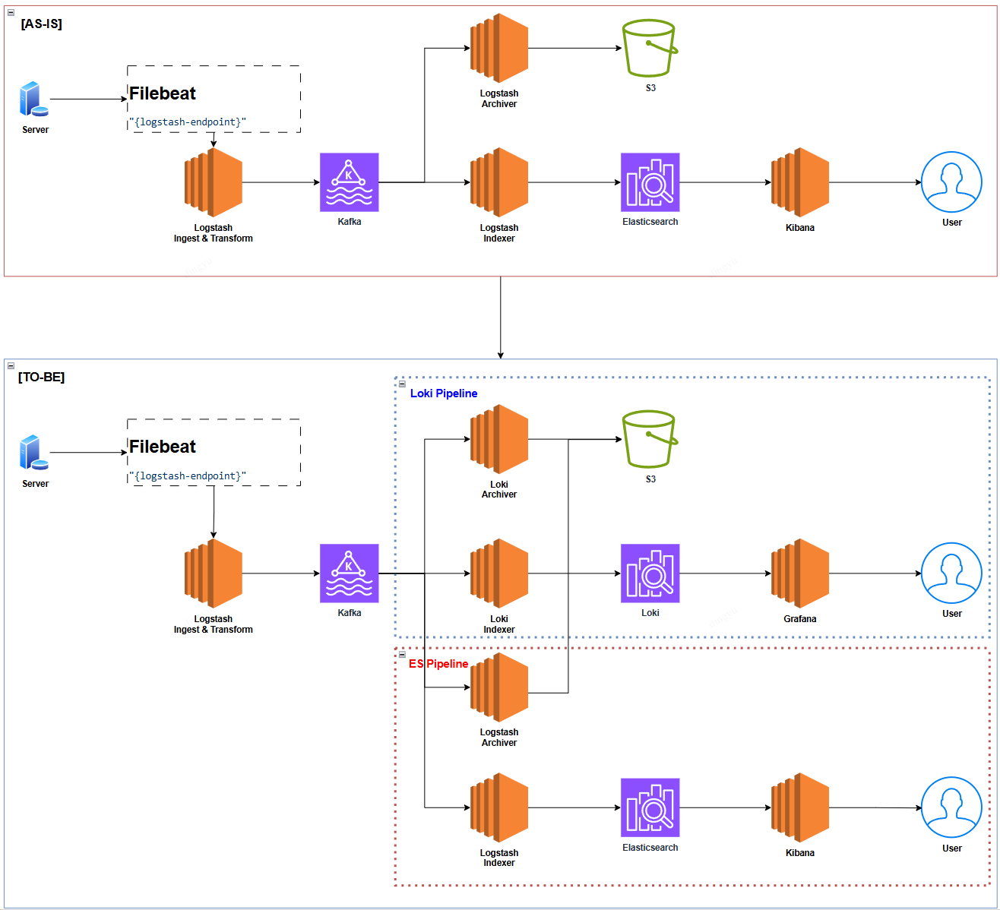
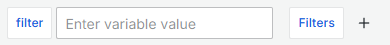
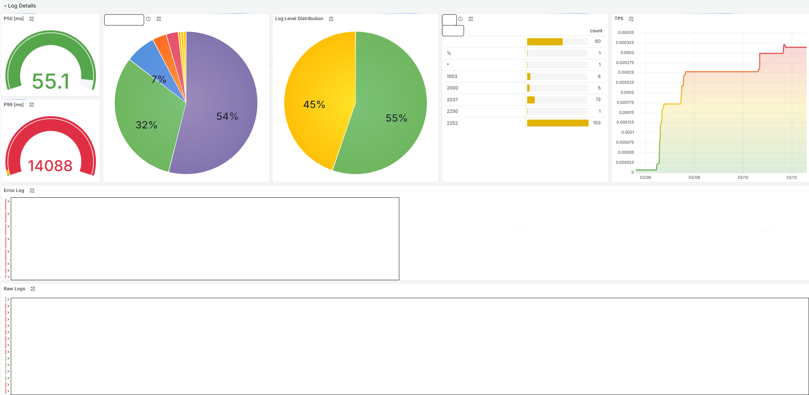

# 왜 Loki?
백엔드 애플리케이션에서 로그를 기반으로 사용자 문의에 대한 ES 쿼리를 수행하거나, 운영팀에 시각적으로 리포트가 가능한 Kibana 대시보드를 자주 사용하곤 했다.

_"왜 Loki로 전환하느냐?"_ 라고 묻는다면...  
_"비용적인 절감을 위해서!"_ 라고 답할 것이다.

| 항목            | Loki 🟢                             | Elasticsearch 🔴              |
| ------------- | ----------------------------------- | ----------------------------- |
| **데이터 저장 방식** | 메타데이터만 저장, 원본 로그는 Object Storage 활용 | 모든 로그를 인덱싱하여 저장               |
| **검색 방식**     | 라벨 기반 검색                            | 정교한 텍스트 검색 (Full-text search) |
| **인덱싱 비용**    | 낮음                                  | 높음 (인덱싱에 CPU, 메모리 많이 사용)      |
| **스토리지 비용**   | 저렴함 (S3, GCS 등 외부 스토리지 활용 가능)       | 비쌈 (Elasticsearch 전용 노드 필요)   |
| **성능**        | 대량 로그 저장 시 성능 우수                    | 빠른 검색 속도                      |
| **확장성**       | 간단한 구성으로 확장 가능                      | 클러스터 확장이 비교적 복잡               |
| **운영 부담**     | 적음 (별도 클러스터 관리 부담 없음)               | 높음 (클러스터 관리 필요)               |
| **사용 사례**     | 단순 로그 저장 및 조회                       | 복잡한 검색 및 데이터 분석               |



live-plex-private-archive

## 고려사항 체크리스트
- [x]별도의 대시보드를 외부에 제공할 필요가 없는가?
- [x]이슈 발생 시, 단순 로그 조회 용도만 필요한가?

## Loki 연동 시
> **라벨 값이 매우 다양**하거나 **고유한 값이 많아지면**, Loki의 **인덱싱 시스템이 비효율적**으로 작동
> - example: `user_id`, `timestamp`와 같이 **고유한 값이 자주 바뀌는 필드를 라벨로 지정하면 인덱스 크기가 급격히 커짐**
> 
> **결과**:
> - **쿼리 성능 저하**
> - **메모리 과다 사용**
> - **저장 비용 증가**

### 고정된 값 중심으로 라벨 구성하기
낮은 카디널리티 유지하기 위해 라벨 구성
- 라벨 값은 가능한 한 고정적이거나 변경 범위가 제한된 값을 사용
- example
    - **Good** 😊: **`region="us-east-1"`, `app="payment-service"`**
    - **Bad** 😥:  **`user_id="12345"`, `request_id="abcd-efgh"`**

### 필터링 목적에 맞는 라벨만 사용
라벨 설계 시, 추후 어떠한 로그 필드로 어떠한 대시보드를 구성할 것인지 상세하게 설계한다
- 라벨은 실제 검색, 필터링, 분석에 필요한 데이터에만 지정
- 불필요하거나 디버깅만을 위한 라벨은 피한다
- example
    - **Good** 😊: API 요청에 따른 요청 량에 대한 집계가 필요한 경우(TPS, latency 등), Request 당 한번만 존재하는 로그를 기준으로 설계 → func="LogMiddleware.Log" 중 latency 사용 → **label을 func로 등록**
    - **Bad** 😥: **latency를 label로 지정**

### 로그 메시지와 메타데이터 분리
Label은 Raw Log를 식별할 수 있는 "Tag"와 가까움.. 라벨은 메타데이터로만 활용, 실제 동적인 값은 로그 메시지 본문에 포함
- example
    - **Good 😊: label:func="RestrictionsService" line:member_sn ="12341512321", message="restricted member"**
    - **Bad 😥: **label:member_sn="12341512321" line:message ="restricted member", func="RestrictionsService"**

### 라벨 개수 제한
Label 자체를 많이 설정한 경우.. 이 또한 고 카디널리티로 인덱스 효율이 비효율적이다
- Loki 공식 권장사항에 따르면, **라벨 수는 20개 이하로 유지**하는 것이 좋음

### 라벨의 유니크 값 개수 제한
Loki는 라벨당 1,000개 미만의 유니크 값을 권장합니다.
예를 들어, `status="200"`, `status="500"` 같은 정해진 값은 문제없지만,
`user_id="12345"`, `session_id="abcd-efgh"` 같은 값은 라벨로 사용하면 안 됨.
- example
- Good 😊: env="production", service="payments", region="us-east-1"
- Bad 😥: user_id="12345", request_id="xyz-789"

### Chunk 크기와 보관 주기 고려하기
Loki는 로그를 Chunk 단위로 저장하며, 일정 주기마다 Object Storage로 Flushing 됨.
Chunk 크기가 너무 작으면 → 성능이 저하되고, 너무 크면 → 검색 속도가 느려질 수 있음.
- chunk_encoding: gzip 
- chunk_target_size: 1MB~2MB (case by case)

## 대시보드 구성하기
1. Variable 설정하기
Variable의 경우, 전체 로그에서 필터를 적용해줘야 하는 번거로움이 있지만... 미래에 모니터링을 하고 있을 자신에게 선사하는 작은 선물이다

Application 로그의 경우, 주로 `raw log`를 기반으로 쿼리하기 때문에 빠르게 필터링 할 수 있는 label을 Variable로 두는 것이 좋다

`raw log` / `error log`에서 필터링 된 로그 중 빠른 파악을 위해 text box filter를 두어 2차로 걸러 주는 것이 바람직할 것임!



2. raw log 구성하기
앱 전역에서 남기는 로그를 쉽게 확인해보기 위해 모든 로그를 한눈에 볼 수 있는 `Logs Visualization`으로 시작해보자

example
```
{_type="loki"} |= `$filter`
```

3. log level에 따른 error log 구성하기
`raw log`에서 duplicate를 통해 error인 로그만 남겨보자
> 비즈니스 로직에 따라 에러임에도 에러로 처리하지 않는 예외 케이스가 존재한다. 이를 유의하여 log level을 미리 지정하자

example
```
{level="error"}
```

4. TPS 구성하기
극한의 완성도는 속도에서 들어나는 법.. 대시보드 구성시 P50, P99는 매번 챙기는 지표이다

Gauge Visualization으로 `quantile_over_time`을 사용하여 PXX를 확인해보자.
단 아래와 같은 유의 사항이 있다. (prometheus가 아닌 loki+grafana에 초점을 맞추었으니 양해를 구합니다)
> - Prometheus처럼 TSDB(Time-Series Database)에서 효율적으로 백분위수를 계산하는 것이 아님
> - 대량의 로그를 처리할 경우 성능 저하 발생 가능
> - `quantile_over_time` 연산이 메모리 집약적이며, 큰 범위에서 실행 시 비용이 높음

example
```
quantile_over_time(0.50, {func="LogMiddleware.Log"} |= `$filter` | json | unwrap latency [$__range]) by (func)
```

5. Label에 따른 Distribution 구성하기
`Piechart`는 전반적인 분포도를 조사하기에 알맞다. 단, Label이 지정되어야 하기에 Unique한 Label의 분포일 경우에만 구성하자

example
```
sum by(method) (count_over_time({func="LogMiddleware.Log"} |= `$filter` [$__auto]))
```

6. Table을 통해 Distribution 및 필터링 구성하기
`Table`은 시각적으로 한눈에 분포를 확인할 수 있으며 아래와 같이 구성할 경우, 클릭을 통해 해당 라벨에 대한 로그를 필터링 할 수 있다

example
```
sum by(method) (count_over_time({func="LogMiddleware.Log"} |= `$filter` [$__auto]))
```

### 대시보드 완성본


### REFS
- [6 easy ways to improve your log dashboards with Grafana and Grafana Loki](https://grafana.com/blog/2023/05/18/6-easy-ways-to-improve-your-log-dashboards-with-grafana-and-grafana-loki/)