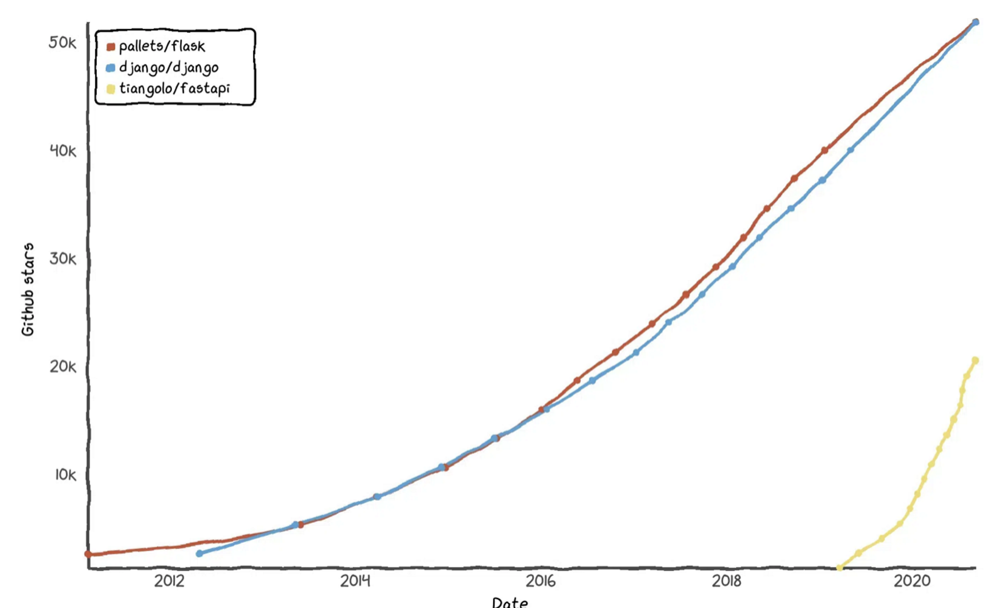

# About FastAPI Convention
## What is FastAPI?


## Advantages of FastAPI
- Dependency Injection
- Automatic Documentation
- Asynchronous Support
- Pydantic Model

With the rise of cloud services, MSA (Microservice Architecture) has gained attention, leading to changes in server ecosystems. Now, stateless architectures using lightweight RESTful APIs have become mainstream, and FastAPI is optimized for such small, modular services.

- **Dependency**: (If A must run after B, they are dependent) `Depends` is the core function that lowers coupling for tasks like authentication and DB connections.
- **Auto Documentation**: Documentation often feels like homework to developers. Unlike other frameworks, FastAPI automatically generates ReDoc and OpenAPI docs without additional dependencies, increasing developer productivity.
- **Async Support**: While Python is synchronous by default and its GIL (Global Interpreter Lock) discourages threading, FastAPI supports async operations out of the box.
- **Pydantic**: FastAPI loves Pydantic. It provides great features like serialization, type validation, and path variable parsing.

## Characteristics


The biggest issue is the lack of a de facto standard. Unlike long-standing frameworks, FastAPI is relatively young and emphasizes flexibility and lightweight design, which naturally results in the absence of a consistent coding standard. While this freedom can be positive, it may also be seen as a lack of structure.

---

## Purpose
Due to the absence of class-based structures and consistent design patterns, collaboration within teams often feels chaotic, even among teammates. The goal is to establish our own convention to ensure intuitive and maintainable project architecture.

---

# Class-Based Convention
## Current Issues
1. Utility-dependent methods that lack structure
   - Classes take on too many responsibilities (**low cohesion**)
2. Non-intuitive structure
   - Business logic is scattered, making code hard to read
3. No consistent convention for Dataclass, Pydantic Models, etc.

---

## Requirements
1. Project structure must be consistent and intuitive
2. Each class should have a single responsibility
3. Organize packages by business layer

---

## Convention Based on Requirements
### 1. Consistent and Intuitive Project Structure
[FastAPI's Suggested Project Structure]
```
.
├── app
│   ├── __init__.py
│   ├── main.py
│   ├── dependencies.py
│   └── routers
│   │   ├── __init__.py
│   │   ├── items.py
│   │   └── users.py
│   └── internal
│       ├── __init__.py
│       └── admin.py
```

[Proposed Project Structure]
```
fastapi-project
├── app
│   ├── worker
│   │   ├── enums.py
│   │   ├── models.py
│   │   ├── dependencies.py
│   │   ├── constants.py
│   │   ├── exceptions.py
│   │   └── utils.py
│   ├── configs
│   │   ├── config.py
│   │   └── log_config.py
│   ├── models.py
│   ├── utils.py
│   ├── exceptions.py
│   ├── database.py
│   └── main.py
├── aws
│   ├── client.py
│   ├── models.py
│   ├── constants.py
│   ├── exceptions.py
│   └── utils.py
├── tests/
│   ├── domain
│   └── aws
├── templates/
│   └── index.html
├── requirements
│   ├── dev.txt
│   ├── stg.txt
│   └── prod.txt
├── .env
└── .gitignore
```
- The root of all domain directories is `app`.
  - `main.py` initializes the FastAPI app (like `src/` in other projects)
  - `controller`: Module endpoints
  - `enums`: Enum definitions
  - `models`: Pydantic models
  - `entities`: Entity models
  - `service`: Business logic
  - `dependencies`: Validation and injection logic
  - `constants`: Internal constants
  - `config`: Configuration files
  - `exceptions`: Custom exceptions

- If multiple methods share similar concerns, group them into a dedicated package.
- External packages are maintained outside the `app` directory since they aren't app-dependent.

---

### 2. Each Class Should Have a Single Responsibility
The author previously misunderstood cohesion. Grouping many methods with related but broad concerns into one class does not improve cohesion—it dilutes it.

This follows the SRP (Single Responsibility Principle) from SOLID design.

Common examples of so-called "GOD" classes include:
`XXXService`, `XXXClient`, `XXXHandler`, `XXXWorker`

Even I fell into this trap, grouping anything remotely related under one service. But this leads to poor readability and becomes a nightmare during unit testing.

For example:
> Implement a feature to write user logs into a txt file

[Bad Example]
```python
class UserService:
    def write_log_file(self, user_id: str) -> None
```

[SRP Applied]
```python
class UserLogWriter:
    def __init__(self, user: User):
        self.user = user

    def write(self) -> None
```

While this is a simplified example, when services accumulate various unrelated features, it hurts readability and maintainability.

To be more `Pythonic` and adhere to `OOP` principles, I also refactored the router to be class-based.

It might seem unnecessary, but I aimed to manage controllers as containers using inheritance to reduce boilerplate.

> Example:
[BaseController]


[HelloController]


---

### 3. Organize by Business Layer

If you’re building a CRUD app for a `User` domain, the structure might look like:

```
fastapi-project
├── app
│   ├── user_manager
│   │   ├── user_getter.py
│   │   ├── user_updater.py
│   │   ├── user_creator.py
│   │   ├── enums.py
│   │   ├── models.py
│   │   ├── entities.py
│   │   ├── user_database.py
│   │   ├── dependencies.py
│   │   ├── constants.py
│   │   ├── exceptions.py
│   │   └── utils.py
```

Want to retrieve a User entity from the DB? Just use `UserGetter.get()`—clean and predictable.

Even if you later add a `Manager` layer using the Facade pattern, this structure still holds.

> _What if model class names collide?_
Yes, of course.
Entity and DTO classes often share names, so we separate them using namespaces:
```python
import app.user_manager.entities as entity
import app.user_manager.models as dto

user_dto = dto.User
user_entity = entity.User
```

---

**Design is more important than implementation.**
Even at the implementation level, clear conventions allow consistent class, sequence, and module diagrams to be built.

This convention isn't a universal truth.
But it's a solid example of how one could be done.

