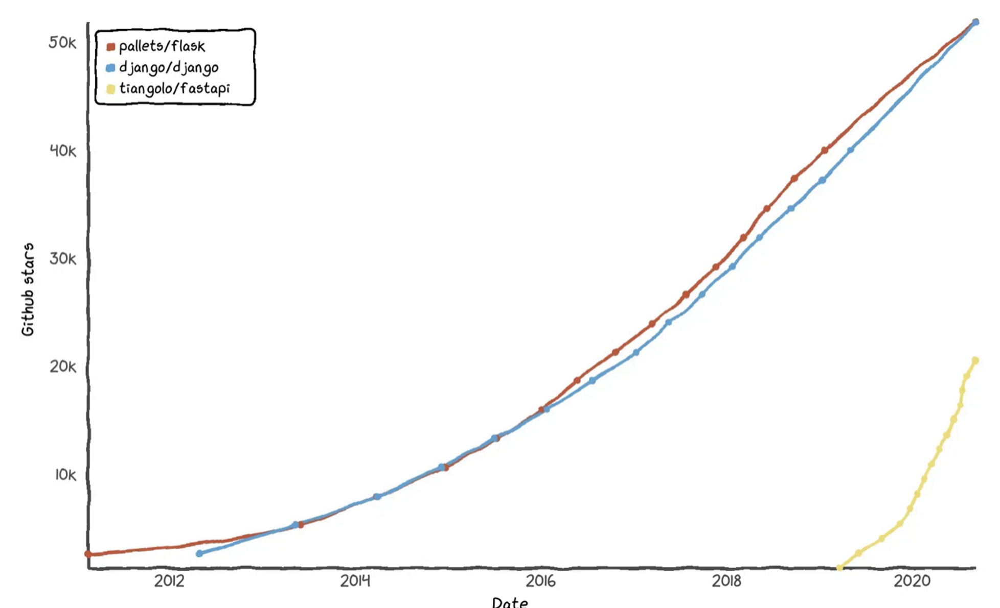

# FastAPI Convention에 관하여
## FastAPI란?


## FastAPI의 장점
- 의존성 주입
- 자동 문서화 
- 비동기 동작
- Pydantic Model

클라우드 서비스가 들어오면서 자연스럽게 `MSA` 라는 아키텍처 구조가 각광 받았고, 그로 인해 서버의 생태계에 변동이 일어나고 있다.
이제는 `Serverless (무상태성)`을 띈 `Restful API` 를 통하여 가벼운 통신 방식을 사용하는 아키텍처가 대세를 이루게 되었는데 
이렇게 작게 나뉘어진 서비스에 특화된 것이 FastAPI 이다.

- **의존성** (A는 반드시 B가 실행되어야 되는 흐름? A & B 는 의존관계 ) 
   - 주입에 핵심적인 `Depends` 함수로 인하여 인증/ DB 연결 등에서 결합도를 낮추어 유연성을 확보할 수 있게 된다
- **자동 문서화**
   - 문서화는 개발자에게 있어 하기 싫은 방학 숙제와 같다. 다른 프레임워크들과 달리 dependency 를 추가 하지 않아도 리독과 openAPI 자동으로 생성된다. 개발자에게 생산성 증대의 이점을 가져온다.
- **비동기 동작**
   - Node 처럼 비동기가 기본이 아닌 파이썬은 동기로 동작하지만 `GIL(Global Interpreter Lock)`으로 인해 쓰레드의 사용도 권장되지 않았기 때문에 동시성 처리를 위한 모듈이 없는 경우가 많다. 하지만 중요한것은 FastAPI 는 이를 지원한다는 점
- **Pydantic**
   - FastAPI 는 `Pydantic` 을 매우 사랑한다. 간단하게 직렬화, 타입검사 경로 변수 읽기 등등 장점이 수두룩 한데 이는 나중에 더 자세히 다루겠다.

## 특징


가장 큰 것이 사실상의 표준(de facto standard) 가 없다는 것이다. 여타 프레임워크들과 다르게 역사도 길지 않고 FastAPI의 모토가 자유롭고 경량의 프레임워크를 지향하기에 어쩔수 없게도 코딩 스탠다드가 존재하지 않는다. 좋게 말하면 자유도 높인 프레임워크이지만 어떻게 보면 근본이 없다 보일 수 있을 것이다.

---


## 목적
기존 클래스화 되지 않고 정해진 구조없이 짜여진 코드로 인하여 협업하는 데에 있어 각자의 코딩 색이 너무 진하여 같은 팀이지만 구조화 되지 않은 프로젝트라고 느껴졌다.

이에 우리만의 Convention을 지정하여 직관적이고 유지보수에 용이한 구조를 만드는 것을 목표로 한다.

---
# Class Based Convention
## 현재 문제점
1. Utility에 의존한 잡다한 Feature methods
	- 너무 많은 책임을 짊어진 클래스 (**낮은 응집도**)
2. 직관적이지 않은 구조
	- 하나의 `비즈니스 레이어`가 분산되어 있어 코드 가독성이 떨어짐
3. Dataclass, Pydantic Model 등 모델에 사용되는 Convention이 지정되어 있지 않음

---

## 요구 사항
1. 프로젝트 구조는 일관적, 직관적
2. 클래스는 단 한개의 책임을 가진다
3. 비즈니스 레이어 별로 패키지를 구성한다

---

## 요구 사항에 따른 Convention
### 1. 프로젝트 구조는 일관적, 직관적
[FastAPI에서 제시하는 project structure] 
```
.
├── app                  # "app" is a Python package
│   ├── __init__.py  	# this file makes "app" a 
│   ├── main.py      	# "main" module, e.g. import app.main
│   ├── dependencies.py  # "dependencies" module
│   └── routers      	# "routers" is a "Python subpackage"
│   │   ├── __init__.py  # makes "routers" a "Python subpackage"
│   │   ├── items.py 	# "items" submodule
│   │   └── users.py 	# "users" submodule
│   └── internal     	# "internal" is a "Python subpackage"
│   	├── __init__.py  # makes "internal" a "Python subpackage"
│   	└── admin.py 	# "admin" submodule
```

[제안 하고자 하는 project structure]
```
fastapi-project
├── app
│   ├── worker (비즈니스 레이어)
│   │   ├── enums.py  # enums
│   │   ├── models.py  # pydantic models
│   │   ├── dependencies.py
│   │   ├── constants.py
│   │   ├── exceptions.py
│   │   └── utils.py
│   ├── configs
│   │   ├── config.py  # global config (including .env) 
│   │   └── log_config.py
│   ├── models.py  # global models
│   ├── utils.py  # global utils
│   ├── exceptions.py  # global exceptions
│   ├── database.py  # db connection related stuff
│   └── main.py
├── aws
│   ├── client.py  # client model for external service 
│   ├── models.p
│   ├── constants.py
│   ├── exceptions.py
│   └── utils.py
├── tests/
│   ├── domain
│   └── aws
├── templates/
│   └── index.html
├── requirements
│   ├── dev.txt
│   ├── stg.txt
│   └── prod.txt
├── .env
└── .gitignore
```
- 모든 도메인 디렉토리의 root는 app이다
   - main.py에서는 그대로 FastAPI app을 초기화하고 프로젝트의 root 역할을 한다 (보편적으로 `src/` 느낌)
   - controller : 각 모듈의 엔드포인트를 가진다
   - enums : Enum 모델들 
   - models : pydantic 모델들
   - entities : 엔티티 모델들
   - service : 모듈 별 비즈니스 로직 담당
   - dependencies : 유효성 검사
   - constant : 모듈 내에서 사용되는 상수값
   - config : 모듈 내의 설정사항
   - exceptions: 커스텀 예외들!

- 같은 관심을 갖는 메서드가 두개 이상일 경우 따로 패키지로 분류한다
- 외부 패키지의 경우 app에 종속적이지 않기 때문에 app 외부에서 관리한다.

---

### 2. 클래스는 단 한개의 책임을 가진다
저자는 응집도를 잘못 이해하고 있었다. 
**여러개의 연관된 관심을 가진 메서드들을 묶어** 하나의 클래스로 만들고 이게 높은 응집도지 ㅋㅋ 하는 어리석음을 반복하고 있었다.

객체지향 설계원칙인 SOLID중 이는 SRP (Single Responsibility) 단일 책임 원칙에 해당된다.

흔히 말하는 `GOD` 클래스들은 다음과 같다.
`XXXService, XXXClient, XXXHandler, XXXWorker`

필자 또한 그러하였고 서비스안에 조금이라도 관심이 같다고 판단하면 무수히 많은 피쳐들을 남발하여 추가하였다. 이는 코드 가독성과 유지보수의 이점을 버리는 지름길이라 생각한다.

가령 아래와 같은 피쳐를 만들어야 한다.
> ex. 회원 로그를 txt 파일로 작성하는 피쳐를 만드시오
>
[Service]
``` python
class UserService:
	def write_log_file(self, user_id:str) -> None
```
[단일책임]
``` python
class UserLogWriter:
	def __init__(self, user:User)
    	self.user = user
	def write(self) -> None
```


하나의 예시에 불과하지만 서비스들로 구성한 피쳐들이 쌓이면 **가독성**적이나 특히 **유닛테스트**에서 큰 골치를 겪을 것이다.

또한 분산된 메서드들을 조합하는 방식에서 최대한 `Pythonic`하고 `OOP`를 따르기 위해 FastAPI의 라우터 또한 손을 보게 되었다.

굳이 싶긴 하겠지만 시간이 된다면 클래스화하여 컨테이너로 관리하고 싶었고 상속을 통해 보일러플레이트 코드를 최소화하고자 모두 클래스로!! 바꾸게 되었다

> ex. 
[BaseController]

[HelloController]


---

### 3. 비즈니스 레이어 별로 패키지를 구성한다

간단히 말하자면 `User`를 도메인으로 가지면서 이에 대한 간단한 CRUD를 가진 애플리케이션을 구성한다고 하였을 경우. 아래와 같이 구성할 수 있다.


```
fastapi-project
├── app
│   ├── user_manager (비즈니스 레이어)
│   │   ├── user_getter.py
│   │   ├── user_updater.py
│   │   ├── user_creator.py
│   │   ├── enums.py  # enums
│   │   ├── models.py  # pydantic models
│   │   ├── entities.py  # pydantic models
│   │   ├── user_database.py 
│   │   ├── dependencies.py
│   │   ├── constants.py
│   │   ├── exceptions.py
│   │   └── utils.py
```

가령 DB로 부터 User 엔티티를 얻고자 한다면 `UserGetter.get()` 과 같이 직관적이게 해당 메서드가 무엇을 리턴하는지 유추할 수 있다.

`Facade Pattern`을 적용하여 이들을 조합하는 하나의 `Manager` 레벨이 증가한다고 하더라도 이는 동일하게 적용 될 수 있다. 

> _**models의 클래스 이름이 같을 수 있지 않소?**_
네, 물론입니다. 
특히나 엔티티와 DTO의 네이밍은 겹칠 수 밖에 없죠
그렇기에 naming space를 사용하여 구분 합니다
ex. 
``` python
import app.user_manager.entities as entity
import app.user_manager.models as dto
user_dto = dto.User
user_entity = entity.User
```

---

구현보다 중요한 것이 **설계**이다.
구현 레벨의 설계도 중요하며 이러한 명확한 Convention이 있어야 통일된 Class Diagram과 Sequence Diagram, Module Diagram을 적립 할 수 있을 것이다

해당 컨벤션이 정답이라고 결코 말할 수 없다.
그냥 이러한 컨벤션을 사용할 수도 있겠구나~ 라고 생각하면 좋을 것 같다

