> #### REFS
- [Rules Based Stream Processing with Apache Flink's Broadcast Pattern](https://brggs.co.uk/blog/broadcast-state-pattern-rules-based-flink/)
- [Advanced Flink Application Patterns Vol.1: Case Study of a Fraud Detection System](https://flink.apache.org/2020/01/15/advanced-flink-application-patterns-vol.1-case-study-of-a-fraud-detection-system/)
- [Build a dynamic rules engine with Amazon Managed Service for Apahce Flink](https://aws.amazon.com/ko/blogs/big-data/build-a-dynamic-rules-engine-with-amazon-managed-service-for-apache-flink/)


# 리서치 배경
---
- `Window Time` 동안 **필터링 조건에 따른 횟수 기반의 탐지 정책을 구축**하는 방안 케이스 스터디가 필요함
- **하나의 Job 코드**에서 **모든 정책에 대한 처리 하는 방안**에 대한 리서치가 필요
   - 정책 별 인스턴스 할당은 가상화 된 컨테이너를 활용하더라도 리소스 낭비가 심함
- 정책은 관리자에 의해 수정될 수 있으며, 정책 변경에 따른 재배포를 최소화해야 함

# 사전 지식
---
### 동적 파티셔닝
`Kafka`는 `Event Key`를 기반으로 **해싱** 후, **모듈러 연산**을 통해 **파티셔닝** 됨

`Kafka Streams`, `Flink`에서 **Event의 Key가 아닌 값으로 group by (keyBy) 할 경우**, **해당 Key를 기준으로 리셔플**이 발생

(리셔플 발생 시, 네트워크를 통해 `Task Manager` 간의 데이터 재구성이 진행되며 심각한 오버헤드가 될 수 있음)
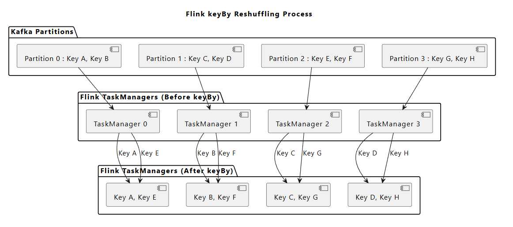

이를 적절히 해결하기 위해, **동일한 키를 가진 스트림 트랜잭션**이 **같은 작업자(subtask)**에서 **처리**될 수 있도록 구성해야 함

ex. ) Group By Target이 "ID" or "IP" 으로 source에서 미리 두개의 topic으로 발행하는 것도 방법이 됨


### 용어 정의
| **구성 요소**       | **설명**                                         | **주요 역할**                                                                                     | **특징**                                                                                                           |
| --------------- | ---------------------------------------------- | --------------------------------------------------------------------------------------------- | ---------------------------------------------------------------------------------------------------------------- |
| **JobManager**  | Flink의 중앙 관리 노드로, 작업(Job)의 생명 주기를 관리합니다.       | - 작업 계획 수립 및 분배<br>- ExecutionGraph 생성<br>- Checkpoint 관리 및 장애 복구<br>- 리소스(TaskManager 슬롯) 할당 | - 클러스터당 하나의 JobManager 실행<br>- 모든 작업의 상태와 진행 상황을 모니터링<br>- Checkpoint와 Savepoint를 통해 상태를 저장 및 복구                 |
| **TaskManager** | Flink의 작업을 실행하는 워커 노드입니다.                      | - SubTask 실행<br>- 네트워크 통신 및 데이터 전송<br>- 상태(State)와 메모리 관리                                     | - 병렬 처리 단위를 실행하는 물리적 노드<br>- 클러스터 내 여러 TaskManager 존재<br>- 각 TaskManager는 여러 슬롯(Slot)을 가질 수 있으며, 슬롯마다 SubTask 실행 |
| **SubTask**     | Flink 작업의 병렬 실행 단위로, TaskManager 내에서 실행됩니다.    | - 파티셔닝된 데이터를 처리<br>- 연산자(Operator)의 로직 실행<br>- 독립적인 상태(State) 관리                              | - `keyBy`를 통해 파티셔닝된 데이터만 처리<br>- 병렬도(parallelism)에 따라 생성<br>- SubTask 간에는 데이터가 공유되지 않으며 독립적으로 작동                 |
| **Broadcast**   | 작은 크기의 데이터 스트림을 모든 SubTask에 복제하여 전달하는 메커니즘입니다. | - 규칙(Rule) 데이터 전파<br>- 설정 정보 동기화<br>- 컨트롤 메시지 공유                                              | - Broadcast 데이터를 모든 SubTask에 복사<br>- 일반 데이터 스트림과 결합 가능<br>- 네트워크 부하가 발생할 수 있으므로 작은 크기의 데이터에 적합                   |


# 구현 방안
---
1. `rule DB`의 `CDC`를 기반으로 **액션 이벤트** + **활성화된 정책 이벤트를 병합**하여 **이벤트 발행**
    1. **액션 이벤트가 1**이고 **활성화된 이벤트가 N**개라면 **총 N개의 병합(액션+정책 정보 포함) 이벤트 발행**
2. `DynamicKeyFunction`을 토대로 `source stream`에서 **group by에 따라 이벤트를 파티셔닝**
    1. **새로운 keyBy() 조건에 따른 리셔플을 동적으로 처리** → Job 코드 수정 X, 재배포 X
    2. **기존 keyBy() 조건인 경우 기존 TaskSlot에서 처리**
3. `DynamicEvaluationFunction`에서는 소스로부터 데이터를 읽어와 **이벤트가 정책에 부합하는 지 확인**, **정책에 부합한다면 restrict event로 발행**

## Broadcast State
REFS : [A Practical guid to broadcast state in Flink](https://flink.apache.org/2019/06/26/a-practical-guide-to-broadcast-state-in-apache-flink/)

`Broadcast State` 는 **하나의 데이터 스트림**을 **다른 데이터 스트림의 모든 작업(Task)에 동일한 상태(State)로 전파**하여 공유할 수 있도록 설계된 기능

주로 **동일한 설정값이나 기준 데이터를 실시간 업데이트**하여 **다른 데이터와 조합**해 **처리**해야 하는 애플리케이션에서 사용 됨

  

### **Broadcast State의 동작 구조**

1. **두 개의 스트림이 필요**:
    - **Broadcast Stream**: 이 스트림의 이벤트는 **모든 작업(Task)의 병렬 인스턴스**에 **공유 상태(State)**로 전파됨
    - **일반 Stream**: 이 스트림의 이벤트는 각 작업의 병렬 인스턴스로 개별적으로 전달됨
2. **이벤트 처리 방식**:
    - `Broadcast Stream`의 이벤트는 **상태로 유지**되어 모든 병렬 작업에서 참조 가능
    - 일반 Stream의 이벤트는 개별 작업에서 `Broadcast Stream`의 상태와 함께 처리

### **적합한 사용 사례**

- **Low Throughput vs High Throughput 스트림 결합**:
    
    - `Broadcast Stream`은 상대적으로 낮은 속도(`low throughput`)로 동작하며, 이를 일반 스트림(`high throughput`)과 결합해 효율적으로 처리
    - **소스 액션 이벤트 스트림**과 **알림 정책**을 **스트림 기반으로 전환하여, 동적으로 결합하여 사용**할 수 있도록 함
- **동적 처리 로직 업데이트**:
    
    - `Broadcast Stream`을 사용해 **처리 로직 또는 기준 데이터**를 실시간으로 업데이트
    - 정책 변경 시, `Broadcast stream`으로 정책 정보 전달, 실시간으로 변경된 정책으로 Evaluate
    
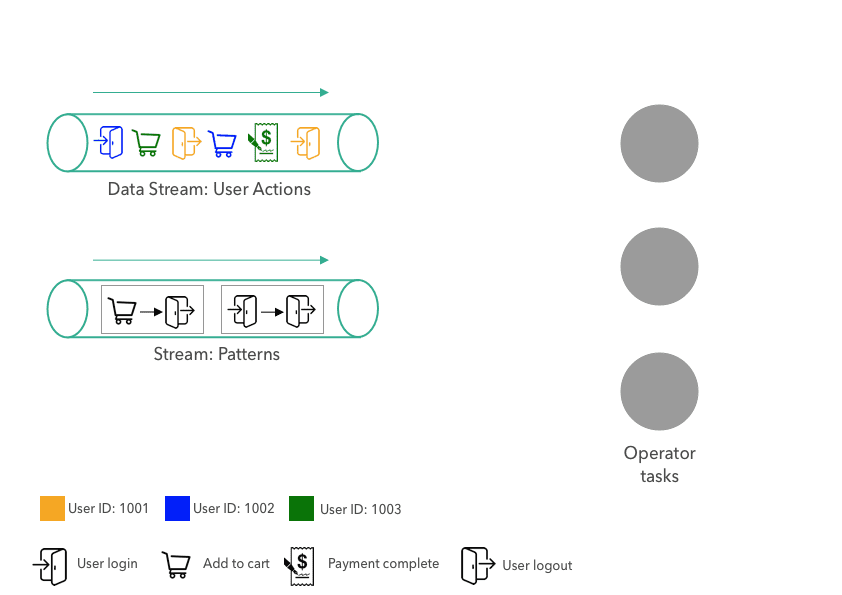

**Data Stream** : Source Event (결제 이벤트)

**Broadcast Stream** : 정책 Event (Retention Time은 무제한)

- **원본 이벤트** (액션 이벤트)에 **정책 Event**를 **병합**하여 처리
- `Operator Task`는 `Broadcast Stream` 기반으로 하는 **Broadcast State(K/V Store)** 를 바탕으로 **정책 Evaluate**

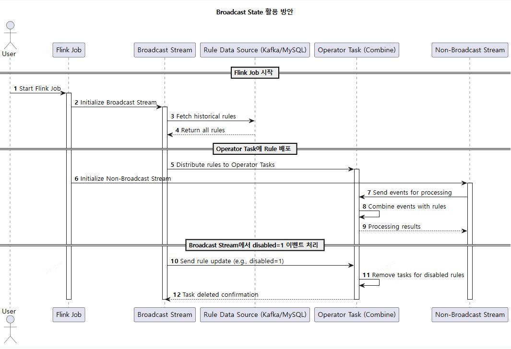

## Dynamic Data Paritioning
REFS : [Advanced Flink Application Patterns Vol.1: Case Study of a Fraud Detection System](https://flink.apache.org/2020/01/15/advanced-flink-application-patterns-vol.1-case-study-of-a-fraud-detection-system/)

Production System에서 **runtime에 Job을 재배포할 필요 없이 Rule을 더하거나 지울 수 있도록 시스템을 구현**한다

### **KeyBy와 Partitioning**

- **KeyBy 메서드**:
    - Flink의 `keyBy` 메서드를 사용하면 스트림의 이벤트에 **키(Key)**를 지정 가능
    - 같은 키를 가진 이벤트는 **같은 파티션**으로 할당되며, **다음 Operator의 같은 Task**에서 처리됨
- **Key 지정의 일반적인 패턴**:
    - 대부분의 스트리밍 애플리케이션에서는 **키를 정적인 필드**로 고정
    - e.g. 유저 로그인(`login stream`)에서 `memberID`를 키로 사용해 **윈도우 기반 집계**를 수행
- **Horizontal Scalability**:
    - 정적 키를 사용하면 수평적 확장성(horizontal scalability)을 제공하여 높은 처리량을 지원
    
| **구분**     | **정적 키 (Static Key)**                                        | **동적 키 (Dynamic Key)**                                                       |
| ---------- | ------------------------------------------------------------ | ---------------------------------------------------------------------------- |
| **정의**     | 런타임 전에 미리 고정된 필드로 데이터를 그룹화                                   | 런타임 시점에 비즈니스 로직에 따라 동적으로 키를 설정                                               |
| **설정**     | 고정된 필드 기반의 `keyBy` <br><br>(예: `Transaction::getAccountId`). | JSON이나 Rule 엔진과 같은 외부 설정으로 키를 구성<br><br>(예: `groupingKeyNames` 필드에서 동적으로 결정) |
| **유연성**    | 비즈니스 로직 변경에 대응하기 어려움                                         | 비즈니스 요구사항 변화에 따라 키 설정을 변경 가능                                                 |
| **구현 난이도** | 단순하고 구현하기 쉬움                                                 | 상대적으로 복잡하며, 런타임 시 Rule 파싱 및 키 설정 로직 추가 필요                                    |
| **성능**     | 최적화에 유리하며, 실행 시 오버헤드가 적음                                     | 키 계산 로직 및 유연성으로 인해 약간의 추가 성능 오버헤드 발생                                         |
| **적용 사례**  | - Account ID 기반 그룹화<br>- 동일 IP 기반 집계<br>- 사용자별 활동 추적         | - 다양한 필드 기반 그룹화 (예: 송신자, 수신자)<br>- 조건에 따라 동적으로 그룹화<br>- Rule 기반 실시간 처리       |
| **장점**     | - 구현 및 유지보수가 용이<br>- 성능 최적화에 유리<br>- 단순한 집계 작업에 적합           | - 복잡한 비즈니스 로직을 처리 가능<br>- 유연하고 확장성이 높음<br>- 다양한 Use Case에 적합                 |
| **단점**     | - 복잡한 요구사항을 처리하기 어려움<br>- 비즈니스 변화 시 재배포 필요                   | - 구현이 복잡하고 런타임 오버헤드 발생<br>- 실수로 인해 키 설정 오류 발생 가능                             |
셔플이 발생하지 않도록, 정책에 따라 생성된 **SubTask**가 **동일한 KeyedStream**을 사용할 수 있도록 한다

Static 하게 지정된 Key가 아닌 정책에 따라 동적으로 `KeyedStream`을 생성하거나 재사용하도록 구성하는 방안

> **성능**이나 **코드파악**에서는 **하드코딩된 명시적인 Key**가 관리하기엔 용이할 수 있다. 하지만, **지속가능한 아키텍처**를 구현하기 위해서 어느정도의 **TradeOff를 감수**하고 동적 키 파티셔닝을 구현하는 것임

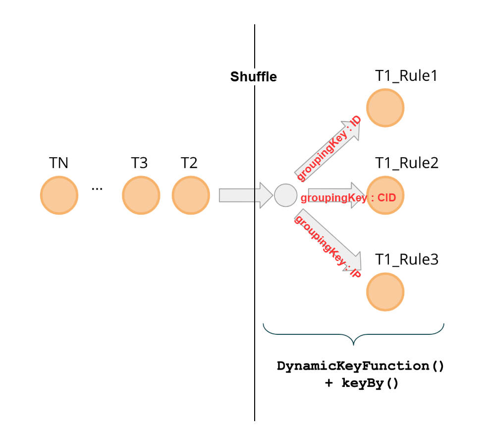
*T :  Transaction (결제 이벤트를 의미)


**T1_Rule1, T1_Rule2, T1_Rule3** 는 **Flink SubTask**를 의미

각각은 **groupingKey** (keyBy)에 따라 셔플링되어 각 **네트워크를 통해 SubTask**로 **전달**

> #### 다른 정책, 동일 KeyBy
>
정책 Evaluate 조건은 다를지라도 `Group By`하는 **Key가 같을 경우**, **동일 SubTask 내에서 정책 평가**를 진행
>
**동일 SubTask**에 **여러 정책**을 Evaluate 할 경우, **SubTask 내부에서 순차적으로 정책 평가**를 진행
>
**병렬도를 늘리고 싶다면** 소스이벤트의 다른 필드를 키로 하여 **파티션**을 나눌수 있겠지만 그만큼 **셔플링으로 인한 오버헤드**가 발생됨

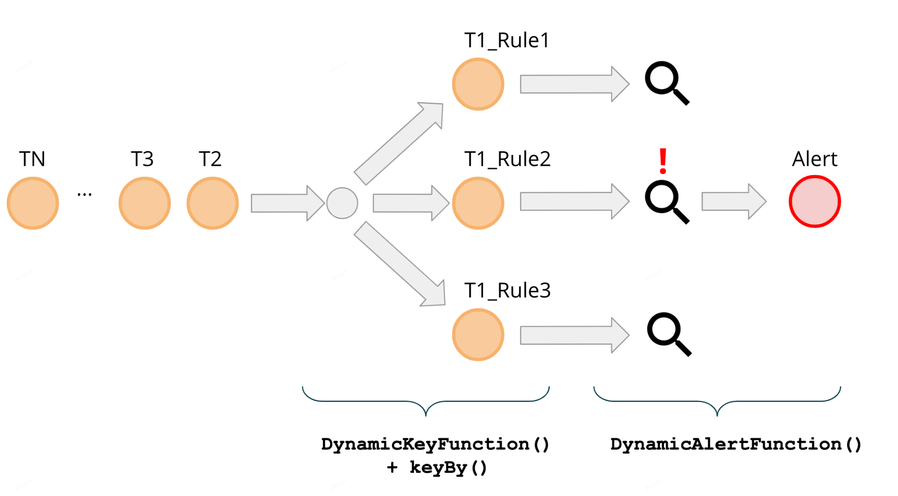

정책을 동적으로 만들 수 있는 파라미터 정의

| 필드명                  | 설명               | 예시                                     |
| -------------------- | ---------------- | -------------------------------------- |
| RuleID               | 정책 고유 ID         | 78, 889                                |
| Aggregation Field    | 집계 결과가 저장되는 필드 명 | id_count, hpid_count                   |
| Grouping Fields      | 집계할 필드           | ID, IP                                 |
| Aggregation Function | 집계 연산            | sum, count, avg                        |
| Window Duration      | 집계 기간            | 10m, 10s, 90d                          |
| Limit                | 임계치              | 3, 5                                   |
| Limit Operator       | 임계치 연산자          | gt, lt, equal                          |
| Filter               | 필터링 조건           | { "filter_option": "option_value"} |


e.x "정책 2: 로그인 단계에서 3분 이내에 동일 ID의 서로 다른 IP가 4개 초과인 경우 알림"

```json
{
  "ruleId": 2,
  "ruleState": "ACTIVE",
  "groupingKeyNames": ["id"],
  "aggregateFieldName": "ip",
  "aggregatorFunctionType": "UNIQUE_COUNT",
  "filter" : {
        "action": "login"
  }.
  "limitOperatorType": "gt",
  "limit": 4,
  "windowMinutes": "3m"
}
```

## Rules BroadCasting
REFS : [Advanced Flink Application Patterns Vol.2: Dynamic Updates of Application Logic](https://flink.apache.org/2020/03/24/advanced-flink-application-patterns-vol.2-dynamic-updates-of-application-logic/)

앞서 설명한 **DynamicKeyFunction()**은 **데이터를 동적으로 파티셔닝**하여 셔플링으로 인한 오버헤드를 최소화
**DynamicEvaluationFunction()** 은 정책에 따른 평가를 수행하는 데이터를 의미

컴파일 되기 전에 미리 Rules 를 List로 읽어와 실행하는 것은 가능하다

하지만  컴파일 된 후, 정책 변경 시에 결코 동적으로 정책에 따른 SubTask Operator를 동작 시킬 수 없다


이를 해결하기 위해 `Rules Broadcasting`을 구현
`Source Topic`으로 부터 액션 이벤트를 받아오고, `Rule Source`를 `Broadcast`로 **병합**하여 **정책 평가**

만약! 정책 DB가 **Soft Delete** 이라면 CDC의 **disabled 컬럼을 통해** **rule_id operator를 드롭**하도록 한다
신규 추가된 정책은 새롭게 `operator task`로 생성한다

### Broadcasting Flow
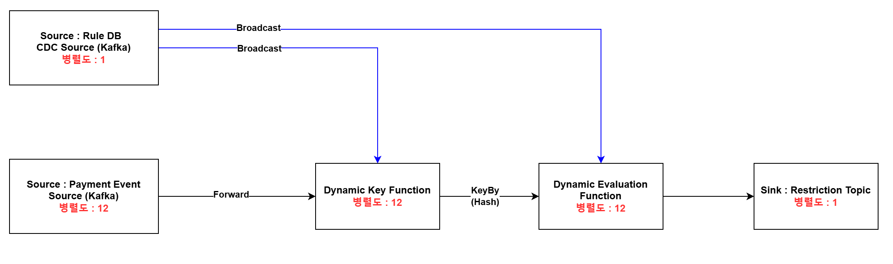

| **항목**                          | **설명**                                                                            |
| ------------------------------- | --------------------------------------------------------------------------------- |
| **Payment Event Source**        | 병렬적으로 Kafka 파티션에서 이벤트를 컨슘.                                                        |
| **Dynamic Key Function**        | `DynamicKeyFunction()`을 통해 병렬 Task로 파티셔닝. 지정된 키에 따라 복합키 또는 단일키를 해싱하여 네트워크로 데이터 전송 |
| **Dynamic Evaluation Function** | - 필터링 조건에 따라 **Data Window**를 상태 저장소(State Backend)에 저장<br>- 임계치를 초과하면 Sinking 처리 |
| **Restriction Topic**           | 제재(Restriction) Topic으로 제재 정보를 포함하여 발행                                            |

***병렬도**는 부하 테스트를 통해 Consumer Lag을 최소화하는 병렬도 산정

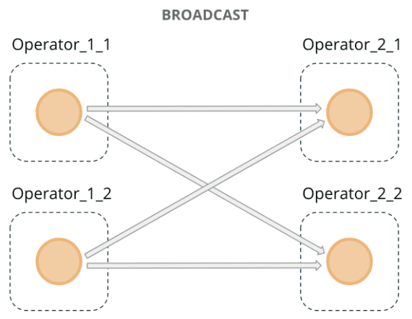
- Rule DB의 CDC는 **Broadcast Channel**을 통해 **main processing data flow**에 **병합** 됨
- **Broadcast**는 **각 메시지를** **모든 병렬 인스턴스로 뿌림** (key나 source 파티션에 관계없이 모두 전달됨)

### FDS 시스템에서의 개략적 설계 방안
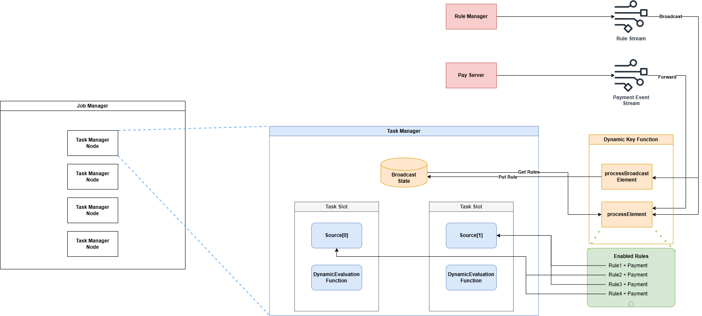


- **processBroadcastElement:** Broadcast source stream의 이벤트 발생 시 트리거 됨
    - **CDC 로 기존 정책 remove + 새로운 정책 insert**
- **processElement:** Source stream의 이벤트 발생 시 트리거 됨
    - 현재 활성화된 정책들을 불러와 활성화된 조건 마다 Rule 조건 + Payment 이벤트를 병합한 이벤트를 발행
    - 정책 별 `group by` 조건에 따라 파티셔닝 됨 (`keyBy`)
    

`Broadcast Stream` 에서 읽어온 데이터는 `Broadcast State (K/V map)`에 상태를 저장한다

`Broadcast Stream`에 새로운 메시지가 도착하면 **processBroadcastElement()** 가 호출된다

해당 class를 상속하는 `DynamicKeyFunction`을 구현하면 **runtime에 분산 키를 수정**할 수 있다

## Custom Window Processing
REFS : [Advanced Flink Application Patterns Vol.3: Custom Window Processing](https://flink.apache.org/2020/07/30/advanced-flink-application-patterns-vol.3-custom-window-processing/)

  

Flink에서는 다양한 유즈케이스에 맞춘 Window API를 제공함

|종류|설명|사용 예시|
|---|---|---|
|**Tumbling Window**|- **고정된 간격**으로 데이터를 그룹화<br>- 각 윈도우는 겹치지 않고 연속적으로 이어짐|- `timeWindow(Time.minutes(1))`<br>- 1분마다 평균, 합계 등의 집계 처리|
|**Sliding Window**|- **고정된 크기**의 윈도우가 **겹치며 이동**.<br>- 슬라이드 간격(`slide`)에 따라 중복된 데이터를 처리할 수 있음|- `timeWindow(Time.minutes(1), Time.seconds(30))`<br>- 1분 윈도우, 30초 간격으로 이동하며 집계 처리.|
|**Session Window**|- 데이터가 **활동 간격(session gap)**에 따라 윈도우가 시작되고 종료됨.<br>- 활동 간 데이터가 없는 경우 윈도우가 닫히고 결과 출력.|- `sessionWindow(Time.minutes(5))`<br>- 유저별 활동 세션 분석.|

이 중, 고려해볼 Window는 **Tumbling**과 **Sliding** Window

### Window API 사용 시 제약 사항
| 유형    | Tumbling Window                                    | Sliding Window                                                 |
| ----- | -------------------------------------------------- | -------------------------------------------------------------- |
| 정책 예시 | **Time Window동안 동일 이벤트가 6번 발생하면 제재한다**             | **Time Window동안 동일 이벤트가 4번 발생하면 제재한다 가정**                      
| 제약사항  | Tumbling Window는 고정된 간격으로 겹치지 않게 이어지기 때문에 탐지할 수 없음 | 슬라이드 간격에 따라 **중복된 데이터가 처리됨**, Sliding 간격을 촘촘히 하더라도 정확한 탐지가 불가능 |

#### Tumbling Window 예외 케이스 예시
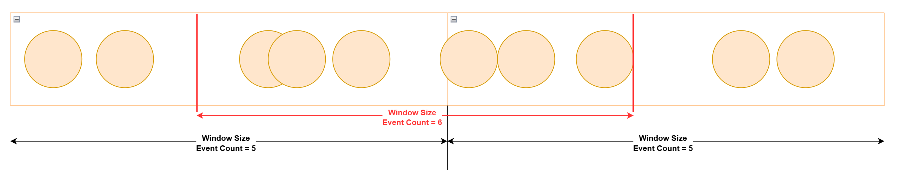

#### Sliding Window 예외 케이스 예시
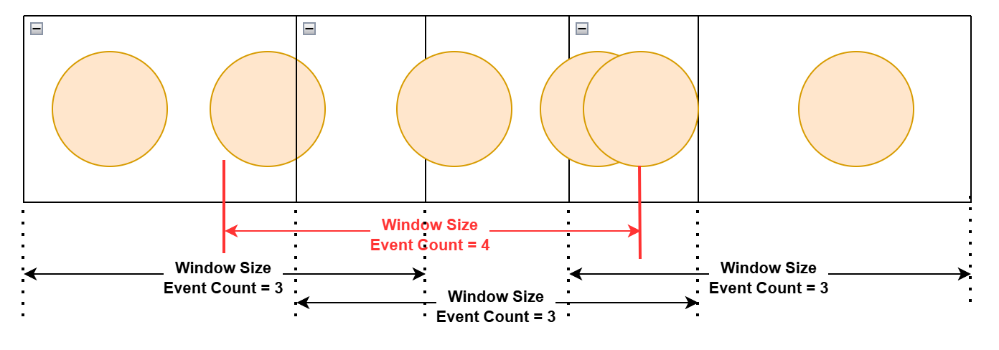

#### 가장 큰 제약 사항
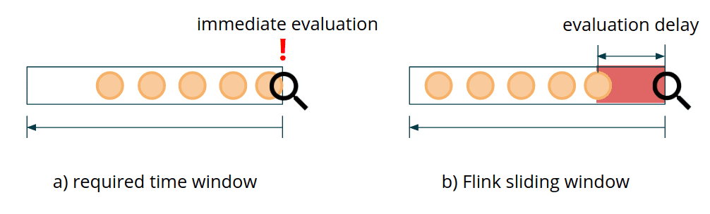

Flink API의 [sliding window](https://nightlies.apache.org/flink/flink-docs-release-1.11/dev/stream/operators/windows.html#sliding-windows) example을 보면, **slide S인 sliding window**를 쓰면, **S/2 만큼의 evaluation delay**가 생기게 된다

윈도우 API의 트리거는 **윈도우의 종료 시점에 실행**되며, **종료 시점까지는 Delay가 필연적**으로 발생한다

→ **Fraud Detection Delay** 동안 **어뷰저의 Negative action**을 방치하므로 **회사의 손실**을 야기시킨다

### Custom Window Function Implementation

`DynamicEvaluationFunction()`에 대한 구현
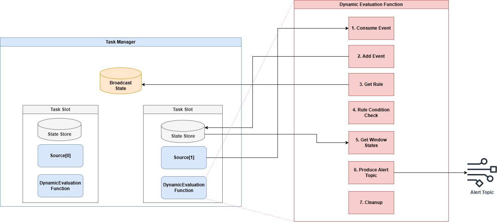


1. **Consume Event:** Source로 부터 이벤트를 가져옴
    1. `DynamicKeyFunction`에 따라, 정책 정보 + 액션 이벤트가 함께 이벤트에 포함됨
2. **Add Event:** 이벤트를 집계하기 위해 상태 저장소에 현재 이벤트 저장
3. **Get Rule:** `Broadcast State`로 부터 현재 활성화된 정책 불러오기
    1. 만약 정책이 **존재하지 않는다면 비활성화된 정책**임 (처리할 필요 X return)
4. **Rule Condition Check:** 현재 이벤트가 필터링 조건에 부합하는지 체크
    1. 부합하지 않는다면 return
5. **Get Window States:** 이벤트 시간 기준으로 정책에 등록된 duration 동안 정책을 만족하는 이벤트 집계
6. **Produce Restrict Topic:** 집계된 결과가 정책을 만족하면 다음 `Enforcement Topic`으로 발행
7. **Cleanup:** Retention 기간이 만료된 이벤트 제거

#### Window State에 저장될 이벤트에 대한 고찰
이벤트는 `source`가 되는 이벤트의 **발행 시점 timestamp**를 갖게 된다
파티셔닝은 `group by` 조건에 따라 발생되기에 **동일한 timestamp를 가진 이벤트**가 **여러개**가 **발생**될 수 있다
**중복 적재가 되더라도 무관한 자료구조인 Set을 활용**하는 것이 바람직. Key는 timestamp
```java
MapState<Long, Set<PaymentEvent>> windowState;
```

> 상태 저장소는 Key Value Store이기 때문에 List Type을 사용할 수 없다
>
필연적으로 모든 Map의 timestamp를 순회하면서 만족하는 값을 찾아야 하는데... 
>
이 부분에 대한 리서치는 조금 더 필요할 듯 
event 전체를 순회하는게 아니라 timestamp만 순회하여 메모리는 크게 이슈가 되지 않을듯 (다만 loop 동안 CPU가 괜찮을까..?)

#### Event Retention에 대한 고찰
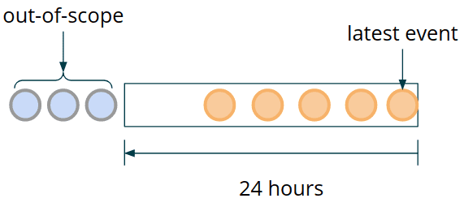
보관 기간 즉, Event의 TTL을 어떻게 잡을 것인가 ?

**DynamicEvaluationFunction()** 에서는 같은 key scope를 가지는 결제 이벤트를 받을 수 있지만, 다른 Rule에 의해 evaluate되고, 다른 길이의 time window를 가질 수 있다

그렇기에 `Rule Stream (Broadcast Stream)`에서 **이벤트를 컨슈밍하는 시점**에서 **가장 긴 Duration을 업데이트**할 수 있도록 한다

ex. `UpdateWidestWindow`
```java
@Override
public void processBroadcastElement(Rule rule, Context ctx, Collector<Alert> out)
{
  ...
   updateWidestWindowRule(rule, boradcastState);
}
 
private void updatWidestWindowRule(Rule rule, BoradcastState<Integer, Rule> broadcastState)
{
  Rule widestWindowRule = broadcastState.get(WIDEST_RULE_KEY);
  if (widestWindowRule == null) {
    broadcastState.put(WIDEST_WRULE_KEY, rule);
    return;
  }
  if (widestWindowRule.getWindowMillis() < rule.getWindowMillis()) {
    broacastState.put(WIDEST_RULE_KEY, rule);
  }
}
```

즉 `Dynamic Evaluation`에서는 가장 Duration이 긴 정책을 기반으로 Event의 TTL을 지정한다