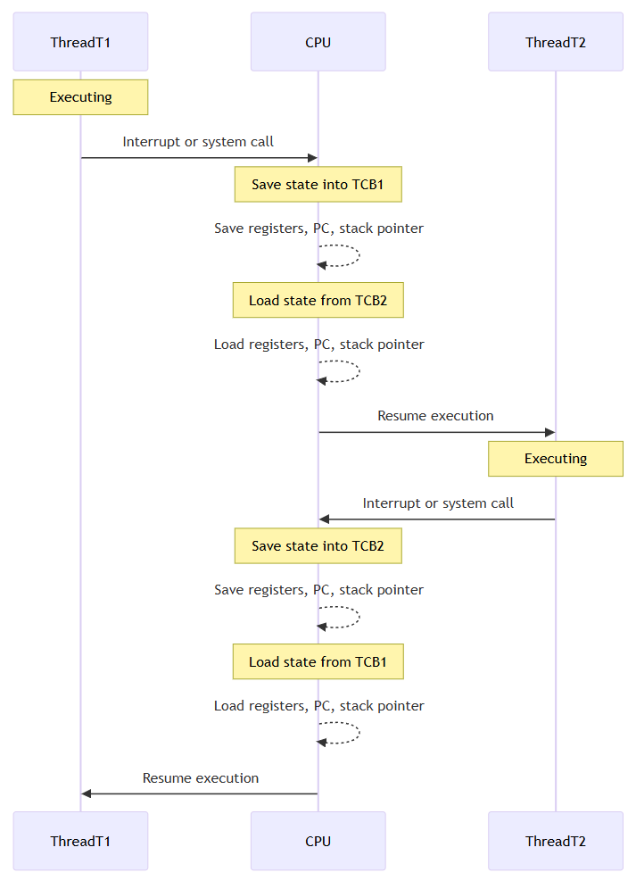

This article is about testing...

> What happens to the server if tens of millions of API requests per second are received, and these APIs communicate with an external API that responds in 10 seconds?
> 
> ⨳ Assume that the TCP connection timeout is not configured separately.

# What is a Goroutine?
Goroutines are often called lightweight threads... So is it just a thread with less memory?

## Advantages of Goroutines
### Low Context Switching Cost
As hardware has advanced, the concepts of *_multithreading_ and *_multitasking_ have emerged to utilize it efficiently.
> Multithreading: Multiple threads running within a single process (In a single-core environment, multithreading might be multitasking)
>
> Multitasking: Simultaneously executing multiple tasks (appearing so)

#### Other Languages (C/C++/Java)


#### Go Language
The Go runtime performs **lightweight context switching** by using its own G (Goroutine), M (OS Thread), and P (Scheduler Context), without switching the kernel-level TCB (Task Control Block) directly.

----

### Creation and Destruction Cost
Creating and destroying an `OS Thread` after use requires high cost. To avoid paying this cost every time, **thread pools** are often used.

What about in Go?

The M in Go’s GMP model corresponds to the `OS Thread`. While a goroutine runs through the connection of a P(processor) and an M, the M can be created or destroyed as needed.

※ G refers to a user-level thread, and M refers to an OS thread. These are mapped in an m:n relationship.

However, this is optimized by the Go runtime scheduler, allowing it to be managed with much lower cost compared to general programming languages.

----

### Low Memory Consumption
When created as threads, they require around `1MB` of stack including memory protection between threads.

In contrast, a goroutine only needs `2KB` of stack initially, resulting in significant lightweighting. (Of course, additional memory allocation may be required depending on the code executed by the goroutine—this applies to other languages as well.)

Here’s a numerical comparison:
| Language | Basic Execution Unit   | Default Stack Size | Estimated Total Memory Use |
| -------- | ---------------------- | ------------------ | -------------------------- |
| C/C++    | pthread                | 8MB                | About 8MB or more          |
| Java     | java.lang.Thread       | 1MB                | About 1MB or more          |
| Go       | goroutine (G)          | 2KB (initial)      | Several KB                 |

----


# GMP: Go Scheduler Architecture

The Go runtime efficiently assigns, schedules, and manages goroutines using a system known as GMP:  
- **G**: Goroutine (logical execution unit)  
- **M**: Machine (an OS thread)  
- **P**: Processor (scheduling context)


This architecture allows Go to perform lightweight context switching and schedule massive numbers of goroutines across a limited set of OS threads.

| Component                  | Meaning          | Role                         | Key Information                                                                 |
|---------------------------|------------------|-------------------------------|----------------------------------------------------------------------------------|
| **G (Goroutine)**         | Logical execution unit | Code that needs to be executed | Stores stack, instruction pointer, goroutine status, etc.                        |
| **M (Machine)**           | OS thread        | Executes G                    | Binds to P, executes G, and may handle syscalls                                 |
| **P (Processor)**         | Scheduling context | Schedules G onto M           | Owns a Local Run Queue (LRQ), can access GRQ and perform work stealing          |
| **LRQ (Local Run Queue)** | Per-P queue      | Stores Gs owned by a P        | Lower contention, faster scheduling                                             |
| **GRQ (Global Run Queue)**| Shared queue     | Backup storage of runnable Gs | Used when LRQs are empty or overflown                                           |

Each P can be thought of as a “logical core” limited by `GOMAXPROCS`. It binds to an M (OS thread) and pulls Gs from its LRQ first, falling back to GRQ if needed.

The system is designed to:
- Reduce kernel-level context switching  
- Avoid excessive OS threads  
- Enable highly scalable I/O concurrency  

----

## P (Processor)
- P defaults to `GOMAXPROCS` = number of CPU cores  
- P is assigned to one M, and each P owns its own `Local Run Queue`  
- P holds context info of G  
- It calls `findRunnable()` to decide which G to run next  


[[runtime/proc.go](https://go.dev/src/runtime/proc.go)]
```go
func findRunnable() (gp *g, inheritTime, tryWakeP bool) {
    mp := getg().m
    pp := mp.p.ptr()

    // local runq
    if gp, inheritTime := runqget(pp); gp != nil {
        return gp, inheritTime, false
    }

    // global runq
    if sched.runqsize != 0 {
        lock(&sched.lock)
        gp := globrunqget(pp, 0)
        unlock(&sched.lock)
        if gp != nil {
            return gp, false, false
        }
    }

    // Poll network.
    if netpollinited() && netpollAnyWaiters() && sched.lastpoll.Load() != 0 {
        if list, delta := netpoll(0); !list.empty() {
            gp := list.pop()
            injectglist(&list)
            netpollAdjustWaiters(delta)
            casgstatus(gp, _Gwaiting, _Grunnable)
            return gp, false, false
        }
    }

    // Spinning Ms: steal work from other Ps.
    if mp.spinning || 2*sched.nmspinning.Load() < gomaxprocs-sched.npidle.Load() {
        if !mp.spinning {
            mp.becomeSpinning()
        }

        gp, inheritTime, _, _, _ := stealWork(nanotime())
        if gp != nil {
            return gp, inheritTime, false
        }
    }

    // fallback: no G found
    return nil, false, false
}
```

| Order | Source                            | Description                         | Use case                            |
| ----- | --------------------------------- | ----------------------------------- | ----------------------------------- |
| ①     | **Local Run Queue (LRQ)**         | Unique queue per P                  | Fastest and lowest cost → **first** |
| ②     | **Global Run Queue (GRQ)**        | Shared queue among all Ps           | Used when LRQ is empty              |
| ③     | **Network Poller (Netpoll)**      | Gs woken by epoll/kqueue/I/O events | Revives Gs after network I/O        |
| ④     | **Work Stealing (other P’s LRQ)** | Steal Gs from another P’s LRQ       | Used when own LRQ & GRQ are empty   |

Then naturally, this question arises...

----

#### After a blocking operation completes, how does the G return to P?
This is the process of goroutine switching within a single P (processor).

G1 is a goroutine performing a syscall (e.g., `HTTPRequest`)


| Step | Description                                                                 |
|------|-----------------------------------------------------------------------------|
| ①    | `G1` enters a syscall (`net.Read()` is called)                             |
| ②    | `M1` blocks on the syscall → calls `entersyscall()`, `P1` is detached      |
| ③    | `P1` is handed over to `M2` → `M2` is either idle or created via `newm()`  |
| ④    | `M2` picks and executes `G2` from `P1`’s run queue                         |
| ⑤    | The OS detects syscall completion via `epoll`, `kqueue`, or IOCP          |
| ⑥    | `netpoller` marks G1 as runnable → `G1.status = _Grunnable`               |
| ⑦    | Scheduler later selects and resumes G1 through `schedule()`               |

----

#### What if no runnable Goroutine is found in `findRunnable()`?
1. The current M (OS thread) has no G to run  
2. `stopm()` is called → the current M is parked  
3. The P held by M is returned via `releasep()`  
4. The returned P is placed into the idle P queue  

- Ps created up to the number of `GOMAXPROCS` do not disappear and stay in the idle state  
- When a new runnable G appears, it reuses an idle P to resume execution  
- M may be created again or an idle M reused if needed  

----

## M (Machine)
- M receives a G and actually executes it as an `OS Thread`
- The default value for maxcount is **10000**

What happens to M1 when its G (running a blocking operation) enters a syscall?

[[runtime/proc.go](https://go.dev/src/runtime/proc.go)]
```go
func exitsyscall() {
    gp := getg()

    // Validate syscall stack frame
    if sys.GetCallerSP() > gp.syscallsp {
        throw("exitsyscall: syscall frame is no longer valid")
    }

    gp.waitsince = 0
    oldp := gp.m.oldp.ptr()
    gp.m.oldp = 0

    // Fast path: try to reacquire P and resume execution
    // if P is IDLE, return true and resume running goroutine
    if exitsyscallfast(oldp) {
        ...
        casgstatus(gp, _Gsyscall, _Grunning) // mark G as running
        return
    }

    // Slow path: failed to reacquire P
    // Call scheduler (park M and let scheduler run G later)
    mcall(exitsyscall0)
}
```

| Condition              | Handling                                              |
| ---------------------- | ----------------------------------------------------- |
| P can be reacquired    | G1 resumes immediately (`execute(g)`)                 |
| P cannot be reacquired | G1 is enqueued as runnable, M1 is stopped (`stopm()`) |
| Too many idle Ms       | M1 may be completely terminated                       |
| Lack of idle Ms        | M1 may be reused (`newm()` is avoided if possible)    |

### Multithreading with M (OS Thread) in other languages
- One OS thread is created per request, and that thread performs `epoll_wait/syscall`
- N worker threads are created, each handling `epoll_wait` or `read`

#### Cons
- To handle 1,000 concurrent requests, **up to 1,000 threads are required**
- Each M (`epoll_wait`) blocks in syscall → leads to context switches
- *_Cache misses_, kernel entry cost, and scheduling overhead increase sharply  
> Cache miss: After a context switch, if the required data is no longer in the CPU cache, it must be reloaded from memory (which is slower)

----

### Netpoller M


The Netpoller M is a dedicated OS thread (M) maintained by the Go runtime, connected to the kernel's I/O readiness monitoring systems like `epoll`, `kqueue`, etc.

- When goroutines use non-blocking I/O (fd), this M exclusively **monitors the readable/writable status** of those fds
- A single M can monitor thousands of fds, efficiently handling a large number of I/O goroutines with minimal resources

> Flow of two goroutines that include syscalls and the Netpoller M


----

#### Why can’t M make a syscall directly?
> Example: Assume G1 calls `conn.Read()` on a TCP socket  
> If the peer suddenly disconnects or NAT timeout occurs but the kernel does not send an EOF signal?

- The `read(fd)` syscall never returns (remains in a blocked state)
- The M executing G1 becomes blocked on the syscall
- The P owned by that M is also released, reducing overall concurrency

Because of this, Go checks the fd’s readiness using `epoll` before calling `read()` to avoid indefinite blocking.

----

#### Why does the Netpoller M exclusively handle epoll?
> Example: 1,000 Ms each calling `epoll_wait(fd)`

- All 1,000 Ms independently call `epoll_wait()`
- `epoll_wait` is also a syscall, which incurs kernel-to-user space transition overhead
- We must also consider how frequently to perform epoll → adds polling interval overhead

----

## G (Goroutine)

### Goroutine Scheduling
Let’s look at the execution flow of a goroutine.  
> `go dosomething()` is called to spawn a new goroutine.  
> 
> **Current status**
> - LRQ is full
> - A new goroutine is spawned


1. A new goroutine (G0) checks if there’s space in the left P’s LRQ  
2. The current P's LRQ is full (in practice, LRQ size = 256)  

3. Half of the current LRQ is moved to GRQ (e.g., G2 → GRQ)  
4. G0 is inserted into the LRQ as P is now available  

5. G1 runs and G0 is set as `runnext`  
6. Since LRQ is empty, a G is taken from GRQ (fetches `GRQ length / GOMAXPROCS + 1`)  

7. G0 runs on M and sends a request to the socket  
8. G0 registers readiness using `epoll_ctl(..., EPOLLIN)`  

9. To avoid blocking, it detaches from the current P  
10. Netpoller M checks readiness using `epoll_wait`  

11. M returns to IDLE state, and G0 waits via `Gopark` (later deleted or reattached to a P)  
12. Netpoller M detects readiness of G0’s fd  

13. Netpoller M marks G0 as Goready after detecting readiness  
14. P fails to find a G in LRQ and GRQ  

15. P directly fetches the ready G from `netpoll` and executes it

## Caveats

### GRQ Starvation
- Only LRQs may be checked repeatedly, causing GRQ starvation
- `schedTick` variable ensures GRQ is checked every 61 ticks
- Why 61? It’s a prime number experimentally proven to perform well. Like hash map sizing, prime numbers help avoid distribution conflicts with application patterns

[[runtime/proc.go](https://go.dev/src/runtime/proc.go)]
```go
func findRunnable() (gp *g, inheritTime, tryWakeP bool) {
    mp := getg().m
    pp := mp.p.ptr()

    // Check the global runnable queue once in a while to ensure fairness
    if pp.schedtick%61 == 0 && !sched.runq.empty() {
        lock(&sched.lock)
        gp := globrunqget()
        unlock(&sched.lock)
        if gp != nil {
            return gp, false, false
        }
    }

    // local runq
    if gp, inheritTime := runqget(pp); gp != nil {
        return gp, inheritTime, false
    }
    ...
}
```

### Time slice based preemption
To prevent one goroutine from monopolizing a processor, Go defines a default 10ms time slice. After this time, the running G is preempted and returned to GRQ.

[[runtime/proc.go](https://go.dev/src/runtime/proc.go)]
```go
func sysmon() {
    ...
    for {
        ...
        lock(&sched.sysmonlock)
        now = nanotime()

        ...

        // retake P's blocked in syscalls
        // and preempt long running G's
        if retake(now) != 0 {
            idle = 0
        } else {
            idle++
        }

        ...
        unlock(&sched.sysmonlock)
    }
}
```

# What happens when handling tens of millions of network I/O?
Go's goroutines can perform efficiently even under large-scale network I/O thanks to lightweight context switching, small memory usage, and epoll-based polling architecture.

However, if the external API response is slow (e.g., 10 seconds), and tens of millions of requests per second flood in, the following bottlenecks and risks arise:

## Potential Error Cases

### 1. Explosive increase in goroutine count
- If every request waits >10s due to external API, goroutines pile up in waiting state
- 10M req/s × 10s = up to 100M concurrent goroutines
- At 2KB per goroutine, memory usage = 100M × 2KB ≒ 200GB+
- System memory gets exhausted → OOM

### 2. File descriptor (fd) limit
- Each TCP connection consumes an fd
- Linux ulimit -n typically limits open files to thousands or tens of thousands
- New requests eventually fail due to fd exhaustion

#### Reference – Default FD Limits by OS
| Operating System     | Soft Limit (Default) | Hard Limit   | Notes                                                         |
| -------------------- | -------------------- | ------------ | ------------------------------------------------------------- |
| **Ubuntu (20.04\~)** | 1024                 | 1048576      | Can be adjusted in `/etc/security/limits.conf`                |
| **Debian**           | 1024                 | 4096         | May vary depending on the system                              |
| **CentOS 7**         | 1024                 | 4096 or 1024 | Can be configured via systemd or `limits.conf`                |
| **macOS**            | 256                  | 10240        | As of Ventura: soft=256, hard=10240 (varies per app/terminal) |

## Test: Is running 100M goroutines okay?

```go
func init() {
    http.HandleFunc("/slow", func(w http.ResponseWriter, r *http.Request) {
        time.Sleep(10 * time.Second)
    })
    go func() {
        log.Println("slow API server start in :18080")
        http.ListenAndServe(":18080", nil)
    }()
}

func main() {
    // ===== trace start =====
    traceFile, err := os.Create("trace.out")
    if err != nil {
        log.Fatalf("trace file creation failed: %v", err)
    }
    if err := trace.Start(traceFile); err != nil {
        log.Fatalf("trace start failed: %v", err)
    }
    defer func() {
        trace.Stop()
        traceFile.Close()
    }()
    // =====================

    startProfiler()

    for i := 0; i < 100000000; i++ {
        go func(i int) {
            client := &http.Client{}
            resp, err := client.Get("http://localhost:18080/slow")
            if err != nil {
                fmt.Printf("[%d] Error: %v", i, err)
                return
            }
            io.Copy(io.Discard, resp.Body)
            resp.Body.Close()
        }(i)

        if i%100000 == 0 {
            fmt.Printf(
                "Current Request Count: %d, Goroutine Count: %d",
                i,
                runtime.NumGoroutine(),
            )
        }
    }

    select {}
}
```


### heap profile

- `net/http.(*Transport).getConn`: Fails to reuse connections → FD surge → heap grows
- `runtime.malg`: Goroutines wait → their stacks remain → heap inflates

### cpu profile

- `runtime.cgocall`: Bursts of HTTP syscalls
- `runtime.(*timers).adjust`: Too many timers from `time.Sleep` increase min-heap ops


> **Reason for Connection Timeout**
> 
> After the default HTTP client's `MaxConnectionPool` is fully consumed, a new connection must be created, which involves the 3-way TCP handshake process.
>
> ```text
> Client Request         Server Handling
> --------------         ----------------------------
> SYN  ───────────▶      [Waiting in the SYN queue]
>                            (Before `accept()` is called)
>                            `accept()` is called → connection accepted
>                                  ⇩
> SYN-ACK ◀──────────     Connection accepted
> ACK     ───────────▶     Connection established (3-way handshake complete)
>
> If the server's SYN queue is full, the connection cannot be established and remains blocked, eventually leading to a timeout.

- Unbounded goroutines waiting = heap bloat = OOM = crash

Even with connection pooling:

```go
client := &http.Client{
    Transport: &http.Transport{
        MaxIdleConns:        10000,
        MaxIdleConnsPerHost: 10000,
        IdleConnTimeout:     90 * time.Second,
        DisableKeepAlives:   false,
    },
    Timeout: 30 * time.Second,
}
```

Still ends in OOM due to:


# REFS
- [Dmitry Vtukov](https://www.youtube.com/watch?v=-K11rY57K7k)
- [GopherCon 2021: Madhav Jivrajani - Queues, Fairness, and The Go Scheduler](https://velog.io/@sunaookamisiroko/Goroutine-%EC%8A%A4%EC%BC%80%EC%A4%84%EB%A7%81)