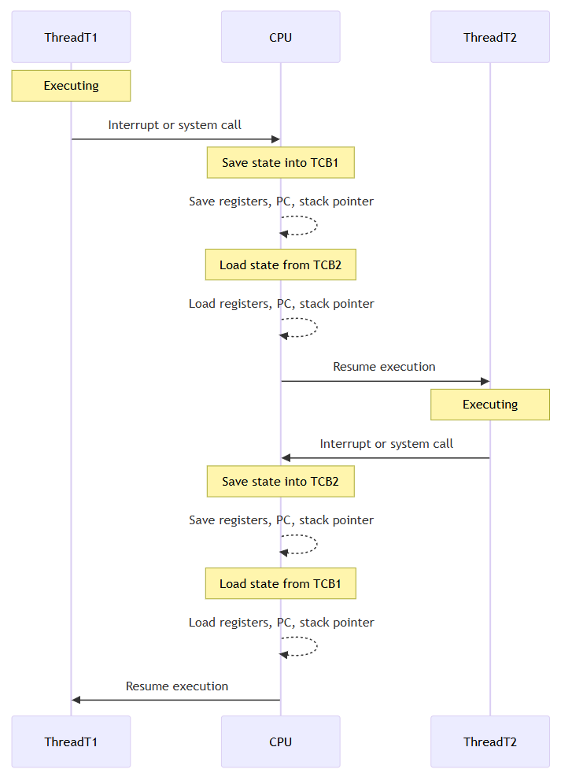
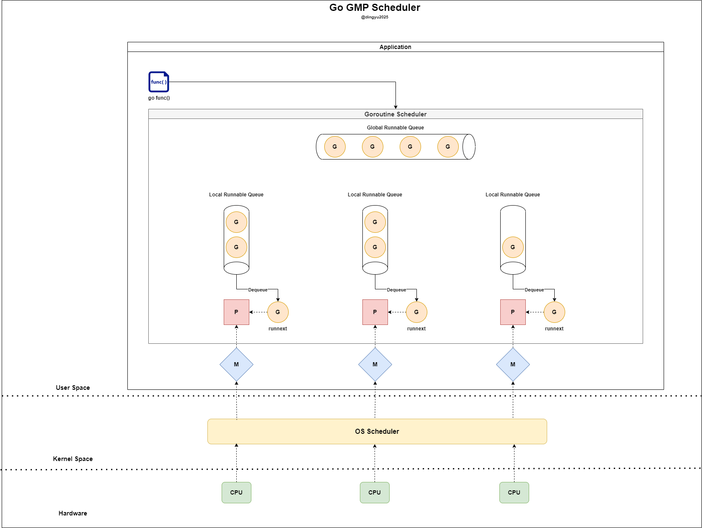
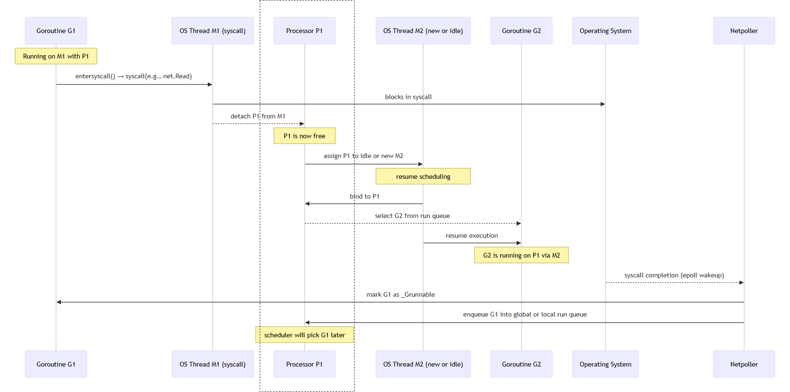

# 고루틴이 무엇인가?
고루틴을 흔히 경량 스레드라고 부른다... 그래서 스레드인데 메모리만 낮은 스레드라는 건가?

## 고루틴의 장점
### 낮은 컨텍스트 스위칭 비용
하드웨어가 발전함에 따라 이를 효율적으로 사용하기 위해 *멀티스레딩과 *멀티태스킹 개념이 등장한다.
> - 멀티스레딩 : 하나의 프로세스 안에서 여러 스레드 실행
> - 멀티태스킹 : 여러 작업을 동시에 실행되는 것처럼 보여줌

정통적인 프로그래밍 언어(C/C++/Java)은 다음과 같이 TCB 전환 과정을 거친다.


Go언어에서는 어떨까?

Go 런타임은 커널 수준의 TCB(Task Control Block)를 직접 스위칭하지 않고, 자체적인 G(고루틴), M(OS Thread), P(Scheduler Context)를 활용한 경량 컨텍스트 스위칭을 수행한다

`GMP`는 아래에 자세히 설명하겠다.

### 생성 및 소멸 비용
`OS Thread`를 생성하고 모두 사용한 뒤에 소멸하는 작업은 높은 비용을 요구한다. 이러한 비용 지불을 매번 하는 것이 부담이 되기에 미리 스레드를 생성하는 스레드 풀이라는 개념이 등장하게 된다.

Go언어에서는 어떨까?

Go 런타임의 GMP 모델 M이 바로 `OS Thread`에 해당된다. P(processor)가 M과 연결되어 고루틴이 수행되는 과정에서 M 또한 새롭게 생성되거나 소멸될 수 있다. 

하지만 이는 go 런타임 스케쥴러에 의해 최적화되기에 일반적인 프로그래밍 언어에 비해 훨씬 저비용으로 관리가 가능해진다 (이에 대해서는 밑에서 자세히...)

### 적은 메모리 소비
스레드로 생성할 경우, 스레드 간 메모리 보호 역할을 하는 공간을 포함하여 `1MB` 정도의 스택을 필요로 한다.

반면에 고루틴은 `2KB`의 스택만 필요하기에 엄청난 경량 효과를 보게 된다 (물론 어떤 코드를 고루틴으로 돌리느냐에 따라, 메모리가 추가적인 할당이 필요함. 이는 다른 언어도 마찬가지)

수치로 비교하자면 다음과 같다
| 언어    | 기본 실행 단위         | 기본 스택 크기 | 총 메모리 소비 추정 |
| ----- | ---------------- | -------- | ----------- |
| C/C++ | pthread          | 8MB      | 약 8MB 이상    |
| Java  | java.lang.Thread | 1MB      | 약 1MB 이상    |
| Go    | goroutine (G)    | 2KB (초기) | 수 KB 수준     |

# GMP
Go런타임은 모든 고루틴을 다중화된 스레드들에 할당하고 모니터링하며, 효율적으로 최적화된 스케쥴링을 진행한다.


구성 요소는 다음과 같다. 자세한 구조체는 [runtime.runtime2.go](https://github.com/golang/go/blob/master/src/runtime/runtime2.go) 참고
| 구성 요소                      | 의미       | 역할         | 주요 정보                                             |
| -------------------------- | -------- | ---------- | ------------------------------------------------- |
| **G (Goroutine)**          | 고루틴      | 실행 단위      | 스택 포인터, 고루틴 상태 등 컨텍스트 정보 보유/LRQ 또는 GRQ에 대기     |
| **M (Machine)**            | OS 스레드   | 고루틴 실행     | 실행 중인 고루틴(G), 연결된 P, 스레드 핸들 정보 보유                 |
| **P (Processor)**          | 논리 프로세서  | 고루틴 스케줄링   | 최대 `GOMAXPROCS` 개 존재/자신의 LRQ로부터 G를 POP하여 M에 할당 |
| **LRQ (Local Run Queue)**  | 지역 실행 큐  | 고루틴 큐 (P별) | 각 P에 하나씩 존재<br>G를 M에 할당/경쟁 조건 줄이기 용이           |
| **GRQ (Global Run Queue)** | 글로벌 실행 큐 | 고루틴 큐 (공용) | 모든 P가 공유/LRQ가 가득 찼거나 실행 시간 초과된 G가 들어감          |


## P (Processor)
- P는 기본값으로 `GOMAXPROCS`=(CPU Core)를 가짐
- P는 하나의 M에 할당되며 각 P는 자신의 `Local Run Queue`를 지님
- P는 G의 context 정보를 갖는다 
- `findRunnable()`을 호출하여 다음 실행 될 G를 결정함

[runtime/proc.go](https://go.dev/src/runtime/proc.go)
```go
func findRunnable() (gp *g, inheritTime, tryWakeP bool) {
    mp := getg().m
    pp := mp.p.ptr()

    // local runq
    if gp, inheritTime := runqget(pp); gp != nil {
        return gp, inheritTime, false
    }

    // global runq
    if sched.runqsize != 0 {
        lock(&sched.lock)
        gp := globrunqget(pp, 0)
        unlock(&sched.lock)
        if gp != nil {
            return gp, false, false
        }
    }

    // Poll network.
    if netpollinited() && netpollAnyWaiters() && sched.lastpoll.Load() != 0 {
        if list, delta := netpoll(0); !list.empty() {
            gp := list.pop()
            injectglist(&list)
            netpollAdjustWaiters(delta)
            casgstatus(gp, _Gwaiting, _Grunnable)
            return gp, false, false
        }
    }

    // Spinning Ms: steal work from other Ps.
    if mp.spinning || 2*sched.nmspinning.Load() < gomaxprocs-sched.npidle.Load() {
        if !mp.spinning {
            mp.becomeSpinning()
        }

        gp, inheritTime, _, _, _ := stealWork(nanotime())
        if gp != nil {
            return gp, inheritTime, false
        }
    }

    // fallback: no G found
    return nil, false, false
}
```

| 순서 | 소스                            | 설명                                | 사용 상황                        |
| -- | ----------------------------- | --------------------------------- | ---------------------------- |
| ①  | **Local Run Queue (LRQ)**     | P마다 존재하는 고유 큐                     | 가장 빠르고 비용이 적음 → **우선 선택 대상** |
| ②  | **Global Run Queue (GRQ)**    | 모든 P가 공유하는 큐                      | LRQ가 비어있을 때 fallback         |
| ③  | **Network Poller (Netpoll)**  | epoll/kqueue/I/O 이벤트로 wake-up된 G들 | 네트워크 I/O 완료 후 G를 되살리는 역할     |
| ④  | **Work Stealing (다른 P의 LRQ)** | 다른 P의 LRQ에서 G를 훔쳐옴                | 자신이 빈 상태이고 GRQ도 비어 있을 때 수행   |

그럼 자연스럽게 이런 생각이 들 것이다.. 

#### I/O 작업을 하는 경우 LRQ와 GRQ가 모두 소비된 후에야 처리될 수 있을까?
우선 아니다. 대표적으로 아래 경우에 netpoll queue에서 GRQ로 inject 된다

sysmon() 시스템 모니터 내부
[runtime/proc.go](https://go.dev/src/runtime/proc.go)
```go
func sysmon() {
    for {
        ...
        if netpollinited() {
            list, _ := netpoll(0) // 비차단
            injectglist(&list)
        }
        ...
    }
}
```

#### Blocking 작업 완료 후, G는 어떻게 다시 P에게 돌아가는가?
하나의 P(processor)에서 `goroutine` 스위칭 과정이다
> - G1은 syscall을 수행하는 고루틴이다 (ex. `HTTPRequest`)


| 단계                              | 설명                                         |
| ------------------------------- | ------------------------------------------ |
| ① `G1`이 syscall 진입              | `net.Read()` 호출                         |
| ② `M1`은 syscall에 block          | `entersyscall()` 호출, `P1` 분리됨              |
| ③ `P1`은 `M2`에게 전달됨              | `M2`가 idle 상태거나 `newm()`으로 새로 생성됨          |
| ④ `M2`는 G2를 선택하고 실행             | P1의 run queue에서 G2를 선택해 실행                 |
| ⑤ OS에서 syscall 완료 감지            | `epoll`, `kqueue`, IOCP 등에 의해              |
| ⑥ `netpoller`가 G1을 runnable로 마킹 | `G1.status = _Grunnable`, run queue에 다시 등록 |
| ⑦ 스케줄러가 적절한 시점에 G1을 재실행         | 이후 `schedule()`에서 G1이 선택되면 재개됨             |


## M (Machine)
- M은 G를 받아 실제 수행을 수행하는 `OS Thread`이다
- maxcount는 기본값으로 10000

앞선 P가 Blocking 작업 고루틴으로 수행하는 경우 M1의 운명은? (syscall 실행 이후의 흐름)

[runtime/proc.go](https://go.dev/src/runtime/proc.go)
```go
func exitsyscall() {
	gp := getg()

	// Validate syscall stack frame
	if sys.GetCallerSP() > gp.syscallsp {
		throw("exitsyscall: syscall frame is no longer valid")
	}

	gp.waitsince = 0
	oldp := gp.m.oldp.ptr()
	gp.m.oldp = 0

	// Fast path: try to reacquire P and resume execution
    // if P is IDLE, return true and resume running goroutine
	if exitsyscallfast(oldp) {
		...
		casgstatus(gp, _Gsyscall, _Grunning) // mark G as running
		return
	}

	// Slow path: failed to reacquire P
    // Call scheduler (park M and let scheduler run G later)
	mcall(exitsyscall0) 
}
```

| 조건              | 처리                                          |
| --------------- | ------------------------------------------- |
| P를 reacquire 가능 | G1 즉시 실행 (`execute(g)`)                     |
| P를 못 얻음         | G1은 runnable로 enqueue, M1은 stop (`stopm()`) |
| M이 많고 idle    | M1은 완전히 종료될 수도 있음                           |
| M이 부족하면서 idle        | M1은 다시 사용될 수도 있음 (`newm()` 피함)              |

## G (Goroutine)
`go dosomething()`을 통해 신규 고루틴을 생성하게 되었습니다.

해당 고루틴은 어떠한 흐름으로 대기 큐에 등록되는 걸까요?


### GRQ Starvation 
- LRQ만 계속 확인하고 GRQ polling이 일어나지 않을 수 있다.
- schedTick 변수가 존재하여, 61번의 polling이 일어날 때마다 LRQ->GRQ 순으로 확인하지 않고 GRQ를 먼저 확인하여 polling한다.
- schedTick 값이 61인 이유는 일단 실험적으로 성능이 좋았던 값의 범위 안에서 prime number를 고른 것이다. prime number를 사용한 이유는 hash map에서 균일 분포를 위해 prime length를 사용하던 것과 마찬가지로 어플리케이션 패턴과의 충돌을 피하기 위함이다.


[runtime/proc.go](https://go.dev/src/runtime/proc.go)
```go
func findRunnable() (gp *g, inheritTime, tryWakeP bool) {
    mp := getg().m
    pp := mp.p.ptr()

    // Check the global runnable queue once in a while to ensure fairness.
	// Otherwise two goroutines can completely occupy the local runqueue
	// by constantly respawning each other.
	if pp.schedtick%61 == 0 && !sched.runq.empty() {
		lock(&sched.lock)
		gp := globrunqget()
		unlock(&sched.lock)
		if gp != nil {
			return gp, false, false
		}
	}

    // local runq
    if gp, inheritTime := runqget(pp); gp != nil {
        return gp, inheritTime, false
    }
    ...
}
```


- [Dmitry Vtukov](https://www.youtube.com/watch?v=-K11rY57K7k)