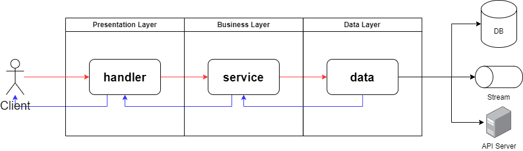

# 배경
---
- 서비스 별로 다른 프로젝트 구조
    - 프로젝트 마다 코드 파악이 힘듦

e.g.
```
SomeAPI
├── .vscode
├── api
├── build
├── config
├── data
├── db
├── externalservice
├── httpsrv
├── httptest
├── mocks
├── log
├── cli
├── repository
├── util
├── .gitignore
├── .gitlab-ci.yml
├── changelog
├── data.go
├── diag_debug.go
├── diag.go
├── go.mod
├── go.sum
├── main.go
├── Makefile
├── release.conf
├── README.md
```

- 공통 컨벤션이 없어 공통 모듈/CI를 사용하기 힘듦
    - 모든 프로젝트에서 사용될 수 있도록 고려할 사항이 많아짐 → 개발 생산성 ↓
- 온보딩 과정이 힘듦
    - 신규 합류된 팀원이 Go언어에도 익숙치 않은 상태에서 너무 제각각인 스타일으로 인해 혼란이 옴
- 팀이 Go 언어 생태계로 전환을 완료했고, 이제는 노하우가 생겼다 생각함
    - 장기적인 운영에서 컨벤션 사용으로 유지보수성 ↑ 
- 신규 프로젝트에서 새로운 프로젝트 구조에 대한 고민을 하는 일, 기존 프로젝트에서 리팩토링의 방향성을 잡기 힘듦
    - 개발 생산성 ↓

# 프로젝트 구조 제안
---
적용이 **Must**인 부분은 * prefix를 가집니다 (그 외, Optional)

> 엔터프라이즈 레벨의 프로젝트가 아닌 MSA를 기준으로 작성됩니다
> 추후 리팩토링을 하더라도 도메인 단위의 MSA로 물리적인 격리가 진행되기 때문...

## 프로젝트 구조 샘플
도메인을 "매치 샘플링"이라 하였을 때
```
.
├── *docs                         // 프로젝트 별 문서들
│   ├── *swagger.yaml             // API 스웨거 문서
│   ├── sequence.md               // 비즈니스 시퀀스 다이어그램
│   └── architecture.md           // 시스템 아키텍처 다이어그램
├── *cmd
│   └── *main.go                  // 프로젝트 진입점, DI 주입
├── pkg                           // 비즈니스 로직에 종속적이지 않은 패키지 (외부에서 import 하여도 상관없는 모듈)
│   ├── file_parser.go
│   └── time_convertor.go
└── *internal                     // 외부에 공개되면 안되는 비즈니스 로직 영역 (도메인 영역)
    ├── *handler
    │   ├── *v1
    │   │   └── sampling_handler.go         // 도메인 핸들러 v1
    │   ├── v2
    │   │   └── sampling_handler.go         // 도메인 핸들러 v2
    │   ├── server.go                       // handler가 많을 경우, handler를 등록할 server를 둡니다
    │   ├── health_handler.go               // v1, v2 공통 핸들러
    │   ├── swagger_handler.go              // 프로젝트 테스트 용 openapi 핸들러 (CORS 허용)
    │   └── auth_middleware.go              // 미들웨어들
    ├── data
    │   ├── mysqldb.go                      // DB client 커넥터
    │   ├── redis.go                        // DB client 커넥터
    │   ├── feature_event_producer.go       // Kafka event producer - xxx_producer
    │   ├── match_repository.go             // ORM 수행 repository (DB client 주입) - xxx_repository
    │   └── nass_api.go                     // 외부 API Data Layer - xxx_api
    ├── *service
    │   ├── kda_sampler.go                  // Data layer 혹은 다른 service를 주입 받아 구현
    │   ├── match_sampling_usecase.go       // service 가 많을 경우, 오케스트레이션 해주는 유즈케이스 구현
    │   └── kda_sampler_test.go             // 비즈니스 로직의 유닛테스트
    ├── logger.go                           // 애플리케이션 전역에서 사용될 기능
    ├── constants.go                        // 외부에서 참조 되어야 하는 상수 값 정의
    └── *config.go                          // application 설정 파일
├── *gitlab-ci.yml
├── *go.mod
├── *go.sum
└── *README.md                    // 프로젝트에 대한 배경, 유즈케이스, 설치 방법 기술
```



| 구분                               | 필수 여부 | 설명                                                                                                                                                                                | 예시                                                                                 |
| -------------------------------- | ----- | --------------------------------------------------------------------------------------------------------------------------------------------------------------------------------- | ---------------------------------------------------------------------------------- |
| **docs**                         | ✔     | 프로젝트 아키텍처, 시퀀스 다이어그램, 스웨거 문서를 관리                                                                                                                                                  | - swagger.yaml<br>- sequence.md                                                    |
| **cmd**                          | ✔     | 프로젝트 진입점, 실행 가능한 파일 및 스크립트 관리                                                                                                                                                     | - main.go<br>- start.sh                                                            |
| **pkg**                          |       | 애플리케이션에 종속적이지 않은 유틸리티 기능 관리                                                                                                                                                       | - time_convertor.go<br>- file_parser.go                                            |
| **internal**                     | ✔     | 외부에 공개되면 안되는 비즈니스 로직(도메인) 영역<br><br>애플리케이션 전역에서 사용될 기능 담당                                                                                                                         | - config.go<br>- logger.go<br>- constants.go                                       |
| **internal/**<br><br>**handler** | ✔     | API라면 API Handler일 것이고 Consumer라면 Consumer Handler 담당<br><br>- 버저닝은 *필수, HTTP/gRPC/MQ/Kafka 와의 통신을 담당<br>- 미들웨어는 Optional<br>- handler가 여러개일 경우, server 에서 handler를 등록할 수 있도록 합니다 | - blacklist_handler.go<br>- alive_handler.go<br>- log_middleware.go<br>- server.go |
| **internal/**<br><br>**data**    |       | 3 Tier Architecture 중, Data Layer 영역<br><br>영속성을 가진 데이터 CRUD 담당<br><br>(외부 API 또한 해당됨, Kafka 또한 stream에 저장하는 행위로 간주)                                                              | - event_producer.go<br>- blacklist_repository.go<br>- member_api.go                |
| **internal/**<br><br>**service** | ✔     | 비즈니스 로직을 수행하는 비즈니스 영역<br><br>- 각각의 서비스는 단일 책임 원칙에 따라 하나의 책임만 수행<br>- 서비스가 다수일 경우, 이를 오케스트레이션 해주는 xxx_usecase로 구현<br>- 서비스 코드의 단위 테스트는 필수 (일부 의존성에 따른 테스트 불가 시 패스)                 | - fraud_detect_usecase.go<br>- fraud_retriever.go<br>- rule_analyzer.go            |
| **./ (root)**                    | ✔     | 프로젝트 실행 및 운영을 위한 파일 영역<br><br>- 리드미는 필수로 작성 (유즈케이스와 설치 방법은 항상 기술)                                                                                                                 | - gitlab-ci.yml<br>- README.md                                                     |


## 상수 컨벤션
기본적으로 카멜케이스와 파스칼케이스를 원칙으로 사용합니다

→ 하나의 도메인 파일에서 도메인과 관련된 상수가 다른 패키지에 속해 있는 경우, 수정에도 어렵고 추적에도 귀찮음이 동반 됨을 느꼈습니다

→ 하나의 책임을 지는 파일 내에서 private 상수로서 관리 된다면 유지보수에도 용이할 것이고 코드 파악에도 용이할 것이라 생각합니다

### 복수 패키지에서 다수 의존될 여지가 있는 경우 (Pascal)
internal layer의 constants.go 파일에 상수 값들을 정의 합니다
```go
package internal

const (
	LanguageCodeKorean   = "ko"
	LanguageCodeEnglish  = "en"
	LanguageCodeChinese  = "zh_CN"
	LanguageCodeJapanese = "ja"
)
```

### 하나의 패키지 내 혹은 하나의 파일에서 사용할 경우 (Camel)
동일 패키지 내에서는 private 변수에 참조할 수 있습니다
```go
package handler

const (
	// resultSuccess : 성공 응답
	resultSuccess = "true"
	// resultFailure : 실패 응답
	resultFailure = "false"
)
```

### 불가피하게 다른 패키지로부터 참조되어야 하는 경우
상수는 private으로, struct의 Public 함수로 참조 될 수 있게 합니다
```go
package handler

const (
	// samplerEndpoint : 매치 샘플링 엔드포인드
	samplerEndpoint = "/v1/:match_id"
)

// Endpoint : 핸들러의 엔드포인트를 반환
func (h *SamplerHandler) Endpoint() string {
	return samplerEndpoint
}
```

## 데이터 모델 컨벤션
데이터 모델은 가급적 별도 파일이 아닌, 수행되는 파일에서 정의하여 사용합니다

→ model을 별도로 지정해 둘 경우, 특정 도메인에 대한 수정이 있을 때 참조된 여러 파일을 수정해야 하는 불편함이 존재합니다

→ 같은 계층 간의 데이터 이동에 대해서는 파라미터로 주고 받고 다른 레이어 간 통신은 *레이어 간 데이터 모델 컨벤션에 따라 데이터 모델을 주고 받습니다

→ parameter가 두 개 이상일 경우, 데이터 모델로 만들어 관리합니다

### 레이어 간 데이터 모델 컨벤션
**handler → service**

request → serviceDTO
```go
func (h *Handler) CreateMatch(c *gin.Context) {
    var req matchRequest
    if err := c.ShouldBindJSON(&req); err != nil {
        c.JSON(http.StatusBadRequest, gin.H{"error": err.Error()})
        return
    }
    // Service 호출
    err := h.service.Create(req.ToServiceDTO())
    // so on
}
```

**service → data**

serviceDTO → entity
```go
func (b *MatchCreater) Create(match MatchDTO) (int, error) {
    ...
    // repository 계층에 MatchEntity 삽입 요청
    id, err := b.repository.Insert(match.ToEntity())
    if err != nil {
        return 0, err
    }
    return id, nil
}
```

**data → service**

entity → serviceDTO
```go
func (r *MatchRepository) Insert(entity MatchEntity) (int, error) {
    // 데이터 레이어에서 UserEntity 가져오기
    result, err := s.db.Create(&entity)
	...
    return result.ID, nil
}
```

### 데이터 모델에서의 조건 검사
모델을 주고 받는 경우, 가독성을 위해 조건 검사는 함수로 실시 합니다

단위 테스트에 용이 하며, 한눈에 비즈니스 로직을 파악하기 쉬워 집니다

[AS-IS]
```go
func (b *MatchCreater) Create(match MatchDTO) (int, error) {
	if strings.HasPrefix(match.Version, "rc") && match.detail == "test" {
		return
	}
	// 비즈니스 로직
}
```

[TO-BE]
```go
func (b *MatchCreater) Create(match MatchDTO) (int, error) {
	if match.IsTest() {
		return
	}
	// 비즈니스 로직
}
```

## 테스트 컨벤션
비즈니스 로직의 테스트는 선택사항이 아닌 필수입니다.
이미 정의된 에러에 대한 테스트케이스는 최대한 상세하고 간결하게 작성합니다.

### Deterministic 비동기 단위 테스트
비동기로 처리하고 결과 값을 확인하지 않거나 `time sleep` 이후의 로깅을 멈추세요

`DI + Eventually`를 통한 **flaky test를 방지**합니다

1. 로거 주입
```go
// NewQueue 비즈니스 로직을 수행할 Queue 생성자
func NewQueue(
	config Config,
	httpClient *http.Client,
	logger *zerolog.Logger,
) (queue Queue, err error) {
	// queue는 Start()를 통해 thread executor가 실행될때에 생성됩니다.
	queue = Queue{
		config:   config,
		client:   httpClient,
		logger:   logger,
		quitChan: make(chan struct{}),
	}
	return
}
```

2. 응답 값 테스트
- 큐 로직 실패 테스트
```go
t.Run("큐 처리 실패시, 실패 로깅 테스트", func(t *testing.T) {
	// given
    var buffer bytes.Buffer
	... 로거 의존성 주입   

    // when
	... 비동기 작업 수행
    event1, err := queue.Push([]byte(validJSON1))
 	assert.NoError(t, err) 
    event2, err := queue.Push([]byte(validJSON2)) 
  	assert.NoError(t, err) 

	// then
	assert.Eventually(t, func() bool {
		output := buffer.String()
		return strings.Contains(output, event1.TraceID().String()) &&
			strings.Contains(output, event2.TraceID().String()) &&
			strings.Contains(output, `"success":false`)
	}, 1*time.Second, 10*time.Millisecond) 
})
```

- 큐 로직 성공 테스트
```go
t.Run("큐 처리 성공시, 성공 로깅 테스트", func(t *testing.T) {
	// given
    var buffer bytes.Buffer
	... 로거 의존성 주입

	// when
	... 비동기 작업 수행
    event1, err := queue.Push([]byte(validJSON1))
 	assert.NoError(t, err) 
    event2, err := queue.Push([]byte(validJSON2)) 
  	assert.NoError(t, err) 

	// then
	assert.Eventually(t, func() bool {
		output := buffer.String()
		return strings.Contains(output, event1.TraceID().String()) &&
			strings.Contains(output, event2.TraceID().String()) &&
			strings.Contains(output, `"success":true`)
	}, 1*time.Second, 10*time.Millisecond)
})
```