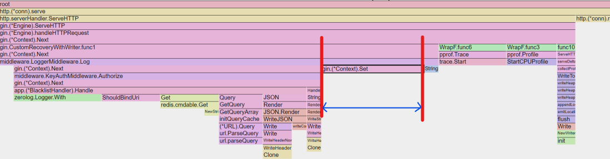
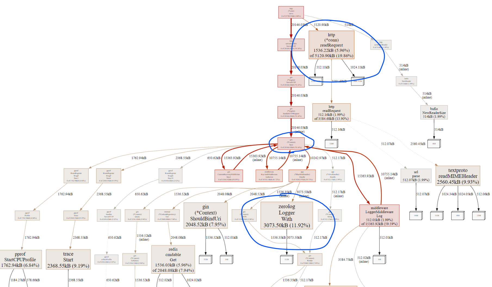
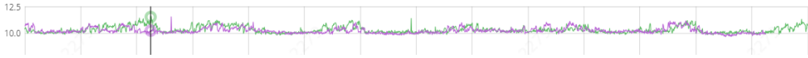

## Applying pprof
```go
import "github.com/gin-contrib/pprof"
// initialize server
var (
	router *gin.Engine
)
{
	router = gin.New()
	// register pprof routes
	pprof.Register(router, APIPrefix+"/debug/pprof")
}
```

## Script
```bash
echo "User API v1.2.3"
# start profiling
curl https://{endpoint}/debug/pprof/trace?seconds=10 --output v1.2.3-trace.out &
curl https://{endpoint}/debug/pprof/heap?seconds=10 --output v1.2.3-heap.prof &
curl https://{endpoint}/debug/pprof/profile?seconds=10 --output v1.2.3-cpu.prof &

# Run load test while profiling
bombardier -t 1s -l -c 30 -d 10s \
  -H "Content-Type: application/json" \
  -m GET https://{endpoint}/v1/users/51387659

wait

# view pprof output locally
go tool trace -http 127.0.0.1:9094 v1.2.3-trace.out &
go tool pprof -http 127.0.0.1:9095 v1.2.3-heap.prof &
go tool pprof -http 127.0.0.1:9096 v1.2.3-cpu.prof &
```

Note: Bash `&` runs commands asynchronously.

### pprof Usage Steps
1. Start the application with pprof routes registered.
2. If the app isn’t under load, run a load test on a target API.
3. Use curl to trigger profiling.

> If you’re behind a Load Balancer, ensure profiling completes within the LB timeout.

## Heap Profiling Metrics
- `inuse_objects`: number of currently used objects
- `inuse_space`: amount of memory currently in use
- `alloc_objects`: total number of objects ever allocated
- `alloc_space`: total memory ever allocated

### Notes on Inuse vs Alloc
- **Same Inuse/Alloc** (e.g. 1GB/1GB): object was allocated once and reused — no GC triggered, CPU efficient.
- **Alloc much larger than Inuse** (e.g. 1TB/1GB): indicates high churn and frequent GC — may cause **Stop-The-World (STW)** pauses.



## Tuning Opportunities
### Flame Graph
Flame Graphs help distinguish between user-defined logic and framework/internal code like `ServeHTTP`.

- The wider the bar, the more allocations are made.
- Contrary to expectations, Redis accounted for only 7.9% of allocations.


- Setting context values consumed 13.9% of heap allocations.


Each context `Set` allocates a new map if the key doesn't exist. Since no capacity is preallocated, this results in additional memory usage.

> If the overhead for grouping logs by request ID is too high, consider removing it.

### Allocation Graph


- Larger rectangles = higher memory usage.
- Prioritize tuning large allocations with high % usage.

#### Zerolog Overhead


Despite using a shared `Logger` instance, allocations still occurred due to the use of `With().Str().Logger()` on every request.

```go
var logEntry zerolog.Logger = h.logger.With().
    Str("trace_id", ctx.GetString(RequestIDContextKey)).Logger()
```

> Although cleaner for readability, this approach allocates new memory on each invocation.

**Solution**: Accept the readability tradeoff or switch logging frameworks.
> However, other loggers may allocate even more due to interface marshalling.
> Always benchmark alternatives.

## GC Tuning
Goal: minimize **STW (Stop-The-World)** latency caused by excessive GC.

### Using GOMEMLIMIT
- `GOGC` uses **heap growth rate** to trigger GC.
- Default GOGC = 100 → GC triggers when heap doubles.

### Tuning Based on Program Behavior
- **Low GOGC** → GC runs too often, especially early on when heap is small.
- **High GOGC** → Risk of OOM. E.g., with 40GB heap and GOGC=50, GC only runs after heap reaches 60GB.

**GOMEMLIMIT** caps memory usage before GC triggers. Set it **below peak usage** to reduce GC frequency.

> GOMEMLIMIT is a soft limit — Go may allocate slightly more than configured.



**Suggested Workflow**:
1. Start with default GOGC.
2. Measure memory usage.
3. Set GOMEMLIMIT to ~80% of peak.
4. Monitor GC behavior.

### Benchmarking Production Code
Use `go test -benchmem` to evaluate memory allocations.
```bash
go test -bench=. -benchmem
```

Example benchmark of `StructuredLogger`:
```bash
BenchmarkStructuredZeroLoggerMessage-12                                   596910              1724 ns/op            1000 B/op         30 allocs/op
BenchmarkStructuredZeroLoggerMessageWithFields-12                         285715              3926 ns/op            1633 B/op         60 allocs/op
BenchmarkStructuredZeroLoggerMessageWithFieldsWithContext-12              222223              5346 ns/op            3418 B/op         68 allocs/op
BenchmarkStandardZeroLoggerMessage-12                                   11927823                90.17 ns/op            0 B/op          0 allocs/op
BenchmarkStandardZeroLoggerMessageWithDeterminedFields-12                5649648               217.6 ns/op             0 B/op          0 allocs/op
BenchmarkStandardZeroLoggerWithFields-12                                  300001              3894 ns/op            1553 B/op         59 allocs/op
```

Even with ZeroLogger, repeated use of `WithFields` leads to significant allocations.

## Use Case Driven Pointer Usage
While pointers are efficient due to passing references instead of values, Go may allocate them on the heap, unlike value types which may reside on the stack.

### When to Use Pointers
- **Large structs**: avoid copying
- **Mutability**: need to modify original value
- **Consistency**: stick to pointer receivers for uniformity
- **Nullable fields**: to distinguish between zero value and nil

Ref: https://articles.wesionary.team/use-case-of-pointers-in-go-w-practical-example-heap-stack-pointer-receiver-60b8950473da

## Preallocate Slice Capacity
Without preallocating, `append()` causes reallocation on each operation.

Go can optimize stack allocation for small-sized slices:
- `MaxStackVarSize`: up to 10MB for explicitly declared vars
- `MaxImplicitStackVarSize`: up to 64KB for implicit vars
- `MaxSmallArraySize`: arrays <= 256 bytes are stack-allocated

Ref: https://go.dev/src/cmd/compile/internal/ir/cfg.go

