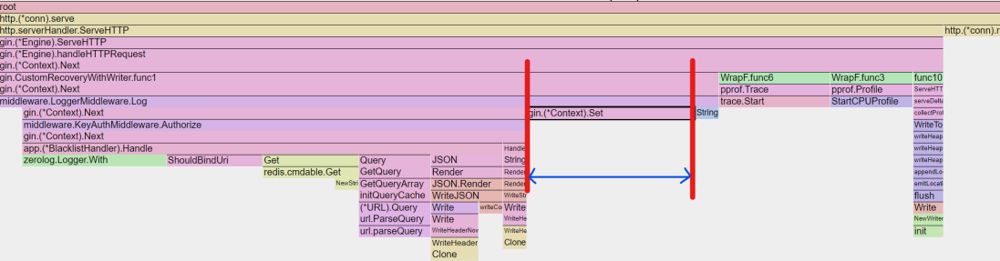
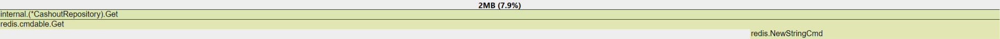
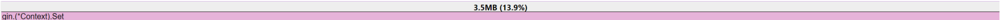
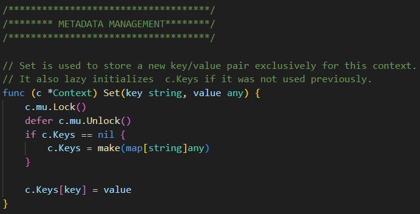
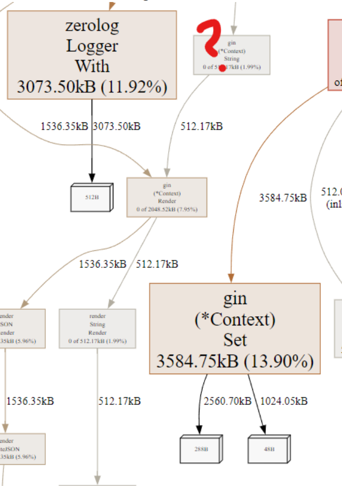
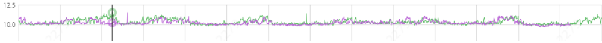

## pprof 적용
---
```go
import "github.com/gin-contrib/pprof"
// init server
var (
	router *gin.Engine
)
{
	router = gin.New()
	// pprof 라우터 등록
	pprof.Register(router, APIPrefix+"/debug/pprof")
}
```
## Script
---
```bash
echo "User API v1.2.3"
# 프로파일링
curl https://{endpoint}/debug/pprof/trace\?seconds\=10 --output v1.2.3-trace.out &
curl https://{endpoint}/debug/pprof/heap\?seconds\=10 --output v1.2.3-heap.prof &
curl https://{endpoint}/debug/pprof/profile\?seconds\=10 --output v1.2.3-cpu.prof &
 
# 부하를 준 상태에서 GET 요청 수행
bombardier -t 1s -l -c 30 -d 10s\
    -H "Content-Type: application/json" \
    -m GET https://{endpoint}/v1/users/51387659
  
wait

# go tool 활성화 -> port에서 각 프로파일 실행
go tool trace -http 127.0.0.1:9094 v1.2.3-trace.out &
go tool pprof -http 127.0.0.1:9095 v1.2.3-heap.prof &
go tool pprof -http 127.0.0.1:9096 v1.2.3-cpu.prof &
```

bash의 &는 비동기로 다른 작업이 수행됨
PPROF의 기본 프로파일링 방법
1. pprof 라우터가 등록된 애플리케이션을 실행시킨다
2. 기존 부하가 없는 경우라면.. 테스트하고자 하는 API Endpoint의 부하테스트 진행
3. curl 요청을 통해 필요한 프로파일링을 시작

※ LB의 Timeout이 있는 경우, 해당 Timeout보다 작게 산정하여야 프로파일 데이터를 받을 수 있습니다

# HEAP 프로파일링
---
- `inuse_objects`: 현재 사용 중인 객체의 수
- `inuse_space`: 현재 사용 중인 메모리 양
- `alloc_objects`: 프로그램이 시작된 후 할당된 총 객체 수
- `alloc_space`: 프로그램이 시작된 후 할당된 총 메모리 양

## Inuse Alloc 지표 확인 시 주의사항
---
e.g. Inuse와 Alloc의 할당된 메모리가 같은 케이스
Inuse가 1GB / Alloc이 1GB인 객체는, 처음 한번 할당된 이후 계속 사용 되고 있다는 뜻 → GC 개입 없음을 의미 → CPU 효율적

e.g. Inuse보다 Alloc이 많이 할당된 케이스
Inuse가 1GB / Alloc이 1TB인 객체는, Heap 메모리를 객체에 1024번 할당했다는 뜻 → GC 가 1024번 발생됨 → GC로 인한 CPU 사용 → GC가 동작하는 동안 프로그램이 동작을 멈추는 **Stop the World** 현상



## 튜닝 포인트 찾기
---
### Flame Graph
---
최적화가 가능한 영역 (e.g. 개발자가 작성한 코드)와 최적화가 불가능한 영역 (e.g. 프레임워크 내부적으로 처리되는 로직 `ServeHTTP`)를 구분하여 최적화가 가능한 영역을 확인한다
가로축의 길이가 길어지는 비중만큼, 해당 함수가 프로그램 동작 과정에서 GC개입이 필요한 객체들을 많이 생성하고 있는 것을 알 수 있음

주요 병목 지점이라 생각했던 Redis는 7.9%인 방면


Context에 Value를 Set하는 함수(13.9%)가 보다 많은 Heap이 할당됨을 알 수 있음



Set은 Context에 지정된 Key가 없는 경우, 새롭게 `make(map[string]any)`로 할당함. capacity를 지정하지 않기 때문에.. map에 대한 메모리 할당이 진행됨

> 하나의 Request 단위로 로그를 그룹화 하기 위한 키이자만 이에 드는 오버헤드가 크다면 사용하지 않는 방안도 있음

### Graph
---


그래프에서는 네모의 크기가 곧 할당된 메모리의 크기입니다.
주요 팁은 크기가 큰 네모를 찾고 할당 비율(%)가 높은 것을 우선순위로 확인하는 방법입니다.
단적인 예로 어째서 zerolog가 메모리를 이렇게 차지하게 되었는지 살펴봅니다




zerolog는 main에서 할당된 `Logger`  객체를 사용하기에 Allocation은 당연히 Zero라고 생각했습니다. (zerolog의 모토 자체가 zero alloc이기에...)

코드리뷰 과정에서 중복된 필드의 `With` 작성으로 가독성이 저해된다는 피드백을 받고.. 이를 해결하기 위해 `Context Logger`를 생성하여 사용하도록 수정한 히스토리가 있었습니다.
아래는 문제의 Func입니다
```go
// Handle : CheckerHandler의 핸들러
func (h *BlacklistHandler) Handle(ctx *gin.Context) {
	// validation check
	var (
		requestParams BlockCashoutGetRequestParams
		snValue       string
	)
	{
		...
	}
	var (
		logEntry zerolog.Logger = h.logger.With().
			Str("trace_id", ctx.GetString(RequestIDContextKey)).Logger()  // func 실행때 마다 New됨
	)
	// fetch blacklist & validate
	{
		...
		if err != nil {
			// redis nil인 경우에만 false로 처리
			if errors.Is(err, redis.Nil) {
				ctx.JSON(http.StatusOK, NewNotBlacklistResponse())
				logEntry.Info().Msg("not found in blacklist")
				return
			}
			ctx.JSON(
				http.StatusInternalServerError,
				NewInternalServerErrorResponse(ctx.GetString(RequestIDContextKey)),
			)
			return
		}
		...
		if err != nil {
			// 시간 포맷이 틀린 경우 에러 로깅
			logEntry.Error().
				Err(err).
				Msg("failed to parse blacklist expire time")
			ctx.JSON(http.StatusOK, NewBlacklistResponse())
			return
		}
		...
		// response
		ctx.JSON(http.StatusOK, NewBlacklistResponse())
	}
	return
}
```

주입받은 `Zerologger`는 Inuse == Alloc이 같아 GC로 인한 부하가 없지만서도... 내부적으로 `NewLogger()`를 수행하는 것과 동일한 효과로 인해, 매번 메모리가 할당되고 있었던 것이죠

이러한 문제를 최적화하기 위해서는 가독성에 대한 TradeOff를 감수하거나 다른 로거를 사용하는 것도 방법이 될 수 있습니다. 
> 다른 Logger의 `With`는 `Interface`를 인자로 받기때문에 메모리 Alloc이 더 심해질수도 있습니다
> 
> 이에 대한 벤치마킹을 충분히 진행하여야 할것임

## GC 튜닝
---
가장 핵심은 과도한 GC 실행으로 인해 애플리케이션이 동작을 멈추는 `Stop The World` 현상을 개선하는 것이겠죠
아래는 이에 대한 여러가지 튜닝 방안입니다

### GOMEMLIMIT 사용하기
---
GOGC는 현시점의 Heap 크기와 직전 시점의 Heap 크기에 대한 증가율을 바탕으로 GC를 수행할지를 결정합니다. 
GC가 동작하는 Default 비율 값은 100으로, 기존 대비 Heap이 100% 증가, 즉 2배가 되면 GC를 수행합니다. 
이 값을 낮추면 GC가 더 자주 수행되고, 이 값을 높일수록 GC가 덜 수행되게 됩니다.

### Golang 프로그램에 따른 수행 기준 값 선정하기
---
**GC 값이 작은 경우** 

GC가 너무 빈번하게 수행될 수 있습니다. 특히 프로그램이 재시작되어 아직 메모리 소비량이 작은 경우, 약간의 Heap 메모리 할당에도 허겁지겁 GC가 수행됩니다. 
예시로 1GB의 Heap 메모리 크기가 2GB가 되어도 100% 증가이지만, 기준 값이 10MB인 경우, 겨우 20MB가 되어도 이 역시 100% 증가이기 때문입니다.

**GC 값이 큰 경우**
OutOfMemory(이하 OOM) 발생 가능성이 커집니다. 기존 Heap 사용량이 40GB이고 GOGC가 50이라면, 1.5배 상승한 60GB가 되어야 GC가 수행되기 때문입니다.

GOMEMLIMIT은 프로그램이 사용할 수 있는 **메모리 사용량 한계선**을 정하는 설정입니다. 이 방식에서는 설정한 GOMEMLIMIT의 값만큼 메모리 사용량이 올라가는 경우에만 GC가 수행됩니다.

따라서 프로그램이 사용할 수 있는 최대 메모리 한계선을 미리 산정한 후, 그 값보다 **작은 값**을 GOMEMLIMIT으로 설정하면 손쉽게 GC를 튜닝할 수 있습니다. 
한계선보다 작은 값을 설정하는 이유는 **GOMEMLIMIT은 SoftLimit**으로 프로그램이 설정된 GOMEMLIMIT 보다 조금 더 많은 메모리를 사용할 수 있기 때문입니다. 
이로써 GC가 항상 최대한 늦게 동작할 수 있는 환경이 갖추어지며, GC Cycle이 최대로 길어지게 되어 STW가 최소화됩니다.



바람직한? 프로세스
- 기본 GOGC를 적용한 뒤, 메모리 수치 확인
- PEAK 기준의 80%정도로 산정 (경험적인 수치)
- 프로파일링 / 모니터링하여 GC Cycle 확인
### Production 코드의 벤치마크 해보기
---
가장 쉬운 방법은 작업한 코드의 벤치마크를 통해 확인해보는 방법입니다
bench의 `-benchmem` 을 통해 메모리 Alloc을 확인하고 Production 환경에서의 영향도를 확인해봅니다
```bash
go test -bench=. -benchmem
```

ex. `StructuredLogger` 벤치마크 중
`StructuredLogger`는 팀에서 규격화되지 않은 필드들이 Elasticsearch에 적재되므로서 동일한 데이터 필드임에도 불구하고 데이터 사일로가 발생되는 것을 막기 위해 
별도로 개발한 코드입니다. 

[주요 목적]
- 로거의 변경이 필요하더라도 로거의 타입만을 바꾸어도 코드 수정이 불필요하도록 Wrapper구현
- 일관되지 않은 필드로 인하여 애플리케이션 내부에서 동일 필드임에도 불구하고, type 및 필드 명의 불일치가 잦음

[관련 벤치마크 테스트]
```bash
go test -bench=. -benchmem
BenchmarkStructuredZeroLoggerMessage-12                                   596910              1724 ns/op            1000 B/op         30 allocs/op
BenchmarkStructuredZeroLoggerMessageWithFields-12                         285715              3926 ns/op            1633 B/op         60 allocs/op
BenchmarkStructuredZeroLoggerMessageWithFieldsWithContext-12              222223              5346 ns/op            3418 B/op         68 allocs/op
BenchmarkStandardZeroLoggerMessage-12                                   11927823                90.17 ns/op            0 B/op          0 allocs/op
BenchmarkStandardZeroLoggerMessageWithDeterminedFields-12                5649648               217.6 ns/op             0 B/op          0 allocs/op
BenchmarkStandardZeroLoggerWithFields-12                                  300001              3894 ns/op            1553 B/op         59 allocs/op
```

동일한 ZeroLogger를 사용하더라도 `WithFields`로 마샬링하는 과정에서 반복된 Memory Allocation이 발생합니다


### 유즈케이스를 살피고 포인터 변수를 사용하자
---
일반적으로 생각하는 상식 상, value를 넘기기 보다 pointer 메모리 주소만 넘기기 때문에 CPU에 효율적이라고 생각합니다.
하지만 Golang에서는 CallByPointer보다 CallByValue가 효율적인 경우가 자주 발생합니다!
> **포인터로 선언되는 순간, 해당 오브젝트는 무조건 Heap 영역에 할당되기 때문**

REF : https://articles.wesionary.team/use-case-of-pointers-in-go-w-practical-example-heap-stack-pointer-receiver-60b8950473da

#### 그렇다면 언제 Pointer를 사용해야 하는가?
- **큰 구조체의 경우**: 큰 구조체는 복사 비용이 크므로, 포인터로 전달하여 메모리 사용을 줄이는 것이 더 효율적입니다.
- **변경 가능성**: 포인터로 전달하면 원본 데이터를 변경할 수 있습니다. 즉, 메서드에서 구조체의 값을 수정하고 싶다면 포인터를 사용해야 합니다.
- **일관성 유지**: API에서 일관성을 유지하기 위해 포인터를 사용하는 것이 좋습니다. 한 메서드에서 포인터를 사용한다면 다른 메서드도 일관성을 위해 포인터를 사용하는 것이 바람직합니다.
- **null 값을 다룰 때**: 예를 들어, `int`와 같은 필드가 실제로 값이 없음을 나타내야 할 때는 포인터를 사용하여 "진정한 부재"를 나타낼 수 있습니다. 기본 값이 0인 경우와 구분하기 위함입니다.

### Capacity를 상수로 지정하여 Slice 생성하기
---
Capacity가 지정되지 않은 Slice를 Dynamic Slice라고 칭해보겠습니다.
Dynamic Slice의 경우, 값을 Append 할 때마다, 새로운 메모리를 할당받고 새로운 데이터를 적재 후, 기존 객체는 버리는 realloc이 발생합니다

Golang에서는 Data Type을 고려해서 크기가 64KB이하인 객체의 경우 Stack 메모리에 선언하는 기능이 있기 때문에...
Capacity를 지정한 Slice 또는 Map을 Stack 메모리에 저장하여 성능을 개선시킬 수 있죠!

[고 컴파일](https://go.dev/src/cmd/compile/internal/ir/cfg.go)
- **MaxStackVarSize**: 명시적으로 선언된 변수(`var x T` 또는 `x := ...`)의 경우 최대 10MB까지 Stack에 할당될 수 있으며, 그 이상의 크기는 Heap에 할당됩니다.
- **MaxImplicitStackVarSize**: 암묵적으로 생성된 변수 (`new(T)`, `&T{}`, `make([]T, n)` 등)의 경우 최대 64KB까지 Stack에 할당됩니다. 이보다 큰 경우는 Heap에 할당됩니다.
- **MaxSmallArraySize**: 256바이트 이하의 작은 배열은 직접 Stack에 할당 및 초기화되며, 그 이상의 배열은 Heap에 할당된 후 복사됩니다.

