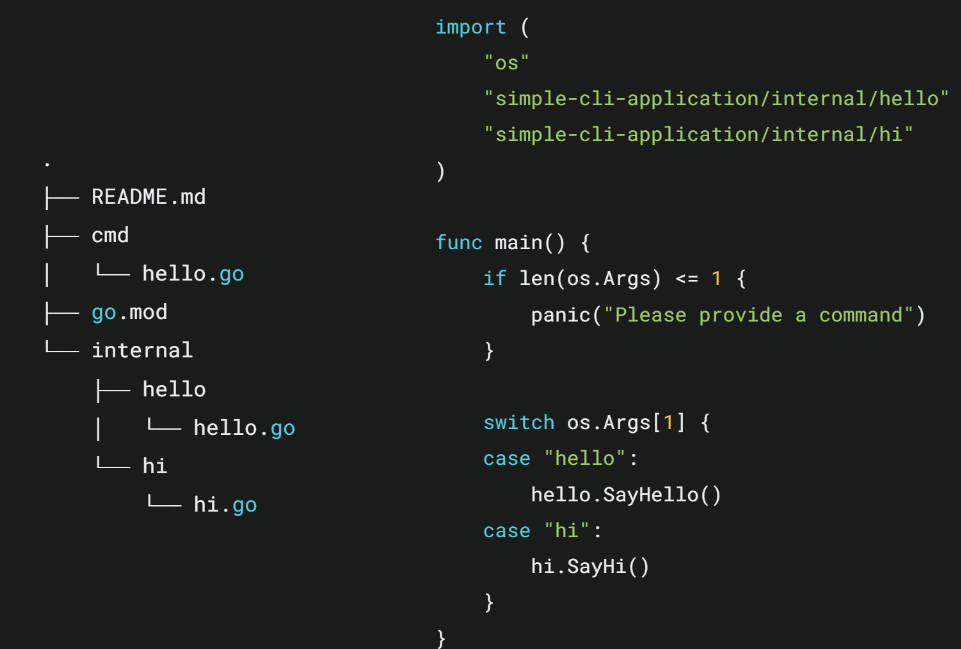
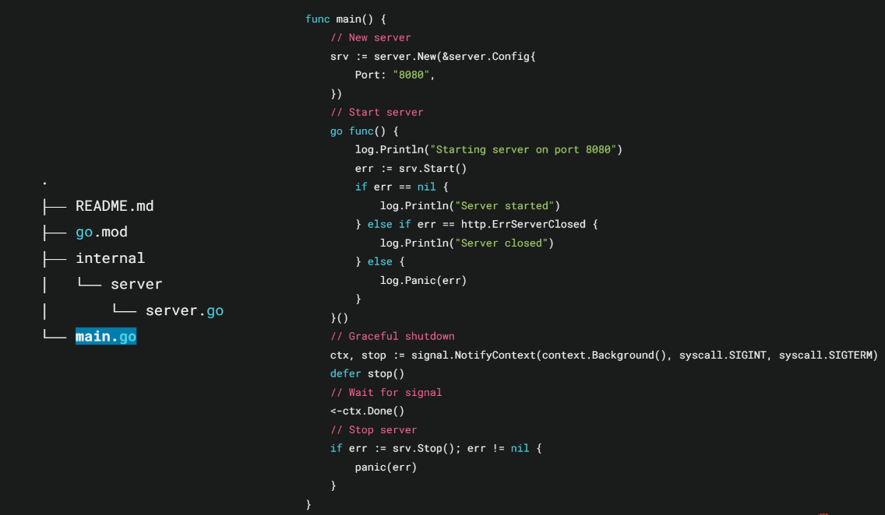
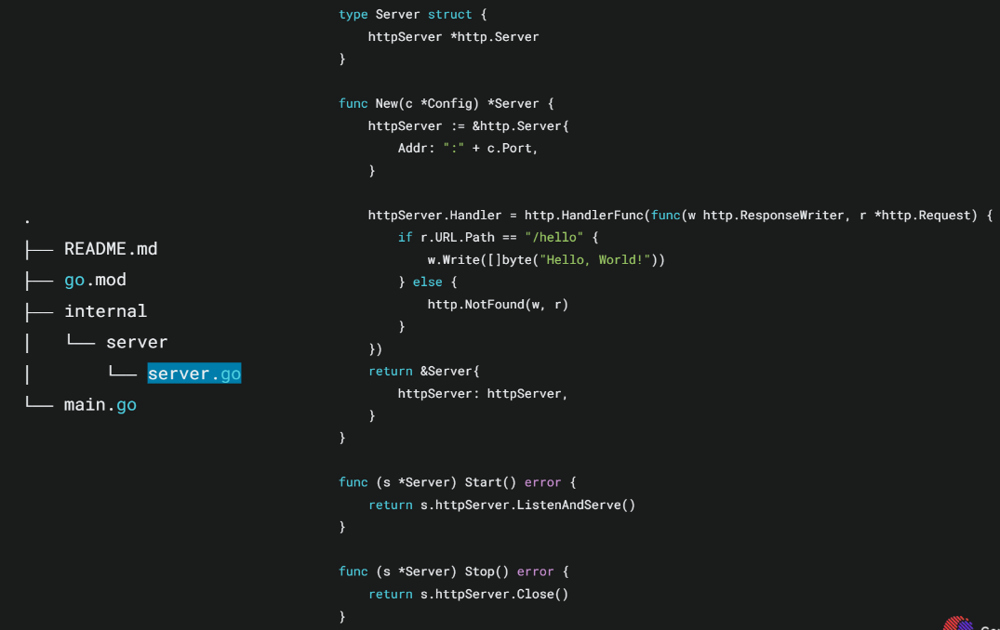
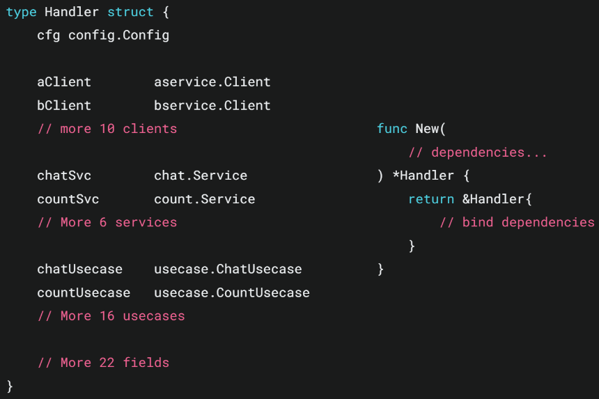
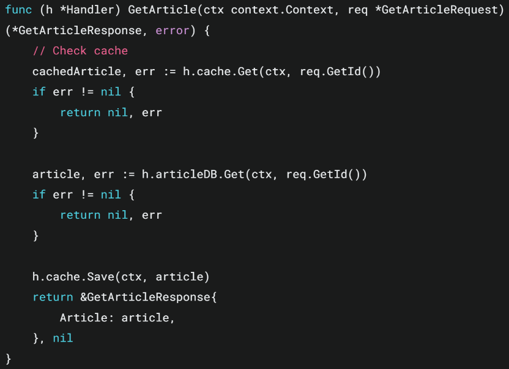
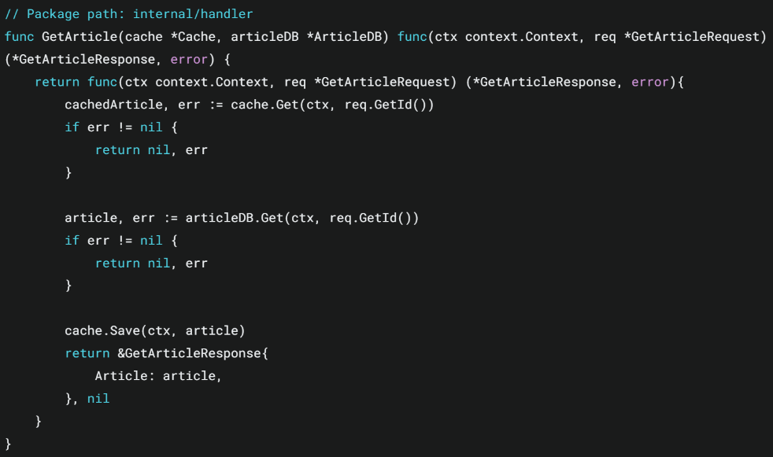
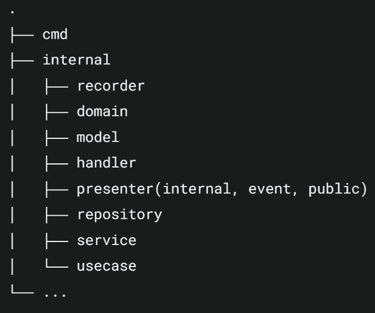
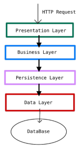
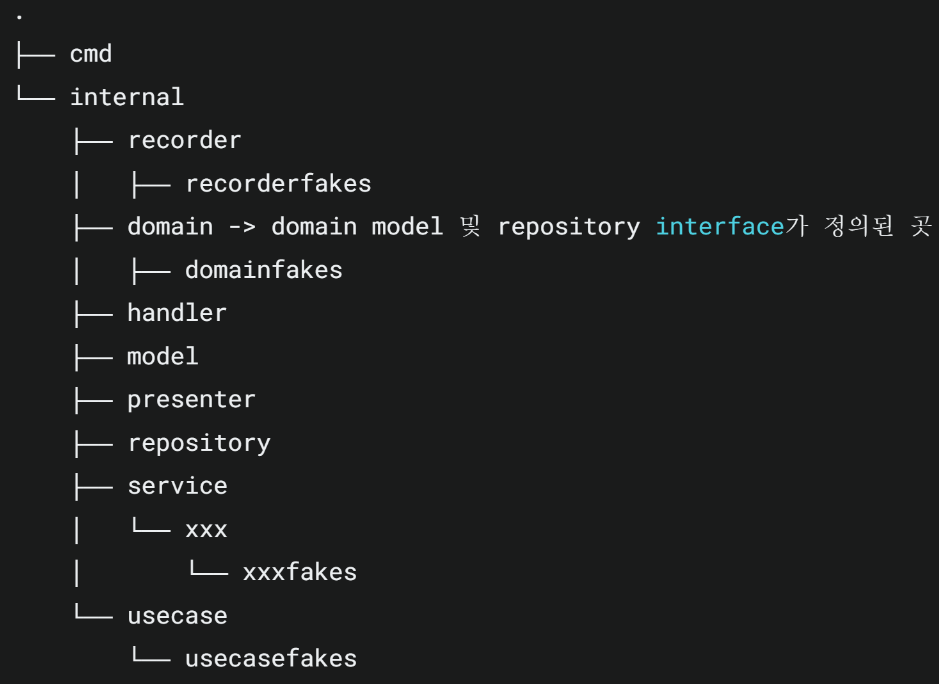

## [Go] Gophercon 2024 - Go Project Guide A-Z

### Small Projects
- Low traffic → Limited user base
- Simple functionality → Undefined user states in new services
- Need for rapid development → Early feature experimentation required for hypothesis validation

---

## For a Simple CLI Tool

---

## For a Simple API Server
Take a minimalistic approach using standard libraries to build and expand APIs incrementally.

---

## Feature-Oriented Project Patterns

### Using Handler Struct (Class-based DI)

Pass required parameters for each method via function inputs:

### Injecting Dependencies via HTTP HandlerFunc

Use closures internally to capture dependencies.
This design is clean, allows for scoped dependency injection, and is highly testable.

| Type       | Advantages                                                                                      | When to Use                                               |
|------------|--------------------------------------------------------------------------------------------------|-----------------------------------------------------------|
| Handler    | - Easier management of complex state - Clearly structured dependencies - Easy to extend - Good for interface implementation - Helps organize complex logic | Complex business logic, many dependencies, stateful apps |
| HandlerFunc| - Quick to write - Simple DI with closures - Functional composition - Ideal for prototyping - Easy mocking for testing        | Simple handlers, small apps, microservices               |

---

## Code Pattern for Enterprise-Scale Services

Apply a Layered Architecture:

### Layer Breakdown
- **Presenter** = Converts between Domain Model and API Model
- **Handler** = Serves API Models
  - Handles HTTP/gRPC requests and responses
  - Clearly separates presentation from application logic
- **Usecase** = Executes business logic
  - Depends on Services or Repositories
  - Avoids using API or DB-specific models, focusing on domain logic
- **(Service)** = Implements complex business logic
  - Extracted when Usecases become complex or involve multiple dependencies
  - Usecases orchestrate; Services execute logic (similar to `xxxExecutor` pattern)
- **Repository** = Manages CRUD for domain models
  - Encapsulates data access logic
  - Inverts dependency: Repositories return domain models and depend on domain layer
- **(Recorder)** = Manages DB-specific models
  - Used for handling NoSQL/RDBMS-specific logic
  - Enables DB migrations by swapping out recorder DI

---

## Test Code per Layer
Use the mocking library **counterfeiter**.

| Feature        | Go Mockery                         | Counterfeiter                                 |
|----------------|-------------------------------------|------------------------------------------------|
| Mock Creation  | Easy auto-generation with args      | Fake objects allow for advanced simulation     |
| Setup Ease     | Simple and intuitive                | Ideal for complex test scenarios               |
| Test Maintainability | Best for simple interfaces        | Long-term test stability with fake objects     |
| Best Use Case  | Isolated module testing             | Complex logic and varied response scenarios    |

Fake mocks are usually stored within the same layer they belong to.

---

## Closing Thoughts
- While Go's ecosystem has experimented with many structural approaches, no clear standard has emerged. This pattern seems highly practical.
- Concern: Does a layered architecture cause unnecessary data structure conversions? (e.g., Presentation, Business, Data layers could each use separate structs for a single API)
- Service vs. Usecase? Seems to hinge on whether multiple services are involved.
- On APM: What about cost? → APM isn't applied globally. It is only used for business-critical logic.