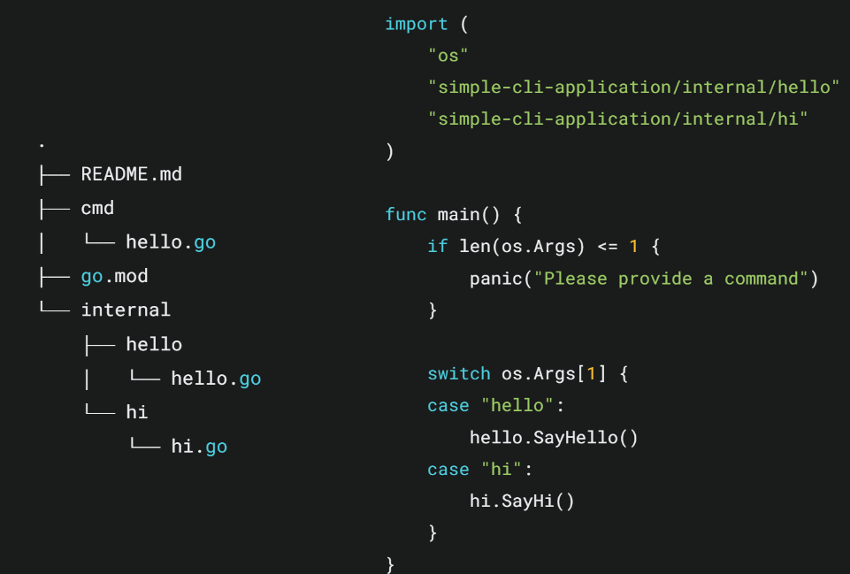
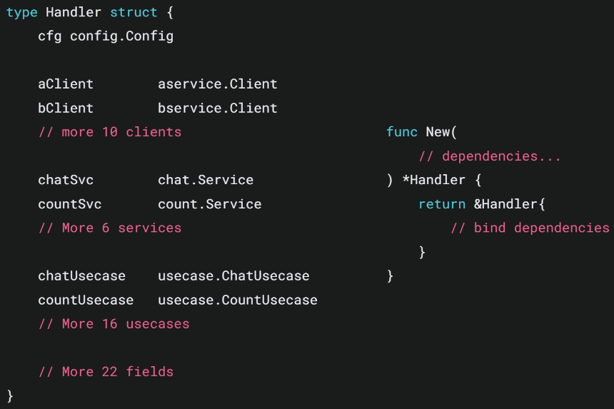
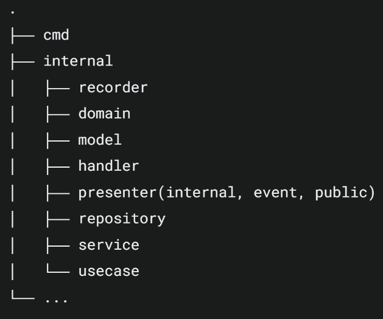
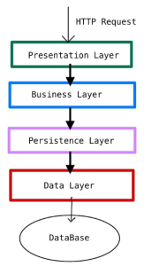
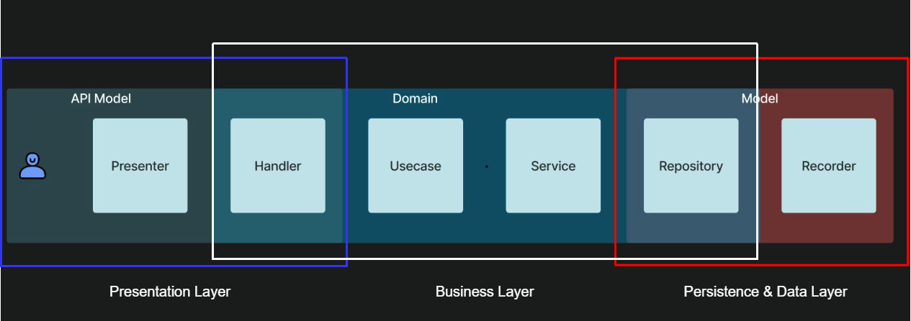

- 작은 프로젝트
    - 트래픽이 적다 → 사용자 풀이 확보되지 않음
    - 기능이 단순하다 → 신규 서비스로 초기 유저 상태가 정의되지 않음
    - 빠른 개발이 필요하다 → 신규 기능이지만 실험적으로 소수의 유저를 통해 가설 검증이 필요한 상태

## 간단한 CLI 인 경우

## 간단한 API 서버를 만드는 경우
단순하게 접근, 기본 라이브러리를 활용하여 API를 연동하여 작게 붙여나가는 방식

## 기능 단위의 프로젝트 코드 패턴
#### Handler Struct (Class)을 활용한 DI 방식

Method 단위로 필요한 파라미터의 경우 → func input 파라미터 활용

  

#### HTTP Handlerfunc에 DI를 주입하는 방식

내부에서 클로저를 사용하여 service DI를 참조할 수 있음

간결하고 클로저 내부에 필요한 의존성만 포함할 수 있어서 테스트에 용이한 구조

  

|   |   |   |
|---|---|---|
|항목|장점|선택 기준|
|Handler|- 복잡한 상태를 관리하기 쉬움 - 의존성과 상태가 구조체 필드로 명시되어 명확함 - 확장성 측면에서 관련 메서드를 쉽게 추가할 수 있음 - 다른 인터페이스를 쉽게 구현할 수 있음 - 복잡한 로직을 구조화할 수 있음|복잡한 비즈니스 로직, 많은 의존성, 상태 관리가 필요한 경우|
|HandlerFunc|- 간단한 핸들러를 빠르게 작성 가능 - 의존성 주입이 쉽고 클로저를 활용할 수 있음 - 함수형 프로그래밍 가능, 함수 조합과 고차 함수 활용 용이 - 빠른 프로토타이핑 - 의존성 모킹이 쉬워 테스트 코드 작성이 용이|간단한 핸들러, 빠른 개발이 필요한 작은 App 혹은 마이크로서비스|

  

##  엔터프라이즈 서비스를 위한 코드 패턴

Layered Architecture 적용

- Presenter = Domain Model ↔  API Model 
- Handler = API Model 서빙
    - HTTP/gRPC 요청 처리와 응답 생성에만 집중
    - 프레젠테이션 계층(Handler)과 애플리케이션 계층(Usecase)이 명확히 구분됨
- Usecase = 비즈니스 로직 수행
    - Service 또는 Repository를 의존성으로 받아 느슨한 결합 유지 → 말만 다르지 서비스인듯?
    - 순수한 도메인 객체를 사용 → API Model 이나 Repository 모델을 사용하지 않음
- (Service) = 비즈니스 로직 수행
    - Usecase의 복잡성이 증가하면 구분 → 여러 서비스에 의존적인 도메인 서비스가 있는 경우 서비스들을 분리
    - Usecase는 흐름 제어와 조정에 집중, Service는 구체적인 비즈니스 로직 구현에 집중 → xxxExecutor 패턴과 동일
- Repository = Domain Model의 CRUD 담당
    - 데이터 접근 로직만을 담당
    - 상위 계층(Usecase 등)이 구체적인 저장 방식을 알 필요가 없음
    - 도메인 모델을 반환, Repository가 도메인 계층에 의존하게 되어 의존성 역전 원칙을 따름
- (Recorder) = DB Model 핸들링
    - 주로 DB의 형태가 다양한 경우 (NoSQL, RDBMS... etc) 각 DB에 의존적인 로직을 구현
    - 다른 DB 마이그레이션 시, recorder DI를 갈아끼우는 방식 채택

  

## 각 레이어에서의 테스트 코드

Mocking 라이브러리 counterfeiter를 사용

|특징|go mockery|counterfeiter|
|---|---|---|
|목 생성|자동 목 생성이 간편하며 매개변수 설정이 용이|페이크 객체를 포함하여 좀 더 복잡한 시뮬레이션 가능|
|설정 용이성|단순하고 직관적인 설정 가능|복잡한 테스트 시나리오에 적합|
|테스트 유지보수|간단한 인터페이스에 적합|페이크 객체로 장기적인 테스트 유지보수 용이|
|적합한 상황|단순하고 독립적인 모듈 테스트|복잡한 구조와 다양한 응답이 필요한 테스트|

모킹된 fakes 들은 fake가 속한 레이어에 포함 하더랍니다

## 후기
- Go 생태계에서 구조적으로 다양한 시도들이 있었지만 이렇다 할 만한 구조는 찾지 못하였는데 충분히 참고할 여지가 있는 구조인 것 같다
- 레이어드 아키텍처를 구현하기 위해 불필요한 데이터 type 변환이 발생하지 않을까? (ex. Presentation, Business, Data 각각 하나씩이라 해도 API 하나에 데이터 struct 3개를 사용해야함)
- service와 usecase를 나누는 기준은 service가 두개 이상이냐?에 따라 갈리는 듯
- APM을 도입한다 했었는데 비용적인 측면은? → 모든 곳에서 APM을 적용하진 않는다, 비즈니스 크리티컬한 로직에 APM을 삽입하고 있다