## 쿠버네티스 API

- 쿠버네티스 플랫폼과 상호작용할 수 있는 인터페이스
- 사용자, 관리자, 애플리케이션이 클러스터 및 리소스를 관리하는 목적으로 사용가능
- 리소스 목록을 얻거나 생성하는 일련의 작업 수행 가능
- 애플리케이션 배포 및 상태 모니터링 기능 제공
- HTTP API 형태로 제공되어 다양한 언어 및 도구 지원

>`https://<APISERVER>/<GROUP>/<VERSION>/<RESOURCE>/<NAME>`
- API SERVER : API 서버 주소
- GROUP : 리소스 그룹
    - /api : 쿠버네티스 코어 API 그룹
        - 기본적이고 필수적인 리소스 : Pod, Service 등
    - /apis/* : 쿠버네티스 확장 API 그룹
        - 애플리케이션 배포 및 확장 기능에 관계된 리소스
- VERSION : v1 (안정 버전), v1beta, v1alpha1
- RESOURCE : 접근하려는 리소스 종류 (/pods, /services)
    - <NAMESPACE><RESOURCE>
        - NAMESPACE : 리소스가 속한 네임스페이스 이름
        - 네임스페이스 범위 리소스를 네임스페이스 조건을 빼고 조회하면 모든 네임스페이스 검색
- NAME : 접근하려는 리소스 이름 지정

  

## client-go 라이브러리

- 쿠버네티스 API 호출을 추상화해 사용하기 편하게 제공
- 쿠버네티스 코어 그룹과 확장 그룹 모두 접근 가능
    - 기본 리소스 외 사용자 정의 리소스 접근 및 사용 가능
- 클러스터 내부/외부에서 초기화 기능 지원
- 리소스 변경 사항을 캐싱하는 Informers등 다양한 기능 지원
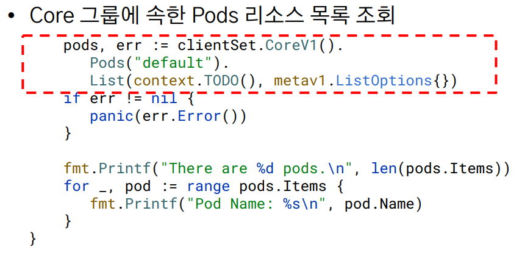

- Pods("")로 조회할 경우, 모든 네임스페이스 조회 가능 (단, 접근 권한을 가진 네임스페이스 한정)
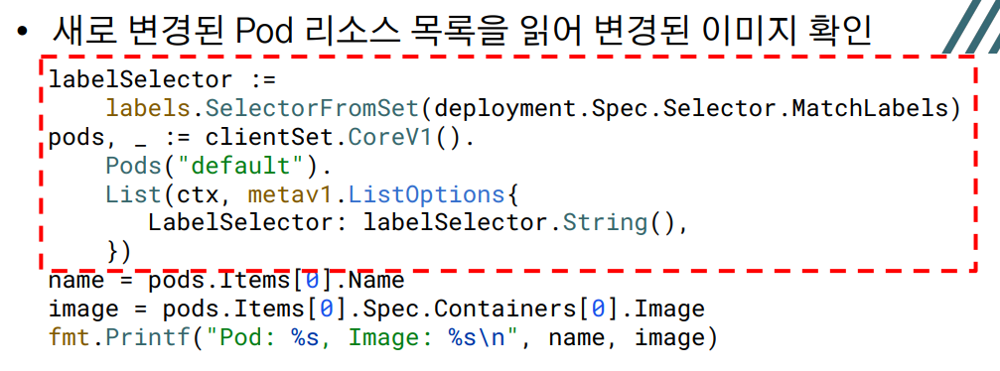
  

### Deployment 리소스를 동시에 변경하는 경우

- 가장 먼저 도착한 변경 사항은 적용되고 나머지는 실패 → First Updater Wins!
    - MVCC와 유사하다고 생각됨. version 충돌을 검사하여 충돌 방지 (lost update 발생되지 않음)

  

### 서로 다른 서버에서 동시에 이미지 변경 시도
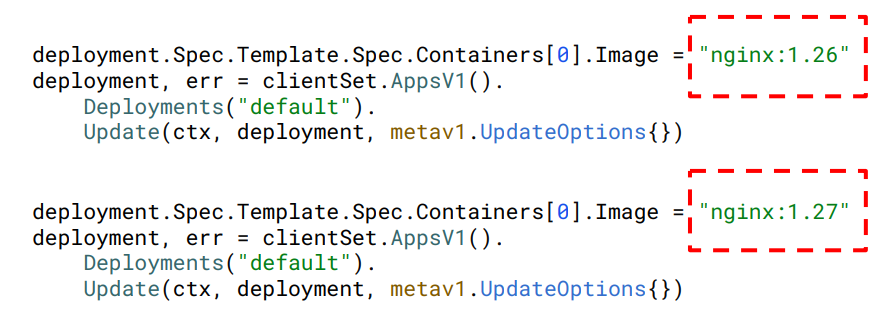

→ 한 요청이 성공하면 다른 요청은 Conflict 에러와 함께 실패

  

### 낙관적 동시성

| Step 1                                                                                                                                                                                                                                               | Step 2                                                                                                                                                                                                                                                | Step 3                                                                                                                                                                                                                                         |
| ---------------------------------------------------------------------------------------------------------------------------------------------------------------------------------------------------------------------------------------------------- | ----------------------------------------------------------------------------------------------------------------------------------------------------------------------------------------------------------------------------------------------------- | ---------------------------------------------------------------------------------------------------------------------------------------------------------------------------------------------------------------------------------------------- |
| 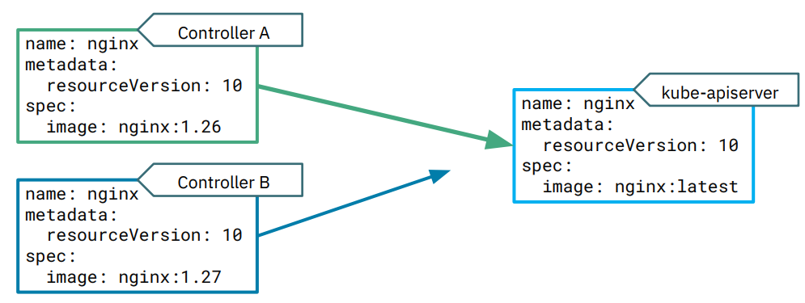변경 요청을 전송하면 리소스 버전을 이용해 충돌 감지 | 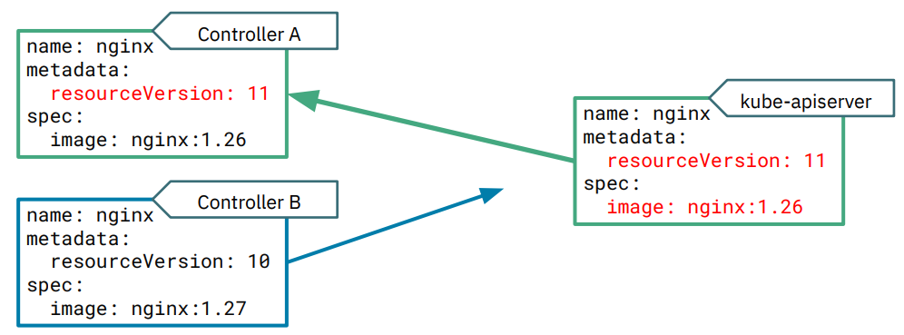저장된 리소스 버전과 동일한 버전을 가진 변경 사항을 적용 | 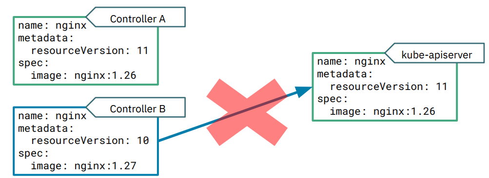리소스 버전이 다른 수정 사항은 충돌 실패 |

MVCC와 유사하게 버전 충돌로 인한 에러의 경우 Retry 설정을 통해 해결

`retry.RetryOnConflict()` 함수를 이용해 간단하게 사용 가능!

  

## 쿠버네티스 컨트롤러와 오퍼레이터

**컨트롤러**

- 쿠버네티스 기본 리소스를 주로 관리하는 목적
- Pod, Deployment, Service 등의 리소스 관리

**오퍼레이터**

- 사용자 정의 리소스를 통해 복잡한 상태 관리 가능
- 애플리케이션 배포 및 관리 자동화를 위해 사용

  

## kubebuilder 프레임워크

- 쿠버네티스 컨트롤러 혹은 오퍼레이터를 개발하기 위한 Go 프레임워크
- 사용자 리소스 관리 스크립트 및 컨트롤러 기본 코드 제공
- 오퍼레이터를 통해 관리하려는 대상에 집중 가능
- client-go 라이브러리를 이용해도 됨 → 하지만 매우 복잡한 작업이 필요

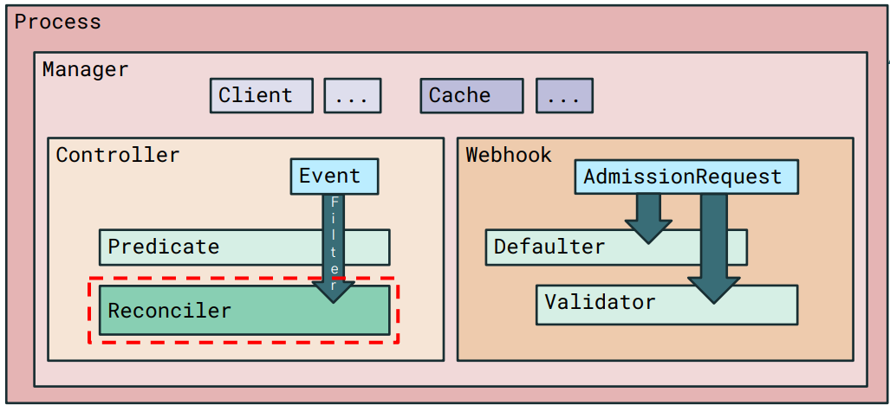
- Process : 애플리케이션 설정 및 초기화
- Manager : API 서버와 통신, 이벤트 캐시, 메트릭 노출, ...
- Webhook : 리소스 초기화, 데이터 검증을 진행할 웹 훅 설정
- Controller : 리소스 이벤트를 필터링해 Reconciler 호출
- Reconciler : 사용자 리소스를 관리하는 실질적인 로직 구현

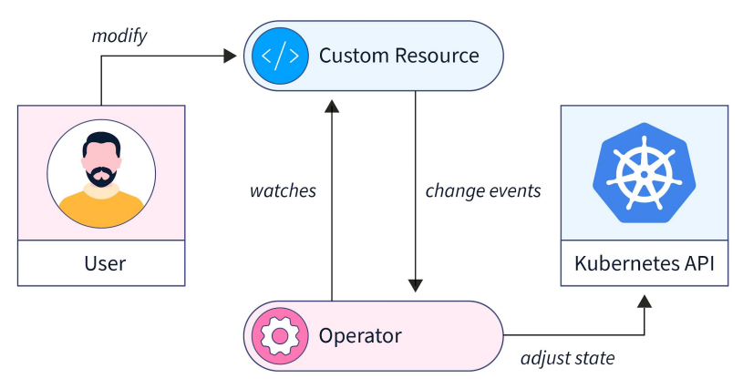

- SPEC : 리소스 특징 및 원하는 상태 지정
- Status : 리소스 현재 상태 표현

  

## 컨트롤러 옵션 설정

- 리소스가 변경될 때 호출되는 Reconcile() 함수 관련 설정
- 변경 감지 리소스, 필터, 성능 옵션 등 다양한 설정 변경 가능
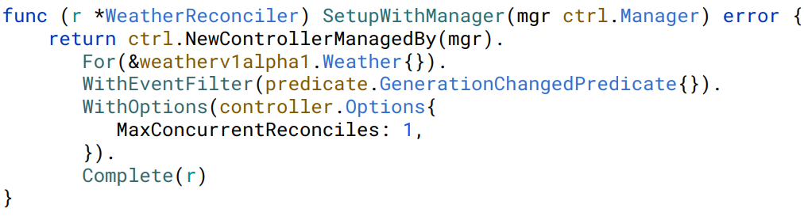

- Spec 속성이 변경될 때만 Reconcile() 함수가 호출되도록 Generation 필드를 사용하는 이벤트 필터 설정
- Reconcile() 함수가 동시에 몇 개까지 실행될 수 있는지 컨트롤러 옵션을 이용해 설정

  

#### Reconcile() 함수가 호출되는 상황

- 처음 오퍼레이터가 실행되는 경우
    - 모든 리소스를 순회하면서 Reconcile() 함수 호출
- 리소스가 변경되는 경우
    - 일반적으로 리소스 필드가 변경되면 호출
    - Spec 속성이 변경될 때만 호출되도록 설정 가능
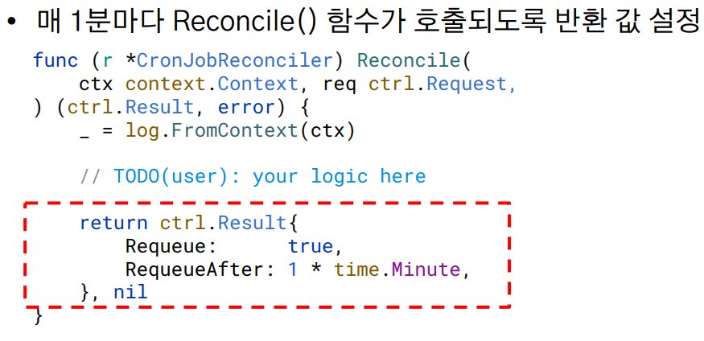
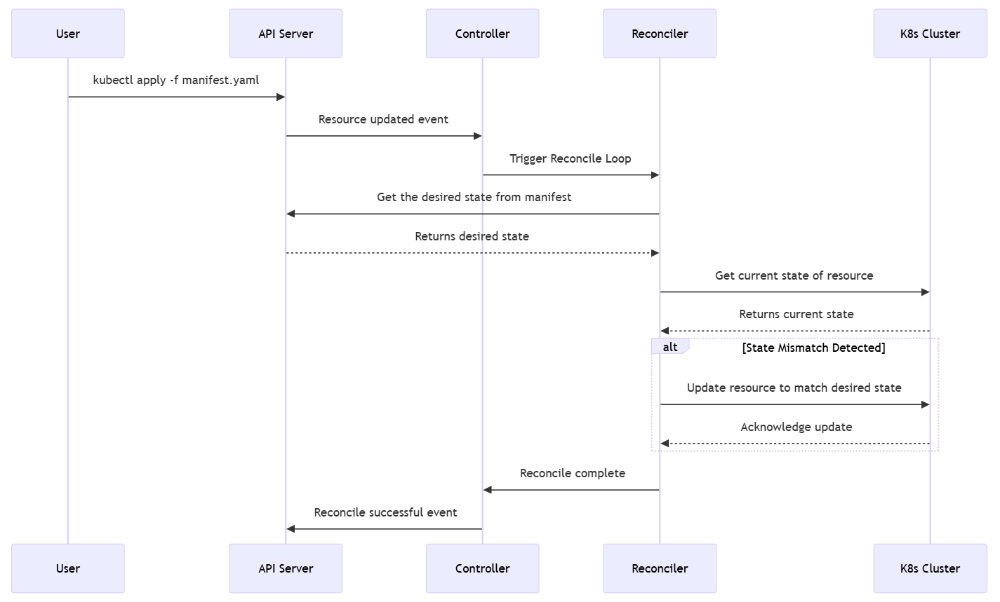

## 후기
- 일반적인 케이스에서 CPU 와 메모리를 통한 오토스케일링이 기본적으로 설정되어 있다. 하지만 애플리케이션의 특성에 따라 이를 커스텀하게 변경하는 것도 고려해보면 좋을 것 같다.
    - 예를 들어 큐에서 하나의 일을 순차적으로 처리하는 서버일 경우, Queue Size Limit을 검사하여 오토스케일링이 가능할 듯 하다
- 동시로 배포를 요구하는 상황은 없겠지만 Conflict로 인한 실패를 커스텀 컨트롤러에서는 방지할 수 있을 것이다.
- 런덱을 매번 생성해달라 할 필요 없이, daemon set으로 오퍼레이터를 띄워, 자동화를 거칠 수 있지 않을까? (위험 부담이 있긴 할 것같다)