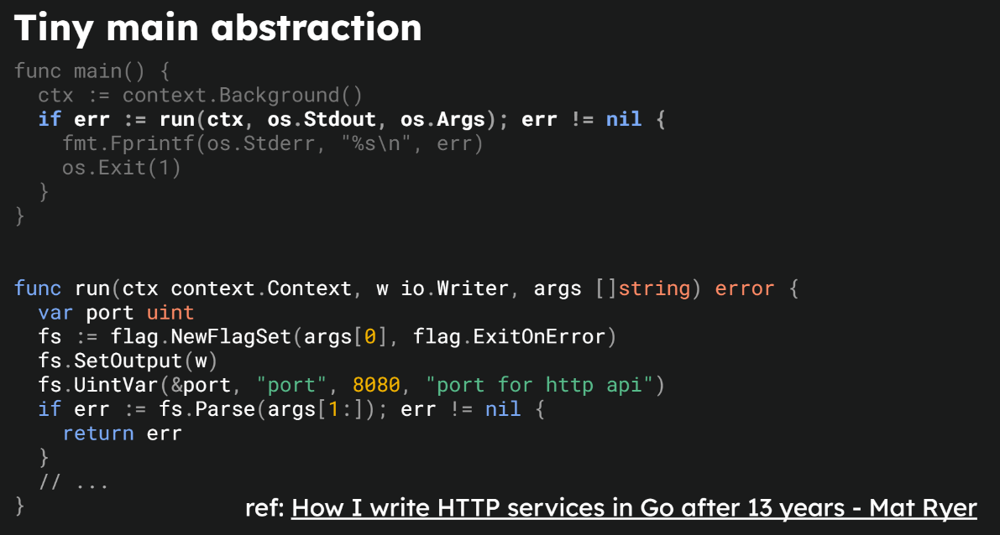
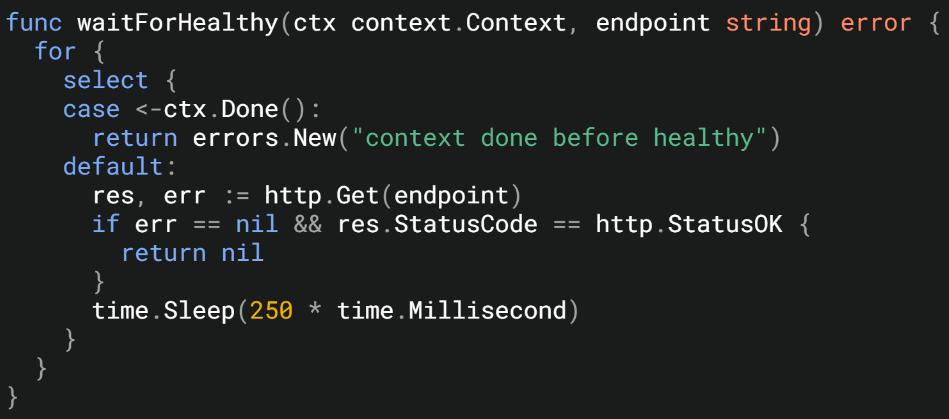
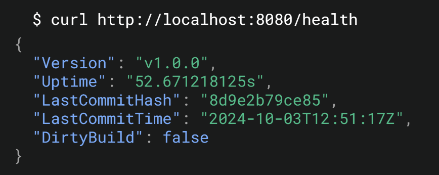
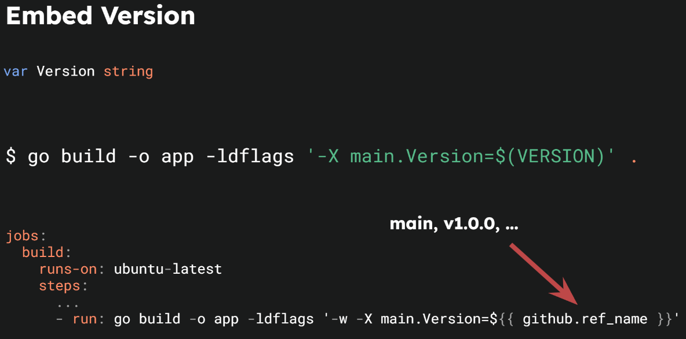
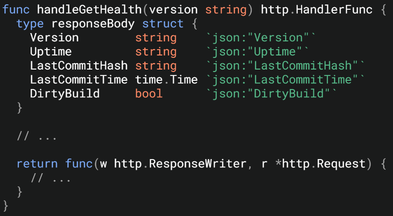
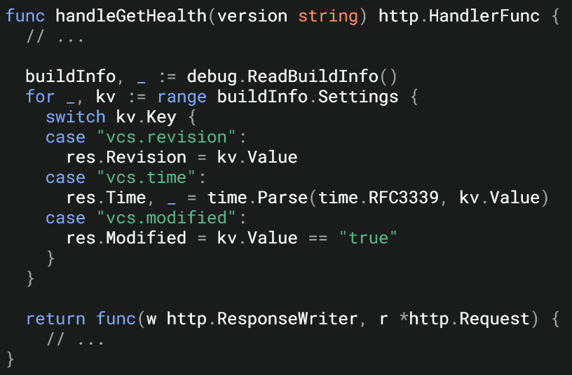
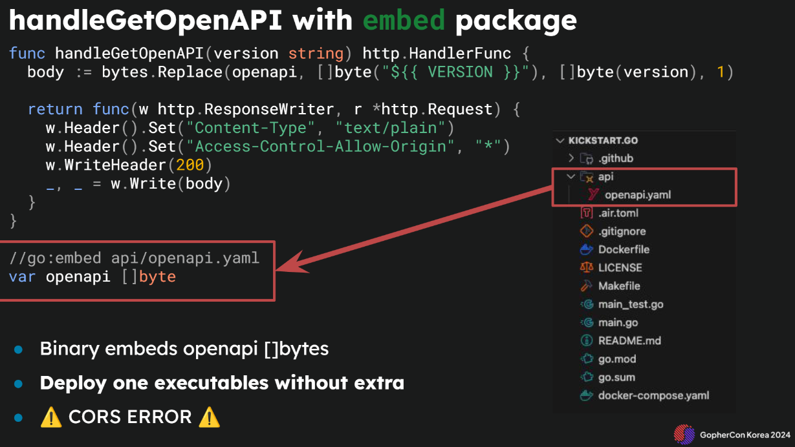

### MSA Requirements for a Go App
- Configuration management, graceful shutdown
- Testable code
- API specifications
- Logging
- Profiling, error monitoring, metrics, API tracing

---

### Tiny Main Abstraction

- Instead of using separate .env files, environment variables are read directly from the OS.
- A question raised: isn't setting every OS argument as a flag wasteful?

---

### Graceful Shutdown


---

### Testable Code


- The speaker waits for the server startup with long polling before running tests—not the cleanest method.
- Since the speaker is focused on vanilla Go, it seems they deliberately chose not to use the `httptest` package.

---

### Health Check





- Version is set using `ldflags`, which could be automatically tagged during release.
- Storing server **start time** is preferred over tracking total **uptime**.


---

### Documentation is a Must
> As Gophers say, "GoDoc isn't optional—it’s essential."



- While the speaker didn't use godoc, they emphasized exposing OpenAPI specs.
- `go:embed` embeds OpenAPI files into the binary at build time. Build fails if the file is missing.
- Swagger endpoints expose the embedded documentation.

> Maintaining Swagger alongside code updates may not be sustainable. Using `swaggo` might be more intuitive.

---

### Logging is a Must


- JSON logging with `slog` is adopted—a must for modern apps.
- Following the 12-factor app philosophy, logs are written to stdout. This reduces File I/O costs.

- Fluentbit handles post-processing with multiple outputs:
  - Sentry: Error tracking
  - Jaeger: API tracing
  - Elasticsearch: Log storage for Kibana

---

### Decorate

- Decorates the response writer to track HTTP status codes and byte sizes.

---

### Reflections
- This approach contrasts with rigid project structures. The minimal Go style without strict clean architecture was convincing.
- Some trade-offs are inevitable. Even when using established frameworks, clean and concise code is still achievable.
- Fluentbit should be adopted company-wide to reduce log coupling in the app.
- Company-wide tracing adoption (e.g., Jaeger, OpenTelemetry) is a must, potentially mandated by CTOs.

---

### Applying to Production
```go
// HealthHandler : Server health status handler
type HealthHandler struct {
	version   string
	startTime time.Time
}

// NewHealthHandler : Creates a new HealthHandler
func NewHealthHandler(version string) HealthHandler {
	return HealthHandler{
		version:   version,
		startTime: time.Now(),
	}
}

// Check : Returns server status and build metadata
func (h HealthHandler) Check(ctx *gin.Context) {
	type responseBody struct {
		Version        string    `json:"version"`
		Uptime         string    `json:"up_time"`
		LastCommitHash string    `json:"last_commit_hash"`
		LastCommitTime time.Time `json:"last_commit_time"`
		DirtyBuild     bool      `json:"dirty_build"`
	}

	var (
		lastCommitHash string
		lastCommitTime time.Time
		dirtyBuild     bool
	)

	{
		buildInfo, _ := debug.ReadBuildInfo()
		for _, kv := range buildInfo.Settings {
			if kv.Value == "" {
				continue
			}
			switch kv.Key {
			case "vcs.revision":
				lastCommitHash = kv.Value
			case "vcs.time":
				lastCommitTime, _ = time.Parse(time.RFC3339, kv.Value)
			case "vcs.modified":
				dirtyBuild = kv.Value == "true"
			}
		}
	}

	up := time.Now()
	ctx.JSON(http.StatusOK, responseBody{
		Version:        h.version,
		Uptime:         up.Sub(h.startTime).String(),
		LastCommitHash: lastCommitHash,
		LastCommitTime: lastCommitTime,
		DirtyBuild:     dirtyBuild,
	})
}
```

