- MSA 에서 Go App의 조건들
    - 설정 읽기, Graceful shutdown...
    - 테스트 가능한 코드
    - API 명세
    - 로깅
    - 프로파일링, 에러 모니터링, 메트릭, API 트레이스, ...

  

위의 조건들을 만족하는 미니멀리즘 Go의 예시를 나열합니다

## Tiny main abstraction
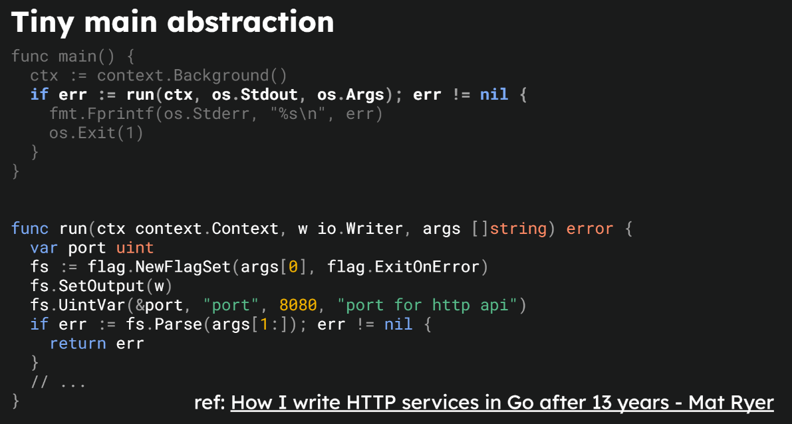

별도의 환경 변수 파일이 아닌, os 환경 변수를 통해 관리하는 예시

- 모든 os ARGS를 flag set으로 설정하면 낭비가 심한게 아닌가?

  

## Graceful shutdown
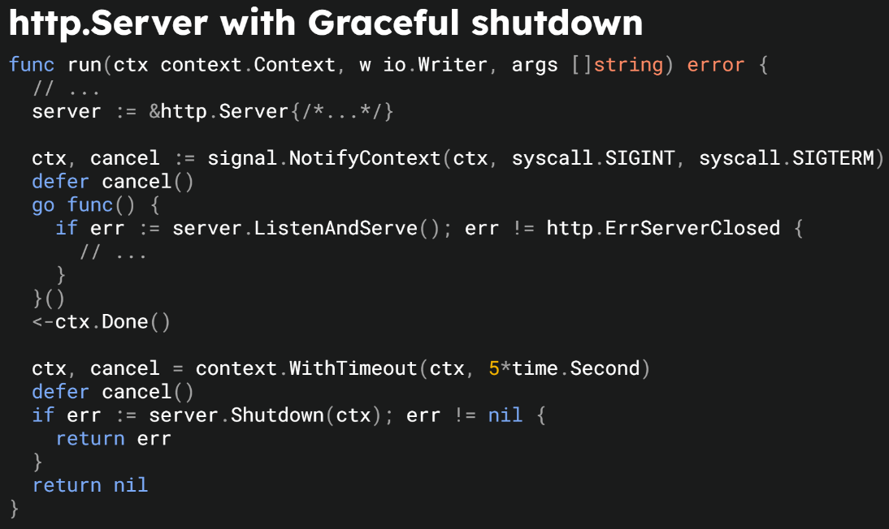
  

## 테스트 가능한 코드
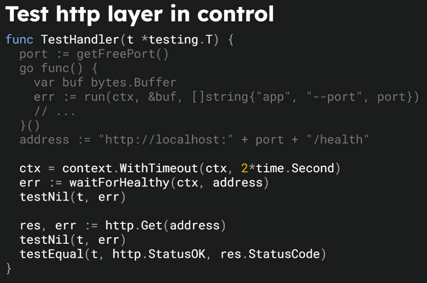
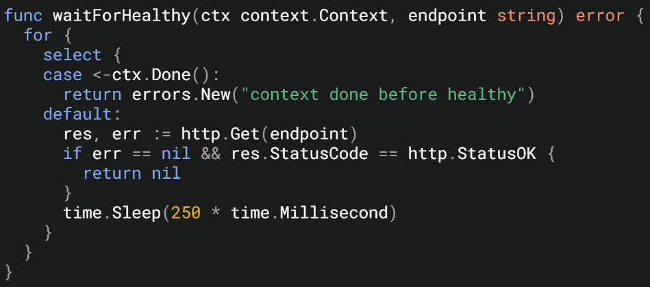

서버가 뜨기까지 기다리기 위해 long polling 한 뒤에 test 진행 → 클린하진 않다 생각함

해당 연사자의 메인 포커스는 바닐라 Go 이기에 httptest 패키지 또한 사용하지 않은 것으로 추측

  

## Health Check
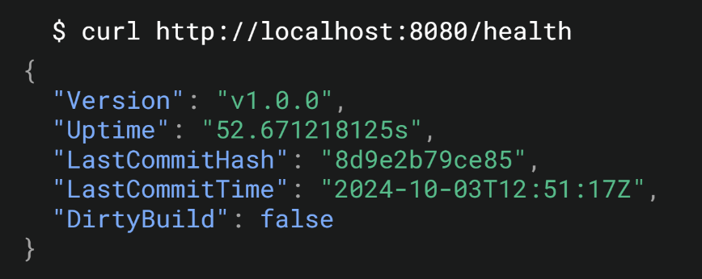
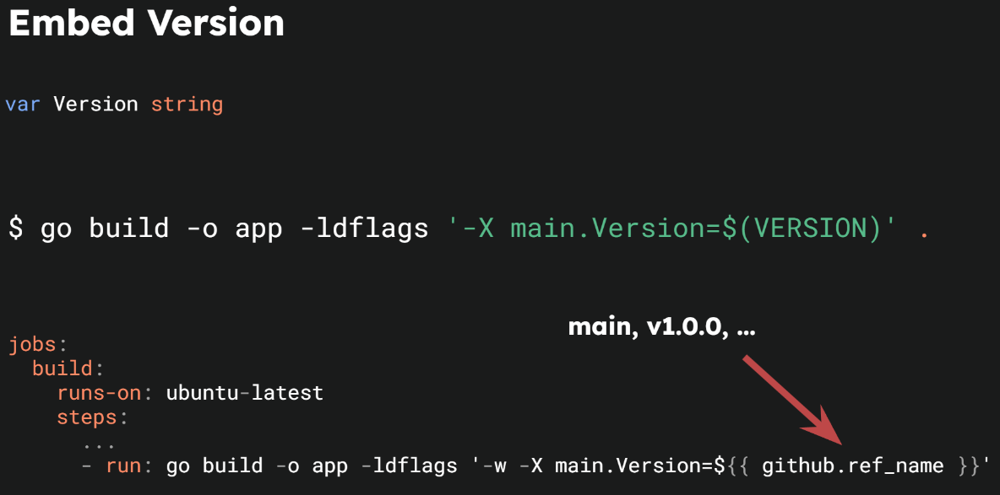
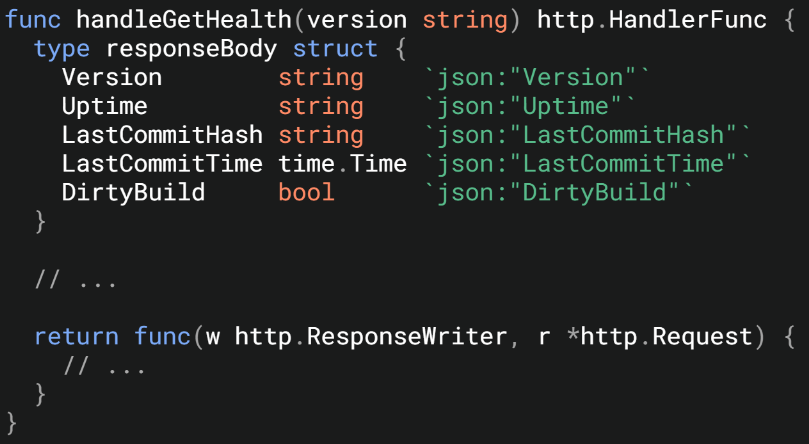
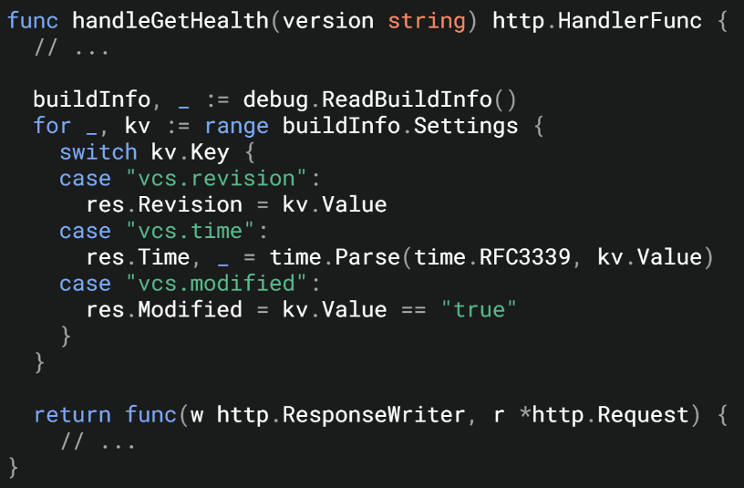


ldflags 옵션을 통해 버전을 지정, 이 부분은 release 단계에서 tag 기반으로 설정하면 좋을 것 같음

+ Uptime은 Server가 시작된 시간을 남기는 것이 좋다 생각함. (얼마나 서버가 실행중이었는지는 굳이?)
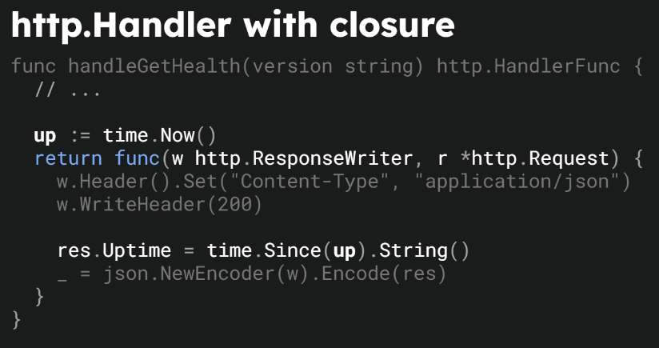
  

## Doc is Must

> 고퍼 가라사대 "GoDoc은 권장이 아닌 필수 사항이다" 

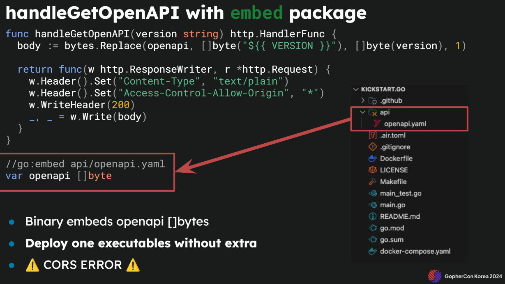

godoc은 아니고 openapi 에 대한 API 명세 설명이었다

|   |
|---|
|`go:embed`는 Go 코드 내에서 파일을 임베드할 때 컴파일 시점에 해당 파일의 내용을 바이너리 내에 포함시키는 기능입니다.<br><br>따라서 `go build`를 수행할 때, 임베드할 파일이 필요하며, 이 파일이 존재하지 않으면 빌드에 실패합니다.|

swagger용 API endpoint를 열어두어 임베딩 된 openapi를 노출시킨다

API 수정을 하면 필연적으로 swagger 수정도 필요함.. 유지가 가능할지 의문이 듦 (swaggo를 사용하는게 더 직관적이지 않나)

  

## Logging is a Must

로그머스트 😊
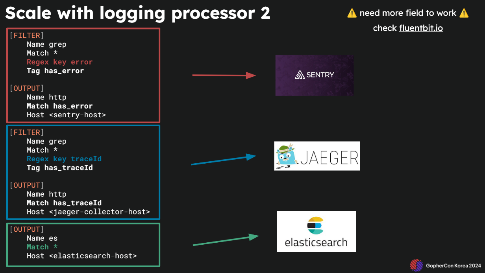

slog를 활용하여 JSON 로그를 채택하고 있다 (모던 애플리케이션에서는 필수인듯)

Stdout으로 충분하다. 12 factor app에서도 소개 되었듯 로그는 스트림으로서 관리하자! FileIO에 드는 리소스도 절감!

  

센트리, 예거, ES 여러개의 output을 두어 로그 기반의 후처리는 fluentbit에게 위임한다

- 센트리 : 에러 트래킹
- 예거 : API 트레이싱
- ES : elasticsearch 적재 → 키바나 연동하여 로그 확인

  

## Decorate
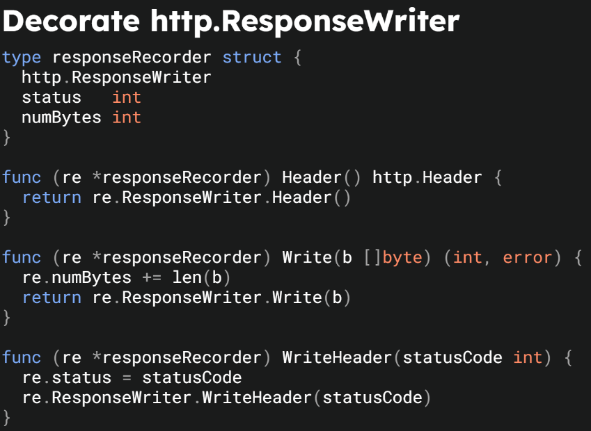

HTTP 상태코드와 Bytes 트래킹 (기존 ResponseWriter를 임베딩하여 확장)

## 후기
- 앞선 프로젝트 구조와 정반대의 성향임을 느꼈다. 클린 아키텍처에 집착하지 않고 Go 만의 색을 입힌 미니멀한 프로젝트 구성에 납득됨
- 어느정도의 타협은 필요하다. 바닐라 Go는 컨셉이라 느껴졌고 상용화된 프레임웍을 사용하더라도 깔끔하고 간결한 코드를 짤 수 있다. 오히려 코드의 량은 줄어들듯
- Fluentbit 도입이 되었으면 좋겠다. 다양한 필터 처리에 따른 Output으로 애플리케이션에서 log에 대한 결합도를 확실히 낮출 수 있다 생각한다.
- 전사적으로 예거, opentelemetry와 같이 트레이싱을 도입하는 게 좋을 것 같다. 이는 CTO가 있다면 다소 강압적으로라도 전사적으로 도입이 되어야 한다 생각


++ 실제 프로덕션 코드에 적용하기
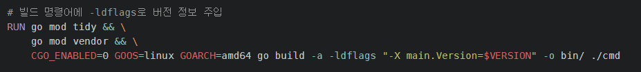

```go
// HealthHandler : 서버 상태 확인 핸들러
type HealthHandler struct {
	version   string
	startTime time.Time
}

// NewHealthHandler : 서버 상태 확인 핸들러 생성자
func NewHealthHandler(version string) HealthHandler {
	return HealthHandler{
		version:   version,
		startTime: time.Now(),
	}
}

// Check : 서버 상태 및 빌드 정보 확인
func (h HealthHandler) Check(ctx *gin.Context) {
	type responseBody struct {
		Version        string    `json:"version"`
		Uptime         string    `json:"up_time"`
		LastCommitHash string    `json:"last_commit_hash"`
		LastCommitTime time.Time `json:"last_commit_time"`
		DirtyBuild     bool      `json:"dirty_build"`
	}
	var (
		lastCommitHash string
		lastCommitTime time.Time
		dirtyBuild     bool
	)
	{
		buildInfo, _ := debug.ReadBuildInfo()
		for _, kv := range buildInfo.Settings {
			if kv.Value == "" {
				continue
			}
			switch kv.Key {
			case "vcs.revision":
				lastCommitHash = kv.Value
			case "vcs.time":
				lastCommitTime, _ = time.Parse(time.RFC3339, kv.Value)
			case "vcs.modified":
				dirtyBuild = kv.Value == "true"
			}
		}
	}
	up := time.Now()
	ctx.JSON(http.StatusOK, responseBody{
		Version:        h.version,
		Uptime:         up.Sub(h.startTime).String(),
		LastCommitHash: lastCommitHash,
		LastCommitTime: lastCommitTime,
		DirtyBuild:     dirtyBuild,
	})
}
```