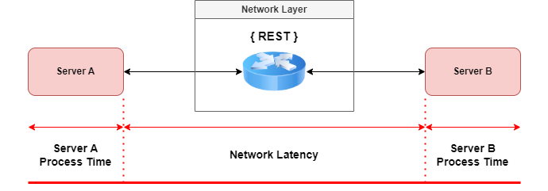
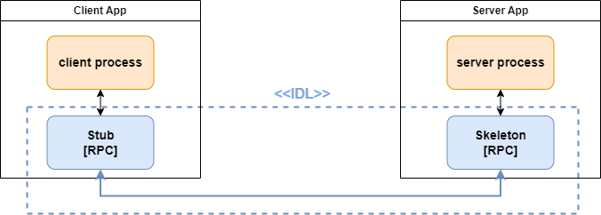
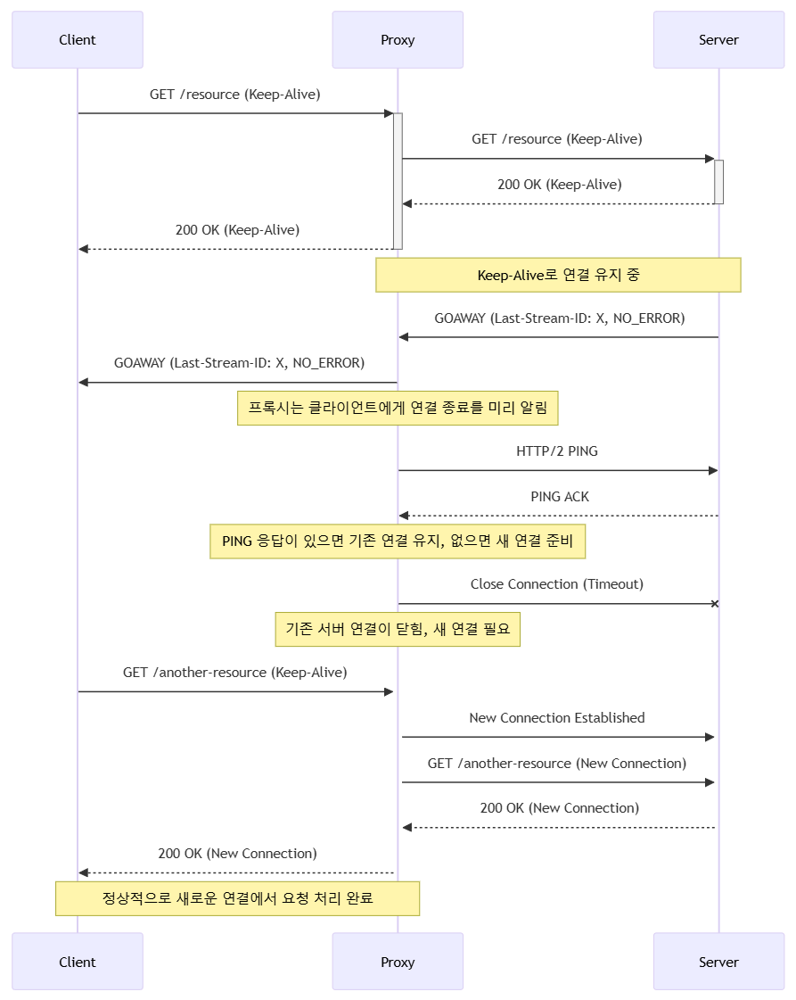
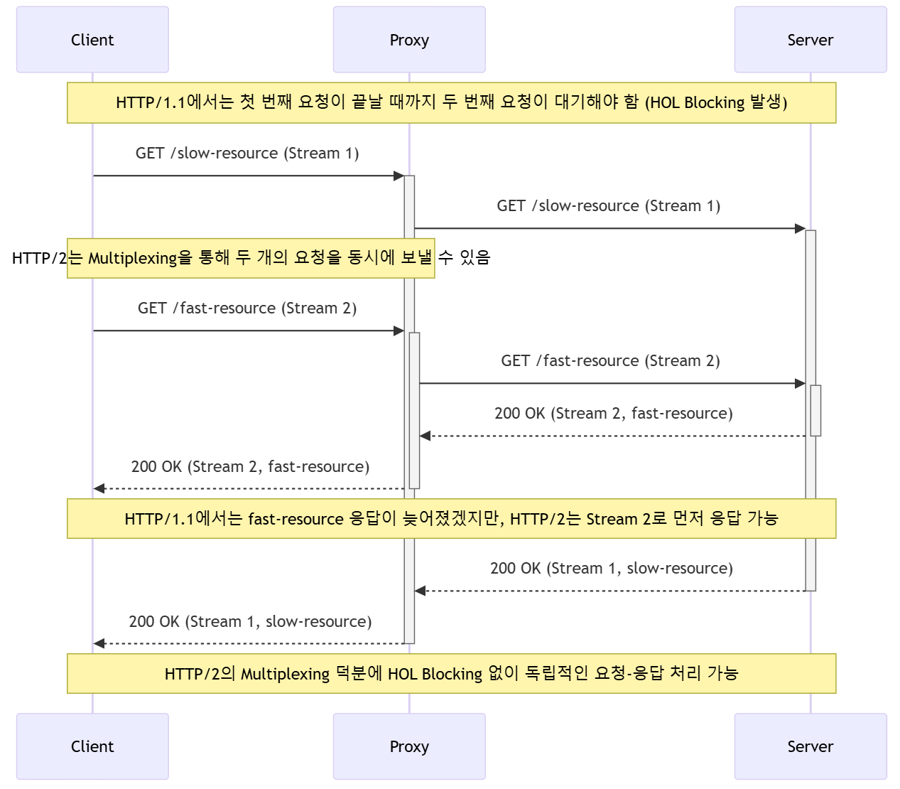

### What is RPC?

RPC stands for **Remote Procedure Call**. It's an inter-process communication technology that allows functions or procedures to run in another address space without requiring separate remote control logic.

In essence, RPC abstracts the underlying connection and data transfer so that developers can invoke remote functions as if they were local.

> In distributed services (especially MSA), RPC is commonly used for communication between clients and servers or between servers.

As applications are split into microservices, the days of simply calling functions locally in a monolith are gone. Now, services must communicate over the network.

**Network latency becomes the bottleneck**, not your optimized code.

---

### How RPC Works

1. Define the interface using IDL (Interface Definition Language).
2. The IDL definition is used to generate client stubs and server skeletons via a compiler (`rpcgen`).
3. The client calls a stub method which marshals parameters.
4. The stub sends the request in a form the server can understand.
5. The server receives the call and executes the logic.
6. The server sends back the response.

> **Stub?**
>
> A stub is an abstraction layer that lets clients call remote methods as if they were local. It handles marshaling/unmarshaling and networking logic internally.

---

## What is gRPC?

- gRPC is a modern RPC framework developed by Google.
- It uses **Protocol Buffers** for IDL and message serialization/deserialization.
- Clients can call server methods on remote machines as if they were local.

> RPC != gRPC. gRPC is a specific implementation of RPC, using HTTP/2 and Protocol Buffers internally.

---

## HTTP/1.1 vs HTTP/2

### HTTP/1.1 Flow

1. TCP handshake
2. Request/response
3. TCP termination

Even with Keep-Alive, HTTP/1.1 can only handle one request per connection (sequentially).

#### Problems
- **Overhead** from many TCP connections
- **HOL Blocking**: one slow request blocks the rest

### HTTP/2 Improvements

#### Proxy + Keep-Alive Problems

- Proxies may drop Keep-Alive connections without notifying clients.
- Clients think the connection is still valid, leading to errors.

#### HTTP/2 Fixes

- Servers send `GOAWAY` frames to indicate shutdown
- Proxies send `PING` to verify liveness
- Clients reconnect when needed

#### Multiplexing

- Multiple requests over a single TCP connection
- Requests are independent and don’t block each other

#### No More HOL Blocking

---

## Advantages and Disadvantages of gRPC

| Feature | Pros | Cons |
|--------|------|------|
| Performance | Multiplexing, header compression, streaming | Requires HTTP/2 support |
| IDL | Strong typing with `.proto` files | ProtoBuf is not human-readable |
| Communication | Unary, Server/Client Streaming, Bidirectional | Complex to debug |
| Language Support | Multi-language support (Go, Java, Python, etc.) | Varies in maturity |
| Code Generation | Auto-generates stubs from `.proto` | Requires additional build tooling |
| Security | Strong TLS support | TLS setup can be tricky |
| Load Balancing | Client-side support available | Typically used with Envoy or other proxies |
| Streaming | Built-in streaming APIs | Harder to implement and maintain |
| Transport | Binary serialization = compact, fast | Not easily debuggable like REST |
| Browser | Supported via gRPC-Web | Requires gRPC-Web proxy layer |

---

More on gRPC performance, debugging, and implementation tips coming next.

