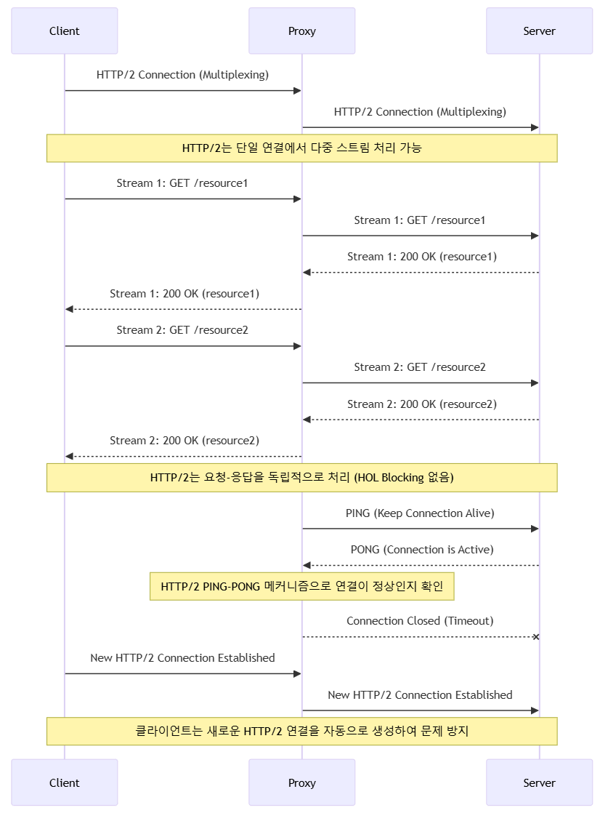

# RPC?
> `Remote Procedure Call`의 약자로 별도의 원격 제어를 위한 코딩 없이 다른 주소 공간에서 함수나 프로시저를 실행할 수 있게하는 프로세스 간 통신 기술 입니다.

→ 즉, 내부적인 커넥션 과정과 데이터가 전달되는 일련의 과정을 추상화하는 Method를 사용하여, 실제로는 외부 통신을 하지만 코드상으로는 함수를 호출하는 것과 동일한 효과

> HTTP API 와 더불어 **Client ↔ Server, Server ↔ Server** 간 데이터를 주고 받을 때 사용되는 범용적인 통신 방법!
원격 프로시저 호출을 이용하여 프로그래머는 함수가 로컬이나 원격 위치에 있든 동일한 코드를 작성하여 기능을 활용할 수 있습니다.
MSA 구조의 서비스에서 다양한 언어와 프레임워크로 개발되는 경우 프로토콜에 맞춰 통신해야 하는 비용이 발생한다.
>
> 그러한 분산 컴퓨팅 환경에서 프로세스(서비스) 간 상호 통신 및 컴퓨팅 자원의 효율적인 사용을 위해서 발전된 기술이다.

→ 애플리케이션이 점차 쪼개짐에 따라... 기존 모노 레포에서 함수를 호출하면 그만이던 것이.. 외부 통신을 거쳐야만 데이터 조회가 가능한 형태로 변경됨...

→ 애플리케이션 코드 내에서의 최적화는 수ns 정도는 줄일 수 있겠지만, 실질적인 네트워크 통신 비용이 병목을 일으키게 됨... 이를 해결하기 위해 grpc가 등장하게 됨

## RPC 동작 방식

- IDL(Interface Definition Language) 을 사용하여 서버의 호출 규약을 정의한다.
- 함수명, 인자, 반환값에 대한 데이터 형이 저장된 IDL 파일을 rpcgen 컴파일러를 이용하여 stub 코드를 자동으로 생성한다

---

(1) 우선 IDL(Interface Definition Language)를 통해 호출에 대한 인터페이스를 정의합니다.

(2) IDL에 의해 정의된 인터페이스는 client의 stub과 server의 skeleton 생성의 기반이 되며, rcpgen(유틸리티)를 통해 각각의 stub과 skeleton을 생성합니다.

(3) 클라이언트는 리모트의 프로시저를 사용하기 위해 설계된 스텁의 프로시저를 호출하고, 프로시저 호출에 필요한 인자와 비지니스에 로직에 필요한 메소드를 호출합니다.

(4) 스텁은 서버가 이해할 수 있는 형태로 데이터의 캐스팅 진행하고, 서버 측 RPC로 호출을 진행합니다.

(5) 서버는 수신된 호출에 대한 데이터를 처리합니다.

(6) 서버측 RPC 프로토콜은 처리된 데이터를 캐스팅하여 클라이언트로 응답합니다.

---

> #### `Stub`이 뭔가요?
> 
> Stub은 원격 프로시저 호출(RPC)에서 클라이언트와 서버 간의 통신을 추상화하고 단순화하는 데 사용되는 코드 조각

# GRPC?
- `gRPC`는 `Protocol Buffer`를 IDL (Interface Definition Language) 및 메시지 교환 방식으로 사용합니다.
    - 구조화된 데이터의 **직렬화(Serialization), 역직렬화(Deserialization)** 에 사용
- 클라이언트 어플리케이션에서 로컬 객체(method) 인 것처럼 다른 머신(remote) 에 있는 서버 어플리케이션의 메서드를 직접 호출 할 수 있다.

> 흔히들 (나만 그럴지도..?) rpc 통신을 한다 하면... HTTP/2 기반의 protocol Buffer를 사용하겠구나~ (grpc 구나) 라고 생각하기 마련이다.
>
> 그치만... 실제 Stub 내부적인 원격 프로시저 호출의 구현체가 어떠한 프로토콜을 사용하여 구현되어 있는지는 알 수 없다
>
> 즉, **rpc != grpc** 이며 RPC와 gRPC는 포함관계이다

## HTTP/1.1과 HTTP/2.0
`HTTP`는 `TCP` 위에서 동작하며, "Connection Oriented"를 목적으로 둔 `TCP` 답게 "연결"을 맺어야 데이터 송수신을 하게된다.

흔히 알고 있는 `HTTP/1.1` 통신 흐름은 다음과 같다.

1. TCP 연결 (3 way handshake)
2. 데이터 송수신
3. TCP 연결 종료 (4 way handshake)

여러번 데이터를 주고 받아야 하는 상황에서 TCP 연결 및 종료에 따른 오버헤드는 무시할 수 없다. (특히나 물리적인 거리가 먼 경우에는... 어휴 😂)

다행히도 `HTTP/1.1`에서는 `Keep-Alive`가 활성화되어 있어, 하나의 TCP 연결을 여러 HTTP 요청/응답에 재사용할 수 있다.
> 주로 REST를 사용하는 Production 애플리케이션에서는 이러한 TCP 연결에 따른 오버헤드를 줄이고자 **HTTP Client를 재사용**하곤 한다.

재사용할 수 있으면 큰 문제가 없지 않느냐..?
> - Keep-Alive는 여러 요청을 하나의 TCP 연결에서 처리할 수 있지만, HTTP/1.1은 기본적으로 **한 번에 하나의 요청만 처리 가능(직렬 처리)**
> - 여러 개의 요청을 동시에 처리하려면 **여러 개의 TCP 연결을 만들어야 함** → 이로 인해 **네트워크 오버헤드 증가**

### HTTP/1.1 - Proxy로 인한 Keep-Alive의 치명적 문제

1. 클라이언트가 프록시를 통해 HTTP 요청(Keep-Alive 포함)을 서버로 보냄.
2. 프록시는 서버에 같은 요청을 전달하고, **서버도 Keep-Alive를 유지**함.
3. 서버가 응답을 보낸 후, **Keep-Alive 상태에서 연결을 유지**함.
4. 일정 시간이 지나면, **프록시가 타임아웃을 감지하고 서버와의 연결을 강제 종료**함.
5. 클라이언트는 아직 연결이 살아 있다고 생각하고 **새로운 요청을 보냄**.
6. 하지만 프록시는 이미 서버와의 연결을 닫았으므로 **연결 재사용이 불가능하고 "Connection Reset" 오류 발생**.

### HTTP/1.1 - HOL(Head-of-Line) Blocking 문제

1. **클라이언트가 첫 번째 요청** (`/slow-resource`)을 보냄.
    - 서버에서 이 요청을 처리하는 데 **오랜 시간이 걸림**.
2. **클라이언트가 두 번째 요청** (`/fast-resource`)을 보냄.
    - 하지만 **HTTP/1.1에서는 한 개의 TCP 연결에서 요청을 순차적으로 처리해야 함**.
    - 따라서 두 번째 요청(`fast-resource`)은 첫 번째 요청(`slow-resource`)이 끝날 때까지 **대기해야 함**.
3. **첫 번째 요청이 완료된 후에야 두 번째 요청 처리 가능**.
    - 두 번째 요청은 빠르게 처리할 수 있지만, **첫 번째 요청의 처리 지연으로 인해 응답이 늦어지는 HOL Blocking 발생**.

## Pros & Cons
| **구분**                                  | **장점 (Pros)**                                                          | **단점 (Cons)**                                 |
| --------------------------------------- | ---------------------------------------------------------------------- | --------------------------------------------- |
| **성능**                                  | HTTP/2 기반으로 멀티플렉싱, 헤더 압축, 스트리밍 지원 → 높은 성능                              | HTTP/2를 지원하지 않는 클라이언트와의 통신이 어려움               |
| **IDL (Interface Definition Language)** | Protocol Buffers(ProtoBuf)를 사용하여 강력한 타입 안정성과 코드 자동 생성 가능               | ProtoBuf는 JSON보다 가독성이 낮고 사람이 직접 읽기 어려움        |
| **다양한 통신 방식 지원**                        | Unary, Server Streaming, Client Streaming, Bi-directional Streaming 지원 | 복잡한 스트리밍 방식은 디버깅이 어려울 수 있음                    |
| **다양한 언어 지원**                           | Go, Java, Python, C++, Node.js 등 여러 언어에서 사용 가능                         | 일부 언어에서는 gRPC 지원이 완벽하지 않거나 라이브러리 성숙도가 낮음      |
| **자동 코드 생성**                            | `.proto` 파일을 기반으로 클라이언트와 서버 코드 자동 생성                                   | 추가적인 빌드 과정 필요 (`protoc` 컴파일러 사용)              |
| **보안**                                  | TLS 기반의 강력한 보안 제공                                                      | TLS 설정이 복잡할 수 있음                              |
| **로드 밸런싱**                              | 클라이언트 사이드 로드 밸런싱 지원                                                    | 기본적으로 제공하는 기능이 제한적이며, Envoy 등과 함께 사용하는 것이 일반적 |
| ***스트리밍 지원***                           | 실시간 데이터 처리를 위한 스트리밍 API 제공                                             | 스트리밍을 활용한 서비스 구현이 상대적으로 복잡                    |
| **트랜스포트 방식**                            | Binary 기반 직렬화로 메시지 크기가 작고, 전송 속도가 빠름                                   | RESTful API처럼 사람이 직접 요청을 보내거나 디버깅하기 어려움       |
| **브라우저 호환성**                            | gRPC-Web을 통해 브라우저 지원 가능                                                | 기존 gRPC는 브라우저에서 직접 사용 불가하여 gRPC-Web 프록시 필요    |
