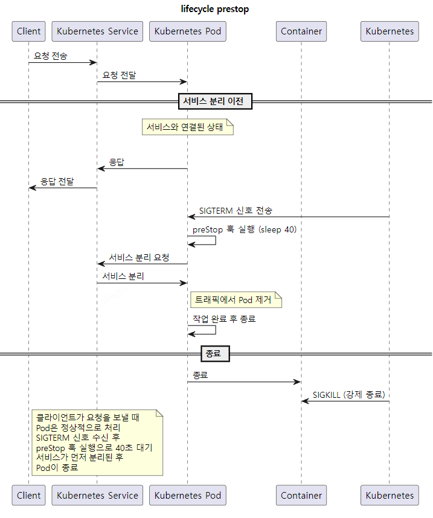

# Background

- After deploying on Kubernetes (k8s), intermittent 502 / 504 errors were observed during load testing.
- Pods were terminated before completing existing requests, causing **504 Gateway Timeout** errors.
- New Pods were launched while old Pods were terminated, causing **502 Bad Gateway** errors.

Although rolling updates were happening, it was confirmed that **without proper Readiness Probe settings, downtime could occur**.

---

# Setup

## Install Load Testing Tools

- [bombardier](https://github.com/codesenberg/bombardier): A simple and easy-to-use Go CLI load testing tool.
- [vegeta](https://github.com/tsenart/vegeta): A flexible load tester that allows scripting and provides detailed status code responses.

Installation steps are omitted here.

---

## Readiness Probe

> A mechanism used to determine whether a Pod is ready to handle traffic.
>
> Even after a container starts, it might not be ready to handle external traffic until certain initialization tasks are completed.

1. Traffic Routing Control:
   - Kubernetes does not route traffic to a Pod until its Readiness Probe succeeds.
   - Ensures Pods handle requests only after they're fully initialized.

2. Pod Status Management:
   - Until the probe passes, Kubernetes removes the Pod from the service endpoint.

**Without a Readiness Probe, 502 errors can occur.**

If a container receives traffic immediately after startup — before the server is fully initialized — it may respond with a **502 Bad Gateway**.


### Changes to `deployment.yml`

```yaml
...
readinessProbe:
  httpGet:
    port: 8080
    path: /alive
    scheme: HTTP
  initialDelaySeconds: 30
  periodSeconds: 30
...
```

Create a `/alive` endpoint and configure the probe to accept traffic only after receiving HTTP 200.

### Test

```bash
bombardier -c 200 -d 3m -l https://{endpoint}
```

Results:
- 5XX errors still occur.

---

## lifecycle & preStop

> **What is lifecycle?**
> Kubernetes lifecycle hooks allow execution of commands during certain container states (similar to AOP):
>
> - **postStart**: Executed immediately after a container starts.
> - **preStop**: Executed just before container termination.

**preStop Hook**

- Used to safely detach Pods from services before termination.
- Helps complete cleanup tasks like closing connections or saving files.
- Allows graceful shutdown by adding a delay.

Even with Readiness Probe configured, without lifecycle settings, intermittent 502 errors could still happen.

- Pod termination (SIGTERM) and service deregistration are asynchronous.
- Pod might still receive traffic but can't serve requests properly.

Thus, setting up:
- **Service Detach** → **Handle remaining requests** → **Terminate Pod**

Achieves a true graceful shutdown.



### Changes to `deployment.yml`

```yaml
...
lifecycle:
  preStop:
    exec:
      command:
        - /bin/sh
        - -c
        - sleep 40  # Wait for 40s after detaching from service
...
```

**Flow:**
1. Kubernetes sends SIGTERM to Pod.
2. `preStop` hook (`sleep 40`) is executed.
3. `terminationGracePeriodSeconds` countdown starts.
4. Pod terminates after hook and grace period.

### Test

```bash
bombardier -c 200 -d 3m -l https://{endpoint}
```

Results:
- Reduced but not eliminated 5XX errors.

---

## terminationGracePeriodSeconds

> **Pod Shutdown Scenario:**
>
> - Kubernetes sends SIGTERM.
> - Application can finalize connections and clean up.
>
> **Grace Period:**
>
> - Defined by `terminationGracePeriodSeconds`.
> - Kubernetes waits for clean termination.
> - Default is 30 seconds.
>
> **SIGKILL:**
>
> - If the Pod is still alive after the grace period, Kubernetes forcefully kills it.

**Problem:**
- `preStop` sleep is 40 seconds.
- Default grace period is 30 seconds.
- Kubernetes sends SIGKILL before graceful shutdown completes.


### Changes to `deployment.yml`

```yaml
...
terminationGracePeriodSeconds: 50
...
```

**Important:** Check ALB timeout settings if you're using AWS Ingress!

If `terminationGracePeriodSeconds` exceeds ALB timeout, **504 Gateway Timeout** errors may occur.

Recommended:

- `lifecycle.preStop` (40s) < `terminationGracePeriodSeconds` (50s) < ALB Timeout (60s)

### Test

```bash
bombardier -c 200 -d 3m -l https://{endpoint}
```

Results:
- **No 5XX errors** observed!

---

### References

- [Kakao Tech Blog - Zero Downtime Deployment on Kubernetes](https://tech.kakao.com/posts/360)
- [Kubernetes Official Docs - Pod Lifecycle](https://kubernetes.io/ko/docs/concepts/workloads/pods/pod-lifecycle/)

