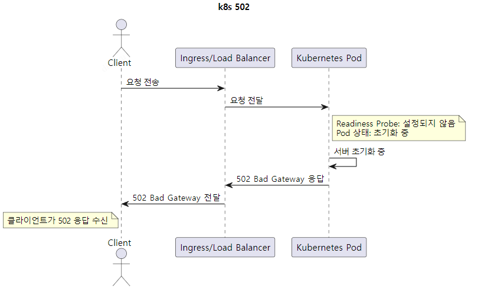
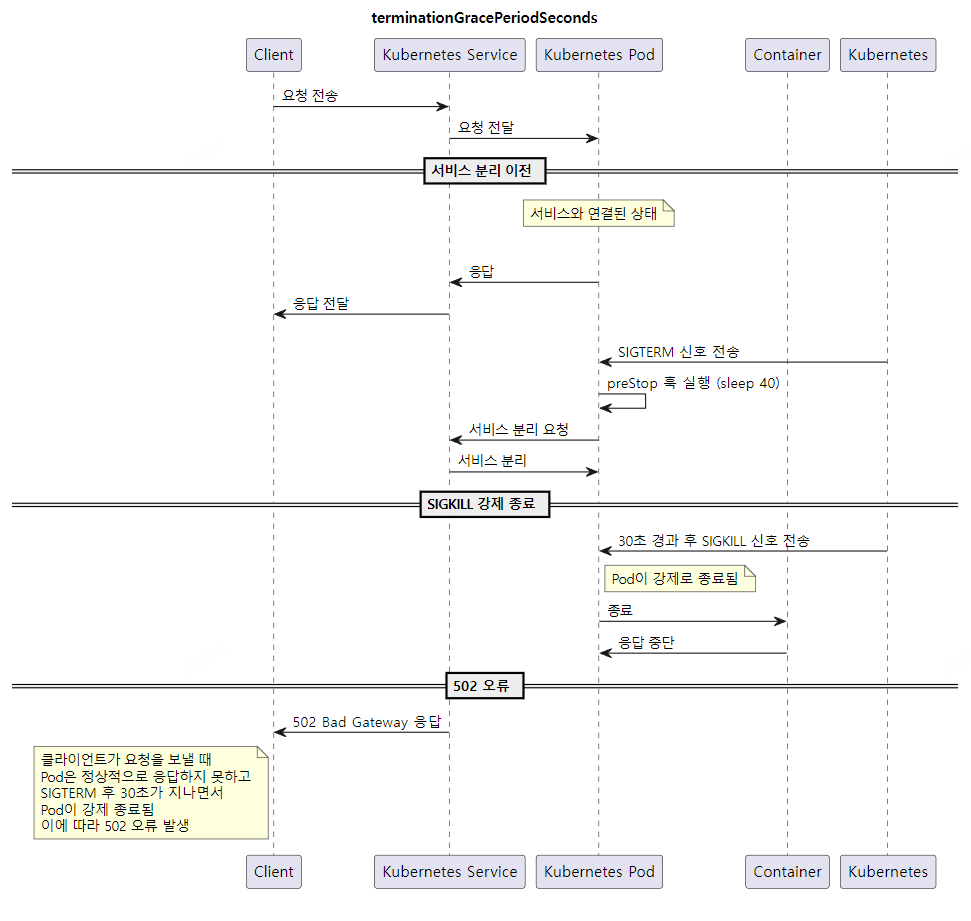

# 배경
---
- k8s 환경 Deploy 후, 부하테스트 과정에서 간헐적으로 502 / 504 에러 발생 확인
- Pod들이 교체 되면서 기존 요청에 대한 응답을 반환하지 못한 채 종료 됨 → 504 Gateway Timeout
- 신규 Pod이 올라가고 대체되는 Pod이 Terminate 됨 → 502 Bad Gateway

롤링업데이트가 진행되지만 **Readiness Probe 설정 없이는 순단이 발생**할 여지가 있음을 확인


# 설정
---
## 부하테스트 툴 설치

[bombardier](https://github.com/codesenberg/bombardier) : 쉽고 간편한 go cli 부하테스트 툴
[vegeta](https://github.com/tsenart/vegeta) : 스크립트 작성으로 보다 유연한 요청 가능, status code 를 상세히 응답하는 툴

각 툴의 자세한 설치 과정은 생략 합니다.

---

## Readniess Probe
> Pod이 서비스 트래픽을 처리할 준비가 되었는지를 판단하는 데 사용되는 메커니즘
>
>특정 컨테이너가 시작된 후에도 일부 작업이 완료될 때까지 외부 트래픽을 처리할 준비가 되지 않았을 수 있기 때문에 이를 확인하는 역할을 함
>
1. 트래픽 라우팅 제어:
   - Readiness Probe가 성공적으로 완료될 때까지 Kubernetes는 해당 Pod으로 트래픽을 라우팅하지 않습니다. 이는 Pod이 준비되지 않은 상태에서 요청을 처리하지 않도록 보장합니다.
   - 준비가 완료된 후에만 트래픽이 Pod으로 라우팅되기 때문에, Pod이 올바르게 설정되고 필요한 리소스를 확보한 상태에서만 요청을 처리하게 됩니다.
>
2. Pod의 상태 확인:
   - Readiness Probe는 특정 조건이 충족될 때까지 Kubernetes에 Pod이 트래픽을 받을 준비가 되지 않았다고 알리며, 준비가 완료된 후에는 트래픽을 받을 준비가 되었음을 알립니다.
   - Pod이 준비되지 않은 경우, Kubernetes는 Pod을 서비스의 엔드포인트에서 제거합니다.

502가 발생하는 원인 중 하나이다

Readiness Probe를 지정하지 않은 경우, 컨테이너가 올라가는 시점에서 트래픽이 들어오게 된다.

이때에, Pod 내부의 서버 초기화가 완전히 되지 않은 시점에서 요청이 온 경우 → 502 Bad Gateway를 응답한다



#### deployment.yml 수정 사항
```yaml
...
readinessProbe:
  httpGet:
    port: 8080
    path: /alive
    scheme: HTTP  
  initialDelaySeconds: 30
  periodSeconds: 30
...
```
Healthcheck 응답용 Endpoint를 생성해두고 응답 상태코드가 200으로 돌아오면 요청을 받는 형식으로 설정

#### 테스트
```bash
bombardier -c 200 -d 3m -l https://{endpoint}
[================================================================================================================] 3m0s
Done!
Statistics        Avg      Stdev        Max
  Reqs/sec      4205.76    1250.10   16927.12
  Latency       47.81ms    10.16ms      2.07s
  Latency Distribution
     50%    45.08ms
     75%    49.77ms
     90%    57.60ms
     95%    64.29ms
     99%    81.95ms
  HTTP codes:
    1xx - 0, 2xx - 0, 3xx - 0, 4xx - 753060, 5xx - 12
    others - 0
  Throughput:     3.24MB/s
```
여전히 **5XX** 에러는 존재한다.

---

## lifecycle & preStop
> lifecycle 설정이란?
컨테이너의 생명주기 동안 특정 시점에 실행될 작업을 정의할 수 있는 Kubernetes의 구성 옵션 (AOP와 유사...하다는 생각)
   - postStart: 컨테이너가 시작된 직후에 실행됩니다. 컨테이너가 시작된 후 추가적인 초기화 작업을 수행하는 데 사용
   - preStop: 컨테이너가 종료되기 직전에 실행됩니다. 종료 전에 필요한 작업을 수행하도록 설정 가능
>
**preStop**
preStop 훅은 컨테이너가 종료될 때 실행되는 스크립트나 명령어를 지정. 이 훅은 컨테이너가 종료되기 전에 반드시 수행해야 하는 작업이 있을 때 매우 유용
   - 트래픽 분리: Pod이 종료되기 전에 해당 Pod을 서비스 트래픽에서 안전하게 분리하기 위해 사용됩니다.
   - 정리 작업: 종료 전에 리소스 정리, 연결 종료, 파일 저장 등의 작업을 수행할 수 있습니다.
   - 대기 시간 설정: 컨테이너가 실제로 종료되기 전에 일정 시간 동안 대기하도록 설정하여, 클라이언트와의 연결이 완전히 종료되도록 할 수 있습니다.
   
앞서 설정한 Readiness Probe 설정 이후에도, lifecycle 설정을 하지 않는다면 간헐적인 502 에러가 발생될 수 있다

파드는 종료될 때 SIGTERM, SIGKILL 처리와 서비스 제외 처리가 비동기로 처리됨

서비스가 분리되기 전에 Pod이 클라이언트 요청에 정상적으로 응답할 수 없을 수 있다.

즉, 서비스 분리 → 잔류하는 요청 처리 → pod 종료 를 통해 Graceful Shutdown이 가능하도록 설정한다


#### deployment.yml 수정 사항
```bash
...
lifecycle:
    preStop:
        exec:
        command:
        - /bin/sh
        - -c
        - sleep 40  # 서비스 분리가 발생한 후 40초 동안 대기
...
```
1. 컨테이너 종료 요청: Kubernetes가 Pod을 종료하기로 결정하면, 컨테이너에 SIGTERM 신호
2. preStop 훅 실행: SIGTERM 신호가 전송된 후, sleep 40 실행, 컨테이너가 40초 동안 대기
3. 유예 기간 시작 (terminationGracePeriodSeconds): preStop 훅이 실행되면서, 동시에 terminationGracePeriodSeconds에 정의된 유예 기간이 시작
이 기간 동안 Kubernetes는 컨테이너가 정상적으로 종료되기를 대기
4. 컨테이너 종료: preStop 훅이 완료되고, 유예 기간이 끝나면 Kubernetes는 컨테이너를 종료

#### 테스트
```bash
bombardier -c 200 -d 3m -l https://{endpoint}
[================================================================================================================] 3m0s
Done!
Statistics        Avg      Stdev        Max
  Reqs/sec      4205.05    1355.65   20756.97
  Latency       47.92ms     8.71ms      2.07s
  Latency Distribution
     50%    45.47ms
     75%    49.26ms
     90%    57.32ms
     95%    64.39ms
     99%    80.67ms
  HTTP codes:
    1xx - 0, 2xx - 751239, 3xx - 0, 4xx - 0, 5xx - 3
    others - 0
  Throughput:     2.82MB/s
```
여전히 **5XX** 에러는 존재한다.

---
## terminationGracePeriodSeconds
> **Pod 종료 시나리오:**
>
   - Kubernetes가 Pod을 종료하기로 결정하면, 먼저 Pod 내의 컨테이너에 SIGTERM 신호를 보냄
   - SIGTERM 신호를 받은 애플리케이션은 현재 처리 중인 요청을 완료하고, 필요한 정리 작업을 수행 가능
>
> **유예 기간 설정:**
>
   - terminationGracePeriodSeconds는 이 유예 기간을 정의. 이 기간 동안 Kubernetes는 컨테이너가 정상적으로 종료될 시간을 대기
   - 기본값은 30초입니다. 이 시간이 지나면 Kubernetes는 컨테이너가 여전히 실행 중인 경우 강제로 종료(SIGKILL)
>
>**SIGKILL 신호:**
>
- terminationGracePeriodSeconds 기간이 만료되었을 때도 컨테이너가 종료되지 않았다면, Kubernetes는 SIGKILL 신호를 줌, 애플리케이션이 강제 종료됨

일정 lifecycle.preStop 설정을 통해, 40초의 유예시간을 두어 애플리케이션에 잔류하는 요청을 응답할 시간을 주었음.

하지만 terminationGracePeriodSeconds 는 기본 **30초로 설정되기에 30초가 지나도록 Pod이 실행중인 경우 SIGKILL을 전송**하여 파드를 강제 종료시킴



#### deployment.yml 수정 사항
```yaml
...
terminationGracePeriodSeconds: 50
...
```

INGRESS와 연결된 ALB 속성을 꼭 확인하자!
`terminationGracePeriodSeconds`가 ALB 타임아웃보다 긴 경우, 특정 시나리오에서 **504 Gateway Timeout 오류가 발생**할 수 있음

**예상 발생 시나리오** : 요청 중간에 종료 발생 → ALB 타임아웃 도달 → 응답 전 Pod 종료

이를 예방하기 위해, lifecycle.preStop (40s) < terminationGracePeriodSeconds (50s) < ALB Timeout (60s) 로 지정

#### 테스트
```bash
bombardier -c 200 -d 3m -l https://{endpoint}
[================================================================================================================] 3m0s
Done!
Statistics        Avg      Stdev        Max
  Reqs/sec      4293.51    1286.80   12924.64
  Latency       46.74ms     8.94ms   547.25ms
  Latency Distribution
     50%    44.48ms
     75%    46.87ms
     90%    54.16ms
     95%    66.82ms
     99%    81.69ms
  HTTP codes:
    1xx - 0, 2xx - 770240, 3xx - 0, 4xx - 0, 5xx - 0
    others - 0
  Throughput:     2.89MB/s
```

---

### REF
- [카카오 테크 k8s 무중단 배포](https://tech.kakao.com/posts/360)
- [Pod 라이프사이클](https://kubernetes.io/ko/docs/concepts/workloads/pods/pod-lifecycle/)