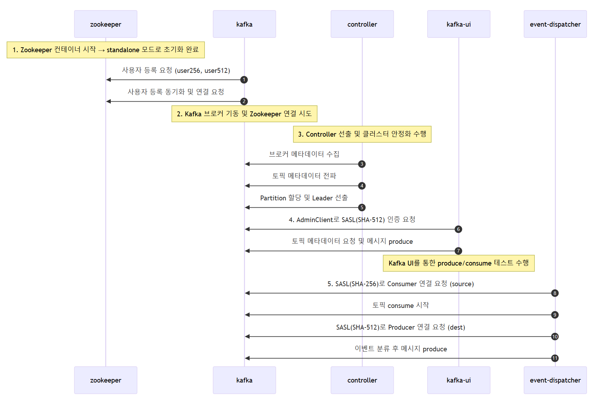

## Why This Setup?

- Debugging on development servers was cumbersome due to lack of access/log visibility.
- Kafka in our environment enforces SASL authentication.
- We needed to test with different SASL mechanisms (SCRAM-256 and 512) **without changing application code**.
- Our Event Dispatcher consumes from one Kafka and produces to another—all on the same cluster but under different authentication methods.
- For availability testing (e.g., ISR=2), a **3-node Kafka cluster** is used.


## Features

- Kafka cluster with **SCRAM-SHA-256** and **SCRAM-SHA-512** authentication
- **Zookeeper-based** Kafka cluster with 3 brokers
- **Kafka UI** for producing and inspecting topics
- **Event Dispatcher** that uses SCRAM-256 for consumer and SCRAM-512 for producer

## Why Bitnami Kafka?

Bitnami’s image provides flexible environment-based configuration:

1. **SASL users auto-registration**:
```env
KAFKA_CLIENT_USERS=user256,user512
KAFKA_CLIENT_PASSWORDS=pass256,pass512
```
2. **SASL protocol setup** without editing `server.properties`.


## Deployment & Teardown
```bash
docker compose --env-file .env up --build
docker compose down -v
```

### `.env` Example:
```env
256_SASL_USER=user256
256_SASL_PASSWORD=pass256
512_SASL_USER=user512
512_SASL_PASSWORD=pass512

KAFKA_BROKER_0_PORT=9092
KAFKA_BROKER_1_PORT=9093
KAFKA_BROKER_2_PORT=9094
```

## Sequence Overview

1. **Zookeeper starts**, no user state yet
2. Kafka Brokers register **SCRAM users** via env
3. Controller elected, brokers stabilize
4. Kafka UI connects using **SCRAM-512** for admin operations
5. Event Dispatcher:
   - Consumes with **SCRAM-256**
   - Produces with **SCRAM-512**



## Common Issues & Fixes

### 1. Misconfigured `ADVERTISED_LISTENERS`
**Symptom:** UI and clients can't connect to Kafka
**Fix:** Use `host.docker.internal` not `localhost`

```env
KAFKA_CFG_ADVERTISED_LISTENERS=PLAINTEXT://host.docker.internal:9092
```

### 2. Mixed SCRAM mechanism auth failures
**Symptom:** UI works, dispatcher fails with `EOF` or `Failed to authenticate`
**Fix:** Double-check user/mechanism pairs and registration

### 3. Kafka UI produce failure
**Symptom:** UI can't send messages
**Fix:** Ensure correct JAAS SASL configs passed into UI

### 4. Cluster ID mismatch
**Symptom:** Broker startup fails after a restart
**Fix:** Teardown volumes fully:
```bash
docker compose down -v
```

### 5. Producer/Consumer config missing SASL
**Symptom:** `no brokers to talk to` error
**Fix:** Ensure SASL mechanism and credentials are passed correctly into the Kafka config

## Final Thoughts

Building a SASL-based Kafka setup locally is extremely helpful for validating production-like authentication scenarios. Bitnami’s Kafka image simplifies user registration and protocol setup. Combined with Kafka UI and an app like Event Dispatcher, you can simulate consumer-producer flows entirely within Docker.

> Having both SCRAM-256 and SCRAM-512 supported in the same cluster without duplicating infrastructure is a game changer.

