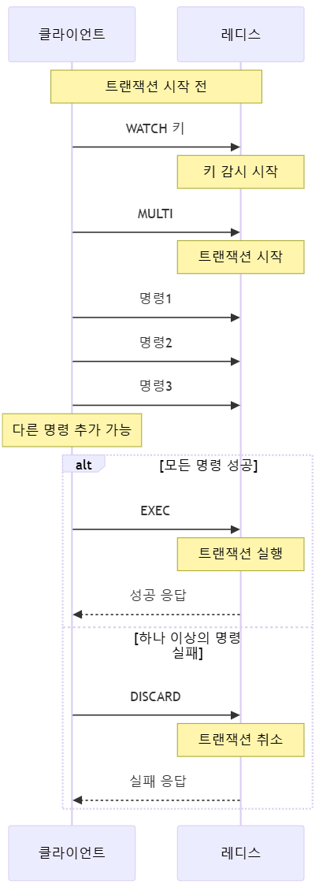
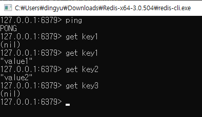

# 목적

일반적인 Transaction이 필요한 RDB의 경우, 자체적으로 격리 수준을 설정하거나 Rollback과 Commit을 통해 트랜잭션을 구현한다.

하지만 Redis는 어떠한가?
Redis에서 데이터의 일관성과 원자성을 보장받기 위해 주어진 옵션은 그렇게 명확하지 않다.

하나의 **Transaction을 격리** 시켜야 하며, **All or Nothing 원자성**을 Redis에서 지켜야 할 때에 도움이 되고자 기록합니다.

---

# 선택지

1. Redis TxPipeline
2. Lua Script

---

## Redis TxPipeline

Redis에서 여러 Command를 일괄적으로 처리하기 위해 떠올리게 되는 것은 Pipeline일 것이다

Pipeline은 연결된 Redis Client로 여러 개의 커맨드를 한번에 보내고 여러개의 응답을 한번에 받는 것을 가능하도록 한다

다만 일반적인 파이프라인이 트랜잭션이 보장된다고 할 수 없다. 즉, 파이프라인 실행 도중 해당 데이터에 대하여 다른 커맨드로 인해 변경될 수 있으며 데이터의 일관성에 문제가 발생할 수 있다

### Edge Case

1. `네트워크 지연`: Redis Pipeline을 사용하면 여러 개의 커맨드를 한 번에 보내고, 한 번에 여러 개의 응답을 받는 것이 가능합니다. 그러나 네트워크 지연으로 인해 커맨드가 서버에 도착하는 순서와 응답이 도착하는 순서가 일치하지 않을 수 있습니다. 따라서 응답이 먼저 도착하는 경우에도, 실제로는 나중에 실행한 커맨드의 결과일 수 있습니다.
2. `다중 스레드 환경`: Redis 서버는 다중 스레드로 동작하며, 여러 클라이언트가 동시에 요청을 보낼 수 있습니다. 따라서 여러 클라이언트가 동시에 Pipeline을 사용할 경우, 커맨드의 실행 순서가 보장되지 않을 수 있습니다.
3. `Redis 서버 설정`: Redis 서버의 설정에 따라 일관성이 달라질 수 있습니다. 예를 들어, Redis 서버가 "slaveof" 설정을 사용하여 데이터를 레플리케이션하는 경우, 일관성이 보장되지 않을 수 있습니다.

이를 해결하는 것이 **TxPipeline**이다

### Pros

- `트랜잭션 보장`: TxPipeline을 사용하면 일괄 처리된 커맨드는 하나의 트랜잭션으로 간주되어, 실행 중 다른 커맨드가 중간에 끼어들지 않습니다. 이로써 데이터의 일관성을 보장합니다.
- `성능 향상`: 여러 개의 커맨드를 한 번에 보내므로 네트워크 오버헤드를 줄일 수 있어 성능이 향상될 수 있습니다.
- `원자성 보장`: TxPipeline 내에서 실행되는 모든 커맨드는 성공하거나 실패되며, 롤백은 지원하지 않습니다.

### Cons

- `메모리 사용`: 모든 커맨드와 결과가 메모리에 저장되므로, 큰 트랜잭션을 처리할 때 메모리 사용량이 증가할 수 있습니다.
- `복잡성`: TxPipeline은 다른 파이프라인과 혼합해서 사용할 때 주의가 필요하며, 트랜잭션의 범위를 신중하게 관리해야 합니다.

### 테스트


> WATCH를 통해 특정 키의 변경을 감시하고, 이를 통해 트랜잭션의 일관성을 보장할 수 있습니다. 
만약 WATCH 중에 감시된 키가 다른 클라이언트에 의해 변경되면, 해당 트랜잭션은 실패
> 

ex. TxPipeline 도중 에러 발생 시나리오

```bash
MULTI
SET key1 value1
SET key2 value2
SET key3 value3
EXEC
```

시나리오 : **SET key2 value2 커맨드가 실패**

- CASE 1 : 메모리 부족

```bash
 "OOM command not allowed when used memory > 'maxmemory'"

```

- CASE 2 : 잘못된 데이터 형식

```bash
"WRONGTYPE Operation against a key holding the wrong kind of value"

```

일반적으로 일어날 수 있는 경우가 드무며, 가장 예상 가능한 시나리오는 Redis Client Connection이 끊어진 케이스가 될것이다.
만약 Client Connection이 끊어진 경우, 실패한 키에 대하여 롤백을 수동으로 진행한다 하여도 롤백 자체가 수행되지 않기 때문에 완벽한 해답은 되지 않는다

즉, TxPipeline은 일관성은 보장 되지만 완벽한 원자성은 보장되지 않는다

---

## Lua Script

Lua 스크립트 내에서 여러 Redis 커맨드를 실행하고, 이를 원자적으로 실행할 수 있다

### Edge Case

1. **스크립트 전송 중 네트워크 지연이나 중단**: 클라이언트가 Lua 스크립트를 Redis 서버로 전송하는 과정에서 네트워크 지연이나 중단이 발생하면, 스크립트는 서버에 제대로 도달하지 못하고 실행되지 않을 수 있습니다.
2. **실행 결과 수신 중 네트워크 문제**: 스크립트가 성공적으로 실행된 후, 그 결과를 클라이언트가 수신하는 과정에서 네트워크 지연이나 중단이 발생할 수 있습니다. 이 경우, 스크립트는 Redis 서버에서 정상적으로 실행되었지만, 클라이언트는 실행 결과를 받지 못할 수 있습니다.

### Pros:

- `경량 및 빠른 실행`: Lua는 경량 스크립팅 언어로, 실행 시스템 자원을 적게 소모하며 빠르게 실행됩니다. 이러한 특징은 임베디드 시스템이나 게임 엔진 등 리소스가 제한된 환경에서 유용합니다.
- `내장 스크립트 언어`: Lua는 많은 애플리케이션과 게임 엔진에서 내장 스크립트 언어로 사용됩니다. 이는 애플리케이션의 확장성을 높이고 사용자 정의 스크립트를 통해 기능을 확장하기에 용이합니다.
    - 흔히 이전에 Statement로 관리 되던 DB 명령 방식
    - ORM이 등장한 배경을 생각해보았을 때, 커맨드(query)를 코드로 관리할 수 없기 때문에 Lua를 사용함에 회의적인 개인적 생각
- `가독성과 간결성`: Lua는 간결하고 가독성이 높은 문법을 가지고 있어 쉽게 이해하고 작성할 수 있습니다.
    - lua Script를 위해 문법을 수정해야 하기 때문에 러닝 커브가 동반될 수 있음

### Cons:

- 작은 생태계: 다른 언어에 비해 Lua의 생태계는 상대적으로 작습니다. 따라서 다양한 라이브러리 및 모듈을 찾기 어려울 수 있습니다.
- 제한된 자료형: Lua는 몇 가지 기본 자료형만을 지원하며, 정수와 부동 소수점 수의 구분이 없어서 정확한 숫자 처리가 어려울 수 있습니다.
- 엄격한 문법: Lua는 문법 검사가 엄격하며, 초보자에게는 초기 학습 곡선이 높을 수 있습니다.
- 쓰레드 처리 어려움: Lua는 기본적으로 싱글 스레드 환경에서 동작하며, 멀티 스레드 처리가 어려울 수 있습니다.

### 테스트

결국 Lua 또한 트랜잭션에 대한 롤백은 지원하지 않습니다.

기본적으로 삽입 요청 시, Validation을 체크하는 것을 고려할 때에 일어날 수 있는 최악의 시나리오는 네트워크의 단절이며 해당 방법은 어떠한 방법으로도 복구 될 수 없습니다.

Redis Pipeline에 저장된 커맨드가 원자적으로 한번에 실행 될 수 없기 때문입니다

**테스트 시나리오**  

key1 ~ key5 까지 세팅하는 도중 에러 발생 시, 롤백 테스트

- 실행 코드 (go)
    
    ```go
    package main
    
    import (
    	"context"
    	"fmt"
    
    	"github.com/go-redis/redis/v8"
    )
    
    var ctx = context.Background()
    
    func main() {
    	rdb := redis.NewClient(&redis.Options{
    		Addr: "localhost:6379", // Redis 서버 주소
    	})
    
    	luaScript := `
        for i = 1, #KEYS do
            if KEYS[i] == 'key3' then
                error('key3 설정 시 에러 발생')
            else
                redis.call('SET', KEYS[i], ARGV[i])
            end
        end
        `
    
    	keys := []string{"key1", "key2", "key3", "key4", "key5"}
    	values := []interface{}{"value1", "value2", "value3", "value4", "value5"}
    
    	err := rdb.Eval(ctx, luaScript, keys, values...).Err()
    	if err != nil {
    		fmt.Printf("Lua 스크립트 실행 중 오류 발생: %v\n", err)
    		return
    	}
    
    	fmt.Println("Lua 스크립트 실행 완료")
    }
    ```
    

[결과]


---

# 종합
## Pros & Cons
|                | TxPipeline                                                                                    | Lua Script                                                             |
| -------------- | --------------------------------------------------------------------------------------------- | ---------------------------------------------------------------------- |
| **특징**         | - Redis Pipeline과 동일한 코드로 수행 가능 <br> - 데이터 무결성 보장 <br> - 낙관적 락 (Watch 중인 키에 변경이 일어나면 트랜잭션 실패) | - Lua 언어를 통해 스크립트를 작성해야 함 <br> - 데이터 무결성 보장 <br> - 스크립트 전체가 하나의 단위로 실행 |
| **트랜잭션 롤백 여부** | 불가능                                                                                           | 불가능                                                                    |
| **단점**         | - Lua에 비해 성능이 안 좋음 (Pipeline과는 비슷)                                                            | - 스크립트를 관리하는 것 또한 리소스가 소모됨 <br> - 러닝 커브                                |

- 두 가지 선택지 모두, **트랜잭션 실패 시 롤백을 제공하지 않지만 데이터의 무결성은 보장됨.**
- Value 삽입 전에 **유효성 검증**을 하기 때문에 데이터 삽입으로 인한 에러 발생 가능성은 적음.
- **최악의 경우**:  
  - Redis Connection이 끊어진 경우, Redis 트랜잭션 실패 시 **삭제하여 롤백을 구현해야 함**.
  - 그러나 커넥션이 끊어진 상태라면 **삭제 요청 또한 실패할 가능성이 높음**.
- Redis Sentinel을 사용할 경우, **가용성에 대한 엣지 케이스를 고려해야 하는가?**


## 벤치마크
Redis에 1,000개 Key 세팅 기준

| 항목 | 테스트 횟수 | 평균 실행 시간 (ms) |
| --- | --- | --- |
| Lua 스크립트 | 1424 | 0.83 |
| TxPipeline | 460 | 2.56 |
| Pipeline | 506 | 2.34 |
- 성능차이가 크리티컬 하지 않으며, 무결성은 보장되는 것이 좋기 때문에 TxPipeline 또는 Lua 스크립트를 사용하는 것 권장