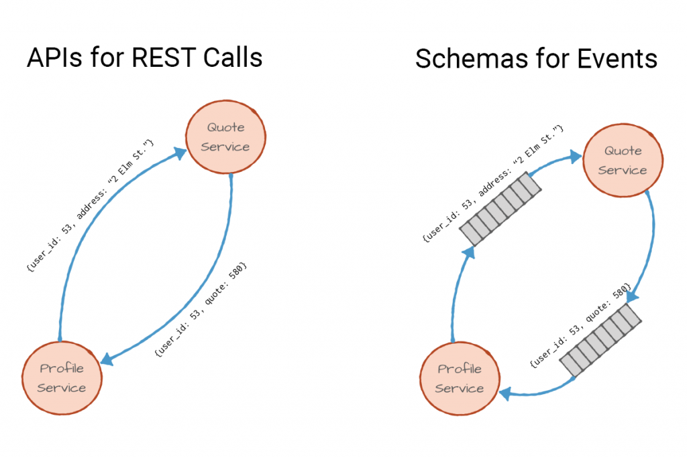
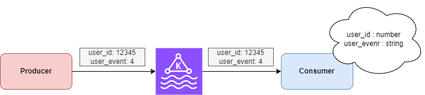
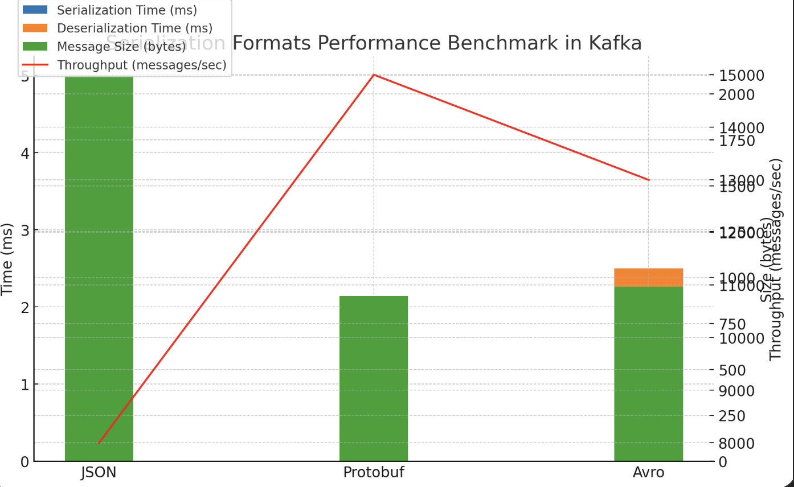
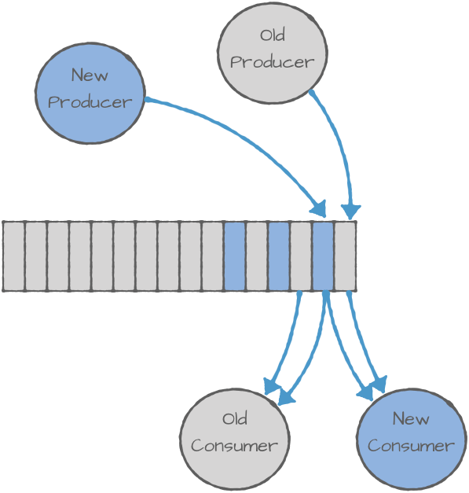
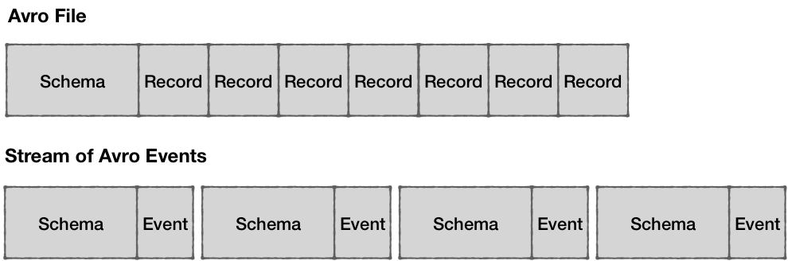
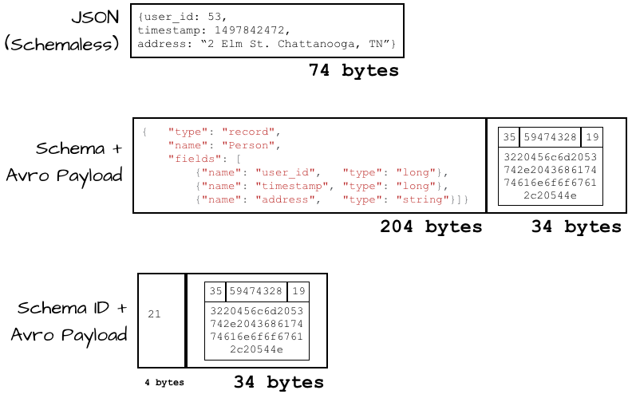

# Introduction

- In Event-Driven Architecture (EDA) that aims for loose coupling and high scalability, paradoxically, **event schemas** create a strong contract between `Producers` and `Consumers`.
- Why do we use schemas and Schema Registry in the first place?

# Purpose of Event Schema

- Defines the structure of data, standardizes message formats, and ensures **data consistency** between `Producers` and `Consumers`.
- Maintains **compatibility** between `Producers` and `Consumers`.
- Enables data validation.

Consider the familiar REST API as an analogy!



When services communicate, they agree on an interface — typically documented using OpenAPI or similar specifications — describing required input and expected output.

The same applies to event streams: 

When a `Producer` publishes a pre-defined event, the `Consumer` processes it based on the agreed schema.

**Example 1** — Suppose a schema was agreed as follows:

```json
{
    "user_id": number,
    "user_action": "string"
}
```

However, the `Producer` mistakenly emits `user_action` as a code rather than a string:



(This triggers the Consumer's rage 🤢)

Just like you wouldn't insert records into a database without designing an ERD, schema design is **mandatory** in EDA.

# Event Schema Formats

Choosing a schema format? Here's a comparison:

| Format         | Advantages | Disadvantages |
|----------------|------------|---------------|
| **JSON** (JavaScript Object Notation) | Human-readable text format. Widely supported across languages. | Large message size. No enforced schema, risking data integrity. |
| **Protobuf** (Protocol Buffers) | Compact binary format by Google. Strong typing with enforced schemas. Faster parsing, smaller messages compared to JSON. | Not human-readable. Requires predefined schemas. Smaller ecosystem than JSON. |
| **Avro** | Schema-based, compact binary format. Supports Schema Evolution without breaking existing programs. | Less popular than JSON/Protobuf. Tooling/library support may be limited. |

Since event streams involve network transmission, **data size matters**.

If you're used to writing API specs, JSON might feel natural — but should you really default to it?

# Checklist for Choosing JSON ("Die-Hard JSON Fan")

If you answer "yes" to all below, JSON could still be a good fit:

- [x] Is the data size small?
- [x] Can you tolerate serialization/deserialization overhead?
- [x] Is strong type validation unnecessary?
- [x] No plans to use Schema Registry?
- [x] No expected major growth in data volume?
- [x] Need for human-readable debugging?

# Advantages of Avro / Protobuf

- **Strong Type Validation**
    - Serialization fails if fields do not match specified types (e.g., ENUM, float).
- **High Serialization/Deserialization Performance**
    - Binary formats like Avro and Protobuf require no parsing, unlike text-based JSON.
- **Schema Evolution Support**
    - New fields can be ignored by older consumers without issues.



**Benchmark:** Even for small payloads, JSON lags behind Avro/Protobuf by more than 2x in performance.

**And the performance gap widens as payload size grows.**

# Impact of Data Size on Performance

Since JSON is stored as **text** instead of **binary**, it consumes more space:

- Larger Kafka volumes
- Degraded produce/consume performance
  - Larger data costs more during ISR (in-sync replication)
  - Larger payloads cause slower fetches during consumption

# Schema Registry

Summarizing the core benefits of event schemas:
- Consistency
- Performance
- Compatibility

A **Schema Registry** centrally manages and validates Kafka message schemas, ensuring compatibility between producers and consumers.

## Schema Evolution and Compatibility

**Example 2:** Think of moving from v1 API to v2 API.
- Keep backward compatibility initially.
- Gradually migrate clients.
- Eventually deprecate the old API.

In event streams, updating schemas means notifying `Consumers` about changes. But which should update first, `Producer` or `Consumer`?

Fortunately, Schema Registry solves this:



- `Producer` publishes events using the new v2 schema.
- `Consumer` detects schema changes and fetches the new version dynamically.

Thus enabling **smooth schema evolution without service disruptions**.

## Efficient Event Management

Is using a Schema Registry mandatory?

No. **Choosing the right tool depends on your needs.**

### Schema Awareness in Kafka Streams

For Avro/Protobuf (binary formats), schemas are essential because raw binary data isn't self-describing:



### Event Size Considerations

While Avro/Protobuf compress data well, embedding full schema info in each event would negate their size advantage:



Using **schema IDs** instead (with Schema Registry) minimizes event size while preserving compatibility.

**Note:**
- If both `Producer` and `Consumer` share identical `.proto` files, they can theoretically skip embedding schemas.
- But this approach has downsides:
  - Tight coupling between producer/consumer.
  - No dynamic schema updates.
  - Requires redeploying both producer and consumer on schema changes.

## AWS Glue vs. Confluent Schema Registry

| Feature | AWS Glue Schema Registry | Confluent Schema Registry |
|---------|---------------------------|---------------------------|
| Schema Updates | Adds as new version | Adds as new version |
| URL Stability | ✅ (ARN-based) | ✅ (REST API-based) |
| Auto-use of Latest Version | ❌ (Needs config) | ✅ (Automatic) |
| Kafka Compatibility | ✅ (Works with AWS MSK) | ✅ (Works with Confluent Kafka) |

# Why Use Schema Registry?

1. **Maintains Data Consistency**
   - Ensures producer messages match consumer expectations.
   - Prevents business logic errors.
2. **Supports Schema Evolution**
   - Add/change fields without breaking existing consumers.
3. **Centralized Schema Management**
   - No need for manual schema file syncing.
4. **Minimizes Kafka Message Size**
   - Sends lightweight schema IDs instead of full schemas.
5. **Provides Schema Validation**
   - Catches invalid payloads early.
6. **Enables Real-time Schema Updates**
   - Consumers fetch updated schemas dynamically.
7. **Configurable Compatibility Modes**
   - Prevents breaking changes.
8. **Versioned Schema History and Easy Rollbacks**
   - Retrieve or roll back to any historical schema version.

# References

- [Confluent](https://www.confluent.io/blog/schemas-contracts-compatibility/)
- [Oliveyoung Tech Blog](https://oliveyoung.tech/2023-10-04/oliveyoung-b2b-msk-connect-introduction/)
- [Exploring Data Serialization in Apache Kafka](https://www.linkedin.com/pulse/exploring-data-serialization-apache-kafka-json-protobuf-joe-z-tb2fc/)