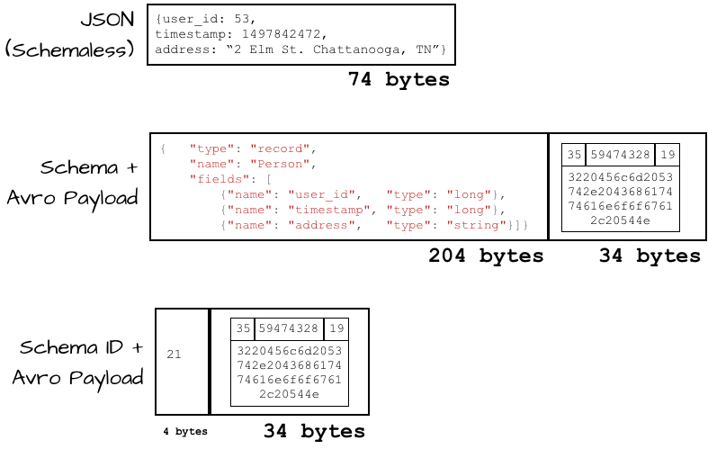

# 들어가기에 앞서...
- 느슨한 결합을 유지하면서 높은 확장성을 보장하는 EDA에서 역설적이지만 `Producer` `Consumer` 간의 강한 결합을 갖게하는 **이벤트 스키마**
- 왜 사용하고 어떤 이유로 `Schema Registry`를 사용할까?

## 이벤트 스키마의 목적
- 데이터의 구조를 정의하고, 메시지 형식을 표준화하며, `Producer`와 `Consumer` 간의 **데이터 일관성을 유지**
- `Producer`와 `Consumer` 간의 **호환성 유지**
- 데이터에 대한 검증

백엔드라면 익숙한 REST API를 예시로 들어보자!


각 서비스가 서로 통신하기 위해서는 사전에 정의된 인터페이스로 Client와 Server 간의 일종의 "약속"을 맺게 된다

서로 일관된 형태로 통신하기 위하여 OpenAPI 혹은 문서를 통해서 사용자는 어떤 값을 입력해야 하는지, 그리고 어떤 값을 반환 받게 되는지에 대한 협의를 하게 되는데...

API가 아닌 이벤트 스트림에서도 동일하다

`Producer`가 사전 정의된 이벤트에 대하여 발행하면, `Consumer`는 사전 정의된 이벤트를 읽어와 비즈니스 로직을 수행한다.

[예시-1] `Producer`와 `Consumer`가 사전에 협의를 통해 스키마를 정의하였다고 가정해보자.
```json
{
    "user_id" : number,
    "user_action" : "string"
}
```
`Producer`와 `Consumer`는 사전에 이벤트 스키마를 통해 협의를 했음에도 불구하고 `Producer`는 action string이 아닌 action code로 이벤트를 발행하였다.


(효과는 대단했다! Consumer의 분노 게이지가 Max다 🤢)

`ERD`를 만들지도 않고 DB에 삽입하는 일이 없듯이... 이벤트 드리븐 아키텍처에서 개발함에 있어 스키마 설계는 선택사항이 아닌 강제사항이라 생각된다.

## Event Schema
이벤트 스키마가 어째서 필요한지는 어느정도 설명이 되었다 생각된다.

스키마는 당연히 설정해야 겠지만 포맷에 결정 고민이 된다면 아래 표를 참고해보자!

| 형식         | 장점 | 단점 |
|-------------|------------------------------------------------|------------------------------------------------|
| **JSON** (JavaScript Object Notation) | 사람이 읽기 쉬운 텍스트 기반 포맷  <br> / 대부분의 프로그래밍 언어에서 널리 지원됨 |  텍스트 포맷으로 인해 크기가 큼  <br> / 스키마 강제가 없어서 데이터 무결성 문제 발생 가능 |
| **Protobuf** (Protocol Buffers) |  Google에서 개발한 빠르고 효율적인 바이너리 포맷  <br> / 스키마 기반으로 데이터 구조를 강제할 수 있음  <br> / JSON보다 빠른 파싱 속도 및 작은 메시지 크기 | 사람이 읽을 수 없는 바이너리 포맷  <br> / 사전 스키마 정의가 필요함  <br> / JSON에 비해 생태계가 상대적으로 작음 |
| **Avro** | 스키마 기반으로 데이터 구조를 관리할 수 있음  <br> / 작은 메시지 크기 (Compact Binary Format)  <br> / 배포된 프로그램을 깨뜨리지 않고 스키마 진화(Schema Evolution) 지원 | JSON이나 Protobuf보다 덜 널리 사용됨  <br> / 일부 환경에서는 도구 및 라이브러리 지원이 부족할 수 있음 |

스트림 또한 네트워크 통신을 거치기 때문에, 결국 중요한 것은 데이터의 사이즈일 것이다. 

API 명세를 자주 작성하는 엔지니어라면 단순하게 쉽고 편한 `JSON`을 사용할 것이다. 다만... 이 경우 명확하게 `JSON`을 사용해야 할 필요성이 있는가? 를 고려해보시길 바란다.

### 얼죽JSON을 위한 체크리스트
아래 여건을 모두 만족한다면 JSON을 선택하였더라도 매우 합리적인 선택일 것이다!
- [x] 데이터의 크기가 작은가?
- [x] 역/직렬화에 드는 비용을 감수할 것인가?
- [x] 강타입 유효성 검증이 필요하지 않은가?
- [x] Schema Registry 사용할 생각이 없는가?
- [x] 데이터가 점진적으로 더 많이 유입될 여지가 없는가?
- [x] 디버깅 용이성을 위해서 눈으로 확인이 가능한 모델이 필요한가?

### Avro / Protobuf의 장점
- 강타입 유효성 검증을 통해 보다 일관된 데이터를 받을 수 있다
    - ex. ENUM, float 등과 같이 지정된 타입이 아닐 경우 직렬화 자체가 실패함
- 역/직렬화에 드는 비용을 최소화 할 수 있다
    - 본래 역/직렬화 성능은 압축률에 반비례한다 (`JSON`은 압축되지 않음). 단 추가적인 파싱 문제로 `JSON`은 매우 비효율적임
    - `JSON`은 텍스트 기반이므로 추가적인 `Parsing`이 필요함
    - `Avro`/`protobuf`는 바이너리 기반으로 `Parsing`이 필요없음
- 상위/하위 호환성을 지원한다
    - 필드가 추가될 때, 해당 필드에 대한 모델이 반영되어 있지 않더라도 무시하고 정상 동작함


실제 벤치마크 결과에서 JSON 비록 작은 데이터사이즈임에도 불구하고 직렬화와 역직렬화 성능이 2배 이상의 차이를 보였다.

놀라운 점은 데이터 크기가 커질수록 이 격차는 보다 확연해진다는 점이다. 

### 데이터 사이즈와 성능의 상관 관계
`JSON`은 BINARY가 아닌 TEXT의 형태로 저장되기에 `Avro`나 `Protobuf`에 비하여 보다 큰 공간을 차지한다.
- `Kafka Volume`의 증가 : JSON 이벤트 사용을 위해 물리적으로 보다 큰 용량을 사용해야 함
- `Broker`에서 이벤트 생산/소비의 성능 저하 : 본질적으로 네트워크 통신에 있어 이동되는 데이터의 크기가 커질수록 성능이 저하될 수 밖에 없음
    - `Produce` 단계에서 `In Sync Replication`에 보다 큰 비용이 발생
    - `Consume` 단계에서 이벤트를 가져오는 데에 보다 큰 비용이 발생

## Schema Registry
이벤트 스키마를 정리하자면 주요하게 아래 3개를 보장한다
- 일관성
- 성능 향상
- 호환성

`Schema Registry`는... Kafka 메시지의 데이터 구조(스키마)를 중앙에서 관리하고 검증하여 생산자와 소비자가 데이터 호환성을 유지하도록 돕는 서비스이다


### 스키마 진화와 호환성
[예시-2] API에서 v1 API를 v2 API로 전환한다 생각해보자. 기존 하위 호환성을 지키되 v1 API 사용자에게 v2로 전환을 부탁하고 ... 몇개월이 지나 v1 API의 유입이 없음을 확인한 뒤에야 v2로 완전 전환이 가능할 것이다.

이벤트 스트림에서는 어떨까?

v2 스키마로 업데이트 이후에, 해당 이벤트를 구독중인 `Consumer`들에게 어떠한 필드가 추가되었는지 알리고.. `Consumer`는 필요에 따라 추가 구현을 진행하게 될 것이다.

그럼 `Producer`가 먼저 업데이트되어야 하는가? `Consumer`가 먼저 업데이트 되어야 하는가? 닭이 먼저냐 계란이 먼저냐??

다행히도 스키마 레지스트리를 사용하면 이러한 문제는 해결된다!


스키마 레지스트리에 스키마를 등록하면, URL은 유지한 채로 `Consumer`는 최신 스키마 버전을 가져오게 된다.

1. Producer 에서 새로운 스키마 버전으로 이벤트가 발행됨 (v2)
2. Consumer 는 기존 캐싱된 스키마 버전과 다름을 인지하고 새로운 스키마 버전을 조회
3. 새로운 스키마 버전으로 비즈니스 로직 수행

이처럼 하위호환성을 유지하면서 스키마 변경이 자유로워진다

### 효율적인 이벤트 관리
무조건 `Schema Registry`가 좋으냐..? `Event Schema`는 필수인가..?

기술선택에 **Must**는 없다. 상황에 따라 최선의 선택을 하는것은 엔지니어의 역량에 달려있다 생각한다.

#### Kafka Stream에서의 Schema Event 이해
Schemaless인 `JSON`과는 달리, `Avro`와 `Protobuf`의 경우 Schema를 포함하여 Event와 함께 `Produce` 된다
> `Avro`와 `Protobuf`의 경우 바이너리 포맷이며 스키마 없이 해석할 수 없기 때문에, 데이터를 어떻게 해석해야 하는지 스키마 정보가 요구됨


#### 이벤트 데이터 사이즈 비교
스키마 이벤트의 장점으로 설명하였던 압축된 작은 바이너리 데이터는 스키마 정보를 포함하는 순간 퇴색된다.

이처럼 스키마 정보를 포함하는 순간 압축률이 높다 하더라도 보다 큰 데이터일 수 밖에 없다.

이러한 단점을 극복하는데 있어 스키마 ID는 이벤트 사이즈를 최소화할 수 있으며 호환성 보장이 가능하다.

> 사실 `Producer`와 `Consumer`에서 동일한 스키마 파일이 있다면 굳이 스키마 정보를 포함하여 이벤트로 발행하지 않아도 가능하다.
단, `Submodule`의 단점은 다음과 같다
> - `Producer`와 `Consumer`가 같은 `.proto`를 사용해야 하는 전제 조건이 강함
> - 스키마 변경이 동적으로 반영되지 않음
> - 스키마 변경이 있을 경우, `Producer`와 `Consumer`를 모두 재배포해야 함


### AWS Glue 와 Schema Registry 차이
MSK를 사용하는 경우, 별도 AWS Glue를 사용하여야 스키마 레지스트리를 사용할 수 있다.
이에 대한 차이는 다음과 같다.
| **기능**            | **AWS Glue Schema Registry**  | **Confluent Schema Registry** |
| ----------------- | ----------------------------- | ----------------------------- |
| **스키마 업데이트 방식**   | 새로운 버전으로 추가됨                  | 새로운 버전으로 추가됨                  |
| **스키마 URL 유지 여부** | ✅ 유지됨 (ARN 기반)                | ✅ 유지됨 (REST API 기반)           |
| **자동 최신 버전 사용**   | ❌ 기본적으로 자동 X (Consumer 설정 필요) | ✅ 기본적으로 자동 사용                 |
| **Kafka 호환성**     | ✅ AWS MSK와 연동 가능              | ✅ Confluent Kafka와 기본 연동      |

## 왜 Schema Registry를 사용하냐고 물으신다면?
1. `Producer`와 `Consumer` 간 데이터 일관성 유지
    - `Producer`가 보내는 데이터와 `Consumer`가 기대하는 데이터 형식을 검증
    - 데이터 불일치로 인한 **비즈니스 로직 오류 방지**

2. Schema Evolution(스키마 진화) 지원 → 하위/상위 호환성 보장
    - 새로운 필드 추가 시 기존 `Consumer`가 깨지지 않도록 유지 가능
    - 기존 필드 삭제나 변경 시에도 안전한 데이터 처리가 가능

3. 스키마 관리의 중앙화 → 변경 및 배포 프로세스 단순화
    - 스키마를 중앙에서 관리하여 모든 서비스가 동일한 기준을 따름
    - 개별 서비스에서 **.proto 파일을 관리하지 않아도 자동으로 최신 버전 적용 가능**

4. Kafka 메시지 크기 최소화 (스키마 ID 활용)
    - **스키마 정보를 메시지에 직접 포함하지 않고**, Schema Registry에서 스키마 ID만 전송
    - **네트워크 비용 절감 + Kafka 저장 공간 절약**

5. Schema Validation(데이터 유효성 검증) 기능 제공
    - `Producer`가 잘못된 데이터(예: 필드 누락, 타입 불일치)를 보내면 **Schema Registry에서 즉시 차단**
    - `Consumer`가 유효한 데이터만 수신하여 안정적인 서비스 운영 가능

6. 실시간 스키마 변경 감지 및 자동 업데이트 가능
    - `Consumer`가 Schema Registry에서 최신 스키마를 조회하여 **동적으로 변경된 필드를 활용 가능**
    - 서비스 재배포 없이 데이터 구조 변경 가능

7. Schema Compatibility Mode 설정 가능
    - 하위 호환성(Backward Compatibility), 상위 호환성(Forward Compatibility) 등의 정책을 설정하여 **스키마 변경으로 인한 장애 방지**

8. 스키마 조회 및 버전 관리 용이
    - REST API 혹은 UI를 통해 기존 스키마 및 변경 이력을 조회할 수 있어 유지보수 편리
    - 특정 시점의 스키마 버전으로 롤백 가능

## REFS
- [Confluent](https://www.confluent.io/blog/schemas-contracts-compatibility/)
- [Oliveyoung](https://oliveyoung.tech/2023-10-04/oliveyoung-b2b-msk-connect-introduction/)
- [Exploring Data Serialization in Apache Kafka](https://www.linkedin.com/pulse/exploring-data-serialization-apache-kafka-json-protobuf-joe-z-tb2fc/)