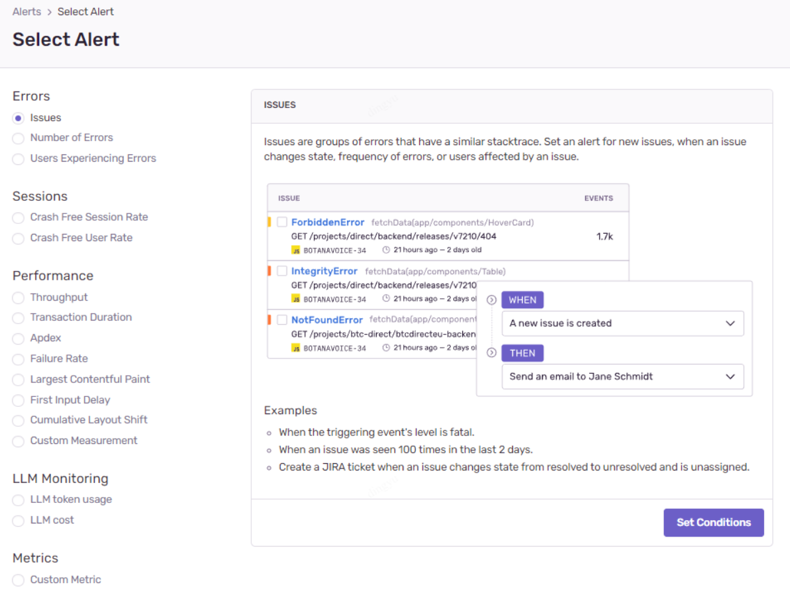
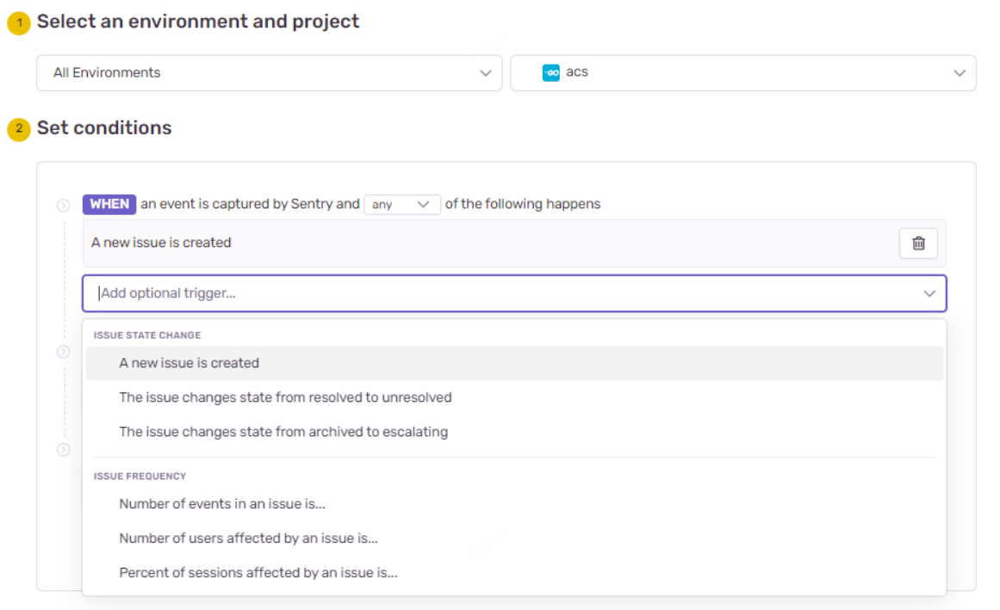
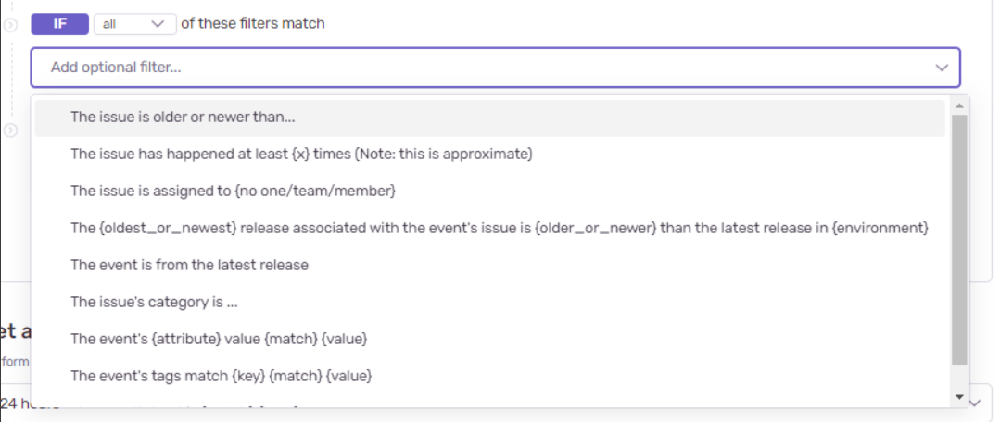
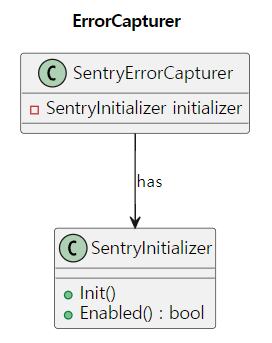

# Background

- Developers were manually monitoring logs for incident response.
- However, there were limitations with log monitoring:
  - **Elasticsearch field mapping errors** due to **field type mismatches** causing **log event drops**.
  - If system logs were required (e.g., for stack traces), developers had to request them separately from the system engineers (SE), resulting in operational overhead.

# Goal

- Establish a common Sentry integration standard for Go-based projects.
- Provide feature specifications and guidelines for Sentry usage.
- Build a stable service foundation through faster incident response after Sentry adoption.

> This document assumes that a Sentry account and a Sentry project are already set up.

# About Sentry

1. **Capture Exception**

Automatically detects and records exceptions and errors in applications. Sentry provides stack traces and environment information at the time of error occurrence, making it easier to identify root causes.

2. **Transaction Monitoring**

Monitors application performance by tracking transactions such as web requests or API calls, providing response times, success rates, and error rates.

3. **Tracing**

Tracks transactions in detail, analyzing service-to-service calls and database queries to identify bottlenecks.

4. **Alerts**

Manages issues and notifies via email, Slack, etc., when problems arise. Developers can be assigned to issues and collaborate on resolutions.

5. **Release Tracking**

Tracks application versions and analyzes the impact of new releases on error rates, helping detect problems introduced by recent deployments.

### Sentry Alerts

Set up Sentry alerts integrated with collaboration tools for easy developer response.

#### Setup Step-by-Step

Dashboard > Alerts > Create Alert


**Trigger Setup**

- **Issues**: Trigger alerts based on stacktrace patterns (e.g., API HTTP status code-based, service category-based).
- **Number of Errors**: Trigger alerts based on error occurrence counts.
- **Users Experiencing Errors**: Trigger alerts when a threshold number of users experience errors (e.g., 100 users failing to log in).



**Detailed Conditions**

- WHEN: Define when the alert should trigger (any vs. all conditions).
- IF: Specify detailed conditions like tags, frequency, or categories.




**Action Selection**

- Send notifications to Email, Slack, Teams, etc.


# Development

### Client Options

- **DSN**: Unique string identifying the Sentry project.
- **Environment**: Specify the runtime environment (e.g., production, staging, development).
- **Release**: Track the application version where the error occurred.
- **SampleRate**: Control the proportion of reported events (e.g., 0.1 means 10% sampling).
- **TracesSampleRate**: Similar to SampleRate but for performance data.
- **BeforeSend**: Callback to modify/filter events before reporting.
- **AttachStacktrace**: Include stack traces in logs.
- **ServerName**: Specify server name for better error grouping.
- **Integrations**: Set additional integrations with frameworks and libraries.
- **Transport**: Customize event transport, including timeout settings.


### Initialize

Best practice is to call `sentry.Init()` at the application's entry point (`main.go`).

```go
err := sentry.Init(
    sentry.ClientOptions{
        Dsn:              config.Sentry.DSN,
        SampleRate:       config.Sentry.SampleRate,
        EnableTracing:    config.Sentry.EnableTrace,
        Debug:            config.Sentry.Debug,
        TracesSampleRate: config.Sentry.TracesSampleRate,
        Environment:      config.Sentry.Environment,
        AttachStacktrace: true,
        Transport: &sentry.HTTPSyncTransport{
            Timeout: config.Sentry.Timeout,
        },
    },
)
```

### Capture Exception

Capture and track exceptions automatically:

```go
hub := sentry.GetHubFromContext(ctx)
if hub == nil {
    hub = sentry.CurrentHub().Clone()
    ctx = sentry.SetHubOnContext(ctx, hub)
}
hub.CaptureException(err)
```

#### Stack Trace Differences: Go `errors` vs `pkg/errors`

- **errors package**: Does **not** capture stack traces.
- **github.com/pkg/errors**: **Includes stack traces** automatically.

Test example:

```go
return pkgErr.Wrap(PkgErr1, PkgErr2.Error())
```

---

# Scope()

Scope allows attaching contextual metadata (e.g., request parameters) to events.

```go
hub := sentry.GetHubFromContext(r.Context())
if hub == nil {
    hub = sentry.CurrentHub().Clone()
    r = r.WithContext(sentry.SetHubOnContext(r.Context(), hub))
}
hub.Scope().SetRequest(r)
```

---

# Sentry Advancement

### SentryInitializer

Manages singleton initialization of the Sentry client:

```go
type SentryInitializer struct {
    conf    *Config
    enabled bool
    mutex   sync.RWMutex
}

func (si *SentryInitializer) Init() error { ... }
func (si *SentryInitializer) Enabled() bool { ... }
```

Manages concurrent access safely with mutex.

### ErrorCapturer

Captures exceptions through the Sentry Hub:



```go
type ErrorCapturer interface {
    CaptureError(ctx context.Context, err error)
}
```

Handles Hub setup and error capture internally.

### RecoverMiddleware

Handles panics and automatically logs to Sentry:


```go
defer func() {
    if err := recover(); err != nil {
        hub.RecoverWithContext(r.Context(), err)
        // Log stack trace
    }
}()
```

Even in panic scenarios, proper logging and Sentry reporting is ensured.

---

> Despite its cost, **Sentry** offers great convenience for both APM and error capture management!