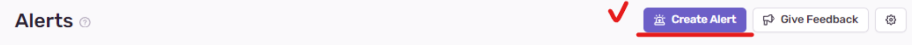
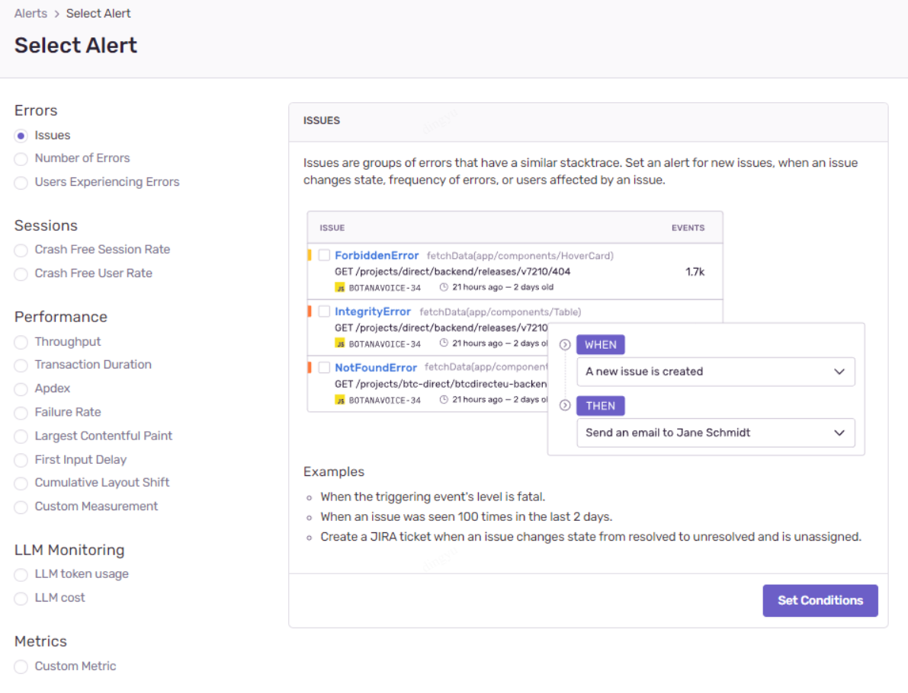
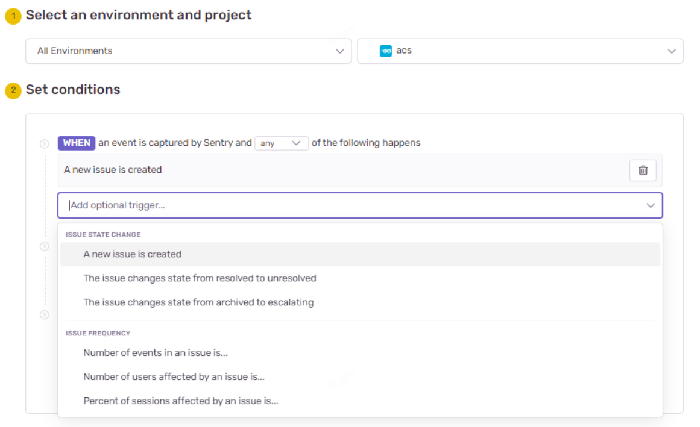
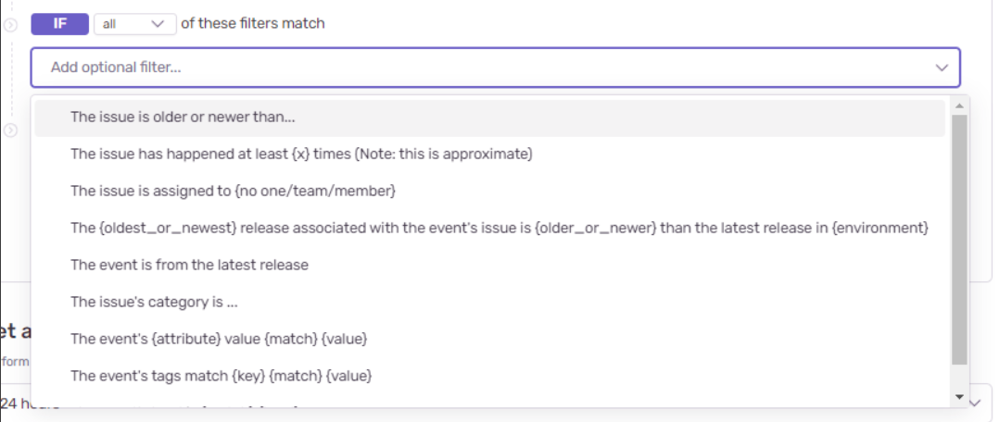
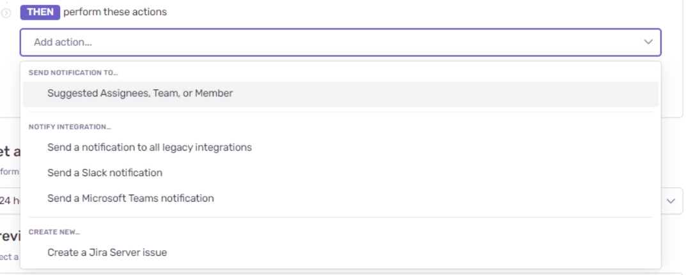
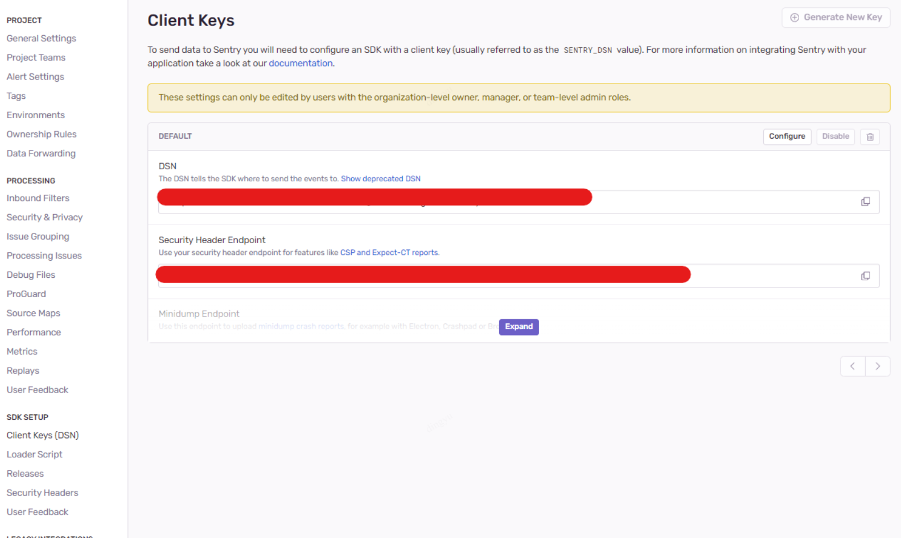
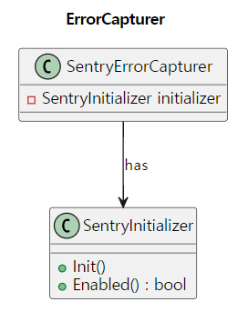
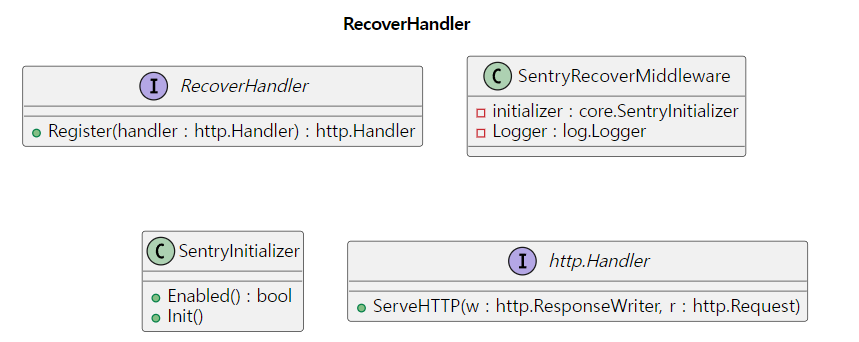

# 배경
---
- 개발자가 직접 로그 모니터링을 통하여 장애 대응
- 아래와 같은 이유로 로그 모니터링에도 제약 사항이 존재
   - **Field Type의 불일치**로 인한 **Elasticsearch field mapping Error** 발생 → 로그 이벤트의 DROP
   - 시스템 로그로 기록되는 경우, 스택 트레이스를 위하여 별도로 SE에게 시스템 로그를 요구하는 공수가 필요

# 목표
---
- Go를 사용하는 프로젝트에서 공통적으로 표준이 될 수 있는 센트리 구조 확립
- 센트리에 대한 기능 명세 / 가이드라인 제공
- 센트리 적용 이후, 빠른 장애 대응을 통한 안정적인 서비스 구축

> 본 글은 센트리 계정이 있으며, 센트리 프로젝트를 이미 생성하였다 가정하고 진행됩니다.

# Sentry에 대하여
1. Capture Exception

`에러 추적(Capture Exception)`: 애플리케이션에서 발생하는 예외와 에러를 자동으로 감지하고 기록합니다. 센트리는 스택 트레이스(stack trace)와 함께 에러 발생 시점의 환경 정보를 제공하여, 에러의 원인을 쉽게 파악할 수 있도록 도와줍니다.

2. Transaction

`성능 모니터링(Transactions)`: 애플리케이션의 성능을 모니터링하며, 웹 요청이나 API 호출 등의 트랜잭션을 추적합니다. 각 트랜잭션의 응답 시간, 성공 및 실패 비율과 같은 세부 정보를 제공하여 성능 병목 현상을 식별하고 개선할 수 있도록 도와줍니다.

3. Trace

`트레이싱(Trace)`: 애플리케이션의 트랜잭션을 세부적으로 추적하여, 서비스 간 호출, 데이터베이스 쿼리 등의 작업에 걸리는 시간을 분석합니다. 이를 통해 애플리케이션 전체의 성능을 이해하고, 문제가 되는 부분을 파악할 수 있습니다.

4. Alert

`이슈 관리 및 알림`: 센트리는 에러와 성능 문제를 이슈로 관리하며, 발생 시 지정된 이메일이나 슬랙(Slack) 등의 통지 채널을 통해 알림을 보냅니다. 개발자는 이슈를 할당받고, 처리 상태를 업데이트하며, 문제 해결을 위해 협업할 수 있습니다.

5. Release Tracking

`릴리즈 추적(Release Tracking)`: 애플리케이션의 버전을 추적하여, 새로운 릴리즈가 에러 비율에 미치는 영향을 분석할 수 있습니다. 이를 통해 최근 배포된 변경사항이 문제를 일으키고 있는지 파악할 수 있습니다.

### Sentry Alerts

센트리 알람을 통해 협업 툴과 연동하여 개발자가 쉽게 대응할 수 있도록 합니다.


#### 설정 STEP BY STEP
대시보드 - Alert - Create Alert


**트리거 설정**
- Issues : 에러의 stacktrace를 기반으로 이슈가 생성되는데, 에러의 유형 별로 센트리 알람 트리거
   - **에러 유형 별로 처리가 필요**할 때 사용 
   - ex. API를 기준으로 HTTP status 코드를 기반으로 설정
   - ex. Service의 유형 기반으로 설정
- Number of Errors : 에러의 횟수 기반으로 센트리 알람 트리거
   - 동일한 유형의 에러이며, 횟수 기반 처리가 필요할 때 사용
- Users Experiencing Errors : 정의된 User 기반 임계치 설정으로 센트리 알람 트리거
   - 특정 Page 내에서 사용자 경험 최적화 또는 이슈 발생을 확인이 필요할 때 사용
   - ex. 100 명의 유저가 로그인 페이지에서 에러가 발생



**세부 조건 설정**

WHEN : 알람이 트리거 되는 시점 정의
   - any (아래 조건 중 하나라도 만족할 경우) / all (모든 조건을 만족하는 경우) 선택
   - 이슈의 상태 / 이슈의 횟수를 기준으로 선정


IF : 이벤트의 세부 조건
- 태그 기반 / 발생 빈도 기반 / 카테고리 기반


THEN : 액션 선정
- 메일 / 슬랙 / 팀즈 등으로 액션 지정


## 개발하기
### Client Options
- Dsn: _Data Source Name_의 약자로, Sentry 프로젝트를 식별하는 고유한 문자열입니다. 이 값을 설정함으로써 에러와 이벤트가 보고될 정확한 Sentry 프로젝트를 지정할 수 있습니다.

[Projects - Settings - Client Keys]


- Environment: 애플리케이션의 실행 환경(예: production, staging, development)을 지정합니다. 이 정보는 에러 필터링과 분석 시 중요한 차원으로 사용됩니다.
   - 각 실행 환경 별로 필터링하여 알림 설정을 하거나, 모니터링 가능
   - Issue Filtering
- Release: 애플리케이션의 릴리즈 버전을 지정합니다. 이 값을 통해 에러가 발생한 애플리케이션의 구체적인 버전을 추적하고, 릴리즈 간 에러 비율을 비교할 수 있습니다.
- SampleRate: 0에서 1 사이의 값을 설정하여, 보고될 이벤트의 샘플링 비율을 결정합니다. 예를 들어, **0.1**로 설정하면 10%의 이벤트만이 실제로 보고됩니다. 이는 대량의 트래픽이 발생하는 애플리케이션에서 유용하게 사용될 수 있습니다.
   - API 트래픽 량이 많을 수록 0에 가깝게 지정
   - 네트워크 트래픽 감소 / 성능 최적화 / 비용 절감을 위해 적절히 지정
- TracesSampleRate: 성능 모니터링에 사용되며, **SampleRate**와 비슷하게 트랜잭션 데이터의 샘플링 비율을 결정합니다. 이를 통해 성능 데이터의 양을 조절할 수 있습니다.
- BeforeSend: 보고되기 전에 이벤트를 수정하거나 필터링할 수 있는 콜백 함수를 설정합니다. 예를 들어, 특정 조건을 만족하는 이벤트만을 보고하거나, 민감한 정보를 제거하는 데 사용될 수 있습니다.
- AttachStacktrace: 자동으로 스택 트레이스를 이벤트에 첨부할지 여부를 결정합니다. 이 옵션을 활성화하면 에러가 아닌 로그 메시지에도 스택 트레이스 정보가 포함됩니다.
- ServerName: 이벤트가 보고될 때 서버 이름을 명시적으로 설정할 수 있습니다. 이 정보는 에러 분석 시 서버 구분에 도움을 줄 수 있습니다.
- Integrations: Sentry와 함께 사용할 추가적인 통합 기능들을 설정합니다. Sentry는 다양한 플랫폼과 프레임워크에 대한 통합을 제공하여, 보다 쉽게 에러 추적 및 성능 모니터링을 구현할 수 있도록 돕습니다.
- Transport는 Sentry 서버로 이벤트를 전송하는 메커니즘을 정의합니다. 이 옵션을 사용하여 개발자는 기본 HTTP 전송 방식 대신 커스텀 전송 방식을 구현할 수 있습니다
   - timeout 값은 네트워크 지연이나 서버 응답 시간의 변동성을 고려하여 설정되어야 합니다

### Initialize
Go-Sentry SDK 사용 시, 최초 초기화 당시에 HTTP Client의 TCP 커넥션을 자동으로 처리 합니다.

Applicaiton 의 main.go 에서 최초로 Init() 설정하는 것이 Best Practice로 소개됩니다.
```go
err := sentry.Init(
    sentry.ClientOptions{
        Dsn:              si.conf.Sentry.DSN,
        SampleRate:       si.conf.Sentry.SampleRate,
        EnableTracing:    si.conf.Sentry.EnableTrace,
        Debug:            si.conf.Sentry.Debug,
        TracesSampleRate: si.conf.Sentry.TracesSampleRate,
        Environment:      si.conf.Sentry.Environment,
        AttachStacktrace: true,
        Transport: &sentry.HTTPSyncTransport{
            Timeout: si.conf.Sentry.Timeout,
        },
    },
)
```

### Capture Exception
발생한 예외(에러)와 관련된 스택 트레이스를 자동으로 캡처하고 추적합니다.

```go
// 현재 컨텍스트와 연관된 Hub 생성 또는 가져오기
hub := sentry.GetHubFromContext(ctx)
if hub == nil {
    hub = sentry.CurrentHub().Clone()
    // 현재 컨텍스트에 Sentry Hub을 설정
    ctx = sentry.SetHubOnContext(ctx, hub)
}
// 에러 캡처
hub.CaptureException(err)
```

#### Go Error 사용에 따른 스택 트레이스 차이점
> 정확한 에러의 발생처를 알기 위해서는 pkg/errors 라이브러리를 사용하자!
>
**errors 패키지**: 기본적으로 스택 트레이스 정보를 제공하지 않습니다. 에러는 단순히 메시지를 포함하는 값이며, 디버깅을 위한 추가적인 컨텍스트나 위치 정보는 포함되어 있지 않습니다.
>
**github.com/pkg/errors 패키지**: 에러에 자동으로 `스택 트레이스`를 포함합니다. 이를 통해 에러가 어디서 발생했는지, 에러의 원인을 추적하는 데 필요한 상세한 호출 스택 정보를 얻을 수 있습니다.

test. errors 패키지와 pkg/errors 에 따른 스택 트레이스
```go
package main
 
import (
    "context"
    stdErr "errors"
    "fmt"
    "time"
 
    sentry "github.com/getsentry/sentry-go"
    pkgErr "github.com/pkg/errors"
)
 
var (
    PkgErr1 = pkgErr.New("pkg error 1")
    PkgErr2 = pkgErr.New("pkg error 2")
    StdErr1 = stdErr.New("standard error1")
    StdErr2 = stdErr.New("standard error2")
)
 
func main() {
    err := sentry.Init(
        sentry.ClientOptions{
            Dsn:              "",
            Debug:            true,
            AttachStacktrace: true,
        },
    )
 
    if err != nil {
        // sentry 초기화 실패 시, panic 시스템 os exit
        panic(err)
    }
    ctx := context.Background()
    hub := sentry.GetHubFromContext(ctx)
    if hub == nil {
        hub = sentry.CurrentHub().Clone()
        // 현재 컨텍스트에 Sentry Hub을 설정
        ctx = sentry.SetHubOnContext(ctx, hub)
    }
    err = errPkgNested()
    go hub.CaptureException(err)
    fmt.Println("Standard error nested")
 
    time.Sleep(5 * time.Second)
}
 
func errStdNested() error {
    return stdErr.Join(PkgErr1, PkgErr2)
}
 
func errPkgNested() error {
    return pkgErr.Wrap(PkgErr1, PkgErr2.Error())
}
```

### Scope()
Sentry에서 Scope는 특정 에러 또는 이벤트에 추가적인 컨텍스트 정보를 제공하는 메커니즘입니다. 에러의 재현을 위해서 요청 파라미터 등을 Scope에 저장하여 애플리케이션의 고도화가 가능합니다.

Sentry 클라이언트를 통해 생성되는 허브는 Context 단위로 싱글턴 패턴을 유지하며, go context.Context 와 함께 메타데이터를 저장하여, 추적에 용이하도록 돕습니다.

```go
func (rm *sentryScopeMiddleware) Register(originalHandler http.Handler) http.Handler {
    if !rm.initializer.Enabled() {
        // sentry가 비활성화 되어 있는 경우, 센트리 활성화
        rm.initializer.Init()
    }
 
    return http.HandlerFunc(func(w http.ResponseWriter, r *http.Request) {
        hub := sentry.GetHubFromContext(r.Context())
        if hub == nil {
            hub = sentry.CurrentHub().Clone()
            r = r.WithContext(sentry.SetHubOnContext(r.Context(), hub))
        }
        hub.Scope().SetRequest(r)
    })
}
```
---

## Sentry Advancement

### SentryInitializer
하나의 애플리케이션에서 싱글턴을 유지하기 위해 설정을 통한 초기화 여부를 확인하는 클래스

```go
package core

import (
    "sync"

    "github.com/getsentry/sentry-go"
)

type (
    // SentryInitializer : Sentry 설정 초기화를 담당하는 구현체
    SentryInitializer struct {
        conf    *Config
        enabled bool
        mutex   sync.RWMutex // enabled 필드에 대한 읽기/쓰기 동기화를 위한 RWMutex
    }
)

// NewSentryInitializer : SentryInitializer 생성자
func NewSentryInitializer(conf *Config) SentryInitializer {
    return SentryInitializer{
        conf: conf,
    }
}

// Init : SentryInitializer 초기화
//
//   - sentry 패키지 변수를 통해 싱글턴 처리하므로 최초 설정만 요구됨
func (si *SentryInitializer) Init() error {
    si.mutex.Lock() // enabled lock for writing
    defer si.mutex.Unlock()
    err := sentry.Init(
        sentry.ClientOptions{
            Dsn:              si.conf.Sentry.DSN,
            SampleRate:       si.conf.Sentry.SampleRate,
            EnableTracing:    si.conf.Sentry.EnableTrace,
            Debug:            si.conf.Sentry.Debug,
            TracesSampleRate: si.conf.Sentry.TracesSampleRate,
            Environment:      si.conf.Sentry.Environment,
            AttachStacktrace: true,
            Transport: &sentry.HTTPSyncTransport{
                Timeout: si.conf.Sentry.Timeout,
            },
        },
    )

    if err != nil {
        // sentry 초기화 실패 시, panic 시스템 os exit
        panic(err)
    }
    // 활성화 상태로 변경
    si.enabled = true
    return nil
}

// Enabled : Sentry 활성화 여부
//
//   - Init()이 호출된 경우, 활성화 상태로 변경
func (si *SentryInitializer) Enabled() bool {
    si.mutex.RLock() // read lock
    defer si.mutex.RUnlock()
    return si.enabled
}
```

동시성 문제로 **Enabled()**의 동기화를 위해 락으로 관리

### ErrorCapturer
SentryInitializer를 임베딩하여, 센트리를 통한 센트리 허브에서 에러를 캡쳐링하는 클래스


```go
package core
 
import (
    "context"
 
    "github.com/getsentry/sentry-go"
)
 
type (
    // ErrorCapturer : 에러 캡처 인터페이스
    ErrorCapturer interface {
        CaptureError(ctx context.Context, err error)
    }
 
    sentryErrorCapturer struct {
        SentryInitializer
    }
)
 
// NewSentryErrorCapturer : SentryErrorCapturer 생성자
func NewSentryErrorCapturer(initializer SentryInitializer) ErrorCapturer {
    return &sentryErrorCapturer{
        initializer: initializer,
    }
}
 
// CaptureError : Sentry로 에러 캡처
func (sec *sentryErrorCapturer) CaptureError(ctx context.Context, err error) {
    // 에러가 없는 경우, 무시
    if err == nil {
        return
    }
 
    if !sec.SentryInitializer.Enabled() {
        // sentry 초기화를 통해 활성화
        sec.SentryInitializer.Init()
    }
 
    // 현재 컨텍스트와 연관된 Hub 생성 또는 가져오기
    hub := sentry.GetHubFromContext(ctx)
    if hub == nil {
        hub = sentry.CurrentHub().Clone()
        // 현재 컨텍스트에 Sentry Hub을 설정
        ctx = sentry.SetHubOnContext(ctx, hub)
    }
 
    // 에러 캡처
    hub.CaptureException(err)
}
```

### RecoverMiddleware
핸들러에서 Panic 발생 시, Recover(), 요청을 허브의 메타데이터로 저장하는 클래스

```go
// Register panic() 발생 시 스택 스레이스를 로깅하며 센트리를 통해 남기는 메서드
//
//   - http handler에 내부적으로 등록
//   - API 고루틴 내부적으로 defer()를 통하여 panic 상황에서도 로깅이 가능하도록 한다
//
// Parameters:
//   - originalHandler: 원래의 http handler
func (rm *sentryRecoverMiddleware) Register(originalHandler http.Handler) http.Handler {
    if !rm.initializer.Enabled() {
        // sentry가 비활성화 되어 있는 경우, 센트리 활성화
        rm.initializer.Init()
    }
 
    return http.HandlerFunc(func(w http.ResponseWriter, r *http.Request) {
        hub := sentry.GetHubFromContext(r.Context())
        if hub == nil {
            hub = sentry.CurrentHub().Clone()
            r = r.WithContext(sentry.SetHubOnContext(r.Context(), hub))
        }
        hub.Scope().SetRequest(r)
 
        defer func() {
            if err := recover(); err != nil {
                hub.RecoverWithContext(r.Context(), err)
                stackList := strings.Split(string(debug.Stack()), "\n")
                rm.Logger.Error().
                    Any("error", err).
                    Any("stack_list", stackList).Send()
 
                resp := dto.ACSErrorResponse{
                    Code:       http.StatusInternalServerError,
                    ErrMessage: "서버에서 예기치 못한 에러가 발생하였습니다",
                    Success:    false,
                }
 
                jsonResp := resp.ToJSON()
                w.Header().Set("Content-Type", "application/json")
                w.WriteHeader(http.StatusInternalServerError)
                _, err = w.Write(jsonResp)
                if err != nil {
                    rm.Logger.Error().
                        Any("error", err).Send()
                }
                return
            }
        }()
        originalHandler.ServeHTTP(w, r)
    })
}
```

비용적인 문제가 있지만 `APM`과 `Error Capture`측면에서는 관리적인 편의성을 제공해주는 Sentry!