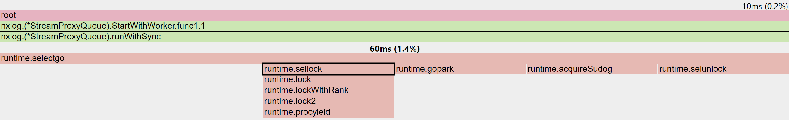
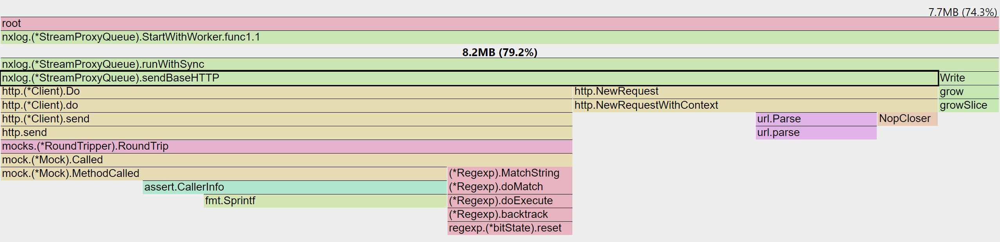
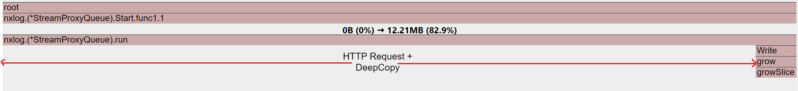

# Background

> **Service server** refers to a server performing business-specific operations.

## [AS-IS]

The service server was publishing individual HTTP events for each occurrence.

Although asynchronous HTTP requests were used, the batch loader's response time increased linearly with the number of HTTP requests.


### Problems

1. **Excessive Network Traffic**: Every event triggered an HTTP request, overwhelming the network as event frequency increased.
2. **Increased Latency**: More requests led to queuing and response delays.
3. **Lack of Scalability**: Each service implemented batch loading differently. Moving to event streaming would require repetitive changes across servers.

## [TO-BE]


### Solutions

1. **Reduce Network Traffic**: Buffer events internally and batch-send them based on buffer limit or interval.
2. **Reduce Latency**: Gathered events are sent at fixed intervals, solving the queuing delay.
3. **Increase Scalability**: Use a shared library to minimize repetitive changes and maintain **loose coupling** with the batch loader server.

---

# Solution

> A shared library was designed, called **"Batch Processor"**, to buffer and batch-send events.

### Requirements
- Minimize **IO-bound tasks**.
- **Control goroutine lifecycle** explicitly.

### Option 1: Worker Pool


Multiple workers buffer internally and synchronously send batched events.

#### Pros
- No deep copy overhead.
- Performance tuning possible by adjusting worker pool size.

#### Cons
- Up to N HTTP requests every interval (where N = number of workers).
- Tuning required to find the optimal "magic number" of workers.

### Option 2: Single Worker + Async HTTP


#### Pros
- Only one HTTP request per interval.
- No worker tuning necessary.

#### Cons
- Potential CPU and memory load from deep copies.
- Memory overhead may trigger GC, leading to "Stop the World" delays.

**Option 2** was selected due to superior usability despite potential deep copy overheads.

# Profiling

## Goals

- **Throughput**: Handle 2000 RPS for 1 minute.
- **Memory Usage**: Measure overhead from `deepCopy()`.
- **GC Overhead**: Check GC impact during memory copy.

```go
func deepCopy[T any](src []T) []T {
    if src == nil {
        return nil
    }
    dst := make([]T, len(src))
    copy(dst, src)
    return dst
}
```

## Method

Compare **10/100 Worker Pool + Sync IO** vs **1 Worker + Async IO**.

- CPU profiling enabled.
- Count processed events by logging inside the API send function.

```go
func (q *BatchProcessor) send(payload []byte, traceIDs []string) {
    response, err := q.client.Do(request)
    q.logger.Info().Int("count", len(traceIDs)).Send()
}
```

## CPU Profile

> **selectgo**: Go runtime's internal event selection from multiple channels.

#### 100 Worker Pool + Sync IO


- `runWithSync()` analysis:
  - Overhead from channel locking (`sellock`) and scheduling (`acquireSudog`) **85%**.

#### 10 Worker Pool + Sync IO



- Overhead reduced to **66%**.

#### 1 Worker + Async IO


- `deepCopy()` overhead (runtime.memmove) only 10ms.
- Runtime and deep copy overhead **50%**.

## Heap Profile

> Focused on deep copy impact during execution.

#### Worker Pool



- No measurable deep copy overhead.
- 7.7MB out of 8.2MB used for HTTP requests.

#### Single Worker + Async IO



- 11.4MB out of 12.21MB used for HTTP requests.
- Deep copy overhead is **150kB (1.22%)**, negligible.

# Test Results

| Setup               | Throughput (per minute) | CPU Overhead | Memory Overhead |
|---------------------|--------------------------|--------------|-----------------|
| 10 Worker           | 83,663                   | 66%          | 0%              |
| 100 Worker          | 84,042                   | 85%          | 0%              |
| 1 Worker + Async IO | 119,720                  | 50%          | 1.22%           |

## Summary

- Worker Pool introduces significant synchronization overhead.
- Increasing workers does not linearly increase throughput.
- **Async IO is significantly more efficient for IO-bound tasks.**
- **Worker Pools** are better for CPU-bound tasks or when strict request ordering is needed.

> **pprof integration:**  
> For pprof-based GC tuning, refer to [pprof tuning article](https://dingyu.dev/posts/go-pprof-gc/).