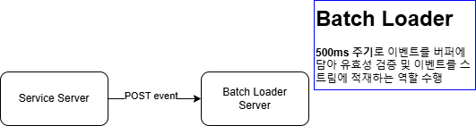
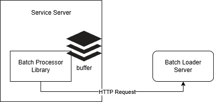
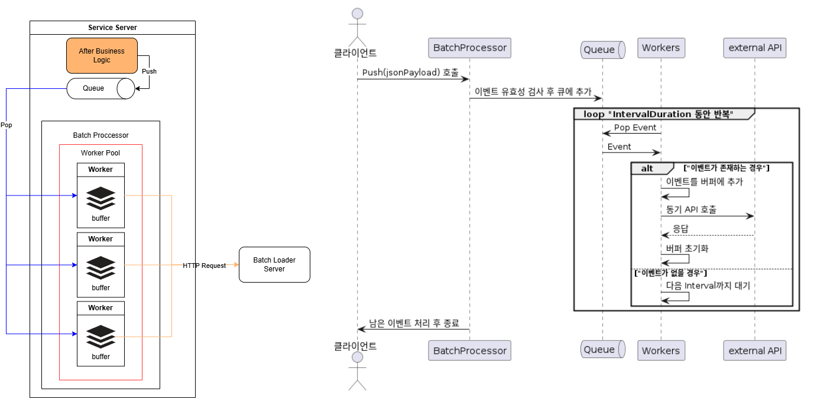
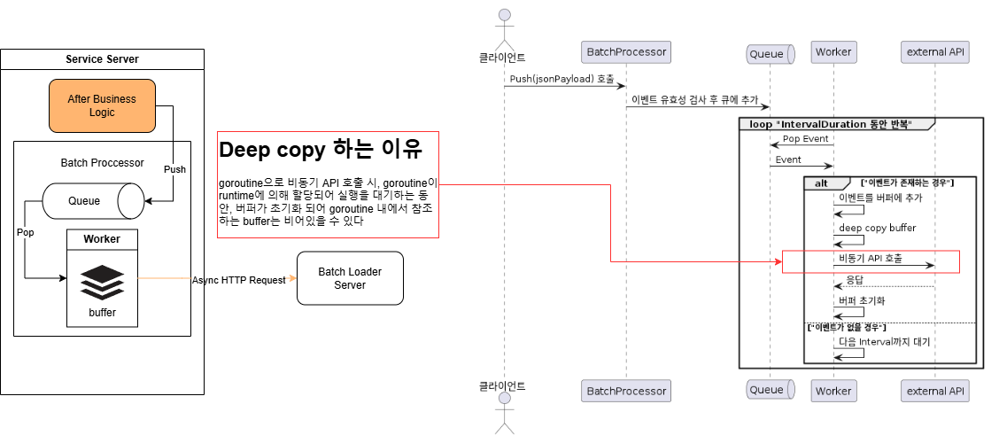
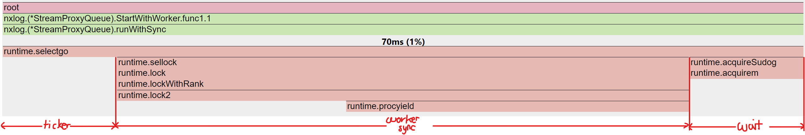
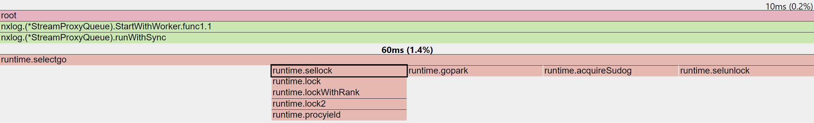
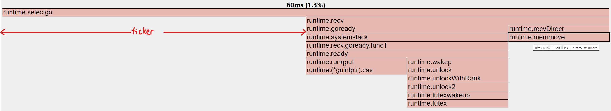
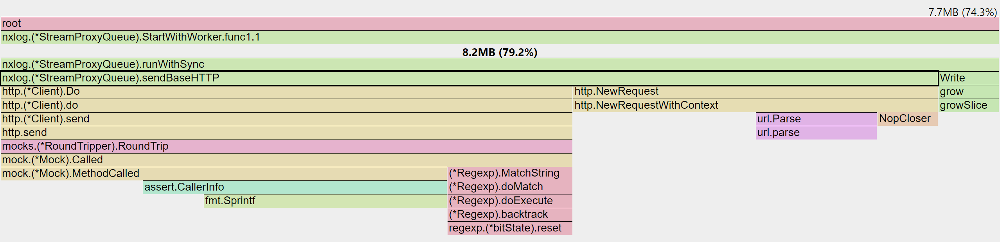
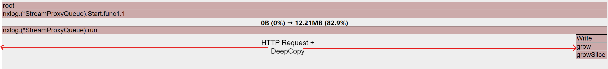

> **pprof 적용**은
> [pprof로 GC 튜닝하기](https://dingyu.dev/posts/go-pprof-gc/)를 참고 해주세요

# 배경
---
> 비즈니스 요구사항에 따른 서비스를 수행하는 서비스 서버를 **"서비스 서버"**라 칭합니다

## [AS-IS]
서비스 서버에서는 매번 단 건의 HTTP Request로 서버내에서 발생한 이벤트를 발행하고 있었습니다
비동기로 HTTP 요청을 수행하고는 있었지만, HTTP 요청 수에 비례하여 Batch Loader 응답지연 시간이 리니어하게 증가하고 있었습니다.


### 문제
1. **과도한 네트워크 요청** : 이벤트가 발생할 때마다 HTTP 요청을 보내므로, 이벤트 발생 빈도가 높아질수록 네트워크 트래픽이 과도하게 증가
2. **레이턴시 증가** : 요청이 많아지면 큐잉이 발생하여 응답 시간 지연
3. **확장성 부재** : 다수의 서비스에서 제각각의 구현 방식으로 Batch Loader에 적재중. HTTP 요청이 아닌 이벤트 스트리밍 기반으로 확장하였을 때, 불필요하게 반복적인 수정 작업을 다수의 서버에서 진행하게 됨

## [TO-BE]


### 문제 해결
1. **과도한 네트워크 요청 해결** : 서비스 서버 내에서 이벤트에 대한 큐를 두어, 최대 버퍼 limit을 초과 하거나 Batch 주기에 도달하는 경우, buffer를 Batch Loader로 이벤트 발행.
   - 오버헤드인 HTTP Request 를 최소화
2. **레이턴시 증가 해결** : 서버에서 지정해둔 `Interval Duration`에 따라 buffer를 모아 요청하기에 큐잉으로 인한 레이턴시 증가는 해결됨.
3. **확장성 증가** : 서비스 서버에서 사용할 공통 라이브러리를 Repository로 구축하여, Batch Loader 서버의 변경 또는 확장에 따른 서비스 서버들의 반복적인 수정 작업을 최소화. Batch Loader 서버와는 **느슨한 결합**을 갖도록 함

# 해결 방안
---
> Batch Loader 서버와는 느슨한 결합을 가지도록 공통 라이브러리를 구축하는 의사 결정 완료
공통 라이브러리에서 이벤트 버퍼를 모아 요청을 하는 모듈을 **"Batch Processor"**라 칭합니다.

### 요구사항
- **IO Bound Task**를 최소화
- `goroutine` 생명주기를 제어 가능해야 함

### 1안 : Worker Pool 방안



여러개의 worker들이 각각의 `Interval Duration` 동안 내부적인 버퍼를 채워 동기적으로 API로 요청하는 방안

#### Pros
- deep copy가 발생되지 않는다
- 성능 개선을 위해 Worker Pool을 튜닝할 수 있다

#### Cons
- `Interval Duration` 주기로 Worse Case Worker Pool 수 만큼 HTTP Request 발생
- 서비스 서버는 Worker Pool의 Magic Number를 찾기 위해 테스트를 진행해야함


### 2안 : 하나의 Worker + Async HTTP Request


#### Pros
- Interval Duration 동안 한번만 HTTP Request 발생
- Worker Pool Magic Number를 찾기 위한 테스트가 불필요

#### Cons
- deep copy로 인한 CPU 부하 가능성 (byte array size 만큼 순회하면서 값 할당)
- deep copy로 인한 Memory 부하 가능성 (byte array를 copy하면서 추가적인 힙 할당)
   - GC 동작 방식에 따라, 복사된 buffer memory로 인한 GC Trigger -> `Stop the World` 로 인한 서비스 서버의 지연 가능성 고려

두가지 비교군 중, 공통 라이브러리를 구성하는 것에 있어 **사용성**이 보장되어야 하기에, 2안이 적합한 방안이라고 생각되었습니다.

하지만 `deep copy`로 인한 CPU / memory 상의 오버헤드가 어느정도이고, 영향도가 없을지 검증이 필요했습니다.

# 프로파일링
---
## 프로파일링 목표
---
- **분당 처리량**: 1분간 2000 RPS 요청 처리 가능 수
- **메모리 사용량**: `deepCopy()`로 인한 메모리 부하 확인
- **GC 발생 오버헤드**: 메모리 복사 과정에서의 GC 확인

> **deep copy 코드**
```go
func deepCopy[T any](src []T) []T {
    if src == nil {
        return nil
    }
    dst := make([]T, len(src))
    copy(dst, src)
    return dst
}
```

## 테스트 방법
---
**10, 100개의 Worker Pool + Sync IO 방안**과 **하나의 Worker + Async IO 방안**의 테스트를 진행합니다.

각 비교군은 CPU Profile을 활성화하여 docker image를 빌드합니다.
- **분당 처리량** : 1분간 2000 RPS의 요청을 몇개까지 처리 가능한가?
   - API 호출 이후 호출된 Event의 개수 로깅
- **메모리** : deepCopy()로 인한 메모리 부하가 얼마나 생기는 지 확인
   - 메모리 copy 과정에서 GC 발생으로 인한 오버헤드 확인 
   - heap Profile을 통한 관측
   ```bash
   curl {endpoint}/debug/pprof/heap\?seconds\=30 --output {output_path}
   ```

> #### 처리된 개수는 어떻게 세나요?
>
API send() 메서드 중 로깅을 통해 확인
>
```go
func (q *BatchProcessor) send(payload []byte, traceIDs []string) {
    ...
    response, err := q.client.Do(request)
    ...
    q.logger.Info().Int("count", len(traceIDs)).Send()
}
```
>count를 파싱하여 stop 이전에 처리된 개수를 확인 합니다
>
**[e.g.] logfile 예시**
- log file ( sum = ... + 1020 + 1000 )
> 
```text
...
2024-10-14T05:11:06Z INF count=1020
2024-10-14T05:11:07Z INF count=1000
2024-10-14T05:11:07Z INF stopping BatchProcessor, waiting for remaining events to be sent func=BatchProcessor.Stop
2024-10-14T05:11:07Z INF count=288
```

## CPU Profile
---
> selectgo : select 구문 중 여러 채널에서 데이터를 동시에 기다리면서 그 중 하나가 준비되면 해당 작업을 수행하는 기능
- 채널 1: queue 에서 Pop()하여 stack buffer에 적재, buffer maxlimit을 초과하는 경우 API 전송 및 buffer Flush
- 채널 2: `time.Ticker` 일정 시간 마다 내부 버퍼 스택으로 API 전송 및 Flush
- 채널 3: 종료 시그널을 받아, 남아있는 버퍼 스택을 API 전송 및 고루틴 종료

#### Worker Pool (100) + Sync IO


`runWithSync()` 분석
- 각 worker들은 공유 자원인 queue 채널을 소비하며, 워커의 수가 많아질 수록 내부적인 lock과 acquireSudog(채널 수신 대기)에 드는 비용이 발생
- runtime 스케쥴러에 의해, 동시성 처리에 드는 비용이 예상외의 오버헤드
- selectgo 중, 오버헤드인 sellock과 acquireSudog의 비율은 **85%**

#### Worker Pool (10) + Sync IO



`runWithSync()` 분석
- sellock 비율이 100 worker pool에 비해 현저히 감소하는 것을 확인
- selectgo 중, 오버헤드인 sellock과 acquireSudog의 비율은 **66%**

#### 하나의 Worker + Async IO


`run()` 분석
- deepCopy(그림 중 runtime.memmove)로 인한 오버헤드는 10ms
- selectgo 중, 오버헤드인 runtime.recv (외부 API 호출 시, goroutine 준비 작업)+ deep copy의 비율은 **50%**

## Heap Profile
---
`run()` / `runWithSync()` 함수가 실행되는 동안 수행되는 DeepCopy에 초점을 맞추어 프로파일링

#### Worker Pool

deepCopy() 로 인한 오버헤드 없음
- 100 workers 중 8.2MB 중 HTTP Request가 7.7MB 소모

#### 하나의 Worker + Async IO

총 12.21MB의 run 과정 중 내부 버퍼를 쓰는 작업인 Write를 제외한 오버헤드를 산정

- worker run / Request 비율
   - 100 worker pool 중, 8.2MB:7.7MB 
   - **12.21MB 인 경우 11.4MB가 HTTP Request에 사용**
- deepCopy에 드는 오버헤드는 150kB (1.22%) 매우 미미한 수준


# 테스트 결과
---
| 분류              | 분당 처리량 | CPU 오버헤드 | 메모리 오버헤드 |
|-------------------|-------------|--------------|-----------------|
| 10 worker         | 83,663      | 66%         | 0%             |
| 100 worker        | 84,042      | 85%         | 0%             |
| 1 worker + async  | 119,720     | 50%         | 1.22%          |

## 정리
- Worker Pool을 사용할 경우, Queue의 동시성 처리를 위해 사용되는 오버헤드가 상당하다
- Worker Number를 늘리더라도 동시성 처리 오버헤드가 상승되기에 number of worker 와 처리량은 리니어하게 상승하진 않는다
- IO Bound Task를 수행할 경우, Worker Pool 보다는 비동기로 처리하는 것이 성능상의 이점이 크다
- CPU Bound Task의 경우, runtime에 의해 goroutine 이 수행되기 까지 대기 시간이 걸리기에 worker pool을 사용하는 것이 좋다
- 순서가 보장되어야 하는 경우에는 IO Bound Task 일지라도 Worker Pool을 사용하는 것이 좋다